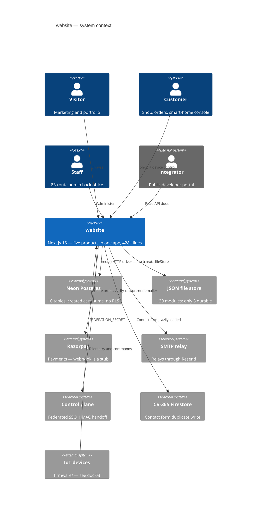
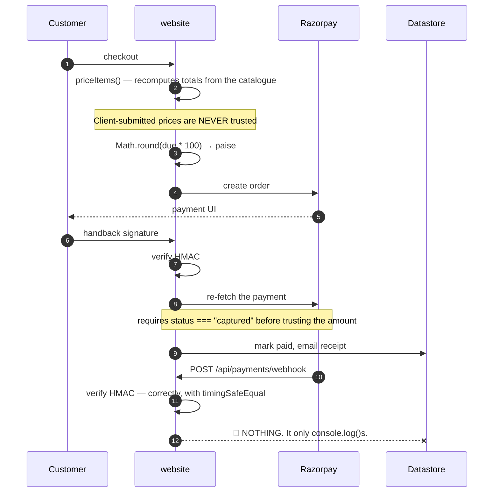

# 01 · System Overview

> **Audience:** everyone. An intern reads §1–§5; a CTO reads §1 and §11.
> **System:** the repository called `website` — which is a marketing site, an e-commerce store, an admin console, an IoT SaaS platform, a developer portal, firmware, hardware designs and two native apps.

---

## 1. Executive summary

```
   ╔══════════════════════════════════════════════════════════════════════╗
   ║  THE FIRST THING TO KNOW                                             ║
   ╠══════════════════════════════════════════════════════════════════════╣
   ║                                                                      ║
   ║  README.md says:                                                     ║
   ║    "Premium portfolio and services website... showcasing 53+         ║
   ║     projects across 6 technology domains"                            ║
   ║    "src/app — Next.js App Router pages (18 routes)"                  ║
   ║    "components/ — 50+ React components"                              ║
   ║                                                                      ║
   ║  THE REPOSITORY ACTUALLY CONTAINS:                                   ║
   ║    23,184 files · 428,355 lines · 150 API routes · 108 pages         ║
   ║    a full e-commerce storefront with payments                        ║
   ║    an 83-route admin back office                                     ║
   ║    a smart-home / IoT SaaS console with 60+ sections                 ║
   ║    a public developer API portal                                     ║
   ║    13,003 files of firmware · hardware designs                       ║
   ║    two separate native mobile codebases                              ║
   ║                                                                      ║
   ║  Someone onboarding from the README would misunderstand this         ║
   ║  system by roughly an order of magnitude.                            ║
   ╚══════════════════════════════════════════════════════════════════════╝
```

### At a glance

| | |
| --- | --- |
| **Type** | A company monorepo — five web products plus firmware, hardware and native apps |
| **Framework** | Next.js 16.2.11 App Router · React 19.2.3 · TypeScript 5 strict · Tailwind 4 |
| **Scale** | 23,184 files · **1,810 src TypeScript files** · **428,355 lines** · 150 API routes · 108 pages |
| **`src/lib`** | 288 modules |
| **Database** | Neon Postgres, HTTP driver · **10 tables, created at runtime** · no migrations · no ORM |
| **Sessions** | **Home-grown HMAC-SHA256 tokens. No JWT library is used at all.** |
| **Tests** | **370 test files** · Jest 30 + Playwright + PGlite |
| **Repository** | `github.com/Hemakotibonthada/WebSite.circuvent` · **529 commits · 5 remotes · 10+ branches** |
| **Payments** | Razorpay — and **the webhook is a stub** |

### The five decisions that define it

| # | Decision | Consequence |
| --- | --- | --- |
| 1 | **Everything in one Next app** | One deployment, one build. Also: a marketing page and an IoT fleet console share a bundle, a router and a security posture |
| 2 | **No JWT, no cookies — HMAC tokens in headers** | Simple, dependency-free, revocable by version. Also: entirely separate from every other Circuvent application |
| 3 | **Schema created by the app at boot** | Zero-friction new environments. Also: no history, no rollback, no review |
| 4 | **A JSON-file store that degrades to memory** | Nothing crashes when the disk is read-only. Also: **~27 modules silently lose all data on every cold start** |
| 5 | **Write down the incident in the file that fixes it** | The single most valuable convention in the repository. Quoted throughout these documents |

---

## 2. What is actually in here

```
   ┌──────────────────────────────────────────────────────────────────────┐
   │  ONE NEXT.JS APPLICATION, FIVE PRODUCTS                              │
   ├──────────────────────────────────────────────────────────────────────┤
   │                                                                      │
   │  1. MARKETING / PORTFOLIO   ← the only part the README describes     │
   │     about · architecture · blog · careers · case-studies · docs      │
   │     domains · faq · open-source · privacy · projects · roadmap       │
   │     services · stack · team · terms · contact                        │
   │                                                                      │
   │  2. E-COMMERCE STOREFRONT                                            │
   │     shop · shop/[slug] · shop/c/[category] · shop/account            │
   │     shop/invoice/[orderNo] · shop/devices                            │
   │     cart · checkout · track · warranty · returns-policy · shipping   │
   │                                                                      │
   │  3. ADMIN BACK OFFICE                       83 of the 150 API routes │
   │     admin · admin/insights · admin/inventory                         │
   │     inventory · orders · CMS · marketing · pricing · tax · fraud     │
   │     ICM incident management · App Insights telemetry clone           │
   │                                                                      │
   │  4. SMART-HOME / IoT SaaS CONSOLE          the largest surface       │
   │     60+ sections: admin/{access,fleet,ota,provisioning,registry,     │
   │     telemetry} · automation · camera · security · energy · solar     │
   │     drone · anpr · attendance · kiosk · command-center · floorplan   │
   │     groups · rooms · scenes · recipes · reports · widgets            │
   │                                                                      │
   │  5. PUBLIC DEVELOPER PORTAL                                          │
   │     authentication · browser · commands · endpoints · errors         │
   │     limits · quickstart · scopes · webhooks                          │
   │                                                                      │
   │  Plus, outside src/: firmware/ · hardware/ · mobile/ · native/       │
   │  platform/ · circuvent-platform/  — see doc 03                       │
   └──────────────────────────────────────────────────────────────────────┘

   ⚠ THERE ARE NO NEXT.JS ROUTE GROUPS. Not one `(name)` folder.
     Every top-level directory is a literal URL segment, so the five
     products share one flat router with no structural boundary between
     a public marketing page and a fleet-management console.
```

---

## 3. Topology

```
   ┌──────────────┐   ┌───────────────┐   ┌──────────────┐  ┌────────────┐
   │  Visitors    │   │  Customers    │   │  Staff       │  │  Devices   │
   │  marketing   │   │  shop + IoT   │   │  admin       │  │  firmware  │
   └──────┬───────┘   └───────┬───────┘   └──────┬───────┘  └─────┬──────┘
          │                   │ ACCOUNT_SECRET   │ ADMIN_SECRET   │
          │                   │ HMAC token       │ HMAC token     │
          └───────────────────┴──────────────────┴────────────────┘
                                     │
   ╔═════════════════════════════════▼════════════════════════════════════╗
   ║                    website  (circuvent-technologies)                 ║
   ║                                                                      ║
   ║   src/proxy.ts — host mounts, redirects, X-Request-Id, CSP           ║
   ║                  ⚠ IT DOES NO AUTHENTICATION AT ALL                  ║
   ║                                                                      ║
   ║   150 API routes · 108 pages · 288 lib modules                       ║
   ║   Auth is enforced PER ROUTE, by helper calls, not centrally.        ║
   ╚═══╤═════════════╤═══════════════╤══════════════╤════════════════╤════╝
       │             │               │              │                │
       ▼             ▼               ▼              ▼                ▼
   ┌────────┐  ┌──────────┐  ┌────────────┐  ┌──────────┐  ┌──────────────┐
   │ Neon   │  │ .data/   │  │  Razorpay  │  │   SMTP   │  │ Control plane│
   │ 10     │  │ JSON     │  │  payments  │  │ (relays  │  │ CONTROL_     │
   │ tables │  │ files    │  │  ⚠ webhook │  │ through  │  │ PLANE_URL +  │
   │ made   │  │ ~27 mods │  │  is a STUB │  │ Resend)  │  │ FEDERATION_  │
   │ at boot│  │ memory-  │  │            │  │          │  │ SECRET       │
   │        │  │ only in  │  │            │  │          │  │              │
   │        │  │ prod     │  │            │  │          │  │ + CV-365     │
   │        │  │          │  │            │  │          │  │ Firestore    │
   └────────┘  └──────────┘  └────────────┘  └──────────┘  └──────────────┘
```



---

## 4. Module map

```
   src/lib — 288 modules

   ADMIN BACK OFFICE      29 files   admin-*.ts — pricing, tax, CRM, fraud,
                                     vendors, SSO provisioning, password policy
   SMART HOME             ~30 files  device auth, cameras, energy budget,
                                     geofencing, recipes, scene scheduler
   INCIDENT MANAGEMENT    14 files   icm*.ts — severity, TTA/TTM state machine,
                                     Teams notify, postmortems.  icm.ts is PURE
   APP INSIGHTS            9 files   a working clone of Azure Monitor's cost,
                                     usage, dependency and query telemetry
   REPORTS                10 files   CSV / PDF / scheduled generation, charts
   COMMERCE               16 files   shop-*, order-core, bundle-pricing,
                                     coupons, delivery-estimate, warranty,
                                     inventory, razorpay
   AUTH & SECURITY        10 files   passkeys, passkey-ceremony, admin-auth,
                                     account, sso, totp, session-expiry, secrets
   TELEMETRY             ~20 files   health probes, synthetic checks, anomaly
                                     monitor, cron health, control-plane,
                                     guardian, tank, fan-speed, predictive
                                     maintenance, traffic, visitor tracking
   MARKETING CONTENT      17 files   PURE constant exports
   INFRASTRUCTURE         18 files   cache, config, csp, client-ip, data-file,
                                     db, logger, rate-limit, validation, fuzzy
   DEVICE LOGIC            8 files   agri, avi, device-history, device-normalize,
                                     camera-audio, camera-relay, drone-mixer,
                                     switchboard
   NOTIFICATIONS           5 files   alerts, email-log, web-push
   SEO / BRAND             5 files   metadata, OG image generation

   PURE modules (arguments in, values out, no I/O):
     icm.ts · session-expiry.ts · delivery-estimate.ts · device-normalize.ts
     validation.ts · fuzzy.ts · all *-data.ts · most seo/brand builders
```

### The twelve largest files

| # | File | Lines |
| --- | --- | ---: |
| 1 | `src/app/smarthome/DeviceControls.tsx` | **4,870** |
| 2 | `src/app/admin/AppInsightsPanel.tsx` | 2,208 |
| 3 | `src/lib/control-plane.ts` | 2,182 |
| 4 | `src/lib/store.ts` | 2,071 |
| 5 | `src/app/admin/IcmPanel.tsx` | 1,823 |
| 6 | `src/app/smarthome/security/VehiclesPanel.tsx` | 1,539 |
| 7 | `src/lib/blog-data.ts` | 1,309 |
| 8 | `src/app/shop/account/page.tsx` | 1,284 |
| 9 | `src/lib/smarthome-command-map.ts` | 1,272 |
| 10 | `src/components/DataVisualization.tsx` | 1,261 |
| 11 | `src/app/smarthome/_kit/primitives.tsx` | 1,244 |
| 12 | `src/app/admin/page.tsx` | 1,225 |

> A single 4,870-line React component is the largest file in the repository. Doc 05.

---

## 5. The 150 API routes

| Group | # | Auth | Purpose |
| --- | ---: | --- | --- |
| **`admin/*`** | **83** | Staff HMAC token + `requireArea` role gate. Plus two exceptions: `admin/external-stats` uses a static `ADMIN_API_KEY`, and `admin/availability/probe` uses `CRON_SECRET` | The whole back office |
| `account/*` | 14 | Customer HMAC token for 9; **none** for the 5 pre-session routes (login, register, verify-otp, forgot/reset-password) | Identity and self-service |
| `smarthome/*` | 10 | ⚠️ Not resolved — matched neither known session helper | Device alerts, cameras, prefs |
| `shop/*` | 5 | None — public catalogue | Bundles, products, questions, quote, reviews |
| `devices/*` | 5 | Customer token for claim/command; firmware/sync unresolved | Claim and command devices |
| `orders/*` | 4 | Customer token; `track` is public by order number | Order lifecycle |
| `payments/*` | 3 | `create-order` **public** (guest checkout) · `webhook` HMAC only · `verify` | Razorpay |
| `ai/*` | 3 | `chat` customer token; `analyze`/`fleet` unresolved | AI chat and fleet analysis |
| `health` · `push` · `telemetry` · `visitors` · `wallet` | 2 each | Mostly public beacons; `wallet` and `push/subscribe` require a token | |
| 13 singletons | 13 | blog, contact, coupons/validate, giftcards/redeem, github, loyalty, newsletter, notify-restock, projects, referral, returns, support, weather | |
| **Total** | **150** | | reconciled exactly |

```
   🟠 SEVEN ROUTES COULD NOT BE RESOLVED to any known authentication
      mechanism by a repository-wide sweep:

        giftcards/redeem   referral        returns
        ai/analyze         ai/fleet
        devices/firmware   devices/sync
        …plus all 10 smarthome/* routes

      That means either an undiscovered check, or a genuine gap.
      `giftcards/redeem` and `returns` are the ones to check first —
      both move money. Doc 05, D-06.
```

---

## 6. Authentication — home-grown, and entirely separate from the suite

```
   ╔══════════════════════════════════════════════════════════════════════╗
   ║  A repository-wide search across src/ for                            ║
   ║      AUTH_JWT_SECRET · JWT_SECRET · jsonwebtoken · jose              ║
   ║  returns ZERO MATCHES.                                               ║
   ║                                                                      ║
   ║  Every other Circuvent application shares one HS256 suite session.   ║
   ║  This one does not participate in it at all.                         ║
   ╚══════════════════════════════════════════════════════════════════════╝
```

```ts
// src/lib/account.ts
function sign(payload: string): string {
  return crypto.createHmac("sha256", secret()).update(payload).digest("hex");
}
export function signToken(email: string, version?: number): string {
  const payload = `${e}|${Date.now().toString(36)}|${ver}`;
  return Buffer.from(`${payload}:${sign(payload)}`).toString("base64");
}
```

| Property | Detail |
| --- | --- |
| Algorithm | HMAC-SHA256 over `email\|issuedAt\|tokenVersion` |
| Customer key | `ACCOUNT_SECRET` |
| Staff key | `ADMIN_SECRET` — *"Staff sessions get their own key so a leaked customer key cannot mint one."* |
| Transport | **Not cookies.** No `Set-Cookie` anywhere in `src/app/api`. Tokens travel in `Authorization: Bearer`, `x-account-token` or `x-admin-token` |
| Storage | Client-side; admin tokens explicitly in `sessionStorage` |
| Revocation | `tokenVersion` — bump it and every prior token dies |
| Lifetime | **24-hour absolute cap** via `session-expiry.ts`, independent of renewal |

### Why `tokenVersion` exists

> **`src/lib/admin-auth.ts`** — *"The old format was `base64(email + ":" + HMAC(email))`… It never expired and could not be revoked, so changing a password left every previously issued token fully valid, **including one a departing employee had already copied.**"*

### Five ways in

| Path | Mechanism |
| --- | --- |
| Password | scrypt + timing-safe compare |
| **Passkey** | `@simplewebauthn/server`, single-use 5-minute challenges, **cloned-authenticator detection via counter regression** |
| Email OTP | 6-digit code via `crypto.randomInt`, sign-up step two |
| Password reset | An **OTP code, not a magic link**, 15-minute TTL |
| SSO federation | `verifyAgainstControlPlane()` adopts a control-plane password when the local account has none |

```ts
/** Which sign-in a credential belongs to. They must never be interchangeable. */
export type PasskeyScope = "admin" | "account";
```

### Authorization — capability areas, not just roles

```ts
export type AdminRole = "superadmin" | "manager" | "inventory" | "orders" | "support";

export type AdminArea =
  | "overview" | "analytics" | "inventory" | "orders" | "returns" | "customers"
  | "coupons" | "support" | "staff" | "settings" | "cms" | "marketing"
  | ... | "icm" | "insights";

const ROLE_AREAS: Record<AdminRole, AdminArea[]> = { superadmin: [...], ... };
```

Admin 2FA is TOTP or email code, gated by a `TOTP_PENDING` sentinel proving the password stage passed first. The QR code is rendered **server-side**, deliberately, *so the secret is never sent to a third-party QR service.*

### The gate does not gate

`src/proxy.ts` (Next 16's rename of `middleware.ts`) handles host mounts, a legacy `/shop?cat=X` → `/shop/c/x` 308 redirect, `X-Request-Id` propagation and the CSP header.

**It performs no authentication whatsoever.** Every route enforces its own. With at least five coexisting credential schemes and seven unresolved routes, that is the structural weakness of this design. Doc 05, D-05.

### Security headers, on the other hand, are complete

```ts
const securityHeaders = [
  { key: "Strict-Transport-Security",
    value: "max-age=63072000; includeSubDomains; preload" },
  { key: "Content-Security-Policy", value: CSP },
  { key: "X-Content-Type-Options", value: "nosniff" },
  { key: "X-Frame-Options", value: "DENY" },
  { key: "Referrer-Policy", value: "strict-origin-when-cross-origin" },
  { key: "X-DNS-Prefetch-Control", value: "on" },
  { key: "Permissions-Policy",
    value: "camera=(), microphone=(), geolocation=(self), browsing-topics=()" },
  { key: "Cross-Origin-Opener-Policy", value: "same-origin" },
];
```

Applied both at the edge in `proxy.ts` and globally via `headers()`, so routes the proxy matcher skips are still covered. Non-production deployments additionally get `X-Robots-Tag: noindex, nofollow`.

---

## 7. Commerce — and the webhook that does nothing



```
   THE WEBHOOK IS A STUB.

     const expected = crypto.createHmac("sha256", secret)
       .update(raw).digest("hex");
     const valid = sigBuf.length === expBuf.length
       && crypto.timingSafeEqual(sigBuf, expBuf);

   The signature check is correct and constant-time. Then the handler
   logs the event and returns. Its own comment admits it:

     // Reconciliation hook: when a persistent order store exists,
     // mark the order paid/failed here...

   So any payment that completes at the gateway but whose browser never
   returns — a closed tab, a dropped connection, a failed redirect —
   is captured by Razorpay and never reconciled here. Doc 05, D-04.
```

**Money is a hybrid.** The catalogue uses `price: number; // whole INR` — a float in major units. The gateway boundary uses `amountPaise: number` — an integer in minor units, converted once with `Math.round(due * 100)`. No fractional rupee exists in the sample data, so no wrong number is demonstrable today. But nothing in the type system prevents one.

**`delivery-estimate.ts` is a good module.** Pure, no courier API, buckets Indian PIN-code prefixes into metro / remote / no-COD sets, and returns a **range** with explicit "estimate" framing rather than a firm promise.

---

## 8. Notifications and documents

| Dependency | Reality |
| --- | --- |
| `nodemailer` | ✅ Real. SMTP transport for orders, OTPs, password resets, contact. **Awaited inline, not queued** — failures are logged and the request proceeds |
| `resend` | ⚠️ **Declared but its SDK is never imported.** Mail goes out over SMTP, which *relays through* Resend. A direct Resend-API fallback was deliberately removed |
| `web-push` | ✅ Real browser push |
| `pdf-lib` | ✅ Real, server-side admin report generation |
| `qrcode` | ✅ **One import site** — TOTP enrolment, rendered server-side on purpose |

> **`src/app/api/contact/route.ts`** documents why the Resend path went away: *"This route used to call the Resend API directly, from `onboarding@resend.dev` to a hardcoded gmail address… these sends consumed the Resend free allowance without ever appearing in the outbound counts."*

**And every contact submission is written twice.** `ContactForm.tsx` calls `saveContactMessage()` (Firestore, in a separate CV-365 project) **and** `fetch("/api/contact")` (local store + SMTP) on the same submit. Two independent persistence paths for one form. Doc 05, D-12.

---

## 9. The comment convention — the best thing in this repository

Module headers name the exact incident that motivated the module. These are worth reading in full.

> **`src/lib/passkeys.ts`** — *"The update branch used to store whatever case the caller passed, so re-registering an existing credential wrote back `Mixed@Example.COM` and every later lookup — which normalises — stopped finding it. **The passkey still existed, still verified, and belonged to nobody.** It only appeared on the second save of the same credential, which is why it survived the first run of its own test."*

> **`src/lib/sso.ts`** — *"So on dev, a sign-in that missed locally fell through to `api.circuvent.com/auth/login`, the live fleet vouched for a real customer, and `/api/account/login` then created that customer in the dev database with a hash of their real password. **Production users could sign in to dev, and dev quietly accumulated live credentials while doing it.** The isolation guard was pointed at the wrong door."*

> **`next.config.ts`** — *"A dev server and a production build share `.next`, and the dev server keeps rewriting it — which silently deleted `BUILD_ID` twice while auditing, so `next start` served nothing and **the audit reported a clean sweep of an empty site.**"*

> **`scripts/verify-icm-durability.ts`** — *"Incidents were written to a JSON file that the serverless host cannot write… The next request — a cold start, or simply one routed elsewhere — began from an empty seed and rendered an empty queue. **Incidents filed weeks ago were not hidden; they were gone.**"*

> **`src/lib/db.ts`** — the environment guard exists because *"dev.circuvent.com came to serve real customer accounts, orders and wallet balances."*

---

## 10. Design patterns actually in use

| Pattern | Where |
| --- | --- |
| **Pure core / impure shell** | `icm.ts`, `session-expiry.ts`, `delivery-estimate.ts`, `device-normalize.ts` — each with an impure store or transport sibling |
| **Stateless tokens with a version counter** | Revocation without a session table |
| **Capability-gated RBAC** | `AdminArea` + `ROLE_AREAS`, not bare role checks |
| **Fail closed in production, warn in development** | `secrets.ts` — *"A hardcoded fallback therefore fails open"* |
| **Signature, then re-verify** | Payment capture is re-fetched from Razorpay; a forged client signature cannot credit an order |
| **Host allow-lists, not block-lists** | `PROD_DATA_HOSTS`, `PROD_IDENTITY_HOSTS` |
| **Estimate, not promise** | `delivery-estimate.ts` returns a range and says so |
| **Degrade rather than throw** | `createFileStore` — which is also the source of the largest data risk in the system |

---

## 11. Health assessment

```
   Incident documentation    ████████████████████░  9/10  best in the suite
   Security headers          ██████████████████░░░  8/10  complete set
   Passkey implementation    ██████████████████░░░  8/10  scoped, clone-detected
   Payment capture path      ████████████████░░░░░  7/10  re-verified server-side
   Session design            ██████████████░░░░░░░  6/10  versioned, 24 h cap
   ─────────────────────────────────────────────────
   Auth architecture         ████████████░░░░░░░░░  5/10  5 schemes, no central gate
   Money typing              ██████████░░░░░░░░░░░  4/10  float rupees in catalogue
   Payment reconciliation    ██████░░░░░░░░░░░░░░░  3/10  🔴 webhook is a stub
   Schema management         ██████░░░░░░░░░░░░░░░  3/10  🔴 created at boot
   Documentation accuracy    ████░░░░░░░░░░░░░░░░░  2/10  🔴 README off by 10×
   Tenancy / DB access ctrl  ████░░░░░░░░░░░░░░░░░  2/10  🔴 none whatsoever
   Data durability           ██░░░░░░░░░░░░░░░░░░░  1/10  🔴 ~27 modules memory-only
```

**What is genuinely excellent:** the incident-comment convention; a complete security-header set applied twice over; passkeys with scoped credentials and cloned-authenticator detection; server-side TOTP QR rendering; payment capture that re-fetches from the gateway rather than trusting a client signature; a pure, honest delivery estimator; and `verify-icm-durability.ts`, which spawns four real operating-system processes to prove a durability claim rather than mocking it.

**What needs attention:** roughly twenty-seven storage modules that lose all data on a serverless cold start; a payment webhook that verifies its signature and then does nothing; a README describing a tenth of the system; five coexisting credential schemes with no central gate and seven routes whose authentication could not be established; and a database with no migrations, no foreign keys and no access control of any kind.

---

## 12. Where to start reading

```
   1. src/lib/db.ts                       and understand initDb()
   2. src/lib/data-file.ts                then count the `durable: true` callers
   3. scripts/verify-icm-durability.ts    read the header
   4. src/lib/account.ts + admin-auth.ts  the two session schemes
   5. src/lib/passkeys.ts                 read the header
   6. src/lib/sso.ts                      read the header
   7. src/proxy.ts                        note what it does NOT do
   8. src/app/api/payments/webhook        note what it does NOT do
   9. NOT README.md                       it describes a different system
```

---

*Next: [02_DATABASE_AND_DATA_MODELS.md](./02_DATABASE_AND_DATA_MODELS.md) · [03_INTEGRATIONS_AND_ECOSYSTEM.md](./03_INTEGRATIONS_AND_ECOSYSTEM.md) · [04_MAINTENANCE_AND_OPERATIONS.md](./04_MAINTENANCE_AND_OPERATIONS.md) · [05_AREAS_OF_ENHANCEMENT.md](./05_AREAS_OF_ENHANCEMENT.md)*
