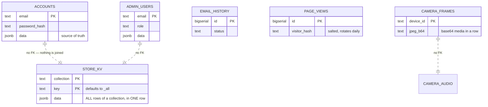

# 02 · Database and Data Models

> **Audience:** engineers and anyone responsible for not losing customer data.
> **Engine:** Neon Postgres via the **HTTP driver** · no ORM · no migrations · **and a JSON-file store that most features actually use**

---

## 1. The headline: schema is a side effect of the application booting

```
   ╔══════════════════════════════════════════════════════════════════════╗
   ║  THERE ARE ZERO .sql FILES IN THIS ENTIRE REPOSITORY.                ║
   ║                                                                      ║
   ║  There is no ORM. No Drizzle, no Prisma, no Knex.                    ║
   ║  There is no migrations directory.                                   ║
   ║  There is no schema version table.                                   ║
   ║                                                                      ║
   ║  Schema is an array of raw SQL strings in a TypeScript file, run as  ║
   ║  CREATE TABLE IF NOT EXISTS the first time any database function is  ║
   ║  called — which means on effectively every serverless cold start.    ║
   ╚══════════════════════════════════════════════════════════════════════╝
```

```ts
// src/lib/db.ts
const SCHEMA_STATEMENTS: string[] = [
  `CREATE TABLE IF NOT EXISTS accounts (
     email TEXT PRIMARY KEY,
     name TEXT,
     password_hash TEXT,
     ...
];

/** Creates the schema if it does not yet exist (idempotent, runs once). */
export function initDb(): Promise<void> {
  if (_initPromise) return _initPromise;
  _initPromise = (async () => {
    const q = await getQuery();
    for (const stmt of SCHEMA_STATEMENTS) await q(stmt);
  })();
  return _initPromise;
}
```

Every exported `db*` function `await`s `initDb()` before its query. `.env.example` states it plainly: *"The schema is created automatically on first run."*

```
   WHAT THIS COSTS
   ───────────────
   • No record of when or why any column was added
   • No rollback path
   • No way to review a schema change in a pull request as a schema change
   • The connecting role MUST hold DDL rights, forever — see §6
   • A fresh environment gets "whatever SCHEMA_STATEMENTS says today",
     which is not necessarily what production actually has

   WHAT IT BUYS
   ────────────
   • A new environment needs no migration step at all. It just works.

   For a site that began as a marketing page, that trade was reasonable.
   For something now holding orders, wallets and passkeys, it is not.
   Doc 05, D-02.
```

---

## 2. Ten tables

Counted by reading `SCHEMA_STATEMENTS` verbatim — `grep "CREATE TABLE"` returns 10 hits, all in `src/lib/db.ts`. This count is provably complete.

| Table | Notable columns | Key | Indexes |
| --- | --- | --- | --- |
| `accounts` | `email`, `name`, `password_hash`, `password_salt`, `phone`, `blocked`, **`data JSONB`** | PK `email` | `created_at` |
| `admin_users` | `email`, `name`, `role`, `active`, `password_hash`/`salt`, **`data JSONB`** | PK `email` | `role` |
| `pending_registrations` | `email`, `otp`, `expires`, `attempts`, `ref`, **`data JSONB`** | PK `email` | — |
| **`store_kv`** | `collection`, `key` DEFAULT `'_all'`, **`data JSONB`**, `updated_at` | PK `(collection, key)` | — |
| `email_history` | `to`, `from_addr`, `subject`, `type`, `status`, `provider`, `message_id`, `error`, `body_html`, `meta` | PK `id` BIGSERIAL | 4: `created_at DESC`, `type`, `to`, `status` |
| `request_metrics` | `endpoint`, `method`, `status`, `ms REAL`, `region` | PK `id` BIGSERIAL | `ts DESC`, `endpoint` |
| `camera_frames` | `device_id`, **`jpeg_b64`**, `bytes`, `captured_at`, `upload_token`, `token_expires` | PK `device_id` | — |
| `camera_audio` | `device_id`, **`wav_b64`**, `bytes`, `captured_at` | PK `id` BIGSERIAL | `device_id, captured_at DESC` |
| `camera_audio_session` | `device_id`, `listen_token`/`expires`, `speak_token`/`wav_b64`/`expires` | PK `device_id` | — |
| `page_views` | `path`, **`visitor_hash`** (salted, daily-rotating), `referrer_host`, `device`, `browser`, `country` | PK `id` BIGSERIAL | `ts DESC`, `ts+path`, `ts+visitor_hash` |

```
   THREE CONVENTIONS WORTH STATING

   1. Every entity table carries a full-fidelity `data JSONB` column, and
      the file header says it is "the source of truth on read". The typed
      columns exist only for indexing and human inspection.

   2. THERE ARE NO FOREIGN KEYS. Anywhere. Not one.

   3. THERE IS NO TENANT OR ORG COLUMN. Anywhere. See §6.

   ✅ One genuinely good detail: page_views stores a SALTED, DAILY-ROTATING
      visitor_hash rather than an IP address or a persistent identifier.
      That is privacy-conscious analytics, done deliberately.

   ⚠ And two that are not: camera_frames.jpeg_b64 and camera_audio.wav_b64
     store base64 media INSIDE Postgres rows. Doc 05, D-11.
```



---

## 3. `store_kv` — 23 collections in one table, one row each

```
   store_kv is a generic key-value multiplexer, reused for three
   unrelated purposes:

   ┌──────────────────────────────────────────────────────────────────────┐
   │  (a) THE ENTIRE SHOP — 23 collections, via KV_COLLECTIONS            │
   │                                                                      │
   │      orders          products      wallets        devices            │
   │      reviews         addresses     notifyRequests logins             │
   │      coupons         tickets       returns        audit              │
   │      loyalty         referrals     referralCodes  giftCards          │
   │      questions       notifications passwordResets admin2fa           │
   │      alertSettings   contactMessages consumedPayments                │
   │                                                                      │
   │      ⚠ EACH IS **ONE ROW**, with key = '_all'.                       │
   │        Every order in the system lives inside a single JSONB value.  │
   │        Reading one order reads all of them. Writing one order        │
   │        rewrites all of them.                                         │
   │        There is no index into it, and no way to page it.             │
   │        Doc 05, D-03.                                                 │
   ├──────────────────────────────────────────────────────────────────────┤
   │  (b) collection='user_prefs', key = an arbitrary user id             │
   ├──────────────────────────────────────────────────────────────────────┤
   │  (c) collection='file_store', key = an arbitrary filename            │
   │      — this is where the JSON modules opt into Postgres. See §5.     │
   └──────────────────────────────────────────────────────────────────────┘
```

Because any module can call `dbWriteFileStore("<anything>.json", …)` with a name chosen at runtime, **the logical contents of `store_kv` cannot be enumerated statically.** The ten physical tables are knowable; what is inside them is not.

---

## 4. The client — HTTP driver, so no transactions

```ts
async function getQuery(): Promise<QueryFn> {
  if (_query) return _query;
  const url = process.env.DATABASE_URL;
  if (!url) throw new Error("DATABASE_URL is not set");
  assertNotProductionData(url);
  const { neon } = await import("@neondatabase/serverless");
  const client = neon(url);
  _query = (text, params = []) =>
    client.query(text, params) as Promise<Record<string, unknown>[]>;
  return _query;
}
```

| Aspect | Finding |
| --- | --- |
| Driver | **`neon()` HTTP only.** No `Pool`, no `Client`, no `neonConfig.webSocketConstructor` anywhere |
| Pooling | None — and none is needed; the HTTP driver is stateless per call |
| Memoization | ✅ Module-scope `let _query`, built once per lambda instance |
| Test seam | ✅ `__setQueryForTests` swaps in PGlite |
| **Transactions** | 🔴 **None exist, and none are possible.** Zero `BEGIN`/`COMMIT`/`ROLLBACK` in the codebase. The HTTP driver cannot hold one open |

The workaround is real and reasonable — single-statement atomic SQL with a JSONB merge:

```sql
INSERT INTO store_kv (collection, key, data)
VALUES ($1, $2, jsonb_build_object($3::text, $4::jsonb))
ON CONFLICT (collection, key)
DO UPDATE SET data = store_kv.data || jsonb_build_object($3::text, $4::jsonb), ...
```

That is correct for the cases it covers. It is also a structural ceiling: nothing here can ever be made atomic across two tables without changing driver. Doc 05, D-10.

---

## 5. The finding that matters most: most data has no database behind it

```
   ╔══════════════════════════════════════════════════════════════════════╗
   ║  src/lib/data-file.ts — createFileStore(), header comment:           ║
   ║                                                                      ║
   ║   "an in-memory working copy is the source of truth for the life of  ║
   ║    the process, and every mutation is best-effort written through    ║
   ║    to a JSON file under DATA_DIR. On read-only filesystems           ║
   ║    (serverless production without a database) writes silently stop   ║
   ║    and the module degrades to in-memory-only for that instance,      ║
   ║    instead of throwing and breaking the request."                    ║
   ║                                                                      ║
   ║  ROUGHLY 30 MODULES ARE BUILT ON THIS.                               ║
   ║  EXACTLY THREE OPT INTO THE POSTGRES MIRROR ({ durable: true }):     ║
   ║                                                                      ║
   ║      icm-store.ts  ·  admin-warranty.ts  ·  api-failures.ts          ║
   ║                                                                      ║
   ║  THE OTHER ~27 ARE MEMORY-ONLY IN PRODUCTION.                        ║
   ║                                                                      ║
   ║  On Vercel's read-only filesystem the write silently fails, the      ║
   ║  catch block swallows it, and the data lives in one lambda           ║
   ║  instance's memory until that instance recycles. Then it is gone.    ║
   ║  Not corrupted. Not stale. Gone.                                     ║
   ╚══════════════════════════════════════════════════════════════════════╝
```

### What is in the non-durable ~27

```
   admin-cms          admin-crm           admin-currency      admin-flags
   admin-jobs         admin-macros        admin-marketing     admin-report-builder
   admin-seo          admin-staff-activity admin-subscriptions admin-surveys
   admin-tax          admin-bulk          admin-affiliates    admin-bundles
   admin-telemetry  ← 570 KB on disk
   console-dev-portal ← developer portal tokens
   passkeys         ← 🔴 WebAuthn credentials
   smarthome-admin-config
   smarthome-user-prefs
   …and more

   CMS content. CRM records. Pricing and currency. Tax configuration.
   Feature flags. Marketing. Staff activity. Developer tokens. Passkeys.

   None of it survives a cold start in production.
```

`.data/` at the repository root (29 files) is simply what this same code path writes when the disk *is* writable — locally. It is **not tracked by git**, and is doubly ignored:

```
# local dev data fallback (email evidence log, file store)
/.data/
# Shop runtime data (orders/products/wallets)
.data/
```

| Source module | Files it writes |
| --- | --- |
| `src/lib/store.ts` | `shop-db.json`, `inventory-db.json` |
| `src/lib/data-file.ts` | ~20 `admin-*.json`, `console-dev-portal.json`, `passkeys.json`, `smarthome-*.json` |
| `src/lib/email-log.ts` | `email-history.jsonl` — the append-only fallback for `email_history` |

---

## 6. Access control at the data layer: there is none

```
   NO tenant or organisation column on any table.
   NO per-query scoping predicate.
   NO Postgres row-level security — a repository-wide search for
      ROW LEVEL SECURITY · CREATE POLICY · GRANT · REVOKE
      returns ZERO matches across src/ and scripts/.
   NO foreign keys.

   And because initDb() runs CREATE TABLE and CREATE INDEX on every cold
   start, the configured role MUST hold DDL rights. It cannot be a
   narrowly-scoped runtime role. There is no separate migration-time
   credential.
```

### The only isolation that exists is a string comparison

```
   assertNotProductionData(url)  — src/lib/db.ts

   Refuses to run against a host listed in PROD_DATA_HOSTS when
   VERCEL_ENV is not production. A parallel PROD_IDENTITY_HOSTS guard
   does the same for the federated-login control plane.

   ⭐ AND THE CODE DOCUMENTS THE INCIDENT THAT CREATED IT:

      "dev.circuvent.com came to serve real customer accounts, orders
       and wallet balances."

   🔴 BUT BOTH GUARDS ARE OPT-IN AND SHIP EMPTY in .env.example.
      A new deployment that does not set them has no protection at all
      against exactly the incident that motivated them. Doc 05, D-07.
```

### It is not the suite database

Nothing in `db.ts` schema-qualifies any table — no `hrms.`, no `identity.`. Every table is created unqualified in `public`. Cross-application identity is handled **out of band**, over HTTPS, via `CONTROL_PLANE_URL` + `FEDERATION_SECRET`.

> Whether `DATABASE_URL` happens to point at the same Neon *project* as HRMS cannot be determined from committed code. But the code treats these tables as its own private, unshared, unscoped set. **From an architectural standpoint this is a separate database.**

---

## 7. Firebase — live, but narrow

```
   firebase@12.11.0 is a real dependency, not a dead remnant.

   EXACTLY ONE module imports it:  src/lib/cv365-firebase.ts
   EXACTLY ONE caller:             src/components/ContactForm.tsx
```

```ts
// CV-365 Firestore contact bridge — Firebase is imported lazily (dynamic
// import inside the submit path) so the heavy SDK is NOT in the initial page
// bundle; it only loads when a visitor actually submits the contact form.
const [{ initializeApp, getApps, getApp }, { getFirestore, collection, addDoc, Timestamp }] =
  await Promise.all([import("firebase/app"), import("firebase/firestore")]);
return addDoc(collection(db, "contactMessages"), { ...data, status: "new", createdAt: Timestamp.now() });
```

It writes contact-form submissions into a **separate Firebase project** so that `work.circuvent.com/admin/messages` can see them. It is entirely decoupled from Postgres. The 18 other files matching "firebase" are marketing pages listing a tech stack.

**There is no `firestore.rules` or `database.rules.json` in this repository.** So the permissiveness of that project's rules cannot be assessed here — a sibling application in this suite shipped a rules file granting root read/write to any signed-in user, and this one lives in a repository nobody in this audit can see. Doc 05, D-13.

---

## 8. PGlite — a real Postgres, in-process

`@electric-sql/pglite` is a dev dependency used in three places:

| Use | What it does |
| --- | --- |
| `scripts/test-db.ts` | Runs the real DDL and query logic against a fresh in-memory `new PGlite()` |
| `scripts/icm-instance.ts` | An **on-disk** PGlite shared across separate OS processes — see §9 |
| `src/lib/user-prefs.test.ts` | Unit tests for the KV merge logic |

It proves `SCHEMA_STATEMENTS` is valid, executable Postgres DDL and that the query logic is correct. **It proves nothing about the live database** — not its actual state, not its permissions, not its extensions.

---

## 9. `verify-icm-durability.ts` — the best script in the repository

```
   "ICM" is the internal incident queue.

   FROM THE FILE'S OWN HEADER:

     "The bug was never in the UI. Incidents were written to a JSON file
      that the serverless host cannot write, so `createFileStore` caught
      the failure and kept them in one lambda instance's memory. The next
      request — a cold start, or simply one routed elsewhere — began from
      an empty seed and rendered an empty queue.

      Incidents filed weeks ago were not hidden; they were gone."
```

**What makes it exceptional:** it does not mock the failure. It spawns **four separate operating-system processes**, sharing no module cache and no memory, each acting as a distinct cold lambda, against one on-disk PGlite instance.

It was **executed during this audit** and passed:

```
   instance A files an incident…
     ✓ a cold instance starts with an empty queue — this was the bug
     ✓ the store reports itself durable
     ✓ filed as INC-0001

   instance B — a different process — files another…
     ✓ it too starts empty, sharing no memory with A
     ✓ after loading, it sees its own and A's incident
     ✓ A's incident survived the process that filed it
     ✓ the id counter continued at INC-0002 rather than restarting

   instance C acknowledges A's incident…
     ✓ a later process can act on an incident it did not file

   instance D reads the queue afresh…
     ✓ both incidents are still there
     ✓ the acknowledgement survived
     ✓ and so did who took ownership

   ALL PASSED
```

> **And here is the uncomfortable part.** This script proves durability for **one** of the roughly thirty modules built on `createFileStore`. The bug it was written to catch is still live in the other twenty-seven, and nothing checks them.

---

## 10. Secrets

`src/lib/secrets.ts` handles session-signing secrets only.

```ts
export function lazySecret(names: string[], label: string): () => string {
  let cached: string | undefined;
  return () => (cached ??= requireSecret(names, label));
}
```

| Behaviour | Detail |
| --- | --- |
| Minimum length | **32 characters**, enforced in production |
| Hardcoded fallback | ✅ **None** — *"A hardcoded fallback therefore fails open… Production now refuses to start without a real secret"* |
| Lazy loading | ✅ Deliberate, so `next build` does not fail at import time |
| Development | A **per-process ephemeral random secret** from `randomBytes(48)`, cached in memory, never persisted, warned about once |
| Admin bootstrap | `seedAdminPassword()` generates a random one-time password if `ADMIN_DEFAULT_PASSWORD` is unset, and prints it once |
| Encryption at rest | ❌ None — everything is read straight from `process.env` |
| Rotation | ❌ No mechanism. Rotating a secret simply invalidates every session |

### `scripts/secret-inventory.mjs` — a genuinely good idea

It records the **path, presence, git-tracked status and SHA-256** of each credential-bearing file — for drift detection — and never the contents:

> *"An inventory that contains the secrets is just another copy of the secrets… which is the thing this whole exercise exists to avoid."*

### Environment variables the data layer needs

| Variable | Purpose |
| --- | --- |
| `DATABASE_URL` | Neon connection. **Absence silently activates the file/memory fallback** |
| `PROD_DATA_HOSTS` | Non-production guard against a production database host |
| `PROD_IDENTITY_HOSTS` | The same for the control plane |
| `CONTROL_PLANE_URL`, `FEDERATION_SECRET` | Federated SSO handoff |
| `DATA_DIR` | Overrides the `.data` location |
| `ACCOUNT_SECRET`, `ADMIN_SECRET` | Session-token signing |
| `ADMIN_DEFAULT_EMAIL`, `ADMIN_DEFAULT_PASSWORD` | Super-admin bootstrap |
| `NEXT_PUBLIC_CV365_FIREBASE_*` (5) | The separate Firestore project |

---

## 11. Data-layer risk register

| # | Finding | Sev |
| --- | --- | :-: |
| 1 | **~27 of ~30 storage modules have no database backing.** CMS, CRM, pricing, tax, feature flags, marketing, staff activity, 570 KB of telemetry, developer-portal tokens and **passkeys** are memory-only in production and vanish on every instance recycle — silently, by design of the degrade-to-memory catch block | 🔴 |
| 2 | **Schema is not versioned or reproducible.** It exists only as an array executed at boot. No history, no rollback, no review surface | 🔴 |
| 3 | **Every shop collection is a single JSONB row.** Reading one order reads all of them; writing one rewrites all of them. No index, no paging | 🔴 |
| 4 | **No RLS, no tenant column, no foreign keys, no database-level access control of any kind** | 🔴 |
| 5 | **The two environment guards ship empty**, and the code documents the incident they exist to prevent — *"dev.circuvent.com came to serve real customer accounts, orders and wallet balances"* | 🟠 |
| 6 | **The database role must hold DDL rights permanently**, because `initDb()` runs `CREATE TABLE` on every cold start | 🟠 |
| 7 | **Transactions are structurally impossible** with the HTTP driver | 🟠 |
| 8 | **No backup or restore story anywhere.** `export-business-data.ts` exports marketing catalogue content, not customer data. Durability rests entirely on Neon's own backups, which this repository neither configures nor verifies | 🟠 |
| 9 | **`.data/*.json` holds unencrypted PII on local disk** — customer emails, order records, tax and warranty data, staff activity | 🟡 |
| 10 | **Base64 media in Postgres rows** — `camera_frames.jpeg_b64` and `camera_audio.wav_b64` | 🟡 |
| 11 | **The Firebase satellite is unauditable from here** — a second datastore, with its rules in a repository this audit cannot see | 🟡 |
| 12 | **No key rotation** for `ACCOUNT_SECRET` or `ADMIN_SECRET`; rotating either logs everyone out | 🟡 |

---

*Next: [03_INTEGRATIONS_AND_ECOSYSTEM.md](./03_INTEGRATIONS_AND_ECOSYSTEM.md) · Back to [01_SYSTEM_OVERVIEW.md](./01_SYSTEM_OVERVIEW.md)*
