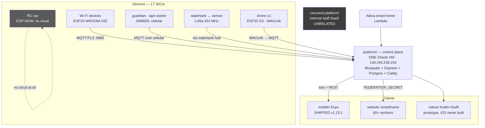

# 03 · Integrations and Ecosystem

> **Audience:** anyone who needs to know what this repository actually talks to.
> **The short version:** this is not a website. It is a company — a retail IoT hardware line, a self-hosted MQTT cloud on a real virtual machine, a shipped mobile app, a drone, and a separate internal HR and payroll SaaS.

---

## 1. What is actually in the repository

```
   ╔══════════════════════════════════════════════════════════════════════╗
   ║  SIX SUB-PROJECTS SIT ALONGSIDE THE NEXT.JS APP                      ║
   ╠═══════════════════════╤══════════╤═══════════════════════════════════╣
   ║  Directory            │ Files on │ What it actually is               ║
   ║                       │   disk   │                                   ║
   ╠═══════════════════════╪══════════╪═══════════════════════════════════╣
   ║  firmware/            │  13,003  │ ESP32/ESP8266 firmware for a      ║
   ║                       │          │ 17-product retail hardware line   ║
   ║                       │          │ ⚠ ONLY 84 FILES ARE FIRST-PARTY   ║
   ║                       │          │   99.35% is PlatformIO build      ║
   ║                       │          │   cache, gitignored               ║
   ╟───────────────────────┼──────────┼───────────────────────────────────╢
   ║  mobile/              │   1,280  │ Expo React Native — SHIPPED on    ║
   ║                       │          │ the Play Store, v1.13.1           ║
   ╟───────────────────────┼──────────┼───────────────────────────────────╢
   ║  circuvent-platform/  │   1,202  │ A COMPLETELY DIFFERENT PRODUCT:   ║
   ║                       │          │ an internal Turborepo SaaS for    ║
   ║                       │          │ project tracking, HR, payroll     ║
   ║                       │          │ and a client portal               ║
   ╟───────────────────────┼──────────┼───────────────────────────────────╢
   ║  native/              │     999  │ Kotlin + Swift parity prototype.  ║
   ║                       │          │ The iOS half has NEVER COMPILED.  ║
   ╟───────────────────────┼──────────┼───────────────────────────────────╢
   ║  hardware/            │     771  │ Real KiCad PCBs, Gerbers, BOMs    ║
   ║                       │          │ and enclosures for 17 products    ║
   ╟───────────────────────┼──────────┼───────────────────────────────────╢
   ║  platform/            │     317  │ The self-hosted IoT control plane:║
   ║                       │          │ Mosquitto + Node/TS + Postgres +  ║
   ║                       │          │ Caddy, on ONE Oracle free-tier VM ║
   ╚═══════════════════════╧══════════╧═══════════════════════════════════╝
```

> ⚠️ **A file count is a lie here.** `firmware/` looks like the biggest thing in the repository at 13,003 files. `git ls-files firmware` returns **84**. The rest is regenerated PlatformIO output, correctly gitignored: *"# PlatformIO build output — regenerated on build, never commit."* Anyone sizing this project by file count overstates the firmware by roughly 150×.

---

## 2. The ecosystem map

```
   ┌───────────────────────────────────────────────────────────────────┐
   │            17-SKU RETAIL HARDWARE LINE (ESP32 / ESP8266)          │
   │   hub · plug · switch · light · fan · lock · curtain · motion     │
   │   energy monitor · camera · facedoor · rfid-gate · sentinel       │
   │   touchboard · watertank · guardian · agri-starter                │
   │   + an RC car (ESP-NOW) + a drone (MAVLink)                       │
   └────┬──────────┬──────────┬──────────────┬──────────────┬──────────┘
        │ Wi-Fi    │ GSM      │ LoRa 433MHz  │ ESP-NOW      │ MAVLink
        │ MQTT/TLS │ SIM800L  │ point-to-    │ 2.4 GHz      │
        │ :8883    │          │ point        │ 50 Hz        │
        ▼          ▼          ▼              ▼              ▼
   ╔══════════════════════════════════════════════════════════════════╗
   ║   platform/  —  THE CONTROL PLANE                                ║
   ║   ONE Oracle Cloud free-tier VM · 140.245.238.154                ║
   ║   api.circuvent.com  ·  mqtt.circuvent.com                       ║
   ║                                                                  ║
   ║   Mosquitto (own broker, own CA)  ·  Express/TS  ·  Postgres     ║
   ║   Caddy reverse proxy  ·  a face-embedding microservice          ║
   ║   + an Alexa smart-home Lambda                                   ║
   ╚═══════╤═══════════════════════╤══════════════════════╤═══════════╝
           │ wss + REST            │ FEDERATION_SECRET    │
           ▼                       ▼                      ▼
   ┌───────────────┐    ┌──────────────────────┐   ┌────────────────┐
   │  mobile/      │    │  website  src/       │   │  native/       │
   │  Expo, SHIPPED│    │  /smarthome console  │   │  prototype     │
   │  com.circuvent│    │  60+ sections        │   │  .nativeclient │
   │  .app v1.13.1 │    │                      │   │  v0.1.0        │
   └───────────────┘    └──────────────────────┘   └────────────────┘

   ┌───────────────────────────────────────────────────────────────────┐
   │  circuvent-platform/  — UNRELATED. Internal staff SaaS.           │
   │  Turborepo · 7 microservices · Prisma · its own Next.js on :3005  │
   │  project-tracker · hr-payroll · financial-ledger · client-portal  │
   │  ats-engine · ai-orchestrator · iot-registry (asset tracking)     │
   │  ⚠ Its README publishes working seed logins.                      │
   └───────────────────────────────────────────────────────────────────┘
```



---

## 3. `platform/` vs `circuvent-platform/` — a naming trap

**These are two entirely different products.** Neither supersedes the other. Someone skimming directory names would get this badly wrong.

| | `platform/` | `circuvent-platform/` |
| --- | --- | --- |
| **Is** | The **device-facing IoT control plane** | An **internal staff SaaS** |
| README title | *"Circuvent Control Plane — self-hosted IoT platform"* | *"Circuvent Technologies — Internal Management Platform"* |
| Users | ESP32 devices, the mobile app, the website's `/smarthome` pages | Circuvent employees |
| Structure | One Node/TS Express service + Mosquitto + Caddy + a face service, plain Docker Compose | Turborepo + pnpm, **7 microservices** + a gateway + its own Next.js 14 dashboard |
| Database | Postgres, hand-rolled `pool.query` | Postgres via **Prisma**, shared `packages/database` |
| Ports | 80/443 (Caddy), **8883** (MQTT/TLS) | 3000 gateway, 3001–3008 services, 3005 web |
| Secrets in `.env.example` | Real annotated device/broker secrets, with incident post-mortems in the comments | 🔴 **Literal placeholders** — `JWT_SECRET=your-super-secret-jwt-key-change-in-production` |
| Seed credentials | None | 🔴 **Published in the README**: `admin@circuvent.com / admin@123`, `engineer@123`, `client@123` — for an application that handles **HR, payroll and a financial ledger** |

> The only thing they share is the word "IoT": `circuvent-platform/apps/services/iot-registry` is an **internal asset and firmware-version tracker for engineering and R&D bookkeeping**, not a broker. Doc 05, D-08.

---

## 4. The device protocol

```
   TRANSPORT   MQTT over TLS, port 8883, self-hosted Mosquitto
               mqtts://mqtt.circuvent.com:8883

   "Everything is JSON over MQTT on our own broker."
   "no third-party IoT cloud."

   ENCRYPTION  ✅ TLS with Circuvent's OWN EMBEDDED CA
               (CIRCUVENT_DEFAULT_CA in CircuventDevice.h)
               The README notes what was removed to get here:
               "setInsecure() no longer used for MQTT"

   TOPICS      cv/<id>/cmd        commands in
               cv/<id>/state      current state out
               cv/<id>/telemetry  measurements
               cv/<id>/frame      camera stills
               cv/<id>/anpr       plate reads
               cv/<id>/track      drone position (16-byte header
                                  + 40-byte fixed records)
               cv/<id>/status     online/offline

   LIVE APP    wss://api.circuvent.com/ws?token=<JWT>   — a separate hop
```

```json
// state — AquaGuard tank controller
{ "level": 72, "pump": true, "mode": "auto",
  "startPct": 30, "stopPct": 90, "dryRun": false }

// cmd
{ "action": "set", "ch": 2, "on": true }
```

### Device authentication

```
   ✅ WHAT IT IS
      A per-device secret. username = deviceId, password = key.
      Minted by POST /devices/provision.
      Stored BCRYPT-HASHED. The registry doc is emphatic:

        "A device key cannot be looked up. Not by support, not by
         engineering, not by an administrator. devices.key_hash is
         bcrypt. There is no plaintext anywhere in the system."

      Broker ACLs restrict each device to its own namespace: cv/<deviceId>/#

   ⚠ WHAT IT IS NOT
      Not mutual TLS. Not an X.509 client certificate. There is no
      hardware-backed secret storage on an ESP32. A leaked device key
      is enough to impersonate that device — though only within its
      own topic namespace, which meaningfully limits blast radius.

   ⚠ AND PROVISIONING IS STILL SEMI-MANUAL
      The API mints the credential; granting broker access is a
      separate operator step (scripts/add-device.sh, mosquitto_passwd).
      The firmware README flags it:
        "Future: delegate broker auth to Postgres (mosquitto-go-auth)
         so provisioning alone grants broker access without add-device.sh."
```

**Wi-Fi handoff during setup is separately encrypted** with NaCl sealed boxes (`crypto_box_keypair` / `crypto_box_open`, via the vendored `tweetnacl.c`) — so the household Wi-Fi password never crosses the captive portal in the clear. That is a genuinely good detail.

---

## 5. Over-the-air updates — the most serious finding in this document

```
   ╔══════════════════════════════════════════════════════════════════════╗
   ║  THERE IS NO FIRMWARE IMAGE SIGNATURE VERIFICATION.                  ║
   ╠══════════════════════════════════════════════════════════════════════╣
   ║                                                                      ║
   ║  Both OTA paths call httpUpdate.update(otaClient, binUrl) over a     ║
   ║  certificate-PINNED TLS connection. That authenticates the SERVER.   ║
   ║  It does not authenticate the FIRMWARE.                              ║
   ║                                                                      ║
   ║  Searched for and NOT found anywhere in CircuventDevice.h:           ║
   ║    • Ed25519 or RSA signature verification                           ║
   ║    • a hash manifest checked against an on-device public key         ║
   ║    • ESP32 Secure Boot or signed-partition configuration in any      ║
   ║      of the 29 platformio.ini files                                  ║
   ║                                                                      ║
   ║  "Signed OTA" in the documentation means "downloaded over a pinned   ║
   ║  HTTPS connection." That is a materially weaker guarantee.           ║
   ║                                                                      ║
   ║  And the code itself already articulates the stakes, in the comment  ║
   ║  explaining why setInsecure() was removed:                           ║
   ║                                                                      ║
   ║    "It used to use setInsecure(), which disables certificate         ║
   ║     validation entirely — anyone able to intercept that connection   ║
   ║     ... could serve arbitrary firmware and take permanent control    ║
   ║     of a board that switches MAINS RELAYS AND DOOR LOCKS."           ║
   ║                                                                      ║
   ║  The transport hole was closed. The integrity hole was not.          ║
   ╚══════════════════════════════════════════════════════════════════════╝
```

**And the checklist is honest about it.** `hardware/CHECKLIST.md` marks both of these unchecked:

- `[ ]` *"OTA manifest endpoint (`/api/devices/firmware`) serving signed builds"*
- `[ ]` *"Field OTA rollout + rollback plan; key rotation policy"*

**Confirmed server-side:** `platform/api/src/routes/` contains no `firmware.ts` or `ota.ts`. So the device's periodic pull-OTA check polls an endpoint **that does not exist**. Pull-OTA is dead code today. Push-OTA works, and trusts whatever URL an administrator supplies.

> A shared-library fix worth noting: OTA is handled generically in `CircuventDevice.h` **after a bug in which all twenty product sketches individually forgot to implement it.** That is the right correction — move it to the one place, not twenty.

---

## 6. Mobile — and a collision deliberately avoided

| | `mobile/` | `native/android` | `native/ios` |
| --- | --- | --- | --- |
| Stack | Expo ~53 · RN 0.79.6 · React 19 | Kotlin + Jetpack Compose | Swift + SwiftUI via XcodeGen |
| App id | **`com.circuvent.app`** | `com.circuvent.app.nativeclient` | `com.circuvent.app.nativeclient` |
| Version | **1.13.1**, build 24 | 0.1.0, versionCode 1 | 0.1.0 |
| Shipped? | ✅ **Yes — on the Play Store** | ❌ Debug side-load only | ❌ **Never compiled, once** |
| Evidence | `mobile/dist/` holds real signed artifacts spanning **1.1.0 → 1.12.0+**, `play-upload-key.json`, `PLAYSTORE.md` | Gradle assembleDebug works | *"There is no Mac in this pipeline."* |

```
   ⭐ THE GOOD DECISION

   A sibling repository in this suite shipped TWO mobile implementations
   under ONE app id, which is a real hazard. This repository used a
   DIFFERENT app id on purpose, and said why:

     "That is deliberate twice over: the first thing anybody needs while
      replacing an app is to run both on one phone and compare them, and
      it removes any chance of a debug build replacing somebody's
      provisioned installation."

   And native/README.md is candid rather than aspirational:
     "mobile/ is what is on the Play Store and it has not been modified."
     "The Swift is not compiled by anything."
```

---

## 7. The same rule, written four times

```
   THE RULE: a per-device "capability table" — which fields a device
   type reports, which command keys control it, and critically which
   device types must expose NO toggle at all (a camera's only switch is
   `streaming`; a drone's is flight permission).

   IMPLEMENTED INDEPENDENTLY IN FOUR PLACES:

     TypeScript (Expo, shipping)  mobile/src/store.tsx  capabilitiesFor()
     Kotlin                       native/android/.../core/Capabilities.kt
     Swift                        native/ios/Circuvent/Core/Capabilities.swift
     TypeScript (web console)     src/ — referenced by name in native/README

   AND native/README.md NAMES THE FAILURE, TWICE OVER:

     "A Home Hub reports `power2` and is commanded with {ch: 1, on: true}
      ... Send the state key to a device that wanted the command key and
      nothing errors...
      THAT BUG HAS ALREADY SHIPPED TWICE — once on the web and once in
      the Expo app."

   The only guard is tests/native-client-parity.test.ts, which diffs the
   Kotlin, Swift and Expo tables at test time.

   Drift is CAUGHT BY AN ASSERTION, not PREVENTED BY A SHARED SCHEMA.
   Doc 05, D-07.
```

A second, lower-severity instance: the device serial-number and QR format is defined server-side in `platform/api/src/serial.ts` and re-implemented for parsing in `mobile/src/qr.ts`.

---

## 8. The hardware

```
   17 SKUs, sold on circuvent.com, Amazon.in and Flipkart

   Home Automation Hub · AquaGuard tank controller · Smart Plug ·
   Smart Switch · Smart Light · Smart Fan · Smart Lock · Curtain
   controller · Motion Sensor · Energy Monitor · Guardian (wearable SOS) ·
   Agri Pump Starter · Touch Switchboard · FaceDoor · RFID Gate ·
   Sentinel (gas/climate) · Load Controller

   MCU: ESP32-WROOM-32E for most; ESP32-S3-WROOM-1 for the drone

   hardware/ IS REAL FIRST-PARTY DESIGN SOURCE — not datasheets.
   Every product except the drone has:
     pcb/  .kicad_pcb · .kicad_pro · .kicad_dru · BOM.csv ·
           SCHEMATIC.md · gerbers/
     enclosure/ · listings/ · DATASHEET.md · MANUAL.md

   Generated, not hand-drawn: gen-hardware.js (Node) + gen-pcb.py
   (Python) build real boards and Gerbers for all 17 devices from
   SCHEMATIC.md + BOM.csv. CHECKLIST.md flags this itself:
     "the netlist is derived by the generator... not captured from a
      drawn schematic"

   ⚠ NOT MANUFACTURED. CHECKLIST.md's own legend marks BIS/WPC/CE
     certification, tooling, photography and seller accounts as
     "requires an external vendor, lab, physical process, or account."

   ⚠ 97 unconnected nets remain across the 17 boards (47 blocked on
     mains-isolation clearance), and the ESP32 antenna keepout was
     reduced from Espressif's recommended 48×21 mm to 7 mm.
     DRC-clean is not the same as safe to fabricate for mains products.
```

### The drone is the least mature thing here

```
   feat/drone-x1 · feature/drone-link · fix/drone-stale-control-plane
   — three long-lived branches for one physical product.

   TWO COMPETING FIRMWARE ARCHITECTURES CO-EXIST:

     firmware/drone-fc     an IN-HOUSE flight-controller stack —
                           motor mixer, arm/disarm, IMU loop.
                           The datasheet warns: "This airframe carries
                           a new flight stack."

     firmware/drone-link   a COMPANION COMPUTER that explicitly refuses
                           to be a flight controller:
                             "It sits on the airframe next to a real
                              flight controller — ArduPilot or PX4...
                              WHY THE CLOUD IS NEVER IN THE CONTROL
                              LOOP... There is deliberately no 'nudge
                              forward while I hold this button'."
                           Bridges MAVLink → MQTT with whole-intent
                           commands only: takeoff, goto, RTL, land.

   The second design is excellent and its reasoning is right.
   The first contradicts it.

   ⚠ AND drone-x1 IS THE ONE PRODUCT WITH NO pcb/ DIRECTORY.
     A DATASHEET only. Spinning propellers, no certification, no PCB
     source, and a documented warning not to fit props before reading
     the commissioning ladder. Doc 05, D-09.
```

---

## 9. Build and release reality

| Sub-project | Build | Automated? | Evidence it has run |
| --- | --- | :-: | --- |
| `firmware/` | PlatformIO per device | ❌ `CHECKLIST.md`: `[ ]` *"Build in CI (arduino-cli) + signed release binaries hosted for OTA"* | ✅ Every device has a populated `.pio/build` with compiled `.elf`/`.bin` — built locally at least once |
| `platform/` | `tsc` → `dist/`, Docker Compose | ❌ none found | ✅ `dist/` has 129 compiled files; deployed to a real VM with an SSH runbook |
| `circuvent-platform/` | Turborepo, pnpm, Prisma | ❌ none found | 🟡 A real 196 KB `pnpm-lock.yaml` and installed modules — run locally, no deployment evidence |
| **`mobile/`** | **EAS Build** — production profile, App Bundle, `autoIncrement: true` | 🟡 Managed cloud CI, invoked manually | ✅ **The strongest release evidence in the repository** — signed artifacts across many versions |
| `native/android` | Gradle | ❌ | 🟡 Debug only, no release signing |
| `native/ios` | XcodeGen | ❌ | ❌ **Never built** |
| `hardware/` | Generators, not a software build | ❌ | ✅ Generated Gerbers and BOMs on disk; `CHECKLIST.md` tracks DRC pass/fail per board |

---

## 10. Signing keys and a documented loss

```
   Creds/  — at the repository root, gitignored wholesale (verified:
             `git ls-files -- Creds` returns nothing, and .gitignore:110
             carries the rule with an explanation:
               "A keystore or an SSH key committed once is in every
                clone and every fork forever.")

     circuvent-cp.key              SSH key for the control-plane VM
     circuvent-upload.jks          Play upload keystore
     circuvent-upload-2026.jks     a second one
     circuvent-upload.keystore     a third
     upload-keystore.properties    passwords, IN PLAINTEXT
     README.md                     VM and key runbook

   Mirrored again under mobile/credentials/, whose .gitignore says:
     "# Signing keystores — NEVER commit"

   🔴 upload-keystore.properties DOCUMENTS A REAL LOSS:

     "This file was overwritten on 2026-08-03 and that is how the
      password for circuvent-upload.jks was lost... do not delete
      [the .bak] until the original key is either recovered or
      permanently retired"

     Three keystore variants plus a .bak now coexist. Losing a Play
     upload key is recoverable; losing an app-signing key is not.
     Doc 05, D-06.
```

---

## 11. Integration risk register

| # | Risk | Sev |
| --- | --- | :-: |
| 1 | **No firmware signature verification.** OTA authenticates the transport, never the image. On devices that switch mains relays and door locks — a risk the code's own comments already articulate | 🔴 |
| 2 | **Pull-OTA polls an endpoint that does not exist.** `/api/devices/firmware` has no route. A mechanism that appears to exist and does not is worse than none | 🔴 |
| 3 | **`circuvent-platform/` publishes working seed logins in its README** — `admin@123` and friends — for an application handling HR, payroll and a financial ledger | 🔴 |
| 4 | **Placeholder JWT secrets ship as defaults** in `circuvent-platform/.env.example`, and its own README records that this exact class of misconfiguration has already happened once | 🟠 |
| 5 | **The capability table exists in four languages** with no shared schema. The bug it causes has already shipped twice | 🟠 |
| 6 | **A Play upload keystore password was permanently lost**, and passwords sit in plaintext beside three keystore variants | 🟠 |
| 7 | **Device auth is a shared secret, not mutual TLS**, with no hardware-backed storage on the ESP32 | 🟠 |
| 8 | **The whole IoT cloud is one free-tier virtual machine.** No redundancy, no documented backup, no failover | 🟠 |
| 9 | **The drone has two competing firmware architectures, three branches and no PCB source** — the least mature and most physically dangerous product in the line | 🟠 |
| 10 | **RF and mains-isolation compliance is unresolved** — 97 unconnected nets, antenna keepout cut from 48×21 mm to 7 mm | 🟡 |
| 11 | **No firmware CI.** Nothing builds the 29 sketches automatically; a compile break is found by a human | 🟡 |
| 12 | **Provisioning is semi-manual** — the API mints a key, an operator must still run `add-device.sh` | 🟡 |

### And what is genuinely well done

> Its own CA and pinned TLS after removing `setInsecure()` · bcrypt-hashed device keys that *nobody* can look up · per-device broker ACLs · NaCl sealed boxes for the Wi-Fi handoff so a household password never crosses the captive portal in the clear · OTA fixed once in the shared library rather than twenty times in twenty sketches · a companion-computer design that refuses to put the cloud in a flight control loop · a deliberately different app id so a debug build can never replace a customer's installation · and a hardware checklist honest enough to mark its own unfinished items unchecked.

---

*Next: [04_MAINTENANCE_AND_OPERATIONS.md](./04_MAINTENANCE_AND_OPERATIONS.md) · Back to [02_DATABASE_AND_DATA_MODELS.md](./02_DATABASE_AND_DATA_MODELS.md)*
