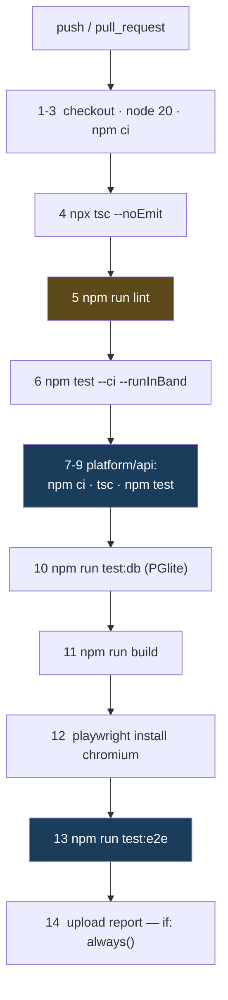

# 04 · Maintenance and Operations

> **Audience:** anyone who has to run, deploy, debug or extend this.
> **The finding that shapes this document:** the CI pipeline here is the most thorough in the entire Circuvent suite — fourteen steps, thirteen of them hard gates, including the control plane's own test suite and a full Playwright run. **It has never executed once.**

---

## 1. The CI that has never run

```
   ╔══════════════════════════════════════════════════════════════════════╗
   ║  gh run list --limit 30                                              ║
   ║                                                                      ║
   ║     27 runs on record.                                               ║
   ║     27 startup_failure.                                              ║
   ║     0 seconds, every one.                                            ║
   ║     Spanning 2026-08-09 → 2026-08-20, across main, develop,          ║
   ║     master and a dozen feature branches.                             ║
   ║                                                                      ║
   ║  AND IT IS WORSE THAN IT LOOKS. Going deeper via the API:            ║
   ║                                                                      ║
   ║     The registered workflow "CI" (id 336804312, ci.yml, state        ║
   ║     ACTIVE, created 2026-08-18) has ZERO RUNS EVER RECORDED          ║
   ║     AGAINST IT.                                                      ║
   ║                                                                      ║
   ║     All 27 runs are attributed instead to a synthetic, DELETED       ║
   ║     workflow named "" / BuildFailed — GitHub's placeholder for       ║
   ║     "could not even start". Every one returns                        ║
   ║     {"total_count": 0, "jobs": []}.                                  ║
   ║                                                                      ║
   ║  This pipeline has never executed one line of its own YAML,          ║
   ║  even after ci.yml became syntactically valid and active.            ║
   ║                                                                      ║
   ║  No YAML defect was found. The billing API returned 403 on the       ║
   ║  audit token, so the precise trigger is unconfirmed — but this is    ║
   ║  the same signature the ATS repository shows.                        ║
   ╚══════════════════════════════════════════════════════════════════════╝
```

### What it would do

`.github/workflows/ci.yml` — the only workflow. Push to `main`/`master`/`feature/shopping`, PR to `main`/`master`. Ubuntu, Node 20, 20-minute timeout, `cancel-in-progress`. *"Deterministic, secret-free build. Real values are configured in Vercel."*



**Only step 5 (`lint`) is `continue-on-error`.** Everything else is a hard gate. That is stricter than most of the suite.

**And the workflow narrates its own history in comments:**

> *"The control plane is a separate package with its own dependencies and its own runner, so `npm test` at the root never touched it. That left **~290 tests** — the MQTT bridge, session revocation, the device registry, the whole ANPR recognition and visit-pairing pipeline — **unable to block a deploy**."*

> *"E2E was never run in CI, which is how the sitemap assertion below stayed broken (it expected the wrong domain)… Must match the browsers `playwright.config.ts` runs. These disagreed: only chromium was installed while the config declared three projects, so every run failed on 'Executable doesn't exist' for firefox and webkit."*

Both are real fixes to real gaps. Neither has ever run.

### Thirteen scripts CI never touches

| Script | Status |
| --- | --- |
| **`verify:secrets`** | 🔴 **Not a CI gate.** Only a bypassable local hook — see §2 |
| `test:coverage` | ❌ not in CI |
| `verify:icm` | ❌ not in CI — the durability proof from doc 02 §9 |
| `audit:contrast`, `audit:admin-theme`, `audit:perf`, `audit:live`, `audit:images` | ❌ **none of the five** |
| `docs:business`, `docs:business:verify`, `docs:kt`, `docs:kt:verify`, `docs:business:data` | ❌ **the entire documentation pipeline** |

**No real database in CI.** `test:db` runs PGlite in-process. Production uses Neon. Neon is never touched by CI.

---

## 2. The git hook

```
   package.json:  "prepare": "node scripts/install-hooks.mjs"
   Runs on every npm install / npm ci.

   INSTALLS EXACTLY ONE HOOK:

     #!/bin/sh
     # Installed by scripts/install-hooks.mjs — edit that, not this.
     node "$(git rev-parse --show-toplevel)/scripts/check-no-secrets.js" --staged || exit 1

   ✅ VERIFIED PRESENT: .git/hooks/pre-commit exists, 163 bytes,
      byte-identical to the template.
```

Its header explains both why hooks are installed rather than committed, and why it is a Node script:

> *"Hooks live in `.git/hooks`, which is not tracked, so a hook that exists on one machine does not exist on the next clone… The hook is deliberately a single node call. **An earlier guard in this repo was written in bash and never ran once, because `bash` on the Windows box that does the builds is WSL with no distribution installed — it failed silently and the build carried on with the wrong signing key.**"*

```
   🔴 BUT IT IS TRIVIALLY BYPASSABLE, THREE WAYS:
        git commit --no-verify
        skip npm install (the hook is then never installed)
        delete .git/hooks/pre-commit

   And because verify:secrets is not in CI, a developer who bypasses the
   hook has NOTHING stopping a secret at push time. Doc 05, D-03.
```

---

## 3. The audit scripts — and what happened when they were run

| Script | What it checks | Run result |
| --- | --- | :-- |
| `check-no-secrets.js` | Forbidden filenames and content patterns, staged or whole-tree | **exit 0** — `✓ no-secrets — checked the tracked tree` |
| `audit-images.mjs` | Every asset in `public/` against a per-type size budget | **exit 1** — 3 over budget: `logo.png` and `logo-mark.png` at **368 kB against an 80 kB budget**, `icon-512.png` at 172 kB |
| `verify_business_docs.py` | The generated business documents actually contain what they claim | **exit 0** — `All 43 checks passed` across 7 artefacts |
| `verify_kt_docs.py` | The same for the knowledge-transfer pack | **exit 1** — `61/73 checks passed` — see §5 |
| `audit-code-contrast.mjs` | Computed CSS contrast of code surfaces, in a real browser | **exit 2** — needs `next start -p 3199` first. It correctly refused to claim success: `FAILED: no code/pre elements were examined — the audit proved nothing.` |
| `audit-admin-theme.js` | Screenshots the console under every theme, no login required | not run — needs a server |
| `perf-probe.mjs` | Real latency, transferred bytes from the Resource Timing API, **directly observed CLS** | not run — needs a server |
| `audit-live.mjs` | Every read-only production surface; `--control` round-trips one live device command | not run — needs production |

### Three quotes worth keeping

> **`scripts/check-no-secrets.js`** — *"`.gitignore` stops the files it knows about. It does not stop `git add -f`, a secret pasted into a source file, a new `.env` under a name nobody thought of, or an archive of the whole credentials directory… **a secret pushed once is in every clone and every fork, and deleting the file in a later commit does not remove it from history.**"*

> **`scripts/audit-code-contrast.mjs`** — *"Written because the bug it checks for was invisible to every existing test: the stylesheet compiled, the page rendered, and **the only symptom was that a human could not read it.** Asserting the computed colours in a real browser is the only thing that would have caught it."*

> **`scripts/verify_kt_docs.py`** — *"`npm run docs:kt` printing 'ok' only proves three files were written. It does not prove the deck has slides, that the device list reached the page, or that the traps table survived being parsed out of a markdown file — and **a build script in this repository has previously reported success while publishing the previous run's artifact**, so 'the command succeeded' is not evidence."*

That last one is the philosophy of this whole repository in one paragraph.

---

## 4. The documentation pipeline

```
   FOUR PYTHON SCRIPTS. TWO BUILD, TWO VERIFY.

   build_business_docs.py     investor deck · sales deck · company profile ·
                              business plan · new-joiner handbook ·
                              product catalogue · price list
                              → PPTX, DOCX, PDF into Docs/business/
                              SOURCE: business-data.json, itself exported
                              from the LIVE SHOP CATALOGUE by
                              scripts/export-business-data.ts

   build_kt_docs.py           onboarding deck · handbook · quick reference
                              → Docs/kt/
                              SOURCE: the repository itself — device list
                              from the firmware tree, doc index from Docs/,
                              traps table parsed out of 00-start-here.md
```

**Why generate rather than write:**

> *"business documents quote prices, and prices move. A deck, a catalogue and a price list that each carry their own typed copy will disagree with the shop within a quarter… **Refuses to run if the export is missing or stale** rather than quietly producing documents from yesterday's prices."*

**And the verifiers check content, not existence:**

| Pack | Asserts |
| --- | --- |
| Business | The company name is in every document · every priced document contains a **real catalogue price** · **no raw unformatted price** slipped past the formatter · exact slide counts · PDFs have extractable text · placeholders appear only where intended |
| KT | Every document names the company **and the commit it was generated from** · the deck has slides, speaker notes and the parity rule · the handbook lists every file in `Docs/` · **every device in the firmware tree appears somewhere** · **nothing in the KT pack carries the business pack's "live product catalogue" stamp** — a claim it has no right to make |

**Neither is run by CI or by a hook.** And the difference shows: the business pack is fresh at 43/43; the KT pack is stale at 61/73.

---

## 5. Test suite — 4,328 tests, one failing

```
   npm test -- --ci --runInBand          EXIT CODE 1

   Test Suites:   1 failed, 235 passed, 236 total
   Tests:         1 failed, 4,327 passed, 4,328 total
   Time:          49.5 s

   THE FAILURE:
     src/lib/report-logo.test.ts
       › "the embedded mark matches the artwork"
         › "re-derives byte for byte from public/logo-mark-160.png"

     The embedded base64 logo bytes have drifted from the PNG on disk.
     A small failure — and a test that is doing exactly its job.

   FILE COUNT RECONCILES EXACTLY:
     tests/**                     120
     co-located src/**/*.test.*   116
     ─────────────────────────────────
     236 files = 236 Jest suites
```

| Aspect | Finding |
| --- | --- |
| Coverage threshold | 🔴 **`jest.config.js` has no `coverageThreshold` key at all.** `test:coverage` exists; nothing fails on low coverage; and it is not in CI anyway |
| Playwright | 8 specs in `e2e/`. `test-results/.last-run.json` says `"passed"` — but per the workflow's own comment e2e *"was never run in CI"*, so this is an undated local cache and should not be trusted |
| **Untested** | 🔴 **`src/lib/db.ts`** — the entire database access layer. 🔴 **`src/lib/csp.ts`** — which generates the Content-Security-Policy string that `next.config.ts` ships |

### Largest test files

| Lines | File | Covers |
| ---: | --- | --- |
| 443 | `src/app/api/admin/icm/route.test.ts` | Incident management API |
| 424 | `tests/firmware-avi.test.ts` | Firmware AVI parsing |
| 382 | `src/app/api/admin/availability/probe/route.test.ts` | Availability probe |
| 362 | `src/lib/app-insights-usage.test.ts` | Telemetry usage reporting |
| 355 | `tests/camera-fps-parity.test.ts` | Camera FPS parity |
| 342 | `tests/icm.test.ts` | Incident state machine |
| 336 | **`tests/drone-flight-safety.test.ts`** | **Drone flight-safety limits** |
| 324 | `src/lib/app-insights-query.test.ts` | Telemetry queries |
| 322 | `src/app/admin/insights-charts.test.tsx` | Admin charts |
| 316 | `tests/lib/extended-utils.test.ts` | Utilities |

---

## 6. Code quality, measured

| Metric in `src/` | Count |
| --- | ---: |
| `TODO` / `FIXME` | **1** |
| `@ts-ignore` / `@ts-expect-error` | **0** |
| `eslint-disable` | 47 across 38 files |
| literal `console.log(` | 7 across 4 files — including one in `payments/webhook/route.ts`, which is the stub |
| Files using `any` | 9 files, 46 occurrences — `AnalyticsPanel.tsx` alone accounts for 24 |
| `.ts`/`.tsx` files | 971 |

For a 971-file tree that is a genuinely clean signal.

```
   npx tsc --noEmit            EXIT 0. Clean. tsconfig strict: true.

   ⚠ BUT tsconfig `exclude` covers scripts, e2e, jest.setup.tsx and
     circuvent-platform — so the scripts and e2e specs are NOT typechecked.

   npm run lint                EXIT 1 — 29,687 problems
                               (5,726 errors, 23,961 warnings)

   AND ALMOST NONE OF IT IS REAL:
     .next-audit/          1,050 files   23,271 problems
     circuvent-platform/     543 files    4,627
     mobile/                 247 files      378
     platform/api/dist       117 files      706   ← COMPILED OUTPUT
     ──────────────────────────────────────────
     src/ + tests/ + scripts/  IN SCOPE          ≈705   (2.4%)

   CAUSE: eslint.config.mjs's globalIgnores lists only SHALLOW patterns
   — .next/**, out/**, build/**, next-env.d.ts — which do not match
   nested paths in a monorepo. So ESLint is linting build output and two
   unrelated sub-projects.

   Fixing the ignore patterns turns a 29,687-problem wall of noise into
   roughly 705 actionable items. Doc 05, D-05.
```

---

## 7. Deployment

```json
// vercel.json — this is the ENTIRE file
{
  "$schema": "https://openapi.vercel.sh/vercel.json",
  "crons": [
    { "path": "/api/admin/alerts/run",          "schedule": "0 8 * * *" },
    { "path": "/api/admin/reports/send",        "schedule": "0 4 * * *" },
    { "path": "/api/smarthome/alerts/cron",     "schedule": "0 6 * * *" },
    { "path": "/api/admin/availability/probe",  "schedule": "0 5 * * *" }
  ]
}
```

Four crons. No regions, no function config, no rewrites, no headers — headers live in `next.config.ts`.

### Security headers — complete, and applied twice

```js
const securityHeaders = [
  { key: "Strict-Transport-Security", value: "max-age=63072000; includeSubDomains; preload" },
  { key: "Content-Security-Policy", value: CSP },
  { key: "X-Content-Type-Options", value: "nosniff" },
  { key: "X-Frame-Options", value: "DENY" },
  { key: "Referrer-Policy", value: "strict-origin-when-cross-origin" },
  { key: "X-DNS-Prefetch-Control", value: "on" },
  { key: "Permissions-Policy", value: "camera=(), microphone=(), geolocation=(self), browsing-topics=()" },
  { key: "Cross-Origin-Opener-Policy", value: "same-origin" },
];
```

Applied to `/:path*`, with `/_next/static/:path*` getting `max-age=31536000, immutable` and `/api/:path*` getting `no-store, must-revalidate`. Non-production deployments add `X-Robots-Tag: noindex, nofollow`.

> ⚠️ The CSP string comes from `src/lib/csp.ts` — **which has no test anywhere.**

**Image remote patterns are scoped to exactly two hosts**, with a comment that shows why: *"`/**` would turn the Next image optimizer into an open proxy for every tenant on `res.cloudinary.com`."*

**Two redirects, both with a reason:**
- `/fw/:file` → an R2 bucket, because *"Eighteen images, about twenty megabytes, were committed under `public/fw/` and shipped with every deployment."*
- `/developers` → `/developer`, avoiding a stale static-prerender 200 followed by a JavaScript redirect.

**`distDir` is conditional on an env var**, because the dev server previously deleted `BUILD_ID` from a shared `.next` and an audit silently ran against an empty site.

---

## 8. Secrets — history is clean

```
   git log --all --diff-filter=A --name-only --pretty=format:
     | Sort-Object -Unique
     | Select-String 'creds|\.env|\.jks|\.keystore|\.key$|\.pem$|secret'

   MATCHES — all benign:
     circuvent-platform/.env.example    platform/.env.example
     Docs/11-secrets.md                 scripts/check-no-secrets.js
     scripts/secret-inventory.mjs       src/lib/secrets.ts
     tests/check-no-secrets.test.ts     tests/unit/secrets-lazy.test.ts

   ✅ NO REAL .env, .jks, .keystore, .pem OR .key HAS EVER BEEN ADDED
      IN THIS REPOSITORY'S HISTORY, ON ANY BRANCH.

   `.gitignore` carries redundant, overlapping coverage: *.jks,
   *.keystore, *.p12, *.pfx, *.pem, *.key, id_rsa, id_ed25519,
   credentials/, *.vault, circuvent-vault/, Creds/ and .env*.

   Docs/11-secrets.md is a full inventory and rotation document with no
   values in it.
```

**The gap is procedural, not historical:** the scanner runs only in a bypassable local hook. Getting it into CI is a two-line change.

### But the history is not clean of bloat

```
   The 15 largest blobs in `git rev-list --objects --all` are ALL
   firmware images — public/fw/camera-*.bin and sentinel-cam-*.bin —
   at 1.12 to 1.25 MB EACH, across dozens of versions.

   They are GONE from HEAD and from the index. They are PERMANENT in
   history. Every clone still pays for them.

   .git/ on disk is ~191 MB. Doc 05, D-10.
```

---

## 9. Documentation

`Docs/` holds 61 files — 39 numbered documents from `00-start-here.md` to `38-rc-platform.md`, plus generated `business/` and `kt/` packs.

| Claim | Reality | Verdict |
| --- | --- | --- |
| `README.md`: *"18 routes", "50+ React components"* | **151 `route.ts`, 108 `page.tsx`** | 🔴 **FALSE.** The README describes an early landing-page stage and was never updated as the monorepo grew |
| The KT pack is current | `verify_kt_docs.py` **exit 1** — missing 5 devices (`rc-link`, `rc-remote`, `rccar`, `rfid-attend`, `switchboard`) and 10 newer documents; **no commit stamp at all** | 🔴 **STALE** |
| `test-results/.last-run.json` says `"passed"` | An undated local cache; e2e *"was never run in CI"* | 🟠 not evidence |

**And several documents check out as accurate:**

| Document | Status |
| --- | --- |
| `Docs/25-git-and-releases.md` | ✅ Branch table matches the real `ci.yml` triggers and branch list exactly |
| `Docs/05-databases.md` | ✅ Correctly names Neon |
| `Docs/13-maintenance.md` | ✅ *"There is no monitoring stack."* — an honest absence claim, still true |

> **Notably, the sibling-repository failure mode is inverted here.** Other Circuvent repositories had documents describing systems that no longer existed. This one has documents describing a **fraction** of a system that grew past them.

### `.agents/`, `skills-lock.json` and `Prompt.txt`

| Artefact | What it is |
| --- | --- |
| `.agents/skills/workflow-init/SKILL.md` | ✅ A genuine AI-coding-agent "skill" teaching how to configure the Vercel Workflow SDK — which matches the `workflow` dependency and the `withWorkflow()` wrapper actually used in `next.config.ts` |
| `skills-lock.json` | ✅ Pins that skill by `computedHash` for reproducibility |
| **`Prompt.txt`** | 🔴 A verbatim AI prompt for building an **entirely unrelated** internal management platform. No connection to this Next.js site. An accidentally-committed scratch file |

The first two are a real convention a future contributor must respect. The third is hygiene debt.

---

## 10. Repository state

```
   533 commits  ·  2026-03-08 → 2026-08-20  ·  currently on `develop`

   FIVE REMOTES — and only one is the working repository:
     origin          Hemakotibonthada/WebSite.circuvent.git   ← THE REAL ONE
     hema            Hemakotibonthada/circuvent-technologies.git
     vercel          Hemakotibonthada/circuvent-technologies.git  (same URL)
     circuvent       Circuvent-Technologies/circuvent.git
     company-portal  Circuvent-Technologies/Company-Portal.git    (a DIFFERENT repo)

   git status: Architecture_Docs/ untracked (this audit), plus four
   deleted-but-unstaged screenshot scripts.

   ✅ test-results/, node_modules/, .next/ and *.log are all UNTRACKED.
```

---

## 11. Observability

```
   WHAT EXISTS                        WHAT DOES NOT
   ───────────                        ─────────────
   ✅ /api/health                      🔴 NO error tracking. No Sentry,
   ✅ /api/health/db                      Datadog, New Relic, Bugsnag or
   ✅ /api/admin/cron-health              LogRocket in package.json.
   ✅ api.circuvent.com/health            Only @vercel/analytics and
      → { ok, db }                        speed-insights — usage and
   ✅ /admin/health (admin token)          performance, not errors.
      → MQTT, DB, uptime               🔴 NO alerting of any kind.
   ✅ src/lib/logger.ts —              🔴 NO log shipper or sink.
      structured logging               🔴 The logger itself has NO TEST.
   ✅ Neon point-in-time recovery      🔴 No custom backup tooling.

   Docs/13-maintenance.md says it plainly, and is still correct:
     "There is no monitoring stack. The endpoints exist...
      Point any uptime service at /health."

   Nothing is pointed at /health.
```

### What you could not diagnose today

1. **Any production error.** There is no aggregation and no alerting — only a `/health` endpoint nobody is polling.
2. **Whether a bad deploy correlates with a broken build** — there is no CI signal at all to correlate against.
3. **A database or CSP regression** — `db.ts` and `csp.ts` are the two modules with no test anywhere.
4. **Whether the ~27 non-durable storage modules have lost data** — nothing reports it, by construction (doc 02 §5).
5. **Whether a device is running the firmware you think it is** — there is no OTA manifest endpoint (doc 03 §5).

---

## 12. Routine maintenance

| Cadence | Task |
| --- | --- |
| **Immediately** | Fix whatever prevents GitHub Actions from starting. Fourteen well-designed gates are worth nothing until then |
| **Immediately** | Add `verify:secrets` to CI. It is currently guarded only by a hook that `--no-verify` defeats |
| **Immediately** | Fix the `report-logo` test — regenerate the embedded bytes from `public/logo-mark-160.png` |
| **This week** | Fix `eslint.config.mjs`'s ignore patterns so `npm run lint` reports ~705 real problems rather than 29,687 |
| **Every deploy** | Run locally what CI cannot: `tsc --noEmit`, `npm test`, `npm run test:db`, `npm run build`, `npm run test:e2e` |
| **Every deploy** | Also run `verify:icm`, `verify:secrets` and `audit:images` — none run anywhere else |
| **After any device or Docs change** | Re-run `npm run docs:kt && npm run docs:kt:verify`. It is currently failing at 61/73 |
| **After any price change** | Re-run `docs:business:data` then `docs:business` — the documents are generated from the live catalogue precisely so they cannot drift |
| **Monthly** | Point an uptime service at `/api/health` and `api.circuvent.com/health`. `Docs/13-maintenance.md` has been asking for this |
| **Before scaling** | Nothing in `.data/`-backed modules survives a second instance. See doc 02 §5 first |

---

*Next: [05_AREAS_OF_ENHANCEMENT.md](./05_AREAS_OF_ENHANCEMENT.md) · Back to [03_INTEGRATIONS_AND_ECOSYSTEM.md](./03_INTEGRATIONS_AND_ECOSYSTEM.md)*
