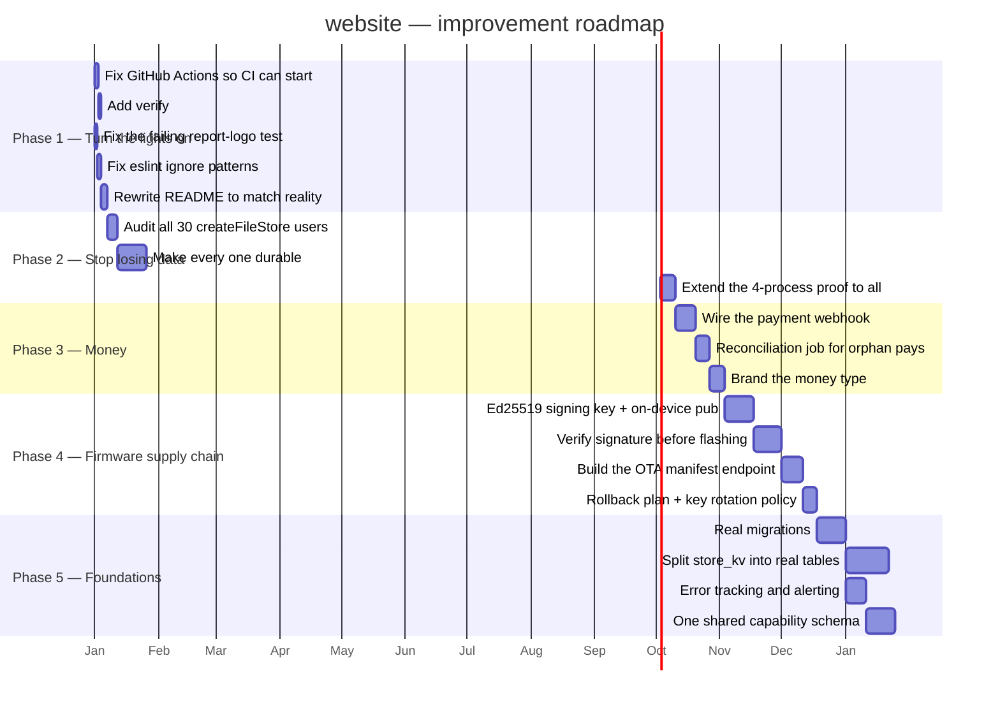

# 05 · Areas of Enhancement

> **Audience:** engineering leadership.
> **Method:** every item is traceable to a file, a command executed during this audit, or a comment in the codebase itself.

---

## 1. Gap analysis

```
   ┌──────────────────────────┬────────┬────────┬───────────────────────┐
   │ Dimension                │  Now   │ Target │ Gap                   │
   ├──────────────────────────┼────────┼────────┼───────────────────────┤
   │ Incident documentation   │████████│████████│ best in the suite     │
   │ Security headers         │████████│████████│ complete, applied 2×  │
   │ Secret history hygiene   │████████│████████│ provably clean        │
   │ Verification thinking    │███████ │████████│ scripts prove, not    │
   │                          │        │        │ assert                │
   │ Test volume              │███████ │████████│ 4,328 tests, 1 red    │
   │ Hardware engineering     │██████  │████████│ 17 real board designs │
   ├──────────────────────────┼────────┼────────┼───────────────────────┤
   │ Code hygiene             │██████  │████████│ lint config broken    │
   │ Documentation accuracy   │████    │████████│ 🔴 README off by 8×   │
   │ Auth architecture        │████    │████████│ 🔴 5 schemes, no gate │
   │ Payment reconciliation   │███     │████████│ 🔴 webhook is a stub  │
   │ Schema management        │███     │████████│ 🔴 created at boot    │
   │ Firmware supply chain    │██      │████████│ 🔴 no image signing   │
   │ Data durability          │██      │████████│ 🔴 ~27 modules memory │
   │ Observability            │█       │██████  │ 🔴 nothing at all     │
   │ CI actually running      │        │████████│ 🔴 0 of 27 runs       │
   └──────────────────────────┴────────┴────────┴───────────────────────┘
```

---

## 2. The four things that would keep me awake

### 2.1 Roughly twenty-seven storage modules lose all data on a cold start

```
   src/lib/data-file.ts — createFileStore()

     "On read-only filesystems (serverless production without a
      database) writes silently stop and the module degrades to
      in-memory-only for that instance, instead of throwing and
      breaking the request."

   ~30 modules use this. THREE pass { durable: true }:
     icm-store.ts · admin-warranty.ts · api-failures.ts

   THE OTHER ~27 INCLUDE:
     CMS content · CRM records · pricing · currency · tax configuration
     feature flags · marketing · staff activity · 570 KB of telemetry
     developer-portal tokens · AND PASSKEYS

   In production these live in one lambda instance's memory. When that
   instance recycles, the data is gone. Not stale. Not corrupted. Gone.

   AND THE REPOSITORY ALREADY KNOWS. From verify-icm-durability.ts:

     "Incidents were written to a JSON file that the serverless host
      cannot write... The next request — a cold start, or simply one
      routed elsewhere — began from an empty seed and rendered an empty
      queue. Incidents filed weeks ago were not hidden; THEY WERE GONE."

   That bug was found, understood, written down, and fixed for ONE
   module. The excellent four-process durability test proves ICM works.
   Nothing checks the other twenty-seven.
```

### 2.2 Firmware has no signature verification

```
   Devices that switch MAINS RELAYS and DOOR LOCKS accept over-the-air
   firmware whose only integrity guarantee is that it arrived over a
   certificate-pinned TLS connection.

   No Ed25519. No RSA. No hash manifest against an on-device key.
   No ESP32 Secure Boot in any of the 29 platformio.ini files.

   The code articulates the stakes itself, explaining why setInsecure()
   was removed:

     "anyone able to intercept that connection ... could serve arbitrary
      firmware and take permanent control of a board that switches mains
      relays and door locks."

   The transport hole was closed. The integrity hole was not.

   And hardware/CHECKLIST.md is honest about it — both unchecked:
     [ ] "OTA manifest endpoint (/api/devices/firmware) serving signed builds"
     [ ] "Field OTA rollout + rollback plan; key rotation policy"

   Meanwhile the device polls that manifest endpoint on a timer.
   It does not exist. platform/api/src/routes/ has no firmware route.
```

### 2.3 The payment webhook verifies its signature, then does nothing

```
   const expected = crypto.createHmac("sha256", secret).update(raw).digest("hex");
   const valid = sigBuf.length === expBuf.length && crypto.timingSafeEqual(sigBuf, expBuf);

   Correct. Constant-time. Then it console.log()s and returns.

     // Reconciliation hook: when a persistent order store exists,
     // mark the order paid/failed here...

   Any payment captured at Razorpay whose browser never returns — a
   closed tab, a dead connection, a failed redirect — is money taken
   and an order never marked paid.

   The checkout-side path is genuinely good: verifyCapturedPayment()
   re-fetches from Razorpay and requires status === "captured" before
   trusting the amount. A forged client signature cannot credit an
   order. The webhook was meant to be the safety net under that, and
   it is a stub.
```

### 2.4 CI has never run

```
   27 runs. 27 startup_failure. 0 seconds each.

   The registered "CI" workflow has ZERO runs ever attributed to it;
   all 27 belong to a synthetic deleted workflow. No YAML defect exists.

   What is not running: a typecheck, 4,328 root tests, the control
   plane's own ~290 tests, a PGlite database test, a production build,
   and a full Playwright suite — thirteen hard gates.

   The workflow's own comments describe fixing exactly the gaps that
   made those tests unable to block a deploy. Those fixes have never
   executed either.

   This is the second Circuvent repository with this precise signature.
```

---

## 3. Technical debt log

Severity: 🔴 critical · 🟠 high · 🟡 medium · ⚪ low

| ID | Finding | Sev | Effort |
| --- | --- | :-: | :-: |
| **D-01** | **~27 storage modules are memory-only in production** — CMS, CRM, pricing, tax, flags, telemetry, developer tokens and **passkeys** vanish on every instance recycle | 🔴 | L |
| **D-02** | **No firmware image signature verification** on devices controlling mains relays and door locks; the pull-OTA manifest endpoint does not exist at all | 🔴 | L |
| **D-03** | **CI has never executed** — 27 of 27 `startup_failure` — and `verify:secrets` is guarded only by a `--no-verify`-able local hook | 🔴 | S |
| **D-04** | **The payment webhook is a stub.** Signature verified correctly, then nothing. Payments captured without a browser return are never reconciled | 🔴 | M |
| **D-05** | **Schema is created at runtime** by `initDb()` on every cold start. No migrations, no version table, no rollback, no review surface | 🔴 | M |
| **D-06** | **No RLS, no tenant column, no foreign keys, no database access control of any kind** | 🔴 | L |
| **D-07** | **`circuvent-platform/` publishes working seed logins** (`admin@123`) in its README — for an application handling HR, payroll and a financial ledger | 🔴 | S |
| **D-08** | **README describes a fraction of the system** — *"18 routes, 50+ components"* against 151 routes and 108 pages, plus firmware, hardware and two native apps | 🔴 | S |
| **D-09** | **Every shop collection is one JSONB row.** Reading one order reads all of them; writing one rewrites all of them | 🟠 | M |
| **D-10** | **The capability table exists in four languages** with no shared schema; the bug it causes *"has already shipped twice"* | 🟠 | M |
| **D-11** | **`npm run lint` reports 29,687 problems**, of which ~705 are in scope. `globalIgnores` uses shallow patterns that miss nested monorepo paths | 🟠 | S |
| **D-12** | **Five coexisting credential schemes and no central gate.** `proxy.ts` performs no authentication; seven routes could not be matched to any known mechanism | 🟠 | M |
| **D-13** | **No observability at all** — no error tracking, no alerting, no log sink. `Docs/13-maintenance.md` says so plainly and has been ignored | 🟠 | M |
| **D-14** | **A failing test on `main`** — `report-logo.test.ts`; the embedded logo bytes have drifted from the PNG on disk | 🟠 | S |
| **D-15** | **The KT documentation pack is stale** — `verify_kt_docs.py` exits 1 at 61/73, missing 5 devices and 10 documents, with no commit stamp | 🟠 | S |
| **D-16** | **A Play upload keystore password was permanently lost** on 2026-08-03, and passwords sit in plaintext beside three keystore variants | 🟠 | M |
| **D-17** | **`db.ts` and `csp.ts` have no test anywhere** — the database layer and the module that generates the shipped Content-Security-Policy | 🟠 | M |
| **D-18** | **The environment guards ship empty.** `PROD_DATA_HOSTS` and `PROD_IDENTITY_HOSTS` are opt-in, and the code records the incident they exist to prevent | 🟠 | S |
| **D-19** | **The whole IoT cloud is one free-tier virtual machine** — no redundancy, no failover, no documented backup | 🟠 | L |
| **D-20** | **Transactions are structurally impossible** with the Neon HTTP driver | 🟡 | M |
| **D-21** | **Git history carries ~20 MB of firmware binaries** permanently. `.git` is ~191 MB | 🟡 | M |
| **D-22** | **No coverage threshold** in `jest.config.js`, and `test:coverage` runs nowhere | 🟡 | S |
| **D-23** | **Money is a float in the catalogue** — `price: number; // whole INR` — with integer paise only at the gateway boundary | 🟡 | M |
| **D-24** | **Every contact submission is written twice**, to Firestore and to the local store, from the same handler | 🟡 | S |
| **D-25** | **The drone has two competing firmware architectures, three branches and no PCB source** | 🟡 | L |
| **D-26** | **`resend` is declared but its SDK is never imported** | 🟡 | S |
| **D-27** | **13 npm scripts run nowhere automated** — including all five audits and the entire documentation pipeline | 🟡 | S |
| **D-28** | **`DeviceControls.tsx` is 4,870 lines** in a single React component | 🟡 | L |
| **D-29** | **Three public assets exceed their size budget** — `logo.png` and `logo-mark.png` at 368 kB against 80 kB | ⚪ | S |
| **D-30** | **`Prompt.txt` is an accidentally-committed AI prompt** for an unrelated project | ⚪ | S |
| **D-31** | **Device auth is a shared secret, not mutual TLS**, with no hardware-backed storage on the ESP32 | 🟠 | L |
| **D-32** | **97 unconnected nets across the 17 boards**, and the ESP32 antenna keepout was cut from 48×21 mm to 7 mm | 🟡 | L |
| **D-33** | **`tsconfig` excludes `scripts` and `e2e`** — a clean `tsc --noEmit` does not cover them | 🟡 | S |
| **D-34** | **Firmware provisioning is semi-manual** — the API mints a key, an operator still runs `add-device.sh` | 🟡 | M |

---

## 4. The pattern worth naming

```
   This repository does something almost nothing else does: when it
   finds a bug, it writes the bug down in the file that fixes it.

     passkeys.ts       "The passkey still existed, still verified, and
                        belonged to nobody."
     sso.ts            "Production users could sign in to dev, and dev
                        quietly accumulated live credentials while doing
                        it. The isolation guard was pointed at the wrong
                        door."
     next.config.ts    "silently deleted BUILD_ID twice while auditing,
                        so `next start` served nothing and the audit
                        reported a clean sweep of an empty site."
     verify-icm-       "Incidents filed weeks ago were not hidden;
     durability.ts      they were gone."
     install-hooks.mjs "bash on the Windows box that does the builds is
                        WSL with no distribution installed — it failed
                        silently and the build carried on with the wrong
                        signing key."
     db.ts             "dev.circuvent.com came to serve real customer
                        accounts, orders and wallet balances."
     check-no-secrets  "a secret pushed once is in every clone and every
                        fork, and deleting the file in a later commit
                        does not remove it from history."
     verify_kt_docs.py "a build script in this repository has previously
                        reported success while publishing the previous
                        run's artifact, so 'the command succeeded' is
                        not evidence."
     native/README     "That bug has already shipped twice — once on the
                        web and once in the Expo app."
     CircuventDevice.h "could serve arbitrary firmware and take permanent
                        control of a board that switches mains relays and
                        door locks."

   AND THE VERIFICATION SCRIPTS FOLLOW THE SAME PHILOSOPHY:
   they PROVE rather than assert.

     verify-icm-durability.ts   spawns FOUR REAL OS PROCESSES rather
                                than mocking a cold start
     audit-code-contrast.mjs    reads COMPUTED CSS in a real browser,
                                because "the only symptom was that a
                                human could not read it"
     perf-probe.mjs             uses the Resource Timing API for real
                                transferred bytes, and DIRECTLY OBSERVES
                                CLS rather than inferring it
     verify_business_docs.py    opens the generated PPTX and asserts a
                                REAL CATALOGUE PRICE is inside it

   The engineering instinct here is excellent.
   Almost none of it is automated.
```

---

## 5. Phased roadmap



### Phase 1 — Turn the lights on (about a week)

| Task | Debt | Why |
| --- | --- | --- |
| Fix whatever prevents Actions from starting | D-03 | Thirteen hard gates are worth nothing until then |
| Add `verify:secrets` to CI | D-03 | It is currently defeated by `git commit --no-verify` |
| Fix `report-logo.test.ts` | D-14 | Regenerate the embedded bytes from the PNG |
| Fix `eslint.config.mjs`'s ignore patterns | D-11 | Turns 29,687 problems into ~705 real ones |
| Rewrite the README | D-08 | It currently describes about one-eighth of the system |

### Phase 2 — Stop losing data (about a month)

Enumerate every `createFileStore` caller. Decide, per module, whether its data matters. For everything that does, pass `durable: true` — the Postgres mirror already exists and is already proven to work. Then generalise `verify-icm-durability.ts` from one module to all of them; the four-process harness is already written.

**This is the highest-value work in the document**, because the failure is silent, and because the fix is largely a flag on a function that already supports it.

### Phase 3 — Money (about a month)

Wire the webhook to actually mark orders paid or failed. Add a reconciliation job that reconciles Razorpay's captures against local orders and reports the difference. Then give money a branded integer type so a fractional rupee can never reach `Math.round(due * 100)`.

### Phase 4 — Firmware supply chain (about two months)

Generate an Ed25519 signing key. Embed the public key in `CircuventDevice.h`. Verify the signature over the downloaded image **before** `httpUpdate.update()` commits it. Build the `/api/devices/firmware` manifest endpoint the devices are already polling. Then write the rollback plan and key-rotation policy the checklist already has unchecked boxes for.

> This should arguably be Phase 2. It is ranked lower only because the data loss in Phase 2 is happening **now**, whereas this is a serious latent risk requiring an attacker.

### Phase 5 — Foundations (a quarter)

Real migrations with a version table. Split `store_kv`'s 23 single-row collections into actual tables with actual indexes. Install error tracking and point an uptime service at the health endpoints that already exist. Replace the four hand-written capability tables with one schema and generated bindings.

---

## 6. What must not change

```
   ✅ THE INCIDENT-COMMENT CONVENTION
      Eleven examples are quoted in §4. It made this audit possible and
      it is worth more than any documentation folder.

   ✅ VERIFICATION THAT PROVES RATHER THAN ASSERTS
      Four real OS processes instead of a mocked cold start. Computed
      CSS in a real browser. Directly observed CLS. A generated deck
      opened and checked for a real catalogue price.
      "'the command succeeded' is not evidence."

   ✅ THE COMPLETE SECURITY-HEADER SET, applied both at the edge and
      globally so routes the proxy skips are still covered.

   ✅ IMAGE remotePatterns SCOPED TO TWO HOSTS
      "'/**' would turn the Next image optimizer into an open proxy for
       every tenant on res.cloudinary.com."

   ✅ SEPARATE SECRETS FOR STAFF AND CUSTOMER SESSIONS
      "Staff sessions get their own key so a leaked customer key cannot
       mint one." Plus tokenVersion, added after a departing employee's
       copied token stayed valid forever.

   ✅ PASSKEY SCOPES
      "Which sign-in a credential belongs to. They must never be
       interchangeable." Plus cloned-authenticator detection.

   ✅ SERVER-SIDE TOTP QR RENDERING
      So the secret never reaches a third-party QR service.

   ✅ PAYMENT CAPTURE RE-FETCHED FROM THE GATEWAY
      A forged client signature cannot credit an order.

   ✅ DOCUMENTS GENERATED FROM THE LIVE CATALOGUE
      "prices move... Refuses to run if the export is missing or stale."

   ✅ A DIFFERENT APP ID FOR THE NATIVE PROTOTYPE
      Deliberately avoiding the exact collision a sibling repository hit.

   ✅ THE DRONE COMPANION-COMPUTER DESIGN
      "WHY THE CLOUD IS NEVER IN THE CONTROL LOOP... There is
       deliberately no 'nudge forward while I hold this button'."

   ✅ NaCl SEALED BOXES FOR THE WI-FI HANDOFF
      A household password never crosses the captive portal in the clear.

   ✅ A HARDWARE CHECKLIST HONEST ENOUGH TO LEAVE ITS OWN BOXES UNCHECKED.
```

---

## 7. If you only do five things

```
   ┌────┬─────────────────────────────────────────────────┬────────────┐
   │ 1  │ Fix GitHub Actions, and add verify:secrets      │ 1 day      │
   │    │ to CI. Thirteen hard gates and 4,328 tests are  │            │
   │    │ currently decorative.                           │            │
   ├────┼─────────────────────────────────────────────────┼────────────┤
   │ 2  │ Set durable: true on every createFileStore      │ 3 weeks    │
   │    │ module whose data matters. Passkeys and         │            │
   │    │ developer tokens are among the ~27 that vanish  │            │
   │    │ on every cold start.                            │            │
   ├────┼─────────────────────────────────────────────────┼────────────┤
   │ 3  │ Wire the payment webhook. It verifies its       │ 2 weeks    │
   │    │ signature correctly and then does nothing.      │            │
   ├────┼─────────────────────────────────────────────────┼────────────┤
   │ 4  │ Sign firmware images and verify the signature   │ 6 weeks    │
   │    │ on-device before flashing — and build the       │            │
   │    │ manifest endpoint devices already poll.         │            │
   ├────┼─────────────────────────────────────────────────┼────────────┤
   │ 5  │ Rewrite the README. It describes an eighth of   │ 1 day      │
   │    │ this system, and it is the first thing anyone   │            │
   │    │ reads.                                          │            │
   └────┴─────────────────────────────────────────────────┴────────────┘

   #1 and #5 together take two days and change what every future
   contributor sees and what every future commit is checked against.

   #2 is the only item on this list where data is being lost right now.
```

---

*Back to [01_SYSTEM_OVERVIEW.md](./01_SYSTEM_OVERVIEW.md) · [02_DATABASE_AND_DATA_MODELS.md](./02_DATABASE_AND_DATA_MODELS.md) · [03_INTEGRATIONS_AND_ECOSYSTEM.md](./03_INTEGRATIONS_AND_ECOSYSTEM.md) · [04_MAINTENANCE_AND_OPERATIONS.md](./04_MAINTENANCE_AND_OPERATIONS.md)*
