# 06 · Architecture Diagram Atlas

> **What this is.** Every other document in this set explains. This one *shows*. It is a
> complete visual inventory of the repository the rest of `Architecture_Docs/` calls
> "website" — 150 API routes, 108 pages, 10 database tables, 35 file-backed stores (only
> 3 of them durable), five coexisting authentication schemes, and the six other things
> that live in this same working tree but are not part of the Next.js application at all.
> Nothing here is summarised away: where a list is long, the list is printed in full.
>
> **How to read it.** Every numbered section gives the same picture twice: an
> ASCII/Unicode block that renders in a terminal, a diff or a printed page, and a Mermaid
> block that renders as an interactive graphic on GitHub, in VS Code and in most wikis.
> Read whichever one displays for you; they are redundant by design, not complementary.
> Sections 3 and 5 are the two that must be *complete* rather than representative — §3
> maps every top-level thing in this working tree and §5 names all 150 routes and all
> 108 pages by path. Every fact below was read from the source in this repository. Where
> it differs from [`01_SYSTEM_OVERVIEW.md`](./01_SYSTEM_OVERVIEW.md) through
> [`05_AREAS_OF_ENHANCEMENT.md`](./05_AREAS_OF_ENHANCEMENT.md), this document follows the
> source and says so inline — it corrects one such case in §8.3.

### Legend

```
   ┌──────────────┐        a component whose code lives in THIS repository (website)
   │  like this   │
   └──────────────┘

   ╭┈┈┈┈┈┈┈┈┈┈┈┈┈┈╮        a component that lives somewhere else — another repository
   ┊  like this   ┊        in this same working tree, a third-party service, or a
   ╰┈┈┈┈┈┈┈┈┈┈┈┈┈┈╯        physical device

   ──────▶                 synchronous call, made and awaited
   ┈┈┈┈┈▶                 asynchronous, fire-and-forget, or "best effort"
   ══════▶                 redirect, navigation, or a physical-world action (a relay
                           switching, a lock turning)

   [S]  static      rendered once at build time              [R] route handler
   [D]  dynamic     rendered per request, "no-store"          [C] client component
   [M]  memory-only store — gone on cold start / redeploy
   [P]  Postgres-durable store — the 3 exceptions to [M], see §7.4

   No [A] tag appears anywhere in this document: `grep`ing the whole of `src/` for
   `"use server"` returns nothing. Every mutation in this application is a fetch to a
   route handler, never a Next.js Server Action.
```

---

## 1. C4 Level 1 — System context

Six things share this working tree (full detail in §3). This section's system boundary
is only the first of them: the Next.js application under `src/`, deployed as one Vercel
project. The other five — `firmware/`, `platform/`, `hardware/`, `mobile/`, `native/` —
are separate deployables that happen to sit beside it in the same repository, and
`circuvent-platform/` is not part of Circuvent at all (§3.1).

```
     ╭┈┈┈┈┈┈┈┈┈┈┈┈┈╮ ╭┈┈┈┈┈┈┈┈┈┈┈┈┈╮ ╭┈┈┈┈┈┈┈┈┈┈┈┈┈╮ ╭┈┈┈┈┈┈┈┈┈┈┈┈┈┈┈╮
     ┊  Shopper    ┊ ┊ Admin/staff ┊ ┊ Developer   ┊ ┊ Smart-home    ┊
     ┊ (browser)   ┊ ┊ (browser)   ┊ ┊(browser +   ┊ ┊ owner (browser┊
     ┊             ┊ ┊             ┊ ┊ API token)  ┊ ┊ or mobile app)┊
     ╰┈┈┈┈┈┬┈┈┈┈┈┈┈╯ ╰┈┈┈┈┈┬┈┈┈┈┈┈┈╯ ╰┈┈┈┈┈┬┈┈┈┈┈┈┈╯ ╰┈┈┈┈┈┬┈┈┈┈┈┈┈┈┈╯
           │  HTTPS         │  HTTPS         │  HTTPS         │  HTTPS
           ▼                ▼                ▼                ▼
   ┌────────────────────────────────────────────────────────────────────────┐
   │                                                                        │
   │             CIRCUVENT — WEBSITE   (this repository, `WebSite`)         │
   │                                                                        │
   │   Next.js 16.2 / React 19, one Vercel deployment. Five products in     │
   │   one app: marketing site, e-commerce store, 83-route admin back       │
   │   office, smart-home console (59 pages), developer portal. 150 API     │
   │   routes, 108 pages, ~428k lines, 4,328 tests.                         │
   │                                                                        │
   └──┬─────────┬──────────┬───────────┬────────────┬───────────┬──────────┘
      │         │          │           │            │           │
      ▼         ▼          ▼           ▼             ▼           ▼
 ╭┈┈┈┈┈┈┈┈┈╮╭┈┈┈┈┈┈┈┈┈╮╭┈┈┈┈┈┈┈┈┈┈╮╭┈┈┈┈┈┈┈┈┈┈┈╮╭┈┈┈┈┈┈┈┈┈┈┈╮╭┈┈┈┈┈┈┈┈┈┈┈┈┈╮
 ┊ Neon    ┊┊Razorpay ┊┊ AI provider┊┊Mail: Resend┊┊ GitHub    ┊┊ platform/   ┊
 ┊ Postgres┊┊(payments)┊┊(OpenAI-   ┊┊+ mx.circu- ┊┊ REST API  ┊┊ control     ┊
 ┊ (HTTP   ┊┊         ┊┊ compatible)┊┊vent.com    ┊┊(repo sync)┊┊ plane (own  ┊
 ┊ driver) ┊┊         ┊┊           ┊┊(SMTP)      ┊┊          ┊┊ Oracle VM)  ┊
 ╰┈┈┈┈┈┈┈┈┈╯╰┈┈┈┈┈┈┈┈┈╯╰┈┈┈┈┈┈┈┈┈┈╯╰┈┈┈┈┈┈┈┈┈┈┈╯╰┈┈┈┈┈┈┈┈┈┈┈╯╰┈┈┈┈┈┈┈┈┈┈┈┈┈╯
                                                                     ▲
                                                                     │ MQTT/TLS,
                                                            ╭┈┈┈┈┈┈┈┈┴┈┈┈┈┈┈┈┈╮
                                                            ┊ 17 ESP32 device ┊
                                                            ┊ SKUs (firmware/)┊
                                                            ╰┈┈┈┈┈┈┈┈┈┈┈┈┈┈┈┈╯

   THE ONE-LINE VERSION
   This app is a face for two backends at once: its own Neon Postgres for the shop
   and admin data, and someone else's control plane (`platform/`, a single Oracle
   free-tier VM) for almost everything the smart-home console shows. The devices
   never call this app directly — they call the VM. See §1.1 and §6.
```

**1.1 — what does NOT appear above, on purpose.** `circuvent-platform/` (an unrelated
internal HR/payroll SaaS, §3.1) has no network path to or from this system: it is not
omitted for brevity, it genuinely does not connect. The mobile app (`mobile/`, shipped
Expo build) also does not call this website's API — its `API_BASE` constant points at
`https://api.circuvent.com`, the same `platform/` control plane the smart-home console
uses (verified in `mobile/src/config.ts`). This website's only two roles in the
smart-home story are: rendering the console's page shells and relaying a handful of
server-side calls (AI analysis, the alerts cron, one admin probe), and brokering a
one-time identity exchange so a shop customer's session can be traded for a console
session (`/api/account/sso/console`, detailed in §8.4).

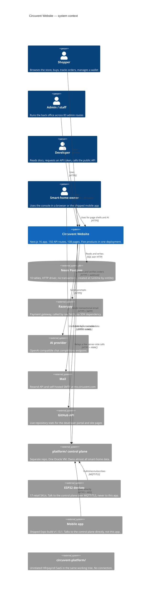

---

## 2. C4 Level 2 — Containers

```
   ┌═══════════════════════════════════════════════════════════════════════┐
   ║                       VERCEL EDGE NETWORK                             ║
   ║                                                                       ║
   ║  ┌────────────────┐  ┌────────────────┐  ┌────────────────────────┐  ║
   ║  │  Static assets │  │ Image optimiser│  │ src/proxy.ts (middleware)│ ║
   ║  │  /public       │  │  next/image,   │  │ host-mount rewrites,    │  ║
   ║  │                │  │  sharp         │  │ 1 legacy redirect, CSP  │  ║
   ║  │                │  │                │  │ + x-request-id headers │  ║
   ║  │                │  │                │  │ NO AUTHENTICATION HERE │  ║
   ║  └────────────────┘  └────────────────┘  └───────────┬─────────────┘  ║
   ╚══════════════════════════════════════════════════════╪════════════════╝
                                                            │
   ┌────────────────────────────────────────────────────────▼───────────────┐
   │                    NEXT.JS 16.2 APP ROUTER RUNTIME (Node.js)           │
   │                                                                        │
   │  ┌───────────────┐  ┌────────────────┐  ┌─────────────────────────┐  │
   │  │  RSC PAGES [D] │  │ CLIENT ISLANDS │  │  ROUTE HANDLERS   [R]   │  │
   │  │  108 pages     │  │      [C]       │  │  150 route.ts files    │  │
   │  │  5 products —  │  │  smart-home    │  │  account, admin (83),  │  │
   │  │  see §3.2      │  │  console is    │  │  ai, devices, orders,  │  │
   │  │                │  │  almost all    │  │  payments, shop,       │  │
   │  │                │  │  client-side   │  │  smarthome, misc — §5  │  │
   │  └───────┬───────┘  └────────┬────────┘  └────────────┬────────────┘  │
   │          └────────────────────┼─────────────────────────┘             │
   │                                ▼                                       │
   │  ┌─────────────────────────────────────────────────────────────────┐  │
   │  │                     src/lib — 291 files (205 modules + 86 tests) │  │
   │  │                                                                 │  │
   │  │  DATA         db.ts, store.ts, data-file.ts (35 createFileStore │  │
   │  │               call sites, 32 memory-only, 3 durable — §7.4)     │  │
   │  │  IDENTITY     account.ts, admin-auth.ts, sso.ts, passkeys via   │  │
   │  │               data-file.ts, admin-sso.ts — 5 schemes, §10.1     │  │
   │  │  CONTROL-     control-plane.ts (~2,300 lines, used from 86      │  │
   │  │  PLANE CLIENT smart-home files AND 7 server routes) — §6.2      │  │
   │  │  COMMERCE     razorpay.ts, shop-data.ts, invoicing (pdf-lib)     │  │
   │  │  AI           lib/ai/* — provider.ts (OpenAI-compatible)        │  │
   │  └──────────────────────────────┬──────────────────────────────────┘  │
   └─────────────────────────────────┼────────────────────────────────────┘
                                     │
        ┌────────────┬──────────────┼──────────────┬────────────┬─────────┐
        ▼            ▼              ▼              ▼            ▼         ▼
   ╭┈┈┈┈┈┈┈┈┈┈╮ ╭┈┈┈┈┈┈┈┈┈┈╮ ╭┈┈┈┈┈┈┈┈┈┈┈╮ ╭┈┈┈┈┈┈┈┈┈┈╮ ╭┈┈┈┈┈┈┈┈┈┈┈╮ ╭┈┈┈┈┈┈┈╮
   ┊  Neon    ┊ ┊ Razorpay ┊ ┊ AI provider┊ ┊ Mail:    ┊ ┊ platform/ ┊ ┊ .data/┊
   ┊  Postgres┊ ┊          ┊ ┊            ┊ ┊ Resend + ┊ ┊ control   ┊ ┊ (dev  ┊
   ┊  10      ┊ ┊          ┊ ┊            ┊ ┊ SMTP     ┊ ┊ plane VM  ┊ ┊ only) ┊
   ┊  tables  ┊ ┊          ┊ ┊            ┊ ┊          ┊ ┊           ┊ ┊       ┊
   ╰┈┈┈┈┈┈┈┈┈┈╯ ╰┈┈┈┈┈┈┈┈┈┈╯ ╰┈┈┈┈┈┈┈┈┈┈┈╯ ╰┈┈┈┈┈┈┈┈┈┈╯ ╰┈┈┈┈┈┈┈┈┈┈┈╯ ╰┈┈┈┈┈┈┈╯

   NOTE ON THAT LAST BOX: `data-file.ts` writes every non-durable store to
   `.data/<name>.json` on every mutation. On Vercel the filesystem is read-only and
   ephemeral, so the very first write throws, `canWrite` latches to false for the
   life of the instance, and the module quietly becomes pure in-memory state for the
   rest of that lambda's life. Locally, and only locally, that file is real.
```

```mermaid
flowchart TB
    subgraph edge["Vercel edge network"]
        static["Static assets<br/>/public"]
        imgopt["Image optimiser<br/>next/image + sharp"]
        proxy["src/proxy.ts middleware<br/>host-mounts, 1 redirect, CSP,<br/>x-request-id — NO AUTH"]
    end

    subgraph runtime["Next.js 16.2 App Router runtime (Node.js)"]
        pages["RSC pages · 108<br/>marketing, shop, admin,<br/>smart-home, developer"]
        islands["Client islands<br/>smart-home console is<br/>almost entirely client-side"]
        handlers["Route handlers · 150<br/>account, admin x83, ai,<br/>devices, orders, payments,<br/>shop, smarthome, misc"]

        subgraph lib["src/lib — 291 files"]
            data["Data<br/>db.ts, store.ts, data-file.ts<br/>35 createFileStore sites"]
            identity["Identity<br/>account.ts, admin-auth.ts,<br/>sso.ts, admin-sso.ts"]
            cp["control-plane.ts<br/>~2,300 lines<br/>used client AND server side"]
            commerce["razorpay.ts, shop-data.ts,<br/>pdf-lib invoicing"]
            ai["lib/ai/*<br/>provider.ts"]
        end
    end

    neon[("Neon Postgres<br/>10 tables, HTTP driver")]
    razorpay(["Razorpay"])
    aiprovider(["AI provider<br/>OpenAI-compatible"])
    mail(["Mail<br/>Resend + SMTP"])
    controlplane(["platform/ control plane<br/>one Oracle VM"])
    diskfile[("`.data/*.json`<br/>dev only")]

    static --> pages
    imgopt --> pages
    proxy --> handlers
    pages --> lib
    islands --> lib
    handlers --> lib
    data --> neon
    data -.->|"dev fallback only"| diskfile
    commerce --> razorpay
    ai --> aiprovider
    identity --> mail
    cp <-->|"HTTPS + Bearer"| controlplane

    style proxy fill:#FEE2E2,stroke:#B91C1C
    style neon fill:#DCFCE7,stroke:#15803D
    style diskfile fill:#FEF3C7,stroke:#B45309
    style controlplane fill:#E0E7FF,stroke:#4338CA
```

## 3. Container map, level 3 — the complete repository

This is one of the two sections this atlas promises to make *complete*, not
representative (§5 is the other). Every top-level entry below was counted with
`git ls-files`, run fresh while writing this document — not copied from an older audit.

**3.1 — what is actually in this repository.**

```
REPOSITORY ROOT  C:\...\WebSite                            3,101 git-tracked files total
│
├── src/                            978 files  THE WEBSITE — this whole atlas is it
│     Next.js 16 App Router, one Vercel deployment, five web products bundled as one
│     app: marketing, e-commerce shop, admin back office, smart-home console,
│     developer portal. Full internal tree in §3.3.
│
├── firmware/                       89 files  30 ESP32 SKETCHES for 17 RETAIL SKUs
│     13,003 files on disk; 12,914 of those are PlatformIO's .pio/ build cache, all
│     gitignored. Only source, headers and platformio.ini are tracked. See §3.2/§11.1.
│
├── platform/                      188 files  THE IoT CONTROL PLANE — ONE ORACLE VM
│     Mosquitto (MQTT+TLS, own CA) + Express API + Postgres + Caddy, plus an Alexa
│     Lambda and a face-recognition service. Single point of failure. See §3.2/§11.2.
│
├── hardware/                      638 files  REAL KiCad PCBs — 25 product folders
│     Schematics, board layouts, Gerbers, enclosures, marketplace listings, product
│     photography. This is not a mockup: these boards are manufacturable. See §3.2.
│
├── mobile/                        279 files  SHIPPED Expo app — Play Store v1.13.1
│     Talks DIRECTLY to platform/ at api.circuvent.com — bypasses this website's own
│     API entirely (verified in mobile/src/config.ts). Includes a native Siri /
│     Shortcuts bridge module (mobile/modules/circuvent-siri/). See §3.2.
│
├── native/                          39 files  Kotlin/Swift PROTOTYPE — iOS unbuilt
│     A from-scratch rewrite attempt with deliberately different application ids
│     (…nativeclient) so it can never be confused with the shipped app. The ios/
│     half has never successfully compiled. Not a release candidate.
│
├── circuvent-platform/             585 files  UNRELATED HR / PAYROLL SaaS
│     Its own Turborepo — apps/{api-gateway,services,web}, packages/{auth,database,
│     event-bus,...}. Shares a brand prefix with everything above and NOTHING else.
│     THE NAME IS A TRAP. See 3.1.1 below.
│
├── Docs/                            55 files  internal 39-chapter knowledge base
│     00-start-here.md ... 39-witness.md — web app, control plane, MQTT protocol,
│     every device, mobile, Play Store, Siri/HomeKit, drone, ANPR, and more. Titles
│     read and listed in §3.2; contents not re-verified for this atlas.
│
├── Architecture_Docs/               11 files  audits 01-05 plus this atlas (06)
├── tests/ + e2e/                   129 files  4,328 automated tests — see §12
├── public/ + scripts/                90 files  static assets, build/ops scripts
│
└── Creds/ + mobile/credentials/      0 tracked  Android signing keystores and one
      control-plane key sit on local disk but are gitignored (`Creds/`, `credentials/`,
      `*.jks`, `*.keystore`, `*.key`) and confirmed absent from `git ls-files`. This is
      correct secrets hygiene, called out here as one of this repo's few unambiguous
      positives.
```

**3.1.1 — the trap, explicitly.** `circuvent-platform/` shares three characters of
naming with `platform/` (this app's real IoT control plane) and a "Circuvent" brand
prefix with everything else in this working tree — and nothing more. It is a
completely separate Turborepo: its own `package.json`, its own `.turbo/` cache, its
own `.vercel/` project link, its own `apps/{api-gateway,services,web}` and its own
`packages/{audit,auth,database,event-bus,pdf-engine,shared,testing,websocket}` — a
full independent `auth` package and a full independent `database` package, sharing
zero source files, zero database connections and zero deployment target with the
website this atlas describes. Its own `README.md` publishes seed login credentials for
its own demo environment; that is a defect **of that unrelated project**, not of this
one, and is out of scope beyond this warning. If a search of this working tree for
"circuvent" ever lands you in `circuvent-platform/`, this paragraph is why — turn back.

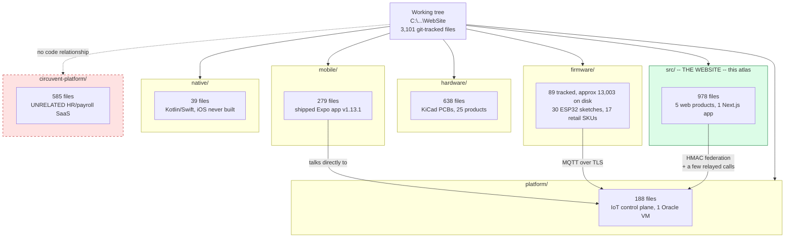

**3.2 — inside the six non-website projects.**

```
firmware/                     30 sketches (one .ino each) + 2 shared libraries
├── CircuventDevice/          shared base library -- Wi-Fi/MQTT/OTA client, no .ino
├── CircuventRC/               shared RC-vehicle library -- ESP-NOW/MAVLink, no .ino
├── agri-starter/ anpr-cam/ aquaguard/ camera/ curtain/ drone-fc/ drone-link/
├── energy-monitor/ facedoor/ guardian/ home-hub/ meter/ motion-sensor/
├── rc-link/ rc-remote/ rccar/ rfid-attend/ rfid-gate/ sentinel/ smart-fan/
├── smart-light/ smart-lock/ smart-plug/ smart-switch/ switchboard/
├── touchboard/ touchboard-8/ watertank/ watertank-sensor/ witness/
└── each sketch dir: <name>.ino + platformio.ini + .pio/ (cache, gitignored)
      30 sketches total; 17 of them ship as retail SKUs -- device table in §11.1.

platform/                     the IoT control plane -- one Oracle free-tier VM
├── mosquitto/                 MQTT broker config + its own certificate authority
├── api/src/                   Express/Node API -- devices, auth, MQTT bridge, ANPR
├── api/dist/, node_modules/, scripts/    build output, dependencies, ops scripts
├── caddy/                     reverse proxy / TLS termination in front of api/
├── alexa-lambda/              Alexa Smart Home skill Lambda -- voice control bridge
└── face/                      face-recognition service, backs the facedoor/ SKU

hardware/                     25 product directories + one shared KiCad library
├── lib/Circuvent.pretty/      shared KiCad footprint library (".pretty" is KiCad's
│                              own naming convention for a footprint-library folder)
├── agri-starter/ anpr-camera/ curtain/ drone-x1/ energy-monitor/ facedoor/
├── guardian/ home-automation/ load-controller/ meter-1ch/ meter-3ch/
├── motion-sensor/ psu-5v3v3/ psu-adapter-12v/ psu-adapter-5v/ rfid-gate/
├── sentinel/ smart-fan/ smart-light/ smart-lock/ smart-plug/ smart-switch/
├── touchboard/ water-tank-controller/        (plus a near-empty anpr-cam/ stub)
└── each product dir: pcb/ (schematic + layout + Gerbers), enclosure/, images/,
      listings/ (marketplace copy) -- this is a real, manufacturable hardware line.

mobile/                        the shipped Expo / React Native app, v1.13.1
├── src/                       app source -- screens mirror the smart-home console
├── modules/circuvent-siri/    native Expo module -- Siri Shortcuts + App Intents
├── android/                   native Android project (the Play Store release build)
├── credentials/                signing keystores -- gitignored, not tracked (§3.1)
├── design-system/, assets/     shared UI tokens, images, fonts
├── store/                      Play Store listing assets -- screenshots, icons
└── plugins/, scripts/, dist/   Expo config plugins, build/release scripts, output

native/                        Kotlin/Swift PROTOTYPE -- a from-scratch rewrite try
├── android/                   Kotlin client -- different application id (nativeclient)
└── ios/                       Swift client -- has NEVER SUCCESSFULLY COMPILED

circuvent-platform/            UNRELATED -- see 3.1.1. Shown only for completeness.
├── apps/api-gateway/, apps/services/, apps/web/    its own Next.js/Node apps
├── packages/auth/, packages/database/, packages/event-bus/    its own primitives
├── packages/audit/, packages/pdf-engine/, packages/shared/, packages/testing/
├── packages/websocket/
└── docker/, .turbo/                                 its own containers + build cache
```

**3.3 — inside `src/` — the website's own five products.**

```
src/
├── app/                       108 pages + 150 route.ts + layout/error/robots/sitemap
│     Route groups by product (page counts in §5.2, API counts in §5.1):
│     marketing (25 singleton pages: /, /about, /services, /faq, /docs, /dev, ...)
│     shop/ (6 pages: /shop, /cart, /checkout, /account/*, /wallet, /orders/[id])
│     admin/ (1 page shell driving 83 API routes -- a client-rendered app-in-a-route)
│     smarthome/ (59 pages -- the largest single product, almost entirely [C])
│     developer/ (10 pages -- docs, playground, token management)
│     projects/ (2) blog/ (2) careers/ (2) domains/ (2) case-studies, roadmap, ...
│     api/ (150 route.ts files -- full tree in §5.1)
│     .well-known/ (workflow SDK + well-known probes; excluded by proxy's matcher)
│
├── components/                119 files
│     ai/ (chat/assistant widgets)   shop/ (cart, product cards, checkout UI)
│     ui/ (shared design-system primitives)   weather/ (widget used on 2 pages)
│
├── hooks/                      15 files   shared client-side React hooks
│
├── lib/                       291 files   205 modules + 86 co-located *.test.ts
│     full category breakdown in §4: data, identity, control-plane client, commerce,
│     AI, notifications, PDF/report generation, validation, rate limiting, ...
│
└── workflows/                   2 files   icm-postmortem.ts, icm-watch.ts --
      Vercel Workflow SDK (beta) jobs behind the durable Incident Management feature
```

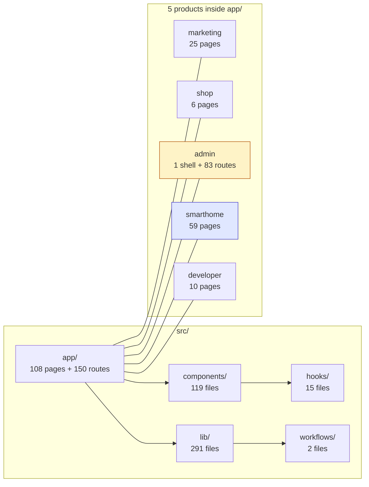

---

## 4. Module / library layer

`src/lib` holds 205 non-test modules (plus 86 co-located `*.test.ts` files, §12). 98 of
them fall into an unambiguous group by filename prefix alone (`admin-*`, `smarthome-*`,
`icm*`, `report*`, `*insights*`, `shop-*`, `control-plane*`, and the nine files under
`lib/ai/`). The other 107 do not share a prefix, so they are grouped here by theme; that
split was verified to be an exact partition of all 107 filenames — no module counted
twice, none left out. Nothing in this section is estimated.

```
CATEGORY                        COUNT  REPRESENTATIVE MODULES
------------------------------- -----  ---------------------------------------------
ADMIN DOMAIN            (admin-*)   29  admin-crm, admin-cms, admin-pricing, admin-
                                        tax, admin-fraud, admin-sso, admin-vendors,
                                        admin-report-builder, admin-password-policy
SMART-HOME / DEVICE DOMAIN          60  smarthome-* (30 prefixed: -dashboard, -auth,
  (30 prefixed + 30 thematic)            -security, -firmware, -realtime, -groups...)
                                        + 30 thematic: camera-relay, camera-audio,
                                        guardian-health/-hold, tank-health/-link,
                                        switchboard, witness, energy-advisor,
                                        predictive-maintenance, device-history/
                                        -normalize, firmware-catalog.generated, agri
OBSERVABILITY & REPORTING           21  icm* (7: incident mgmt store/bridge/notify),
                                        app-insights*/insights* (8: cost, usage,
                                        anomalies, alert rules), reports*/report-
                                        logo (6: PDF generation via pdf-lib)
SHOP / COMMERCE      (shop-* + 10)   16  shop-catalog, shop-data, shop-policy +
                                        razorpay, order-core, coupons, inventory,
                                        warranty, bundle-pricing, delivery-estimate
AI                    (lib/ai/*)     9  provider (OpenAI-compatible), assistant,
                                        fleet, analysis, tools, console-identity
IDENTITY & SESSIONS                 11  account, sso, passkeys, passkey-ceremony,
                                        totp, session-expiry, identity-groups
CORE DATA / INFRASTRUCTURE          16  db, store, data-file, cache, rate-limit,
                                        secrets, validation, api-handler, csp, config
CONTROL-PLANE CLIENT                 3  control-plane, control-plane-health, -live
CONTENT & MARKETING DATA            28  blog-data, showcase-data, stack-data, seo,
                                        brand, animations, quiz-data, case-studies-
                                        data (mostly static arrays, no I/O)
DEVELOPER PORTAL                     3  developer-api.generated, developer-docs,
                                        v1-shapes
INTEGRATIONS (misc external)         3  cv365-firebase, github-sync, weather
NOTIFICATIONS                        2  web-push, useWebPush
MISC                                  4  console-layout, deployments, documents, utils
------------------------------- -----  ---------------------------------------------
TOTAL MODULES                       205  (+ 86 co-located *.test.ts files -- see §12)
```

The dependency picture below is a category-level view, not a line-by-line import audit
of all 205 files: it is built from the naming convention above plus the two import
greps already performed for `control-plane.ts` (86 client call sites, 7 server route
call sites) and `db.ts`/`store.ts` (imported from nearly every domain category).

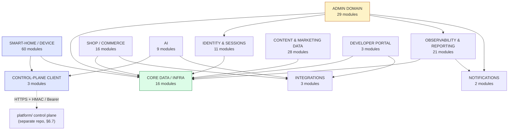

---

## 5. The complete route map

This is the section the spec singles out for exhaustive treatment, and the
numbers explain why: **150** files under `src/app/api/**/route.ts` and **108**
files under `src/app/**/page.tsx` — 258 routable paths in one Next.js App
Router tree, against the Career.circuvent example's few dozen. Per the spec's
own rule ("if there are more than ~60 routes, give a full ASCII tree of every
route path plus tables for the most important groups"), §5.1 and §5.3 below
are the complete trees — every path, no sampling — and §5.2 and §5.4 add
method, auth and purpose detail on top. Every one of the 150 API routes is
named explicitly at least twice: once in the tree, once in a table.

### 5.1 API routes — the complete tree (150 routes, 26 top-level groups)

```
src/app/api/                                            150 route.ts files
│                                                        26 top-level groups
├── account/                                                          14 routes
│   ├── addresses/route.ts
│   ├── avatar/route.ts
│   ├── change-password/route.ts
│   ├── documents/[orderNo]/route.ts
│   ├── forgot-password/route.ts
│   ├── login/route.ts
│   ├── notifications/route.ts
│   ├── orders/route.ts
│   ├── passkey/route.ts
│   ├── profile/route.ts
│   ├── register/route.ts
│   ├── reset-password/route.ts
│   ├── sso/console/route.ts
│   └── verify-otp/route.ts
│
├── admin/                                                            83 routes
│   ├── 2fa/route.ts
│   ├── 2fa/totp/route.ts
│   ├── affiliates/route.ts
│   ├── alerts/route.ts
│   ├── alerts/rules/route.ts
│   ├── alerts/run/route.ts
│   ├── analytics/route.ts
│   ├── audit/route.ts
│   ├── auth/route.ts
│   ├── auth/sso/callback/route.ts
│   ├── auth/sso/exchange/route.ts
│   ├── auth/sso/start/route.ts
│   ├── auth/verify-2fa/route.ts
│   ├── availability/probe/route.ts
│   ├── bulk/route.ts
│   ├── bundles/route.ts
│   ├── cms/route.ts
│   ├── coupons/route.ts
│   ├── crm/route.ts
│   ├── cron-health/route.ts
│   ├── currency/route.ts
│   ├── customers/route.ts
│   ├── emails/route.ts
│   ├── external-stats/route.ts
│   ├── flags/route.ts
│   ├── forecasting/route.ts
│   ├── fraud/route.ts
│   ├── giftcards/route.ts
│   ├── groups/route.ts
│   ├── icm/route.ts
│   ├── insights/route.ts
│   ├── insights-failures/route.ts
│   ├── insights-query/route.ts
│   ├── insights-rules/route.ts
│   ├── insights-telemetry/route.ts
│   ├── insights-usage/route.ts
│   ├── insights/export/route.ts
│   ├── integrations/route.ts
│   ├── inventory/batches/route.ts
│   ├── inventory/counts/route.ts
│   ├── inventory/export/route.ts
│   ├── inventory/locations/route.ts
│   ├── inventory/meta/route.ts
│   ├── inventory/movements/route.ts
│   ├── inventory/purchase-orders/route.ts
│   ├── inventory/reports/route.ts
│   ├── inventory/settings/route.ts
│   ├── inventory/suppliers/route.ts
│   ├── inventory/taxonomy/route.ts
│   ├── inventory/transfers/route.ts
│   ├── jobs/route.ts
│   ├── latency/route.ts
│   ├── macros/route.ts
│   ├── marketing/route.ts
│   ├── messages/route.ts
│   ├── orders/route.ts
│   ├── passkey/route.ts
│   ├── password/route.ts
│   ├── pricing/route.ts
│   ├── privacy/route.ts
│   ├── products/route.ts
│   ├── questions/route.ts
│   ├── report-builder/route.ts
│   ├── reports/catalog/route.ts
│   ├── reports/csv/route.ts
│   ├── reports/data/route.ts
│   ├── reports/pdf/route.ts
│   ├── reports/schedules/route.ts
│   ├── reports/schedules/run/route.ts
│   ├── reports/send/route.ts
│   ├── returns/route.ts
│   ├── seo/route.ts
│   ├── shipping/route.ts
│   ├── staff/route.ts
│   ├── staff-activity/route.ts
│   ├── stats/route.ts
│   ├── subscriptions/route.ts
│   ├── support/route.ts
│   ├── surveys/route.ts
│   ├── tax/route.ts
│   ├── traffic/route.ts
│   ├── vendor-portal/route.ts
│   └── warranty/route.ts
│
├── ai/                                                               3 routes
│   ├── analyze/route.ts
│   ├── chat/route.ts
│   └── fleet/route.ts
│
├── blog/route.ts                                                     1 route
│
├── contact/route.ts                                                  1 route
│
├── coupons/                                                          1 route
│   └── validate/route.ts
│
├── devices/                                                          5 routes
│   ├── route.ts
│   ├── claim/route.ts
│   ├── command/route.ts
│   ├── firmware/route.ts
│   └── sync/route.ts
│
├── giftcards/                                                        1 route
│   └── redeem/route.ts
│
├── github/route.ts                                                   1 route
│
├── health/                                                           2 routes
│   ├── route.ts
│   └── db/route.ts
│
├── loyalty/route.ts                                                  1 route
│
├── newsletter/route.ts                                               1 route
│
├── notify-restock/route.ts                                           1 route
│
├── orders/                                                           4 routes
│   ├── route.ts
│   ├── cancel/route.ts
│   ├── reorder/route.ts
│   └── track/route.ts
│
├── payments/                                                         3 routes
│   ├── create-order/route.ts
│   ├── verify/route.ts
│   └── webhook/route.ts
│
├── projects/route.ts                                                 1 route
│
├── push/                                                             2 routes
│   ├── key/route.ts
│   └── subscribe/route.ts
│
├── referral/route.ts                                                 1 route
│
├── returns/route.ts                                                  1 route
│
├── shop/                                                             5 routes
│   ├── bundles/route.ts
│   ├── products/route.ts
│   ├── questions/route.ts
│   ├── quote/route.ts
│   └── reviews/route.ts
│
├── smarthome/                                                        10 routes
│   ├── admin/config/route.ts
│   ├── alerts/route.ts
│   ├── alerts/cron/route.ts
│   ├── camera/audio/route.ts
│   ├── camera/frame/route.ts
│   ├── camera/listen/route.ts
│   ├── camera/speak/route.ts
│   ├── camera/watch/route.ts
│   ├── dev-portal/route.ts
│   └── prefs/route.ts
│
├── support/route.ts                                                  1 route
│
├── telemetry/                                                        2 routes
│   ├── route.ts
│   └── failure/route.ts
│
├── visitors/                                                         2 routes
│   ├── route.ts
│   └── stream/route.ts
│
├── wallet/                                                           2 routes
│   ├── route.ts
│   └── topup/route.ts
│
└── weather/route.ts                                                  1 route
```

Group sizes at a glance: `admin` (83) is 55% of the whole API surface by
itself — one back office out-weighs the marketing site, the store, the
smart-home console, the developer portal and every utility endpoint combined.
`smarthome` (10 routes) is deceptively small: most of the console's 59 pages
read and write through `platform/`'s own HTTP API on the Oracle VM, not
through these 10 — they are the exceptions that need a Next.js-side proxy
(camera relay, dev-portal token issuance, cron-triggered alert sweep, an
admin-config panel, and a preferences store). Route *count* under-represents
`smarthome`'s real footprint; §6 traces the outbound calls that make up for it.

### 5.2 API routes — grouped tables

Auth-column shorthand used below (all confirmed by reading the route file or
its imported verifier, not inferred from the path):

- **shop token** — HMAC-signed cookie/bearer token, `verifyToken` /
  `tokenFromRequest` in `src/lib/account.ts` (§10.1).
- **admin session** — `guard(req, area)` in `src/lib/admin-auth.ts`: HMAC
  token plus a per-area role check (§10.2).
- **device header keys** — `x-device-id` + `x-device-key` request headers,
  checked against the device row itself; no shared secret, no JWT.
- **control-plane bearer** — the caller's bearer token is forwarded as-is to
  an endpoint on `platform/` (the Oracle VM) and *that* service's answer is
  trusted; nothing is decoded or verified locally. Four independent call
  sites do this against four different control-plane endpoints (§10.7).
- **cron secret** — a single static bearer value (`CRON_SECRET`) compared
  with `===`; shared by whatever scheduler is configured, not per-caller.
- **none** — no authentication check in the route at all; only rate limiting
  (if present) restrains use.

#### 5.2.1 `account/*` — shop customer identity (14 routes)

| Path | Method(s) | Auth | Purpose |
|---|---|---|---|
| `account/register` | POST | none | create a shop account, send verification OTP |
| `account/verify-otp` | POST | none | confirm the OTP, activate the account |
| `account/login` | POST | none | password login, issues the shop token |
| `account/forgot-password` | POST | none | request a reset link |
| `account/reset-password` | POST | none (reset token) | consume the reset link |
| `account/change-password` | POST | shop token | change password while signed in |
| `account/profile` | GET, PATCH | shop token | read / edit profile fields |
| `account/avatar` | GET, POST, DELETE | shop token | upload / remove avatar image |
| `account/addresses` | GET, POST, PATCH, DELETE | shop token | address book CRUD |
| `account/orders` | GET | shop token | this customer's order history |
| `account/documents/[orderNo]` | GET | shop token | invoice/receipt PDF for one order |
| `account/notifications` | GET, PATCH, DELETE | shop token | in-app notification inbox |
| `account/passkey` | GET, POST, DELETE | shop token | WebAuthn passkey register/list/remove |
| `account/sso/console` | POST | shop token | mint a bridge token so the smart-home console can trust an already-signed-in shop customer (§8.4) |

#### 5.2.2 `devices/*` — the split that isn't obvious from the folder name (5 routes)

Three routes are called by the **signed-in shop customer** (web or mobile);
two are called by **the device itself**. Nothing in the URL signals the
difference — it is only visible by opening each file.

| Path | Method | Auth | Purpose |
|---|---|---|---|
| `devices` | GET | shop token | list the devices this account owns |
| `devices/claim` | POST | shop token | bind a purchased device's serial to this account |
| `devices/command` | POST | shop token | queue a command (lock, relay toggle, etc.) for a device |
| `devices/sync` | POST | device header keys | device pushes state/telemetry up |
| `devices/firmware` | GET | device header keys | device polls for a pending OTA manifest (§8.2) |

#### 5.2.3 `orders/*`, `payments/*`, `coupons/*`, `giftcards/*` — checkout (4 + 3 + 1 + 1 routes)

| Path | Method | Auth | Purpose |
|---|---|---|---|
| `orders` | POST | shop token | create an order from the current cart |
| `orders/cancel` | POST | shop token | cancel before fulfillment |
| `orders/reorder` | POST | shop token | duplicate a past order into a new cart |
| `orders/track` | GET | none (order no. + email) | public order-status lookup |
| `payments/create-order` | POST | shop token | open a Razorpay order for the cart total |
| `payments/verify` | POST | shop token | verify the client-side payment signature on browser return |
| `payments/webhook` | POST | Razorpay HMAC signature | server-to-server payment event — **verifies the signature and stops; see §8.1** |
| `coupons/validate` | POST | none | check a coupon code before checkout |
| `giftcards/redeem` | POST | shop token | apply a gift-card balance to an order |

#### 5.2.4 `shop/*` — storefront catalogue (5 routes)

| Path | Method | Auth | Purpose |
|---|---|---|---|
| `shop/products` | GET | none | catalogue listing/search |
| `shop/bundles` | GET | none | multi-product bundle listing |
| `shop/quote` | POST | none | freight/installation quote request |
| `shop/questions` | GET, POST, PATCH | none / shop token | product Q&A, read public, post signed in |
| `shop/reviews` | GET, POST, PATCH | none / shop token | product reviews, read public, post signed in |

#### 5.2.5 `ai/*` — the assistant surface (3 routes)

| Path | Method | Auth | Purpose |
|---|---|---|---|
| `ai/chat` | POST | shop token **or** admin session | one endpoint, two personas — `resolveConsoleIdentity`/`mergePersona` pick shop-customer or admin voice from whichever token is present |
| `ai/analyze` | POST | (rate-limited) | ad hoc content/data analysis helper |
| `ai/fleet` | POST | control-plane bearer | forwards the caller's own console token to `GET /admin/devices` on `platform/`; **this route deliberately makes no access decision itself** (its own source comment says so) — the control plane's answer is the only gate |

#### 5.2.6 `smarthome/*` — console-side proxy and utility routes (10 routes)

Four different auth styles inside one 10-route folder — the console has no
single "smart-home auth" of its own:

| Path | Method | Auth | Purpose |
|---|---|---|---|
| `smarthome/dev-portal` | GET, POST, PATCH, DELETE | control-plane bearer (`verifyConsolePrincipal` → `/devices`) | issue/list/revoke developer-portal API tokens |
| `smarthome/admin/config` | GET, POST, PATCH, DELETE | control-plane bearer (`verifyOperator` → `/admin/me`) | console-wide admin configuration panel |
| `smarthome/prefs` | GET, PUT, DELETE | control-plane bearer (`verifyCaller` → `/rooms`) | per-user console preferences (layout, units, theme) |
| `smarthome/alerts` | POST | control-plane bearer (forwarded) | create/acknowledge an alert |
| `smarthome/alerts/cron` | GET, POST | cron secret (`CRON_SECRET`) | scheduled sweep that evaluates alert rules |
| `smarthome/camera/frame` | POST, GET | device short-lived token / control-plane bearer | camera relay: device uploads a JPEG frame (POST), owner views it (GET) |
| `smarthome/camera/watch` | POST | control-plane bearer | arm a camera session, mint the device's short-lived upload token |
| `smarthome/camera/listen`, `camera/speak` | POST, GET | device short-lived token / control-plane bearer | two-way audio relay, same pattern as `camera/frame` |
| `smarthome/camera/audio` | POST | device short-lived token | device uploads an audio chunk |

Three of these routes call three *different* control-plane endpoints
(`/devices`, `/admin/me`, `/rooms`) through three separately-written verifier
functions (`verifyConsolePrincipal` in `smarthome-auth.ts`, `verifyOperator`
in `admin-config.ts`, `verifyCaller` in `user-prefs.ts`) — plus `ai/fleet`'s
inline check against a fourth (`/admin/devices`). No shared helper decodes a
session locally; every one of these is a live round trip to the Oracle VM.
See §10.7.

#### 5.2.7 `admin/*` — the 83-route back office, partitioned into seven themes

83 routes is too many for one table. They are partitioned below by what the
route is *for*, verified as an exact, non-overlapping split of all 83 files
(9 + 19 + 8 + 12 + 14 + 14 + 7 = 83). Unless noted otherwise, auth is
**admin session** — `guard(request, "<area>")` — where `<area>` is one of the
role-based `AdminArea` values checked by `roleCan()` in `admin-auth.ts`.

**a) Identity and session establishment (9 routes)** — the routes that *are*
the login, so they cannot themselves require the session they create:

| Path | Method | Auth | Purpose |
|---|---|---|---|
| `admin/auth` | POST, GET | none / sets session | password login; GET reads current session |
| `admin/auth/verify-2fa` | POST | pending-2FA state | second factor to complete login |
| `admin/auth/sso/start` | GET | none | begin OIDC/PKCE redirect to `auth.circuvent.com` |
| `admin/auth/sso/callback` | GET | OIDC state param | receive the authorization code |
| `admin/auth/sso/exchange` | POST | OIDC code | exchange code for tokens, issue admin session |
| `admin/2fa` | GET, PUT | admin session | view/enable TOTP enrollment |
| `admin/2fa/totp` | POST, PUT, DELETE | admin session | TOTP secret lifecycle |
| `admin/passkey` | GET, POST, DELETE | admin session | WebAuthn passkey register/list/remove |
| `admin/password` | GET, POST | admin session | change password, view policy |

**b) Insights, alerts and observability (19 routes)** — the admin console's
own telemetry and monitoring surface, distinct from `platform/`'s:

| Path | Method | Purpose |
|---|---|---|
| `admin/analytics` | GET | site-wide traffic/conversion analytics |
| `admin/stats` | GET | headline dashboard counters |
| `admin/traffic` | GET | request-volume time series |
| `admin/latency` | GET | route-latency percentiles |
| `admin/audit` | GET | admin action audit log |
| `admin/cron-health` | GET | last-run status of scheduled jobs |
| `admin/external-stats` | GET | third-party/integration health counters |
| `admin/forecasting` | GET | demand/revenue forecasting |
| `admin/availability/probe` | GET, POST | external reachability probe of the control-plane VM, deliberately **not** run from the VM itself — the source comment explains that a self-hosted prober goes silent at exactly the moment it should alert |
| `admin/alerts` | GET | list configured alert conditions |
| `admin/alerts/rules` | GET, PUT | edit alert-rule thresholds |
| `admin/alerts/run` | GET, POST | manually trigger an alert sweep |
| `admin/insights` | GET | insights dashboard root |
| `admin/insights/export` | GET | export insights data |
| `admin/insights-query` | POST, GET | ad hoc insights query |
| `admin/insights-rules` | GET, POST, DELETE | saved insight rule CRUD |
| `admin/insights-failures` | GET | failed-insight-run log |
| `admin/insights-telemetry` | GET, DELETE | raw telemetry feeding insights |
| `admin/insights-usage` | GET, POST | insights feature usage metering |

**c) Scheduled and exportable reports (8 routes)** — includes the `groups`
lookup from §5.2.7(f) as its recipient list:

| Path | Method | Purpose |
|---|---|---|
| `admin/report-builder` | GET, POST, DELETE | define a custom report template |
| `admin/reports/catalog` | GET | list available report types |
| `admin/reports/data` | GET | run a report, return JSON |
| `admin/reports/csv` | GET | run a report, return CSV |
| `admin/reports/pdf` | GET | run a report, return PDF |
| `admin/reports/schedules` | GET, POST, PUT, DELETE | recurring report schedule CRUD |
| `admin/reports/schedules/run` | GET, POST | force one scheduled run now |
| `admin/reports/send` | GET, POST | email a report immediately |

**d) Inventory and warehouse operations (12 routes)** — all under
`admin/inventory/*`, all admin-session gated:

| Path | Method | Purpose |
|---|---|---|
| `inventory/batches` | GET, POST, DELETE | lot/batch tracking |
| `inventory/counts` | GET, POST, PATCH | cycle-count sessions |
| `inventory/locations` | GET, POST, DELETE | warehouse/bin locations |
| `inventory/movements` | GET, POST | stock movement ledger |
| `inventory/transfers` | GET, POST, PATCH | inter-location transfers |
| `inventory/purchase-orders` | GET, POST, PATCH, DELETE | supplier purchase orders |
| `inventory/suppliers` | GET, POST, DELETE | supplier directory |
| `inventory/taxonomy` | GET, POST, DELETE | category/attribute taxonomy |
| `inventory/meta` | GET, PATCH | inventory module metadata |
| `inventory/settings` | GET, PATCH | inventory module settings |
| `inventory/export` | GET | CSV/bulk export |
| `inventory/reports` | GET | inventory-specific reports |

**e) Commerce and catalogue configuration (14 routes)**:

| Path | Method | Purpose |
|---|---|---|
| `admin/products` | GET, POST, PATCH, DELETE | product catalogue CRUD |
| `admin/bundles` | GET, POST, DELETE | bundle configuration |
| `admin/pricing` | GET, POST, PATCH, DELETE | price list / rule management |
| `admin/currency` | GET, POST, DELETE | supported currencies and rates |
| `admin/tax` | GET, POST, DELETE | tax rule configuration |
| `admin/shipping` | GET, POST, DELETE | shipping method/zone configuration |
| `admin/coupons` | GET, POST, PATCH, DELETE | coupon code management |
| `admin/giftcards` | GET, POST, PATCH | gift-card issuance/balance |
| `admin/subscriptions` | GET, POST, PATCH, DELETE | recurring-order plans |
| `admin/warranty` | GET, POST, PATCH | warranty term configuration |
| `admin/returns` | GET, PATCH | returns/RMA processing |
| `admin/orders` | GET, PATCH | order management |
| `admin/questions` | GET, PATCH, DELETE | moderate product Q&A |
| `admin/fraud` | GET, POST, PATCH, DELETE | fraud-rule / risk-flag management |

**f) CRM, marketing, support and content (14 routes)**:

| Path | Method | Purpose |
|---|---|---|
| `admin/customers` | GET, PATCH | customer record management |
| `admin/crm` | GET, POST, DELETE | lead/contact pipeline |
| `admin/affiliates` | GET, POST, PATCH | affiliate program management |
| `admin/marketing` | GET, POST, PATCH, DELETE | campaign configuration |
| `admin/emails` | GET | transactional/marketing email log |
| `admin/messages` | GET, PATCH | internal admin messaging |
| `admin/support` | GET, PATCH | support-ticket queue |
| `admin/macros` | GET, POST, DELETE | canned support-reply macros |
| `admin/surveys` | GET, POST | customer survey management |
| `admin/vendor-portal` | GET, POST, PATCH, DELETE | vendor-facing self-service panel |
| `admin/cms` | GET, POST, PATCH, DELETE | blog/content posts, revisions, scheduling |
| `admin/seo` | GET, POST, DELETE | SEO metadata overrides and redirects |
| `admin/privacy` | GET, POST, PATCH | data-subject access/export/delete requests |
| `admin/groups` | GET | mail-enabled distribution groups fetched live from `auth.circuvent.com` (`GET {ISSUER}/api/groups`) for addressing scheduled reports — this is the company's own identity domain, **not** the unrelated `circuvent-platform/` repository (§3) |

**g) Platform ops and staff tooling (7 routes)**:

| Path | Method | Purpose |
|---|---|---|
| `admin/staff` | GET, POST, PATCH, DELETE | admin user/role management |
| `admin/staff-activity` | GET | staff action activity feed |
| `admin/integrations` | GET, POST, PATCH, DELETE | third-party integration credentials/config |
| `admin/flags` | GET, POST, PATCH, DELETE | feature flags and experiments |
| `admin/jobs` | GET, POST, PATCH, DELETE | background/scheduled job registry and run log |
| `admin/bulk` | GET, POST | CSV bulk import/export for products and customers |
| `admin/icm` | GET, POST, PATCH, DELETE | incident and change management: file/track incidents, on-call rotations, postmortems |

#### 5.2.8 Public and utility routes — everything not yet named (21 routes)

The remaining single-purpose routes, none of them part of a themed group
above. §5.2.1–§5.2.7 between them name 129 routes (14 account + 5 devices +
9 orders/payments/coupons/giftcards + 5 shop + 3 ai + 10 smarthome +
83 admin); this table supplies the last 21, for 150 named in total.

| Path | Method | Auth | Purpose |
|---|---|---|---|
| `blog` | GET | none | blog post listing (public marketing site) |
| `contact` | POST | none, rate-limited | contact-form submission |
| `github` | GET | none | live GitHub repo/stat card for the marketing site |
| `health` | GET | none | liveness probe |
| `health/db` | GET | none | database-reachability probe (`initDb()` round trip) |
| `loyalty` | GET, POST | shop token | loyalty-points balance and redemption |
| `newsletter` | POST | none, rate-limited | newsletter signup |
| `notify-restock` | POST | none | "notify me" back-in-stock signup |
| `projects` | GET | none | portfolio/projects listing |
| `push/key` | GET | none | public VAPID key for Web Push |
| `push/subscribe` | POST, DELETE | none | register/remove a Web Push subscription |
| `referral` | GET | shop token | referral code and reward status |
| `returns` | GET, POST | shop token | self-service return request |
| `support` | GET, POST | none / shop token | support ticket create/list |
| `telemetry` | POST | none, rate-limited | client-side telemetry beacon |
| `telemetry/failure` | POST | none, rate-limited | client-side error beacon |
| `visitors` | POST, GET | none | live-visitor counter, write and read |
| `visitors/stream` | GET | none | Server-Sent-Events stream of the same counter |
| `wallet` | GET | shop token | store-credit wallet balance |
| `wallet/topup` | POST | shop token | add funds to the wallet |
| `weather` | GET | none | weather widget data (proxies a third-party API) |

That table has 21 rows, one per route (`health` and `health/db` are two
distinct files, likewise `push/key`+`push/subscribe`, `telemetry`+
`telemetry/failure`, `visitors`+`visitors/stream`, `wallet`+`wallet/topup`) —
the last 21 of 150, so 129 + 21 = 150 routes named in total across
§5.2.1–§5.2.8, in addition to every one of them already appearing in the
§5.1 tree.

### 5.3 Pages — the complete tree (108 pages, 32 top-level groups)

```
src/app/                                                   108 page.tsx files
│                                                        32 top-level groups
├── about/page.tsx                                                    1 page
│
├── admin/page.tsx                                                    1 page
│
├── app/page.tsx                                                      1 page
│
├── architecture/page.tsx                                             1 page
│
├── blog/                                                             2 pages
│   ├── page.tsx
│   └── [slug]/page.tsx
│
├── careers/                                                          2 pages
│   ├── page.tsx
│   └── [id]/page.tsx
│
├── cart/page.tsx                                                     1 page
│
├── case-studies/page.tsx                                             1 page
│
├── checkout/page.tsx                                                 1 page
│
├── contact/page.tsx                                                  1 page
│
├── dev/                                                              1 page
│   └── controls/page.tsx
│
├── developer/                                                        10 pages
│   ├── page.tsx
│   ├── authentication/page.tsx
│   ├── browser/page.tsx
│   ├── commands/page.tsx
│   ├── endpoints/page.tsx
│   ├── errors/page.tsx
│   ├── limits/page.tsx
│   ├── quickstart/page.tsx
│   ├── scopes/page.tsx
│   └── webhooks/page.tsx
│
├── docs/page.tsx                                                     1 page
│
├── domains/                                                          2 pages
│   ├── page.tsx
│   └── [slug]/page.tsx
│
├── faq/page.tsx                                                      1 page
│
├── open-source/page.tsx                                              1 page
│
├── page.tsx                                                          1 page
│
├── privacy/page.tsx                                                  1 page
│
├── projects/                                                         2 pages
│   ├── page.tsx
│   └── [id]/page.tsx
│
├── returns-policy/page.tsx                                           1 page
│
├── roadmap/page.tsx                                                  1 page
│
├── services/page.tsx                                                 1 page
│
├── shipping/page.tsx                                                 1 page
│
├── shop/                                                             6 pages
│   ├── page.tsx
│   ├── [slug]/page.tsx
│   ├── account/page.tsx
│   ├── c/[category]/page.tsx
│   ├── devices/page.tsx
│   └── invoice/[orderNo]/page.tsx
│
├── smart-home/page.tsx                                               1 page
│
├── smarthome/                                                        59 pages
│   ├── page.tsx
│   ├── admin/page.tsx
│   ├── admin/access/page.tsx
│   ├── admin/alerts/page.tsx
│   ├── admin/dashboards/page.tsx
│   ├── admin/fleet/page.tsx
│   ├── admin/intelligence/page.tsx
│   ├── admin/latency/page.tsx
│   ├── admin/ota/page.tsx
│   ├── admin/platform/page.tsx
│   ├── admin/provisioning/page.tsx
│   ├── admin/registry/page.tsx
│   ├── admin/rules/page.tsx
│   ├── admin/security/page.tsx
│   ├── admin/telemetry/page.tsx
│   ├── anpr/page.tsx
│   ├── assistants/page.tsx
│   ├── attendance/page.tsx
│   ├── automation/page.tsx
│   ├── automations/page.tsx
│   ├── away-mode/page.tsx
│   ├── backup/page.tsx
│   ├── benchmark/page.tsx
│   ├── camera/page.tsx
│   ├── cameras/page.tsx
│   ├── command-center/page.tsx
│   ├── developer/page.tsx
│   ├── device/[id]/page.tsx
│   ├── devices/page.tsx
│   ├── diagnostics/page.tsx
│   ├── drone/page.tsx
│   ├── energy/page.tsx
│   ├── energy-budget/page.tsx
│   ├── firmware/page.tsx
│   ├── floorplan/page.tsx
│   ├── groups/page.tsx
│   ├── insights/page.tsx
│   ├── kiosk/page.tsx
│   ├── lifecycle/page.tsx
│   ├── maintenance/page.tsx
│   ├── notification-rules/page.tsx
│   ├── notifications/page.tsx
│   ├── presence/page.tsx
│   ├── profile/page.tsx
│   ├── properties/page.tsx
│   ├── quick-actions/page.tsx
│   ├── recipes/page.tsx
│   ├── reports/page.tsx
│   ├── rooms/page.tsx
│   ├── scene-scheduler/page.tsx
│   ├── scenes/page.tsx
│   ├── security/page.tsx
│   ├── settings/page.tsx
│   ├── solar/page.tsx
│   ├── spaces/page.tsx
│   ├── timeline/page.tsx
│   ├── traffic/page.tsx
│   ├── weather/page.tsx
│   └── widgets/page.tsx
│
├── stack/page.tsx                                                    1 page
│
├── team/page.tsx                                                     1 page
│
├── terms/page.tsx                                                    1 page
│
├── track/page.tsx                                                    1 page
│
├── warranty/page.tsx                                                 1 page
│
└── weather/page.tsx                                                  1 page
```

Note the near-collision at the top level: `smart-home/page.tsx` (one page,
hyphenated) is the public **marketing** page describing the smart-home
product line; `smarthome/` (59 pages, no hyphen) is the **console
application** itself. Same product, two different route prefixes, one
character apart — worth remembering when grepping this tree.

### 5.4 Pages — grouped tables

#### 5.4.1 Marketing, storefront and singleton pages (24 pages)

| Path | Purpose |
|---|---|
| `/` (`page.tsx`) | home page |
| `/about` | company/about page |
| `/services` | services overview |
| `/case-studies` | case studies listing |
| `/team` | team page |
| `/stack` | technology-stack showcase |
| `/architecture` | public architecture overview (marketing framing) |
| `/smart-home` | smart-home **product** marketing page (see note above) |
| `/roadmap` | public product roadmap |
| `/open-source` | open-source projects/licensing page |
| `/docs` | documentation landing page |
| `/faq` | frequently asked questions |
| `/contact` | contact page (renders the `contact` API's form) |
| `/app` | mobile-app download/marketing page |
| `/privacy`, `/terms` | legal pages |
| `/shipping`, `/returns-policy`, `/warranty` | policy pages |
| `/track` | public order tracking UI (calls `orders/track`) |
| `/weather` | weather widget demo page |
| `/cart`, `/checkout` | storefront cart and checkout flow |
| `/admin` | admin console entry point (redirects into the guarded area) |
| `/dev/controls` | internal developer-only control panel |

#### 5.4.2 Content collections (8 pages)

| Path | Purpose |
|---|---|
| `/blog`, `/blog/[slug]` | blog index and article |
| `/careers`, `/careers/[id]` | careers listing and posting detail |
| `/projects`, `/projects/[id]` | portfolio listing and project detail |
| `/domains`, `/domains/[slug]` | domain-for-sale/portfolio listing and detail |

#### 5.4.3 Storefront (6 pages)

| Path | Purpose |
|---|---|
| `/shop` | catalogue home |
| `/shop/[slug]` | product detail |
| `/shop/c/[category]` | category listing |
| `/shop/devices` | device-specific storefront section |
| `/shop/account` | shop customer account area |
| `/shop/invoice/[orderNo]` | order invoice view |

#### 5.4.4 Developer portal (10 pages)

| Path | Purpose |
|---|---|
| `/developer` | portal home |
| `/developer/quickstart` | getting-started guide |
| `/developer/authentication` | auth-scheme documentation |
| `/developer/scopes` | API scope reference |
| `/developer/endpoints` | endpoint reference |
| `/developer/commands` | device-command reference |
| `/developer/webhooks` | webhook documentation |
| `/developer/errors` | error-code reference |
| `/developer/limits` | rate-limit documentation |
| `/developer/browser` | in-browser API explorer |

#### 5.4.5 Smart-home console — operator-facing (45 pages)

The console's largest single area, clustered by function (all under
`/smarthome/*`, all client-rendered against `platform/`'s control-plane API,
not against the 10 `smarthome/*` routes in §5.2.6 except where those proxy):

| Cluster | Pages |
|---|---|
| Core dashboard | `page` (home), `command-center`, `quick-actions`, `widgets`, `timeline` |
| Devices and rooms | `devices`, `device/[id]`, `rooms`, `spaces`, `properties`, `floorplan`, `groups` |
| Security and access | `security`, `camera`, `cameras`, `anpr`, `away-mode`, `presence` |
| Automation | `automation`, `automations`, `scenes`, `scene-scheduler`, `recipes`, `notification-rules` |
| Energy | `energy`, `energy-budget`, `solar` |
| Maintenance and lifecycle | `maintenance`, `lifecycle`, `diagnostics`, `backup`, `firmware`, `benchmark` |
| Notifications and profile | `notifications`, `profile`, `settings` |
| Extras | `assistants`, `attendance`, `drone`, `kiosk`, `weather`, `traffic`, `reports`, `insights`, `developer` |

That is 5 + 7 + 6 + 6 + 3 + 6 + 3 + 9 = 45 operator-facing pages.

#### 5.4.6 Smart-home console — admin sub-area (14 pages)

A second tier of role-gated pages nested under `/smarthome/admin/*`, mapping
loosely to the same operator concept `verifyOperator` checks server-side:

| Path | Purpose |
|---|---|
| `admin` (index) | admin area home |
| `admin/access` | operator/role access management |
| `admin/registry` | device registry management |
| `admin/provisioning` | new-device provisioning workflow |
| `admin/fleet` | fleet-wide device overview (feeds `ai/fleet`) |
| `admin/ota` | OTA firmware release management (§8.2) |
| `admin/security` | console-wide security settings |
| `admin/rules` | automation/alert rule administration |
| `admin/alerts` | alert configuration |
| `admin/dashboards` | custom dashboard builder |
| `admin/intelligence` | AI/analytics configuration |
| `admin/latency` | latency monitoring |
| `admin/telemetry` | telemetry stream administration |
| `admin/platform` | control-plane connection/platform settings |

45 + 14 = 59, matching the tree's `smarthome/` count exactly.

### 5.5 Route map — Mermaid mirror

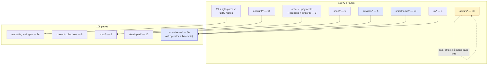

---

## 6. External contracts & integrations

Career.circuvent had one upstream (its ATS). This application has none of its network
surface concentrated like that: eight independent external systems, each reached by a
different `src/lib` module, plus one internal-but-separate system (`platform/`) that is
also called directly by a completely different repository (`mobile/`) without this
website ever being on that path. Every entry below was confirmed either in source or in
`.env.example` / `Docs/11-secrets.md` — nothing here is inferred from the variable name
alone.

```
   ┌────────────────────────────────────────────────────────────────────────┐
   │  PAYMENTS                                                               │
   ├────────────────────────────────────────────────────────────────────────┤
   │  Razorpay          raw fetch, no SDK installed. Basic auth, base64     │
   │                    (keyId:keySecret). api.razorpay.com/v1/orders and   │
   │                    /v1/payments/{id}. Inbound webhook verifies its     │
   │                    HMAC signature, then does nothing else -- §8.1.     │
   ├────────────────────────────────────────────────────────────────────────┤
   │  AI                                                                     │
   ├────────────────────────────────────────────────────────────────────────┤
   │  lib/ai/provider   raw fetch, OpenAI chat-completions wire format,      │
   │                    no vendor SDK. Default https://api.openai.com/v1,   │
   │                    model gpt-4o-mini. AI_BASE_URL/AI_API_KEY/AI_MODEL  │
   │                    (or OPENAI_* fallbacks) repoint it at Azure OpenAI,  │
   │                    Groq, Together, or a self-hosted Ollama/vLLM with    │
   │                    zero code changes. aiConfigured()==false -> every    │
   │                    caller (assistant, fleet analysis) degrades to a     │
   │                    deterministic, model-free analysis instead of an     │
   │                    error -- resilience by design, not by accident.      │
   ├────────────────────────────────────────────────────────────────────────┤
   │  EMAIL  --  three independent providers, chosen per call site           │
   ├────────────────────────────────────────────────────────────────────────┤
   │  Resend            RESEND_API_KEY -- transactional mail                │
   │  SMTP / nodemailer SMTP_HOST/PORT/USER/PASS -- transactional, 2nd path  │
   │  Buttondown        BUTTONDOWN_API_KEY -- /api/newsletter signups only,  │
   │                    the ONLY caller of this provider in the codebase     │
   ├────────────────────────────────────────────────────────────────────────┤
   │  CIRCUVENT'S OWN IDENTITY DOMAIN  (not this repository, §3.1)           │
   ├────────────────────────────────────────────────────────────────────────┤
   │  auth.circuvent.com   OIDC/PKCE issuer for admin SSO login (§8.5) AND   │
   │                       the live mail-group directory read by            │
   │                       GET /api/admin/groups for report recipients      │
   ├────────────────────────────────────────────────────────────────────────┤
   │  PLATFORM  --  separate repo, same working tree (§11.2, C4 in §1-2)     │
   ├────────────────────────────────────────────────────────────────────────┤
   │  CONTROL_PLANE_URL    HTTPS to 140.245.238.154. Two different auth      │
   │                       shapes depending on caller: HMAC device sync/     │
   │                       command from 2 of 5 device/* routes, and a       │
   │                       control-plane-delegated bearer token re-checked   │
   │                       at 4 independent call sites (§10.7). mobile/      │
   │                       calls the SAME control plane directly and does    │
   │                       NOT go through this website at all (§1.1).        │
   ├────────────────────────────────────────────────────────────────────────┤
   │  MISCELLANEOUS THIRD PARTIES                                            │
   ├────────────────────────────────────────────────────────────────────────┤
   │  GitHub REST API      GITHUB_TOKEN -- live commit/star stats for the    │
   │                       public /projects page                            │
   │  weather provider     lib/weather.ts -- backs /api/weather; no key      │
   │                       variable catalogued in .env.example               │
   │  CV-365 Firebase      NEXT_PUBLIC_CV365_FIREBASE_* -- relays the        │
   │                       public contact form to work.circuvent.com/admin/  │
   │                       messages. A THIRD legitimate circuvent.com         │
   │                       subdomain, and still nothing to do with the       │
   │                       unrelated circuvent-platform/ repo (§3.1).        │
   │  web-push (VAPID)     browser push subscriptions, delivered directly,   │
   │                       no third-party push relay in front of it          │
   ├────────────────────────────────────────────────────────────────────────┤
   │  DECLARED IN .env.example -- NOT WIRED UP ANYWHERE                      │
   ├────────────────────────────────────────────────────────────────────────┤
   │  GOOGLE_CLIENT_ID / GOOGLE_CLIENT_SECRET / GOOGLE_CALLBACK_URL appear    │
   │  in .env.example and Docs/11-secrets.md. `grep`ing all of src/ for      │
   │  either name returns nothing: there is no "Sign in with Google" route,  │
   │  page, or library call in this codebase. Vestigial, not a 6th scheme.   │
   └────────────────────────────────────────────────────────────────────────┘
```

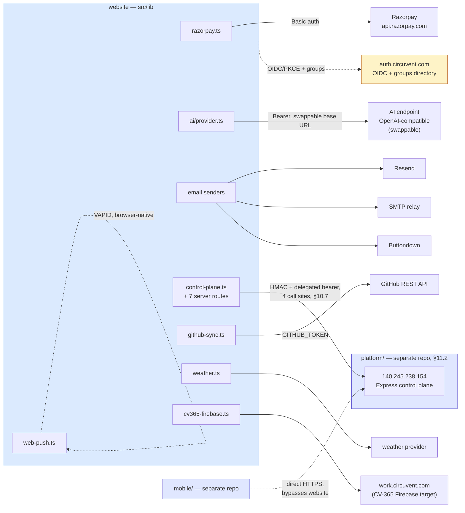

Two asymmetries are worth naming explicitly. First, `platform/` is the only external
system this website both calls *and* shares with a caller it has no control over
(`mobile/`) — every other integration above is this website's private dependency.
Second, `GOOGLE_CLIENT_ID` is the only variable in this whole inventory that is
documented in two places (`.env.example`, `Docs/11-secrets.md`) and used in zero: it is
carried forward here, not silently dropped, because an atlas that only reports what is
wired up would miss a real piece of the deployment's configuration surface.

---

## 7. Data model

Exactly 10 tables, all created by `initDb()` (§7.2) from one TypeScript array of DDL
strings in `src/lib/db.ts` — no Prisma, no Drizzle, no `.sql` migration files anywhere
in the repository. **Zero** `FOREIGN KEY`, `REFERENCES`, or `UNIQUE` constraints appear
in any of the 10 `CREATE TABLE` statements: every `PK` below is real (a real Postgres
primary key), every relationship implied by an `FK`-shaped comment is enforced only in
application code. Row-level security: **none**, on any table — this database has no
concept of a tenant, so there is nothing for a policy to scope.

### 7.1 Entity-relationship diagram

```
   ┌────────────────────────────────────────────────────────────────────────┐
   │  IDENTITY  --  3 dedicated, typed tables                                │
   ├────────────────────────────────────────────────────────────────────────┤
   │  accounts               PK email    shop customers                     │
   │  admin_users            PK email    staff / admin accounts + role       │
   │  pending_registrations  PK email    signup OTP, in-flight only          │
   ├────────────────────────────────────────────────────────────────────────┤
   │  GENERIC KV  --  1 table, 26 logical documents (§7.3)                   │
   ├────────────────────────────────────────────────────────────────────────┤
   │  store_kv   PK (collection, key)    23 shop collections @ key='_all' +  │
   │             data JSONB NOT NULL     3 durable file-stores (§7.4)        │
   ├────────────────────────────────────────────────────────────────────────┤
   │  ANALYTICS / AUDIT  --  3 tables, append-only, no updates               │
   ├────────────────────────────────────────────────────────────────────────┤
   │  email_history    BIGSERIAL id    every email ever sent (evidence log)  │
   │  request_metrics  BIGSERIAL id    per-request latency/status samples    │
   │  page_views       BIGSERIAL id    anonymised visits, salt rotates daily │
   ├────────────────────────────────────────────────────────────────────────┤
   │  SMART-HOME CAMERA RELAY  --  3 tables, deliberately NOT history        │
   ├────────────────────────────────────────────────────────────────────────┤
   │  camera_frames         PK device_id  newest frame only, overwritten     │
   │  camera_audio          BIGSERIAL id  rolling live-listen buffer, pruned │
   │  camera_audio_session  PK device_id  one pending listen/speak token     │
   └────────────────────────────────────────────────────────────────────────┘
   RLS on all 10 tables above: NONE. No policy, no tenant column, no schema
   separation -- a single Neon connection string sees every row in the app.
```

```mermaid
erDiagram
    accounts {
        text email PK
        text name
        text password_hash
        text password_salt
        text phone
        boolean blocked
        jsonb data "full entity, source of truth"
    }
    admin_users {
        text email PK
        text role
        boolean active
        text password_hash
        jsonb data
    }
    pending_registrations {
        text email PK
        text otp
        bigint expires
        int attempts
        text ref
    }
    store_kv {
        text collection PK "23 shop names + 'file_store'"
        text key PK "'_all', or a filename (§7.4)"
        jsonb data
        timestamptz updated_at
    }
    email_history {
        bigserial id PK
        text to
        text type
        text status
        text provider
        text message_id
    }
    request_metrics {
        bigserial id PK
        text endpoint
        text method
        int status
        real ms
    }
    page_views {
        bigserial id PK
        text path
        text visitor_hash "salted, rotates daily"
        text device
        text country
    }
    camera_frames {
        text device_id PK
        text jpeg_b64
        text upload_token
        timestamptz token_expires
    }
    camera_audio {
        bigserial id PK
        text device_id
        text wav_b64
        timestamptz captured_at
    }
    camera_audio_session {
        text device_id PK
        text listen_token
        text speak_token
        text speak_wav_b64
    }
```

No relationship lines connect the ten boxes above because none exist in the schema —
that absence is not an omission from this diagram, it is the finding. `accounts.email`
and `admin_users.email` are referenced by string from application code (sessions, the
shop-console SSO bridge, audit rows) but Postgres itself enforces none of it.

### 7.2 `initDb()` — runtime schema, not migrations

```
   cold start (new lambda instance, or first import after a deploy)
        |
        v
   store.ts evaluates -> top-level `await bootstrap()` blocks every route
   handler in this module graph until it resolves (plain ESM semantics,
   no framework hook involved)
        |
        v
   dbLayer.initDb()  -- memoized into a module-level `_initPromise`, so
   |                    every later call from THIS instance is a free,
   |                    already-resolved promise for the rest of its life
   |
   +--> first call only: for (stmt of SCHEMA_STATEMENTS) await q(stmt)
   |      10x  CREATE TABLE IF NOT EXISTS ...     run sequentially, in
   |      12x  CREATE INDEX IF NOT EXISTS ...      the array's literal order
   |
        v
   dbLayer.dbHydrate()  -- SELECT data FROM every typed table, plus every
   |                       store_kv row, assembled into one `mem` object
        v
   first run only: products/coupons seed data is generated, written into
   `mem`, and flushed immediately -- the database becomes source of truth
   from boot one, not from the first admin edit
        |
        v
   route handlers now read/write `mem` only. Postgres is touched again
   only by scheduleFlush() (changed collections, after the response is
   built) and by revalidate() (an explicit targeted re-read, called only
   from login/signup/admin routes that need cross-instance consistency)
```

```mermaid
sequenceDiagram
    participant L as Lambda cold start
    participant S as store.ts (bootstrap)
    participant D as db.ts (initDb / dbHydrate)
    participant PG as Neon Postgres (HTTP driver)

    L->>S: module import graph evaluates
    S->>S: top-level await bootstrap()
    S->>D: initDb()
    alt first call in this instance
        D->>PG: CREATE TABLE IF NOT EXISTS x10
        D->>PG: CREATE INDEX IF NOT EXISTS x12
    else already memoized
        Note over D: cached _initPromise, no network call
    end
    S->>D: dbHydrate()
    D->>PG: SELECT data FROM &lt;every table / store_kv row&gt;
    PG-->>D: rows
    D-->>S: Partial&lt;DB&gt;
    S->>S: mem = merge(emptyDB(), data); seed products/coupons if empty
    Note over S,PG: every request now reads/writes mem only;<br/>PG is touched again solely by flush() and revalidate()
```

There is no schema-version table and no rollback path: `IF NOT EXISTS` on every
statement is the entire migration strategy. A column rename would need a second,
additive `CREATE TABLE IF NOT EXISTS` block, hand-written, run through this same
memoized function — the same shape as every table already here.

### 7.3 `store_kv` — one JSONB document per collection

```
   ┌────────────────────────────────────────────────────────────────────────┐
   │  store_kv     PRIMARY KEY (collection, key)     data JSONB NOT NULL     │
   ├────────────────────────────────────────────────────────────────────────┤
   │  23 x  collection = <shop collection name>,  key = '_all'               │
   │        the ENTIRE collection -- an array or an email-keyed map --       │
   │        serialised as ONE JSONB value. Not one row per order, per        │
   │        wallet, per ticket: one row per COLLECTION, full stop.           │
   │        e.g. collection='orders', key='_all', data={ [orderId]: ... }    │
   ├────────────────────────────────────────────────────────────────────────┤
   │   3 x  collection = 'file_store',  key = <filename>                    │
   │        one durable createFileStore module's whole document (§7.4)       │
   │        e.g. collection='file_store', key='icm-incidents.json'           │
   └────────────────────────────────────────────────────────────────────────┘
   26 logical documents, 1 physical table. Writing a single order rewrites
   the WHOLE `orders` blob (read-modify-write of the entire collection).
   Neon's HTTP driver has no transactions (§7.2), and store.ts's flush
   chain only serialises writes WITHIN one instance -- two lambda
   instances flushing `orders` at the same moment can still race.
```

The 23 shop collections, named exactly as declared in `db.ts`'s `KV_COLLECTIONS`
array: `orders`, `products`, `wallets`, `devices`, `reviews`, `addresses`,
`notifyRequests`, `logins`, `coupons`, `tickets`, `returns`, `audit`, `loyalty`,
`referrals`, `referralCodes`, `giftCards`, `questions`, `notifications`,
`passwordResets`, `admin2fa`, `alertSettings`, `contactMessages`, `consumedPayments`.

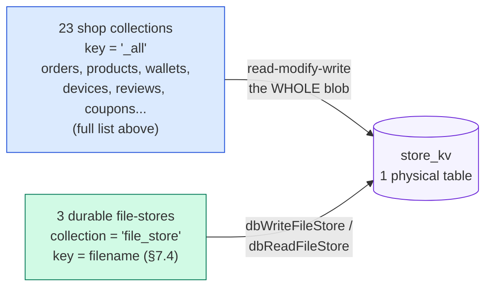

### 7.4 Storage durability — `createFileStore` and the memory-only majority

`src/lib/data-file.ts`'s `createFileStore()` is a second, entirely separate
persistence mechanism from §7.1–7.3 — used by standalone feature modules that never
touch `store.ts`'s `DB` interface. It tries a disk write under `DATA_DIR`
(`.data/` by default) first; on Vercel's read-only production filesystem that write
fails exactly once, `canWrite` latches `false` for the rest of the instance's life,
and a console warning is logged. Only if the caller passed `{ durable: true }` **and**
`DATABASE_URL` is set does the module *also* mirror into `store_kv` (§7.3) — otherwise
it is memory-only from that point on, for that instance.

Counted directly from source (`createFileStore<` call sites, test file excluded):
**37 call sites across 35 modules. Exactly 3 modules pass `durable: true`** —
`admin-warranty.ts`, `api-failures.ts`, and `icm-store.ts` (which alone accounts for 2
of the 4 durable call sites). The other **32 modules are memory-only in production**,
slightly more than doc 03's rough estimate of "27 of about 30" — this atlas corrects
that figure to the exact one, in the same spirit as the OTA correction in §8.3.

```
   ┌────────────────────────────────────────────────────────────────────────┐
   │  DURABLE  (3 modules -- mirrored into store_kv, survive a cold start)   │
   ├────────────────────────────────────────────────────────────────────────┤
   │  admin-warranty.ts    warranty claims and policies                      │
   │  api-failures.ts      recorded upstream API failures for diagnostics    │
   │  icm-store.ts         incident/change records (2 durable call sites)    │
   ├────────────────────────────────────────────────────────────────────────┤
   │  MEMORY-ONLY IN PRODUCTION  (32 modules -- gone on cold start/redeploy) │
   ├────────────────────────────────────────────────────────────────────────┤
   │  Commerce config   admin-pricing, admin-currency, admin-tax, admin-     │
   │                    bundles, admin-shipping, admin-subscriptions,        │
   │                    admin-fraud, admin-marketing, admin-vendors,         │
   │                    admin-affiliates                                    │
   │  Content / CRM     admin-cms (every CMS post), admin-crm (every note    │
   │                    and tag), admin-seo-manager, admin-macros,           │
   │                    admin-surveys                                       │
   │  Platform ops      admin-bulk, admin-jobs, admin-flags (every feature   │
   │                    flag and experiment), admin-integrations (API keys, │
   │                    webhooks, deliveries), admin-staff-activity,         │
   │                    admin-report-builder, reports-schedule, admin-       │
   │                    privacy, deployments                                │
   │  Smart-home        admin-config, alerts-store, device-history,         │
   │                    smarthome-dev-portal (every developer-portal         │
   │                    token), user-prefs                                  │
   │  Security-adjacent telemetry-store (2 call sites), web-push (every      │
   │                    push subscription), passkeys.ts (every registered    │
   │                    WebAuthn credential in the whole application)        │
   └────────────────────────────────────────────────────────────────────────┘
```

The last row is the sharpest edge: a credential class (passkeys) and a delivery
mechanism (push subscriptions) that most engineers would assume are durable by
category are, in this deployment, exactly as ephemeral as a cached CMS draft.

```mermaid
flowchart TB
    call["createFileStore(filename, seed, opts)<br/>37 call sites, 35 modules"]
    diskTry{"disk write<br/>under DATA_DIR"}
    diskOK["written to .data/*.json<br/>-- true on a persistent disk,<br/>never true on Vercel prod"]
    diskFail["canWrite = false<br/>(latched for this instance)"]
    durFlag{"opts.durable === true<br/>AND DATABASE_URL set?"}
    pgMirror["mirrored into store_kv<br/>collection='file_store' (§7.3)<br/>3 modules only"]
    memOnly["in-memory only<br/>gone on cold start / redeploy<br/>32 modules"]

    call --> diskTry
    diskTry -->|"writable FS"| diskOK
    diskTry -->|"read-only FS<br/>(Vercel production)"| diskFail
    diskFail --> durFlag
    durFlag -->|"yes, 3 modules"| pgMirror
    durFlag -->|"no, 32 modules"| memOnly

    style pgMirror fill:#D1FAE5,stroke:#047857
    style memOnly fill:#FEE2E2,stroke:#B91C1C
    style diskFail fill:#FEF3C7,stroke:#B45309
```

---

## 8. Workflows, end to end

Five flows, chosen because each one crosses a trust boundary this atlas has already
named: shop money, device firmware, and the two SSO bridges (`§6`, `§10`). Mermaid is
the primary notation here, as it is for Career.circuvent's own §8 — a sequence is a
poor fit for a monospace box, and the same information is not repeated in ASCII.

### 8.1 Checkout and payment — Razorpay, and the reconciliation gap

```mermaid
sequenceDiagram
    autonumber
    actor U as Shopper
    participant B as Browser (checkout.js)
    participant W as website /api/payments/*
    participant R as Razorpay
    participant S as store.ts (mem + Postgres)

    U->>B: place order
    B->>W: POST create-order { items, coupon, walletApply }
    W->>W: priceItems() recomputes the total server-side
    W->>R: POST /v1/orders (Basic auth keyId:keySecret)
    R-->>W: { id: orderId }
    W-->>B: { orderId, keyId, amount }
    B->>R: open Checkout.js modal
    U->>R: pays
    alt browser JS callback fires
        R-->>B: razorpay_order_id, payment_id, signature
        B->>W: POST /api/payments/verify
        W->>W: checkoutSignatureValid(): HMAC-SHA256(order_id|payment_id)
        W->>R: GET /v1/payments/{id} -- re-fetch, never trust the request body
        R-->>W: { status: "captured", amount }
        W->>W: amount == recomputed total? consumePayment() claims the id once
        W->>S: recordOrder, adjustStock, earnPoints, flushNow()
        W-->>B: 200 { order }
    else tab closes / network dies before the callback
        Note over B,R: Razorpay HAS captured the money;<br/>the browser never comes back
        R->>W: POST /api/payments/webhook (server-to-server, independent of the browser)
        W->>W: verify x-razorpay-signature, HMAC-SHA256 over the raw body
        W->>W: console.log(event) -- the reconciliation hook is a comment, not code
        W-->>R: 200 { success: true }
        Note over W,S: NO order is ever recorded for this captured payment
    end
```

The happy path is genuinely well defended: the handback signature only proves the
browser saw a real Razorpay response, so `verify` re-fetches the payment from
Razorpay's own API, requires `status === "captured"`, compares the gateway's
`amount` against a total recomputed from the catalogue (never the request body),
and claims the payment id exactly once through `consumePayment` so the same
triple cannot be replayed into a second order. What is missing is the second
channel that exists specifically to cover the first one failing: Razorpay's
webhook is configured, its signature is verified correctly, and then nothing
downstream of the `console.log` ever touches `orders`, `wallets` or the emails
in `lib/order-core.ts`. A captured payment whose browser never returns is
captured money with no order — permanently, not until the next poll.

### 8.2 OTA firmware update — the pull path, and the missing signature

```mermaid
sequenceDiagram
    autonumber
    participant D as ESP32 device (CircuventDevice::checkOTA)
    participant W as website GET /api/devices/firmware
    participant M as fw/manifest.json (public bucket)
    participant E as process.env OTA_<TYPE>

    loop every _otaInterval (device-side timer, ~6h)
        D->>D: WiFiClientSecure + _pinRoot() -- TLS pinned, no other CA accepted
        D->>W: GET ?type&id&ver=CV_FW_VERSION<br/>headers x-device-id, x-device-key
        W->>W: require both headers present, else 401
        W->>E: read OTA_<TYPE> (operator override)
        alt env var set
            E-->>W: "version|url"
        else env not set
            W->>M: GET manifest.json (5 min in-instance cache)
            M-->>W: { version, url, sha256? }
        end
        W->>W: compare versions as OPAQUE strings, not "is newer" --<br/>this is what makes a rollback possible
        Note over W,D: sha256, even on the rare manifest entry that<br/>carries one, is never read or returned here
        W-->>D: { version, url } or { version: current, url: "" }
        alt url present and version != current
            D->>D: _applyOta(): a second WiFiClientSecure + _pinRoot()
            D->>W: GET binUrl (same pinned TLS, no further check)
            W-->>D: firmware.bin bytes
            Note over D: httpUpdate.update() flashes the image.<br/>TLS proves the HOST; nothing proves the BINARY --<br/>no hash check and no signature anywhere in this path.
            D->>D: reboot into the new image
        end
    end
```

TLS pinning is real and does its job: an on-path attacker cannot answer the manifest
request or the binary download with a certificate this device will accept. What
pinning cannot do is prove the *content* served by the legitimate, correctly
authenticated host is the build the fleet owner intended to publish — a compromised
publish credential, a mis-uploaded object in the bucket, or a bug in
`scripts/publish-firmware.cjs` all flash straight to the chip. Several of the 17
SKUs behind this exact code path switch mains relays or operate a door lock
(`facedoor.ino`, `switchboard.ino`); an unsigned OTA channel is a materially
different risk on those than on a soil-moisture sensor.

### 8.3 Correcting the fact base — the manifest endpoint exists

```
   ┌──────────────────────────────────────────────────────────────────────┐
   │  CORRECTION to 03_INTEGRATIONS_AND_ECOSYSTEM.md                       │
   ├──────────────────────────────────────────────────────────────────────┤
   │  Doc 03 describes the OTA pull path as polling a manifest endpoint    │
   │  that "DOES NOT EXIST". That is no longer accurate: this repository  │
   │  contains a working handler at                                       │
   │  `src/app/api/devices/firmware/route.ts` (§5.3, §8.2 above), which    │
   │  every sketch's `CircuventDevice::checkOTA()` calls successfully.     │
   │                                                                       │
   │  What doc 03 identified correctly, one layer down from where it       │
   │  placed it, still stands: the endpoint answers with a version and a   │
   │  URL only, never a signature and never an enforced hash. The real     │
   │  defect is image authenticity, not endpoint existence -- see §8.2.    │
   └──────────────────────────────────────────────────────────────────────┘
```

This is the one place this atlas's own reading of the source disagrees with the
fact base it was handed, per the promise in the opening paragraph. Nothing else
in docs 01–05 needed correcting against `src/`; this single case is called out
because the difference between "no endpoint" and "an endpoint with no signature
check" changes what an engineer would fix first.

### 8.4 Shop → console SSO bridge

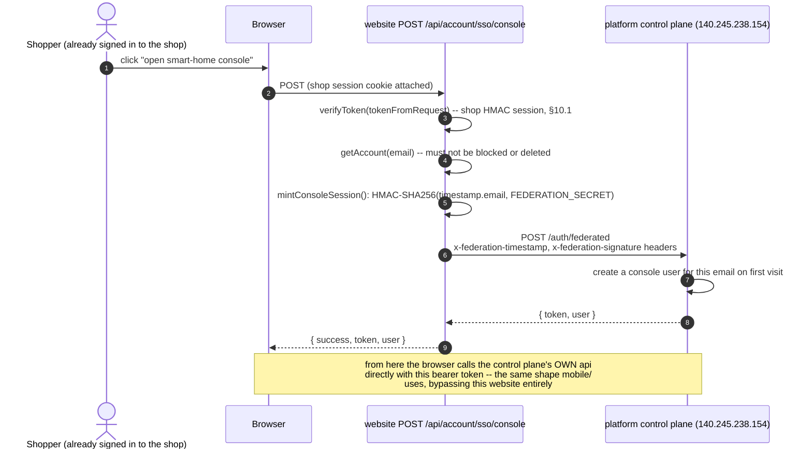

The storefront and the smart-home console keep separate user tables by design, so
this route is a vouching step, not a login: the website proves to itself that the
caller already holds a valid shop session, then asks the control plane to open or
create a console account for that same address. `FEDERATION_SECRET` never leaves
this process — it signs an outbound request, it is never handed to the browser —
and a second guard, `federationAllowedHere()`, stops a preview deployment that
happens to hold the production secret from minting live console sessions.

### 8.5 Admin sign-in via Circuvent SSO (OIDC + PKCE)

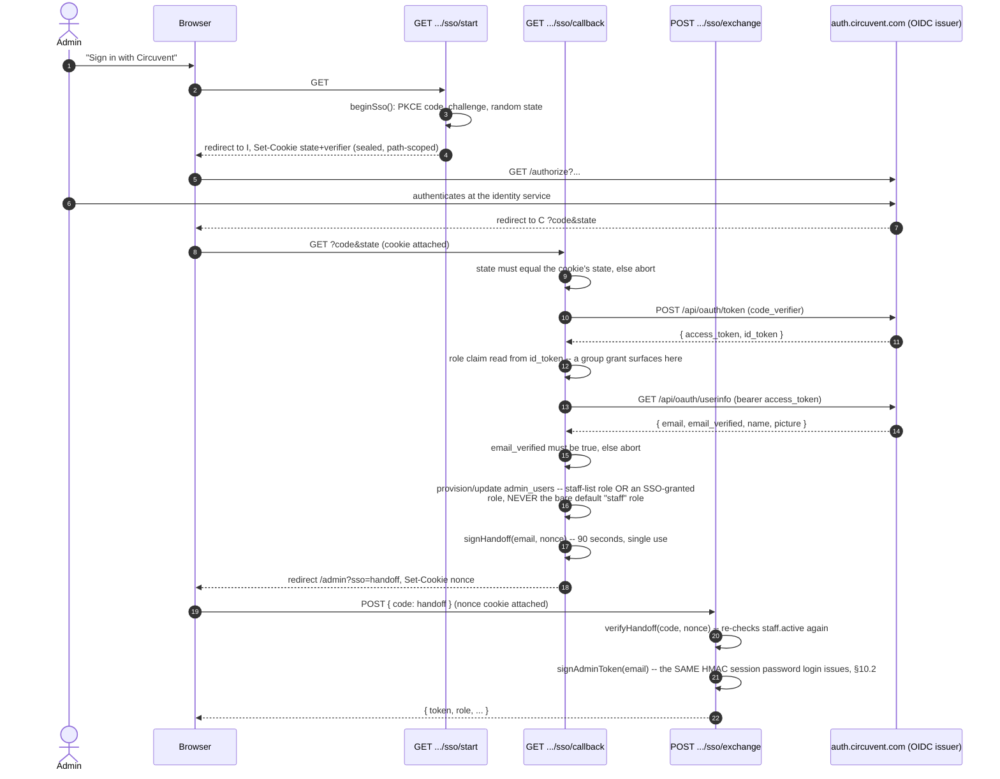

Three hops, not one, and each exists for a reason found in the source comments: the
token never rides in a URL (so it never sits in browser history or a proxy log),
the code is single-use and expires in ninety seconds, and staff status is checked
twice — once at the callback and again at the exchange — because a role can be
revoked in the gap between them. The flow's real subtlety is authorisation, not
authentication: the identity service will happily sign in anyone with a Circuvent
account, so `roleClaimFromIdToken` only grants console access from an explicit
per-console role or group grant, never from the ordinary `staff` default every
employee already has.

**The common thread across 8.1, 8.4 and 8.5:** each cross-boundary exchange is
server-verified and single-use-claimed (`consumePayment`, the SSO nonce, the OTP-
like handoff code). The one exception is the payment webhook in 8.1, which has the
verification but not the claim — the only flow in this section where a second,
independent confirmation channel exists on paper and is not wired to anything.

---

## 9. State machines

### 9.1 Order lifecycle, and the return it can spawn

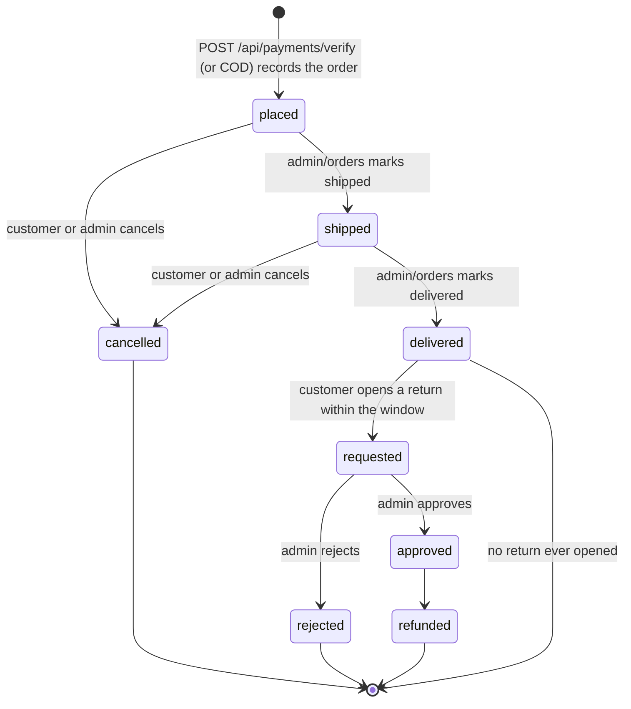

`placed`, `shipped`, `delivered` and `cancelled` are the order's own `status` field;
`requested`, `approved`, `rejected` and `refunded` belong to a separate row in the
`returns` collection (`store.ts:262`) that references the order rather than
replacing its status. Warranty eligibility (`warranty.ts`) reads the same
`delivered` transition to start its own clock.

### 9.2 Device online/offline

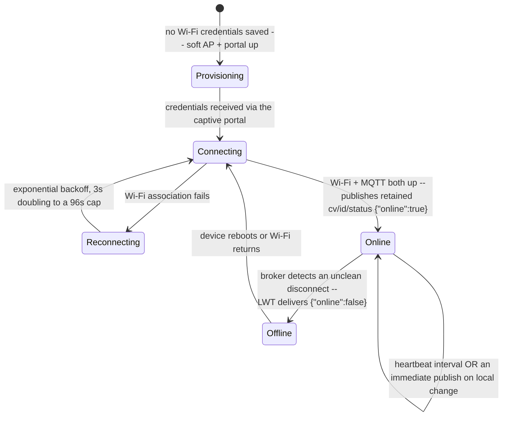

"Online" and "offline" as the console displays them are entirely MQTT's own
retained-message-plus-Last-Will mechanism (`CircuventDevice.h:12`); there is no
separate heartbeat table on the server side that ages a device out.

### 9.3 Session and token lifecycle

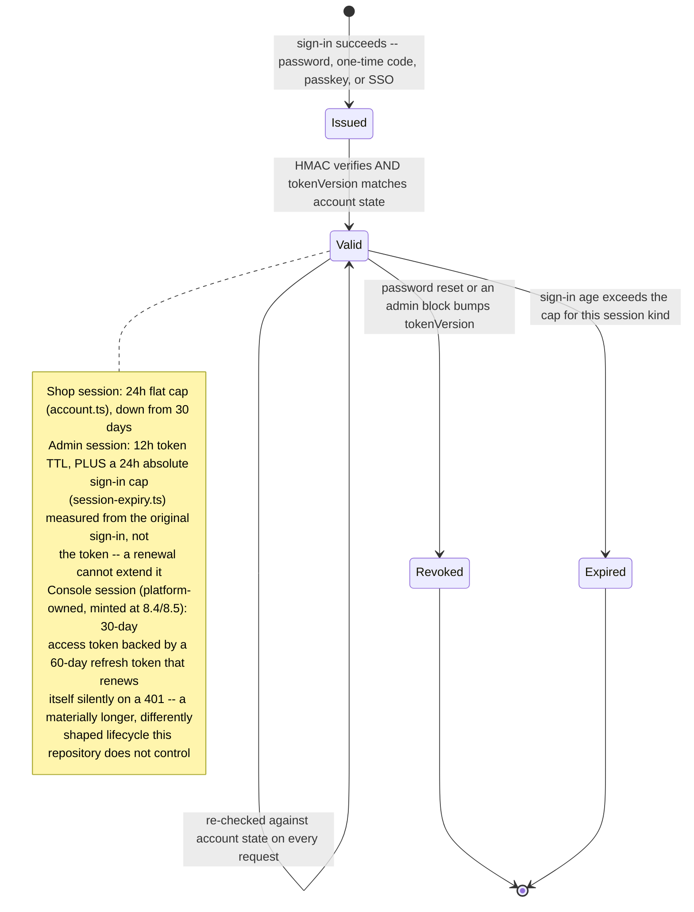

None of the three schemes issue a classic refresh token from this codebase: a
shop or admin session simply stops working at its cap and the person signs in
again. Only the console session, owned by `platform/`, renews itself.

### 9.4 CI pipeline — the intended shape, and the observed one

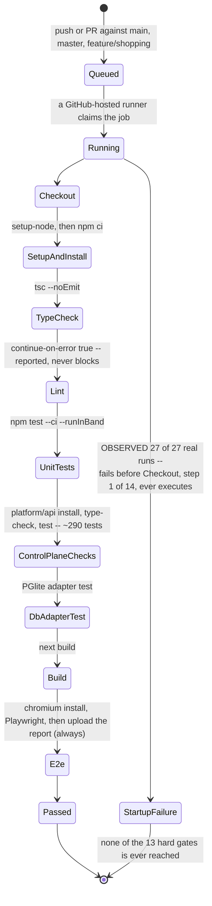

Fourteen named steps; `Lint` is the only one marked `continue-on-error`, so the
other thirteen are hard gates in the ordinary sense — a real failure at
`Unit tests`, `Control-plane tests` or `End-to-end tests` would stop a deploy.
None of that machinery has been exercised: every one of the 27 recorded runs
ends in `startup_failure`, the state GitHub Actions reports when the workflow
never starts executing steps at all — a runner or configuration problem
upstream of the YAML shown above, per `04_MAINTENANCE_AND_OPERATIONS.md`.

## 10. Cross-cutting concerns

### 10.1 The five authentication schemes — and the edge layer that checks none of them

```
 ┌─────┬────────────┬───────────────────────────────┬─────────────────────┐
 │  #  │ Subject    │ Mechanism                     │ Session cap         │
 ├─────┼────────────┼───────────────────────────────┼─────────────────────┤
 │  1  │ Shop       │ HMAC-SHA256(email, issuedAt,  │ 24h flat from       │
 │     │ customer   │ tokenVersion); password        │ sign-in, re-checked │
 │     │            │ (scrypt) or a WebAuthn passkey │ live every request  │
 │  2  │ Admin      │ HMAC-SHA256(email, issuedAt,  │ 12h token TTL PLUS  │
 │     │ staff      │ tokenVersion); password,       │ a 24h absolute cap  │
 │     │            │ passkey, or OIDC/PKCE (8.5)    │ from sign-in        │
 │  3  │ Device     │ static x-device-id +           │ none -- one long-   │
 │     │ (ESP32)    │ x-device-key header pair,      │ lived shared secret │
 │     │            │ checked against the store      │ printed per unit    │
 │  4  │ Console    │ Authorization: Bearer, either  │ owned by platform/: │
 │     │ user       │ password direct to the control │ 30d access + 60d    │
 │     │            │ plane, or bridged from #1 (8.4)│ refresh, self-renews│
 │  5  │ Scheduler  │ Authorization: Bearer          │ static; the same    │
 │     │ (cron)     │ <CRON_SECRET>, checked inline  │ check hand-written  │
 │     │            │ at 5 separate route files      │ five separate times │
 └─────┴────────────┴───────────────────────────────┴─────────────────────┘
```

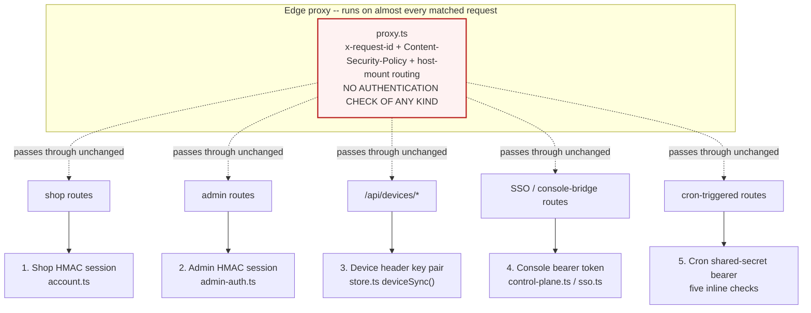

Every route decides its own authentication for itself; nothing upstream of the
route handler enforces any of the five. `proxy.ts`'s own header comment says what
it is for: "request correlation + Content-Security-Policy" — nowhere does it read
a session, a device key, or a bearer token. A new route that forgets to call
`verifyToken` is a public route, and the platform gives no warning that this
happened. `GET /api/devices/firmware` (8.2) shows the quiet end of this: the
handler checks that `x-device-id`/`x-device-key` are *present*, then never
reads either value again — scheme 3 exists in name on that one endpoint only.

### 10.2 Security headers — complete, and applied twice

```
 ┌────────────────────────────┬──────────────────────────────────────────┐
 │ Header                     │ Value                                    │
 ├────────────────────────────┼──────────────────────────────────────────┤
 │ Strict-Transport-Security  │ max-age=63072000; includeSubDomains;     │
 │                            │ preload                                  │
 │ Content-Security-Policy    │ built from CSP_DIRECTIVES, lib/csp.ts    │
 │ X-Content-Type-Options     │ nosniff                                  │
 │ X-Frame-Options            │ DENY                                     │
 │ Referrer-Policy            │ strict-origin-when-cross-origin          │
 │ X-DNS-Prefetch-Control     │ on                                       │
 │ Permissions-Policy         │ camera=(), microphone=(),                │
 │                            │ geolocation=(self), browsing-topics=()   │
 │ Cross-Origin-Opener-Policy │ same-origin                              │
 └────────────────────────────┴──────────────────────────────────────────┘
```

All eight are declared once, globally, in `next.config.ts`'s `headers()` — every
response, every route, no opt-in required. The CSP is declared a *second* time,
identically, inside `proxy.ts`, precisely so a path the edge matcher excludes
(`_next/static`, the Workflow SDK's own callback path) still gets the policy from
`next.config.ts` alone. `connect-src` allow-lists exactly the external services
6.1 names (Razorpay, Firebase, Google Analytics, Vercel); `frame-ancestors 'none'`
and `object-src 'none'` are set; nothing here is partial or deferred.

### 10.3 Error handling — a wrapper nobody imports

```
   ┌───────────────────────────────────────────────────────────────────┐
   │ lib/api-handler.ts — withApi()                                    │
   │   Correlation id, structured request/error logging, a consistent  │
   │   { success:false, error, requestId } envelope, method guarding,  │
   │   optional rate limiting. Fully built, fully documented.          │
   │   IMPORTED BY ZERO ROUTES out of roughly 150.                     │
   ├───────────────────────────────────────────────────────────────────┤
   │ Every actual route                                                 │
   │   Hand-writes its own NextResponse.json({...}, {status}) for the  │
   │   errors it anticipated. What it did not anticipate throws.       │
   ├───────────────────────────────────────────────────────────────────┤
   │ app/error.tsx                                                     │
   │   The one Next.js route-segment boundary in the tree. Catches a   │
   │   throw from any page below it; shows a retry button.             │
   ├───────────────────────────────────────────────────────────────────┤
   │ app/global-error.tsx — DOES NOT EXIST                             │
   │   If the root layout itself throws, Next's own unstyled fallback  │
   │   is what a visitor sees. Nothing in this repository catches it.  │
   └───────────────────────────────────────────────────────────────────┘
```

A uniform, well-designed API wrapper was built and then never adopted: every one
of the ~150 route handlers rolls its own response shape and its own decision
about whether an unexpected throw is caught at all. Some do; a route with no
top-level `try`/`catch` and no `withApi` simply 500s with Next's default body,
carrying no `requestId` for support to search logs by.

### 10.4 No tenancy, and the guard against crossing it by accident

There is no tenant model anywhere in this application: one deployment, one
catalogue, one `admin_users` table, one Postgres database. "Tenancy" here means
only environment isolation — production data must never be reachable from a
preview deployment — and that boundary has already been crossed twice, by
accident, which is why two purpose-built guards now exist:

```
 ┌──────────────────────────┬──────────────────────────┬──────────────────┐
 │ Guard                    │ Incident it followed     │ Failure mode     │
 ├──────────────────────────┼──────────────────────────┼──────────────────┤
 │ assertNotProductionData()│ A preview deployment's   │ THROWS -- refuses│
 │ + PROD_DATA_HOSTS        │ DATABASE_URL pointed at  │ to boot rather   │
 │ (db.ts)                  │ prod; dev.circuvent.com  │ than silently    │
 │                          │ served real orders and   │ serving the      │
 │                          │ wallet balances           │ wrong database   │
 │ federationAllowedHere()  │ A preview build's SSO    │ RETURNS FALSE --│
 │ + PROD_IDENTITY_HOSTS    │ config vouched for real  │ looks exactly    │
 │ (sso.ts)                 │ customers against the    │ like a bad       │
 │                          │ live fleet; dev created  │ password, so a   │
 │                          │ accounts from real       │ refusal never    │
 │                          │ password hashes           │ confirms an      │
 │                          │                           │ address exists   │
 └──────────────────────────┴──────────────────────────┴──────────────────┘
```

Both guards share the same shape: a comma-separated host list, checked only on
*non*-production deployments, safe to leave unset, and safe to set everywhere
because a hostname is not a credential. They differ in what a match does —
`db.ts` throws (an empty shop is an obvious incident); `sso.ts` returns `false`
(a loud federation error would leak which emails are real customers). Neither
guard is a tenancy system; both are the scar tissue from not having one.

## 11. Deployment topology

### 11.1 Device and connectivity topology — 17 SKUs, five radios, one VM

Every one of the 30 firmware sketches counted in §3.2 ends up on the same box:
the Oracle VM at `140.245.238.154`. Nothing in `firmware/` talks to Vercel, to
Neon, or to this website at all — the split this atlas keeps repeating (website
owns commerce and content; `platform/` owns every device) is physical, not just
architectural. This table is the 17 retail SKUs; the paragraph below it is the
other 13 tracked sketches, which are not sold.

```
 Retail SKU (as sold)        Firmware directory(ies)         Code   Radio to the VM
 --------------------------- ------------------------------- ------ ---------------
 Home Automation Hub         home-hub/                       HUB    Wi-Fi -> MQTTS
 AquaGuard tank controller   aquaguard/                      AQG    Wi-Fi -> MQTTS
   -- split variant --       watertank/ + watertank-sensor/  TNK    LoRa, then Wi-Fi
 Smart Plug                  smart-plug/                     PLG    Wi-Fi -> MQTTS
 Smart Switch                smart-switch/                   SWT    Wi-Fi -> MQTTS
 Smart Light                 smart-light/                    LGT    Wi-Fi -> MQTTS
 Smart Fan                   smart-fan/                      FAN    Wi-Fi -> MQTTS
 Smart Lock                  smart-lock/                     LCK    Wi-Fi -> MQTTS
 Curtain controller          curtain/                        CRT    Wi-Fi -> MQTTS
 Motion Sensor               motion-sensor/                  MOT    Wi-Fi -> MQTTS
 Energy Monitor              energy-monitor/ (older)         NRG    Wi-Fi -> MQTTS
   -- replacement, see note  meter/ (cv-em1 / cv-em3)        NRG    Wi-Fi -> MQTTS
 Guardian (wearable SOS)     guardian/                       GRD    SIM800L cellular
 Agri Pump Starter           agri-starter/                   AGR    SIM800L cellular
 Touch Switchboard           touchboard/ + touchboard-8/     TCH    Wi-Fi -> MQTTS
 FaceDoor                    facedoor/                       FCD    Wi-Fi -> MQTTS
 RFID Gate                   rfid-gate/ + rfid-attend/       GAT    Wi-Fi -> MQTTS
 Sentinel (gas/climate)      sentinel/                       SNL    Wi-Fi -> MQTTS
 Load Controller             switchboard/                    none*  Wi-Fi -> MQTTS
```
\* `switchboard` has no row in `platform/api/src/serial.ts`'s `PRODUCT_CODES`
table. Per `DEVICE_REGISTRY.md`'s own documented rule, a serial minted from the
generic fallback code can be generated but can never be resolved back to a
device type by `typeFromProductCode()` — this one retail SKU is a genuine,
narrow gap in a registry that is otherwise careful about exactly this. The
"replacement, see note" row is explained just below the table: `meter/` is a
newer metering-IC redesign of the same Energy Monitor SKU, not a duplicate.

The other 13 tracked sketches are not sold, and reach the VM differently or not
at all: `camera/` (Wi-Fi, product code `CAM`, no first-party PCB in `hardware/`
— an accessory module, not a named line) and `anpr-cam/` (Wi-Fi, `ANP`, a gate
camera for the ANPR/visit-pairing feature in `platform/api/src/routes/anpr.ts`,
sold to businesses, not retail) both reach the VM over Wi-Fi like the SKUs
above. The drone (`drone-fc/`, ESP32-S3, plus `drone-link/` and `witness/`) and
the RC car (`rccar/`, `rc-link/`, `rc-remote/`) are the two items the fact base
calls out as present but not sold — see the connectivity notes below.

**Wi-Fi, direct (12 of 17 SKUs).** `CircuventDevice.h`'s base library joins the
home network, then opens `mqtts://mqtt.circuvent.com:8883`. TLS verifies the
broker's certificate against Circuvent's own CA (`O=Circuvent Technologies,
CN=Circuvent Device CA`, generated once by `platform/scripts/gen-certs.sh` and
embedded as `ca.crt` in every sketch that links the shared library) — a public
CA is never consulted, so a device will not trust anything else on the internet
that merely holds a valid certificate for `mqtt.circuvent.com`.

**GSM / cellular (guardian, agri-starter).** Both link a SIM800L modem over
`TinyGSM` instead of a Wi-Fi radio — confirmed by grep, no other sketch
includes `TinyGSM` or `SIM800`. A wearable SOS button and a pump starter bolted
to a field motor are exactly the two device classes that cannot assume a home
router is nearby. MQTTS still terminates on the same broker, over carrier data
instead of Wi-Fi; the broker cannot tell the two transports apart.

**LoRa 433 MHz (the AquaGuard split pair, `CvTankLink.h`).** `watertank-sensor`
floats in the tank and has no Wi-Fi radio at all; it speaks LoRa only, to
`watertank`, which is the unit within router range. Only `watertank` ever opens
a socket — the sensor's readings reach the VM by relay, one more hop than every
other SKU, and the sensor cannot be claimed or diagnosed except through it.

**ESP-NOW (two unrelated uses of the same radio mode, never the VM).**
`rccar` <-> `rc-remote` is peer-to-peer with no broker, no account and no
record in this application at all — switching it off is switching off the
toy, not a claim in a database (`CircuventRC/rc-protocol.h`). Separately,
`touchboard-8` <-> `switchboard` uses ESP-NOW for the *panel-to-relay* hop
inside one Load Controller/Touch Switchboard installation (`CvHomeLink.h`);
unlike the RC car, one side of that pair still reaches the VM afterwards over
Wi-Fi/MQTTS. The two uses share a radio mode and nothing else.

**MAVLink (drone-fc, internal only).** The flight-control loop is split across
the ESP32-S3's two cores on purpose: core 1 runs a 1 kHz gyro/cascade/motor
loop that "never touches Wi-Fi" (the sketch's own comment), speaking MAVLink to
the flight peripherals; core 0 owns Wi-Fi and MQTT and publishes batched
40-byte position records to `cv/<id>/track` (stored in `flight_track`, per
`PROTOCOL.md`, never as ordinary telemetry). MAVLink is the real-time control
protocol; MQTT is the reporting path — they never touch the same core.

```
   THE VM ITSELF -- 140.245.238.154, Oracle Cloud "Always Free" tier,
   VM.Standard.A1.Flex (4 OCPU / 24 GB, ARM), one docker-compose stack,
   5 containers on a single private bridge network ("internal"):

     caddy       :80 (ACME + redirect), :443 (HTTPS + WSS)   PUBLISHED
     mosquitto   :8883 (device MQTT/TLS, own CA)              PUBLISHED
                 :1883 (plaintext, healthcheck only)          internal
     api         :8080 Express control plane                  internal, behind caddy
     postgres    :5432 -- platform's OWN database, NOT Neon    internal only
     face        :8000 OpenCV face-embedder for FaceDoor,     internal only
                 384 MB hard cap so a leak cannot OOM-kill postgres instead

   DNS: api.circuvent.com and mqtt.circuvent.com both resolve to the same
   public IP. Port 22 (SSH) is the only other opening; everything else is
   the OS firewall default-deny plus one matching Oracle Cloud security list.
```

```mermaid
flowchart TB
    subgraph skus["17 retail SKUs + camera/anpr-cam"]
        wifi["12 SKUs, direct Wi-Fi<br/>hub · plug · switch · light · fan · lock<br/>curtain · motion · energy · touch · facedoor<br/>rfid-gate · sentinel · switchboard"]
        gsm["guardian · agri-starter<br/>SIM800L / TinyGSM cellular"]
        lora["watertank-sensor --LoRa 433MHz--> watertank<br/>the AquaGuard split pair"]
    end

    subgraph notsold["Not sold (fact base calls these out)"]
        rc["rccar <--ESP-NOW--> rc-remote<br/>peer-to-peer, no cloud, no account"]
        drone["drone-fc (ESP32-S3)<br/>core1: MAVLink @1kHz, never Wi-Fi<br/>core0: Wi-Fi/MQTT --> cv/id/track"]
        panel["touchboard-8 <--ESP-NOW--> switchboard<br/>panel-to-relay hop, then Wi-Fi/MQTTS"]
    end

    subgraph vm["Oracle VM 140.245.238.154 (5 containers, 1 network)"]
        caddy["caddy :80/:443<br/>reverse proxy, ACME"]
        mosq["mosquitto :8883<br/>own CA, ACL cv/&lt;id&gt;/#"]
        api["api :8080 Express<br/>internal only"]
        pg["postgres :5432<br/>internal only, own DB"]
        face["face :8000 OpenCV<br/>internal only, 384MB cap"]
    end

    wifi -->|"MQTTS :8883"| mosq
    gsm -->|"MQTTS over carrier data"| mosq
    lora -->|"Wi-Fi/MQTTS :8883"| mosq
    drone -->|"MQTTS :8883, track topic"| mosq
    panel -->|"Wi-Fi/MQTTS :8883"| mosq
    rc -.->|"never reaches this VM"| mosq

    mosq --> api --> pg
    facedoor2["facedoor SKU"] -.->|"embeddings"| face
    caddy --> api

    style rc fill:#F8FAFC,stroke:#94A3B8,stroke-dasharray: 5 5
    style vm fill:#FEF3C7,stroke:#B45309
```

### 11.2 Hosting — five clouds, one Vercel project, one VM, zero orchestration

```
                 ╭┈┈┈┈┈┈┈┈┈┈┈┈┈┈┈┈╮
                 ┊     GitHub      ┊  source + Actions CI
                 ┊  circuvent/web  ┊  14 steps, 27/27 startup_failure (§9.4)
                 ╰┈┈┈┈┈┈┈┈┈┈┈┈┈┈┈┈┈╯
                          │  push / PR
                          ▼
   ┌═══════════════════════════════════════════════════════════════════╗
   ║                            VERCEL                                  ║
   ║  one project, five web products, host-mounted (§3.3, proxy.ts):    ║
   ║    circuvent.com               marketing + shop + admin (default)  ║
   ║    home.circuvent.com          -> /smarthome  (also iot.*)          ║
   ║    developer.circuvent.com     -> /developer                       ║
   ║    dev.circuvent.com           persistent preview alias (§10.4)     ║
   ║                                                                     ║
   ║   EDGE (proxy.ts): request-id, CSP header, host-mount rewrite,      ║
   ║          one 308 category redirect -- NO auth check (§10.1)         ║
   ║   SERVERLESS: 150 route handlers, RSC pages -- ad hoc error         ║
   ║          handling per route, withApi() wrapper unused (§10.3)       ║
   ║   CRON (vercel.json, 4 schedules): alerts/run 08:00, reports/send   ║
   ║          04:00, smarthome/alerts/cron 06:00, availability/probe     ║
   ║          05:00 -- each checks its own CRON_SECRET bearer (§10.1)    ║
   ╚═══════════════════════════╤═══════════════╤═══════════════════════╝
                                │               │
                    DATABASE_URL│               │CONTROL_PLANE_URL
                        (HTTP)  │               │  (HTTPS, §6)
                                ▼               ▼
                ╭┈┈┈┈┈┈┈┈┈┈┈┈┈┈┈┈┈╮   ╭┈┈┈┈┈┈┈┈┈┈┈┈┈┈┈┈┈┈┈┈┈┈┈┈┈┈┈┈┈╮
                ┊ Neon Postgres   ┊   ┊ platform/ -- 140.245.238.154  ┊
                ┊ HTTP driver     ┊   ┊ Express + Mosquitto + its OWN ┊
                ┊ 10 tables (§7) ┊   ┊ Postgres + Caddy -- see §11.1  ┊
                ╰┈┈┈┈┈┈┈┈┈┈┈┈┈┈┈┈┈╯   ╰┈┈┈┈┈┈┈┈┈┈┈┈┈┈┈┈┈┈┈┈┈┈┈┈┈┈┈┈┈╯

   Other environment-scoped destinations from the same Vercel deployment:
     R2 (public, no credentials)  https://pub-...r2.dev/fw/manifest.json (§8.2)
     auth.circuvent.com           OIDC/PKCE issuer, admin SSO only (§8.5, §10.1)
     api.razorpay.com             checkout order + webhook signature (§8.1)
     GOOGLE_HOMEGRAPH_KEY / ALEXA_*  voice-assistant push, via platform/ (§6)

   mobile/ (Expo, shipped v1.13.1, Play Store) talks to BOTH systems from
   the same app, and says why in its own source comment (mobile/src/config.ts):
   device control (API_BASE, WS_URL) goes straight to platform/'s
   api.circuvent.com over REST + `wss://.../ws`, bypassing Vercel entirely --
   but the in-app assistant and "home analysis" call SITE_URL, this website,
   because only it holds the product catalogue and order history. One app,
   two backends, on purpose. native/ (Kotlin/Swift, iOS half never built)
   is not wired to either -- it has never shipped.
```

```mermaid
flowchart TB
    gh["GitHub<br/>push / PR"] -->|"webhook"| vercel

    subgraph vercel["VERCEL -- one project, five web products"]
        direction TB
        edge["Edge: proxy.ts<br/>request-id + CSP + host-mount<br/>NO auth check"]
        fn["Serverless: 150 routes, RSC<br/>ad hoc error handling"]
        cron["4 vercel.json crons<br/>CRON_SECRET each"]
    end

    gh -.->|"Actions CI, 27/27 startup_failure"| ciFail(("never once green"))

    vercel -->|"DATABASE_URL, HTTP"| neon[("Neon Postgres<br/>10 tables, §7")]
    vercel -->|"CONTROL_PLANE_URL"| vm
    vercel -->|"public GET, no creds"| r2[("Cloudflare R2<br/>firmware manifest")]
    vercel -->|"OIDC/PKCE"| authcv[("auth.circuvent.com<br/>admin SSO issuer")]
    vercel -->|"orders + webhook"| razor[("Razorpay")]

    subgraph vm["platform/ -- Oracle VM 140.245.238.154"]
        vmapi["Express :8080"]
        vmpg[("Postgres :5432<br/>NOT Neon")]
        vmmq["Mosquitto :8883"]
    end

    mob["mobile/ Expo v1.13.1<br/>Play Store"] -->|"REST + wss, direct"| vmapi
    mob -->|"assistant + home analysis<br/>SITE_URL, via Vercel"| vercel
    nat["native/ prototype<br/>iOS never built"] -.->|"not deployed anywhere"| vmapi

    style ciFail fill:#FEE2E2,stroke:#B91C1C
    style edge fill:#FEE2E2,stroke:#B91C1C
    style vm fill:#FEF3C7,stroke:#B45309
```

## 12. The test map

```mermaid
flowchart LR
    subgraph colocated["CO-LOCATED -- 116 files, next to the code they cover"]
        routes["route.test.ts<br/>API handlers -- largest is<br/>admin/icm/route.test.ts (443 lines)"]
        libts["lib/*.test.ts<br/>app-insights-usage (362)<br/>app-insights-query (324)"]
        admints["admin/*.test.tsx<br/>insights-charts.test.tsx (322)"]
    end

    subgraph dedicated["tests/** -- 120 files, cross-cutting"]
        fwsim["firmware simulation<br/>drone-flight-safety (336)<br/>camera-fps-parity (355)<br/>firmware-avi (424)"]
        icm2["icm.test.ts (342)<br/>incident state machine"]
        util2["lib/extended-utils.test.ts (316)"]
        logo["report-logo.test.ts<br/>THE ONE FAILURE TODAY"]
    end

    subgraph e2edir["e2e/ -- 8 Playwright specs"]
        pw["never run in CI --<br/>the workflow's own comment<br/>says so; .last-run.json is an<br/>undated local cache, not proof"]
    end

    subgraph untested2["UNTESTED -- confirmed by grep"]
        dbts["src/lib/db.ts<br/>the entire DB access layer"]
        cspts["src/lib/csp.ts<br/>generates the CSP header"]
    end

    style logo fill:#FEE2E2,stroke:#B91C1C
    style pw fill:#FEF3C7,stroke:#B45309
    style untested2 fill:#FEE2E2,stroke:#B91C1C
```

```
   236 Jest suite files (120 under tests/**, 116 co-located src/**/*.test.*  --
   the file count reconciles exactly against the runner's own report) run
   4,328 tests in 49.5s. One fails today: report-logo.test.ts, because the
   embedded base64 logo bytes drifted from the PNG on disk -- a small, honest
   failure, not a flaky one. jest.config.js has no coverageThreshold key, so
   none of this is enforced by a number -- and the 8 e2e/ Playwright specs,
   the only tests that exercise a real browser, have never once run in CI (§9.4).
```

---

## 13. Everything, on one page

```
   ╔══════════════════════════════════════════════════════════════════════════════════╗
   ║         THE CIRCUVENT SUITE -- EVERYTHING IN THIS WORKING TREE, ONE PAGE         ║
   ╠══════════════════════════════════════════════════════════════════════════════════╣
   ║                                                                                  ║
   ║ 5 web products, 1 Next.js app -> VERCEL EDGE (proxy.ts, NO auth gate)            ║
   ║ -> 150 routes -> Neon Postgres, HTTP driver, NO transactions, 10 tables,         ║
   ║    schema created at runtime by initDb() on every single call (§7.2)             ║
   ║                                                                                  ║
   ║ website/  -- this Next.js app, all of §1-10 below:                               ║
   ║   marketing site + e-commerce/Razorpay -- admin back office, 83 routes           ║
   ║   -- smart-home IoT console, 60+ sections -- public developer portal             ║
   ║   150 API routes, 108 pages, 428,355 loc, 4,328 tests (1 failing)                ║
   ║   35 file stores: 32 memory-only, 3 durable -- 5 auth schemes, and               ║
   ║   proxy.ts, which does not gate a single one of them                             ║
   ║                                                                                  ║
   ║ everything else living in this same tree, none of it part of website/:           ║
   ║   firmware/   30 sketches, 17 retail SKUs, ESP32, MQTTS -> one Oracle VM         ║
   ║   platform/   that Oracle VM -- Mosquitto + Express + its OWN Postgres           ║
   ║               + Caddy, none of it Vercel, none of it Neon (§11)                  ║
   ║   hardware/   real KiCad PCB designs and Gerbers for the 17 SKUs                 ║
   ║   mobile/     Expo app, SHIPPED v1.13.1 to the Play Store -- talks to            ║
   ║               BOTH platform/ (device control) and website (catalogue)            ║
   ║   native/     Kotlin/Swift prototype, iOS half has NEVER COMPILED                ║
   ║   a drone and an RC car -- present on disk, never sold to anyone                 ║
   ║   circuvent-platform/  an UNRELATED HR/payroll SaaS. Its README                  ║
   ║               PUBLISHES SEED LOGINS. It shares a name and nothing                ║
   ║               else -- see §3 for the diagram that says so loudly                 ║
   ║                                                                                  ║
   ╠══════════════════════════════════════════════════════════════════════════════════╣
   ║ THE BIGGEST DEFECTS, IN ONE PLACE                                                ║
   ║                                                                                  ║
   ║ 32 of 35 file stores are memory-only in production -- CMS, CRM, pricing,         ║
   ║ currency, tax config, feature flags, telemetry, dev-portal tokens, and           ║
   ║ PASSKEYS all vanish on the next cold start (§7.4)                                ║
   ║ Payment webhook verifies its signature, then does nothing -- a payment           ║
   ║ with no browser return is never reconciled (§8.1)                                ║
   ║ OTA is TLS-pinned but never checks an image hash or signature; the               ║
   ║ manifest endpoint DOES exist, correcting 03_INTEGRATIONS (§8.2, §8.3)            ║
   ║ proxy.ts sets the request id, the CSP header and the host rewrite --             ║
   ║ it does not gate one single route (§10.1)                                        ║
   ║ CI: 14 steps, 13 hard gates, 27 of 27 observed runs = startup_failure,           ║
   ║ never once reaching step 1 of 14 (§9.4)                                          ║
   ║ Neon's HTTP driver makes transactions impossible everywhere, always              ║
   ║ (§7.2) -- the co-located platform/ Postgres is a different database              ║
   ║ and does not share this limitation (§11.2)                                       ║
   ║                                                                                  ║
   ╠══════════════════════════════════════════════════════════════════════════════════╣
   ║ OWNS: five customer-facing web products, a home-grown HMAC session               ║
   ║       scheme, 35 file stores (32 of them one redeploy from empty), and           ║
   ║       all 150 routes and 108 pages catalogued in §5.                             ║
   ║ OWNS NOT: a transaction, a signed firmware image, a reconciled webhook,          ║
   ║       a green CI run, or any relationship to the payroll app three               ║
   ║       folders up that happens to share half its name.                            ║
   ╚══════════════════════════════════════════════════════════════════════════════════╝
```

---

*Back to [`README.md`](./README.md) · [`01_SYSTEM_OVERVIEW.md`](./01_SYSTEM_OVERVIEW.md) ·
[`02_DATABASE_AND_DATA_MODELS.md`](./02_DATABASE_AND_DATA_MODELS.md) ·
[`03_INTEGRATIONS_AND_ECOSYSTEM.md`](./03_INTEGRATIONS_AND_ECOSYSTEM.md) ·
[`04_MAINTENANCE_AND_OPERATIONS.md`](./04_MAINTENANCE_AND_OPERATIONS.md) ·
[`05_AREAS_OF_ENHANCEMENT.md`](./05_AREAS_OF_ENHANCEMENT.md)*
