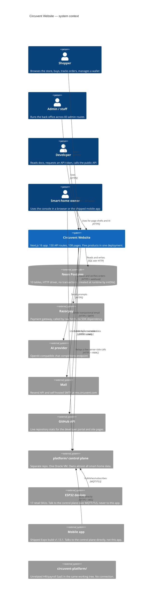
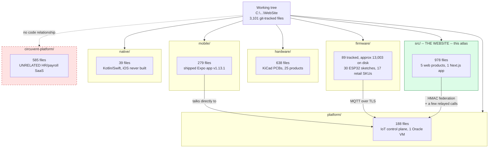
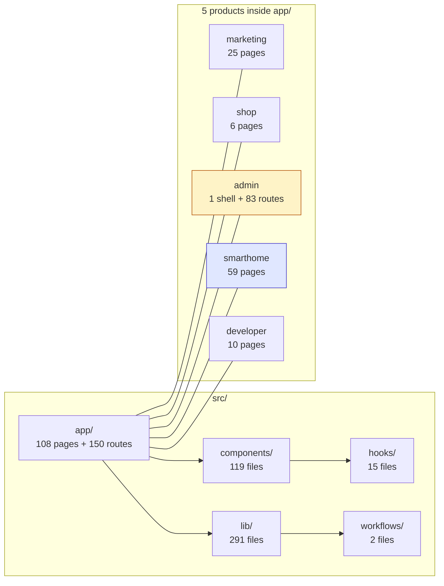

# 06 · Architecture Diagram Atlas

> **What this is.** Every other document in this set explains. This one *shows*. It is a
> complete visual inventory of the repository the rest of `Architecture_Docs/` calls
> "website" — 150 API routes, 108 pages, 10 database tables, 35 file-backed stores (only
> 3 of them durable), five coexisting authentication schemes, and the six other things
> that live in this same working tree but are not part of the Next.js application at all.
> Nothing here is summarised away: where a list is long, the list is printed in full.
>
> **How to read it.** Every numbered section gives the same picture twice: an
> ASCII/Unicode block that renders in a terminal, a diff or a printed page, and a Mermaid
> block that renders as an interactive graphic on GitHub, in VS Code and in most wikis.
> Read whichever one displays for you; they are redundant by design, not complementary.
> Sections 3 and 5 are the two that must be *complete* rather than representative — §3
> maps every top-level thing in this working tree and §5 names all 150 routes and all
> 108 pages by path. Every fact below was read from the source in this repository. Where
> it differs from [`01_SYSTEM_OVERVIEW.md`](./01_SYSTEM_OVERVIEW.md) through
> [`05_AREAS_OF_ENHANCEMENT.md`](./05_AREAS_OF_ENHANCEMENT.md), this document follows the
> source and says so inline — it corrects one such case in §8.3.

### Legend

```
   ┌──────────────┐        a component whose code lives in THIS repository (website)
   │  like this   │
   └──────────────┘

   ╭┈┈┈┈┈┈┈┈┈┈┈┈┈┈╮        a component that lives somewhere else — another repository
   ┊  like this   ┊        in this same working tree, a third-party service, or a
   ╰┈┈┈┈┈┈┈┈┈┈┈┈┈┈╯        physical device

   ──────▶                 synchronous call, made and awaited
   ┈┈┈┈┈▶                 asynchronous, fire-and-forget, or "best effort"
   ══════▶                 redirect, navigation, or a physical-world action (a relay
                           switching, a lock turning)

   [S]  static      rendered once at build time              [R] route handler
   [D]  dynamic     rendered per request, "no-store"          [C] client component
   [M]  memory-only store — gone on cold start / redeploy
   [P]  Postgres-durable store — the 3 exceptions to [M], see §7.4

   No [A] tag appears anywhere in this document: `grep`ing the whole of `src/` for
   `"use server"` returns nothing. Every mutation in this application is a fetch to a
   route handler, never a Next.js Server Action.
```

---

## 1. C4 Level 1 — System context

Six things share this working tree (full detail in §3). This section's system boundary
is only the first of them: the Next.js application under `src/`, deployed as one Vercel
project. The other five — `firmware/`, `platform/`, `hardware/`, `mobile/`, `native/` —
are separate deployables that happen to sit beside it in the same repository, and
`circuvent-platform/` is not part of Circuvent at all (§3.1).

```
     ╭┈┈┈┈┈┈┈┈┈┈┈┈┈╮ ╭┈┈┈┈┈┈┈┈┈┈┈┈┈╮ ╭┈┈┈┈┈┈┈┈┈┈┈┈┈╮ ╭┈┈┈┈┈┈┈┈┈┈┈┈┈┈┈╮
     ┊  Shopper    ┊ ┊ Admin/staff ┊ ┊ Developer   ┊ ┊ Smart-home    ┊
     ┊ (browser)   ┊ ┊ (browser)   ┊ ┊(browser +   ┊ ┊ owner (browser┊
     ┊             ┊ ┊             ┊ ┊ API token)  ┊ ┊ or mobile app)┊
     ╰┈┈┈┈┈┬┈┈┈┈┈┈┈╯ ╰┈┈┈┈┈┬┈┈┈┈┈┈┈╯ ╰┈┈┈┈┈┬┈┈┈┈┈┈┈╯ ╰┈┈┈┈┈┬┈┈┈┈┈┈┈┈┈╯
           │  HTTPS         │  HTTPS         │  HTTPS         │  HTTPS
           ▼                ▼                ▼                ▼
   ┌────────────────────────────────────────────────────────────────────────┐
   │                                                                        │
   │             CIRCUVENT — WEBSITE   (this repository, `WebSite`)         │
   │                                                                        │
   │   Next.js 16.2 / React 19, one Vercel deployment. Five products in     │
   │   one app: marketing site, e-commerce store, 83-route admin back       │
   │   office, smart-home console (59 pages), developer portal. 150 API     │
   │   routes, 108 pages, ~428k lines, 4,328 tests.                         │
   │                                                                        │
   └──┬─────────┬──────────┬───────────┬────────────┬───────────┬──────────┘
      │         │          │           │            │           │
      ▼         ▼          ▼           ▼             ▼           ▼
 ╭┈┈┈┈┈┈┈┈┈╮╭┈┈┈┈┈┈┈┈┈╮╭┈┈┈┈┈┈┈┈┈┈╮╭┈┈┈┈┈┈┈┈┈┈┈╮╭┈┈┈┈┈┈┈┈┈┈┈╮╭┈┈┈┈┈┈┈┈┈┈┈┈┈╮
 ┊ Neon    ┊┊Razorpay ┊┊ AI provider┊┊Mail: Resend┊┊ GitHub    ┊┊ platform/   ┊
 ┊ Postgres┊┊(payments)┊┊(OpenAI-   ┊┊+ mx.circu- ┊┊ REST API  ┊┊ control     ┊
 ┊ (HTTP   ┊┊         ┊┊ compatible)┊┊vent.com    ┊┊(repo sync)┊┊ plane (own  ┊
 ┊ driver) ┊┊         ┊┊           ┊┊(SMTP)      ┊┊          ┊┊ Oracle VM)  ┊
 ╰┈┈┈┈┈┈┈┈┈╯╰┈┈┈┈┈┈┈┈┈╯╰┈┈┈┈┈┈┈┈┈┈╯╰┈┈┈┈┈┈┈┈┈┈┈╯╰┈┈┈┈┈┈┈┈┈┈┈╯╰┈┈┈┈┈┈┈┈┈┈┈┈┈╯
                                                                     ▲
                                                                     │ MQTT/TLS,
                                                            ╭┈┈┈┈┈┈┈┈┴┈┈┈┈┈┈┈┈╮
                                                            ┊ 17 ESP32 device ┊
                                                            ┊ SKUs (firmware/)┊
                                                            ╰┈┈┈┈┈┈┈┈┈┈┈┈┈┈┈┈╯

   THE ONE-LINE VERSION
   This app is a face for two backends at once: its own Neon Postgres for the shop
   and admin data, and someone else's control plane (`platform/`, a single Oracle
   free-tier VM) for almost everything the smart-home console shows. The devices
   never call this app directly — they call the VM. See §1.1 and §6.
```

**1.1 — what does NOT appear above, on purpose.** `circuvent-platform/` (an unrelated
internal HR/payroll SaaS, §3.1) has no network path to or from this system: it is not
omitted for brevity, it genuinely does not connect. The mobile app (`mobile/`, shipped
Expo build) also does not call this website's API — its `API_BASE` constant points at
`https://api.circuvent.com`, the same `platform/` control plane the smart-home console
uses (verified in `mobile/src/config.ts`). This website's only two roles in the
smart-home story are: rendering the console's page shells and relaying a handful of
server-side calls (AI analysis, the alerts cron, one admin probe), and brokering a
one-time identity exchange so a shop customer's session can be traded for a console
session (`/api/account/sso/console`, detailed in §8.6).



---

## 2. C4 Level 2 — Containers

```
   ┌═══════════════════════════════════════════════════════════════════════┐
   ║                       VERCEL EDGE NETWORK                             ║
   ║                                                                       ║
   ║  ┌────────────────┐  ┌────────────────┐  ┌────────────────────────┐  ║
   ║  │  Static assets │  │ Image optimiser│  │ src/proxy.ts (middleware)│ ║
   ║  │  /public       │  │  next/image,   │  │ host-mount rewrites,    │  ║
   ║  │                │  │  sharp         │  │ 1 legacy redirect, CSP  │  ║
   ║  │                │  │                │  │ + x-request-id headers │  ║
   ║  │                │  │                │  │ NO AUTHENTICATION HERE │  ║
   ║  └────────────────┘  └────────────────┘  └───────────┬─────────────┘  ║
   ╚══════════════════════════════════════════════════════╪════════════════╝
                                                            │
   ┌────────────────────────────────────────────────────────▼───────────────┐
   │                    NEXT.JS 16.2 APP ROUTER RUNTIME (Node.js)           │
   │                                                                        │
   │  ┌───────────────┐  ┌────────────────┐  ┌─────────────────────────┐  │
   │  │  RSC PAGES [D] │  │ CLIENT ISLANDS │  │  ROUTE HANDLERS   [R]   │  │
   │  │  108 pages     │  │      [C]       │  │  150 route.ts files    │  │
   │  │  5 products —  │  │  smart-home    │  │  account, admin (83),  │  │
   │  │  see §3.2      │  │  console is    │  │  ai, devices, orders,  │  │
   │  │                │  │  almost all    │  │  payments, shop,       │  │
   │  │                │  │  client-side   │  │  smarthome, misc — §5  │  │
   │  └───────┬───────┘  └────────┬────────┘  └────────────┬────────────┘  │
   │          └────────────────────┼─────────────────────────┘             │
   │                                ▼                                       │
   │  ┌─────────────────────────────────────────────────────────────────┐  │
   │  │                     src/lib — 291 files (205 modules + 86 tests) │  │
   │  │                                                                 │  │
   │  │  DATA         db.ts, store.ts, data-file.ts (35 createFileStore │  │
   │  │               call sites, 32 memory-only, 3 durable — §7.4)     │  │
   │  │  IDENTITY     account.ts, admin-auth.ts, sso.ts, passkeys via   │  │
   │  │               data-file.ts, admin-sso.ts — 5 schemes, §10.1     │  │
   │  │  CONTROL-     control-plane.ts (~2,300 lines, used from 86      │  │
   │  │  PLANE CLIENT smart-home files AND 7 server routes) — §6.2      │  │
   │  │  COMMERCE     razorpay.ts, shop-data.ts, invoicing (pdf-lib)     │  │
   │  │  AI           lib/ai/* — provider.ts (OpenAI-compatible)        │  │
   │  └──────────────────────────────┬──────────────────────────────────┘  │
   └─────────────────────────────────┼────────────────────────────────────┘
                                     │
        ┌────────────┬──────────────┼──────────────┬────────────┬─────────┐
        ▼            ▼              ▼              ▼            ▼         ▼
   ╭┈┈┈┈┈┈┈┈┈┈╮ ╭┈┈┈┈┈┈┈┈┈┈╮ ╭┈┈┈┈┈┈┈┈┈┈┈╮ ╭┈┈┈┈┈┈┈┈┈┈╮ ╭┈┈┈┈┈┈┈┈┈┈┈╮ ╭┈┈┈┈┈┈┈╮
   ┊  Neon    ┊ ┊ Razorpay ┊ ┊ AI provider┊ ┊ Mail:    ┊ ┊ platform/ ┊ ┊ .data/┊
   ┊  Postgres┊ ┊          ┊ ┊            ┊ ┊ Resend + ┊ ┊ control   ┊ ┊ (dev  ┊
   ┊  10      ┊ ┊          ┊ ┊            ┊ ┊ SMTP     ┊ ┊ plane VM  ┊ ┊ only) ┊
   ┊  tables  ┊ ┊          ┊ ┊            ┊ ┊          ┊ ┊           ┊ ┊       ┊
   ╰┈┈┈┈┈┈┈┈┈┈╯ ╰┈┈┈┈┈┈┈┈┈┈╯ ╰┈┈┈┈┈┈┈┈┈┈┈╯ ╰┈┈┈┈┈┈┈┈┈┈╯ ╰┈┈┈┈┈┈┈┈┈┈┈╯ ╰┈┈┈┈┈┈┈╯

   NOTE ON THAT LAST BOX: `data-file.ts` writes every non-durable store to
   `.data/<name>.json` on every mutation. On Vercel the filesystem is read-only and
   ephemeral, so the very first write throws, `canWrite` latches to false for the
   life of the instance, and the module quietly becomes pure in-memory state for the
   rest of that lambda's life. Locally, and only locally, that file is real.
```

```mermaid
flowchart TB
    subgraph edge["Vercel edge network"]
        static["Static assets<br/>/public"]
        imgopt["Image optimiser<br/>next/image + sharp"]
        proxy["src/proxy.ts middleware<br/>host-mounts, 1 redirect, CSP,<br/>x-request-id — NO AUTH"]
    end

    subgraph runtime["Next.js 16.2 App Router runtime (Node.js)"]
        pages["RSC pages · 108<br/>marketing, shop, admin,<br/>smart-home, developer"]
        islands["Client islands<br/>smart-home console is<br/>almost entirely client-side"]
        handlers["Route handlers · 150<br/>account, admin x83, ai,<br/>devices, orders, payments,<br/>shop, smarthome, misc"]

        subgraph lib["src/lib — 291 files"]
            data["Data<br/>db.ts, store.ts, data-file.ts<br/>35 createFileStore sites"]
            identity["Identity<br/>account.ts, admin-auth.ts,<br/>sso.ts, admin-sso.ts"]
            cp["control-plane.ts<br/>~2,300 lines<br/>used client AND server side"]
            commerce["razorpay.ts, shop-data.ts,<br/>pdf-lib invoicing"]
            ai["lib/ai/*<br/>provider.ts"]
        end
    end

    neon[("Neon Postgres<br/>10 tables, HTTP driver")]
    razorpay(["Razorpay"])
    aiprovider(["AI provider<br/>OpenAI-compatible"])
    mail(["Mail<br/>Resend + SMTP"])
    controlplane(["platform/ control plane<br/>one Oracle VM"])
    diskfile[("`.data/*.json`<br/>dev only")]

    static --> pages
    imgopt --> pages
    proxy --> handlers
    pages --> lib
    islands --> lib
    handlers --> lib
    data --> neon
    data -.->|"dev fallback only"| diskfile
    commerce --> razorpay
    ai --> aiprovider
    identity --> mail
    cp <-->|"HTTPS + Bearer"| controlplane

    style proxy fill:#FEE2E2,stroke:#B91C1C
    style neon fill:#DCFCE7,stroke:#15803D
    style diskfile fill:#FEF3C7,stroke:#B45309
    style controlplane fill:#E0E7FF,stroke:#4338CA
```

## 3. Container map, level 3 — the complete repository

This is one of the two sections this atlas promises to make *complete*, not
representative (§5 is the other). Every top-level entry below was counted with
`git ls-files`, run fresh while writing this document — not copied from an older audit.

**3.1 — what is actually in this repository.**

```
REPOSITORY ROOT  C:\...\WebSite                            3,101 git-tracked files total
│
├── src/                            978 files  THE WEBSITE — this whole atlas is about it
│     Next.js 16 App Router, one Vercel deployment, five web products bundled as one
│     app: marketing, e-commerce shop, admin back office, smart-home console,
│     developer portal. Full internal tree in §3.3.
│
├── firmware/                       89 files  30 ESP32 SKETCHES for 17 RETAIL SKUs
│     13,003 files on disk; 12,914 of those are PlatformIO's .pio/ build cache, all
│     gitignored. Only source, headers and platformio.ini are tracked. See §3.2/§3.4.
│
├── platform/                      188 files  THE IoT CONTROL PLANE — ONE ORACLE VM
│     Mosquitto (MQTT+TLS, own CA) + Express API + Postgres + Caddy, plus an Alexa
│     Lambda and a face-recognition service. Single point of failure. See §3.2/§3.5.
│
├── hardware/                      638 files  REAL KiCad PCBs — 25 product folders
│     Schematics, board layouts, Gerbers, enclosures, marketplace listings, product
│     photography. This is not a mockup: these boards are manufacturable. See §3.2.
│
├── mobile/                        279 files  SHIPPED Expo app — Play Store v1.13.1
│     Talks DIRECTLY to platform/ at api.circuvent.com — bypasses this website's own
│     API entirely (verified in mobile/src/config.ts). Includes a native Siri /
│     Shortcuts bridge module (mobile/modules/circuvent-siri/). See §3.2.
│
├── native/                          39 files  Kotlin/Swift PROTOTYPE — iOS unbuilt
│     A from-scratch rewrite attempt with deliberately different application ids
│     (…nativeclient) so it can never be confused with the shipped app. The ios/
│     half has never successfully compiled. Not a release candidate.
│
├── circuvent-platform/             585 files  UNRELATED HR / PAYROLL SaaS
│     Its own Turborepo — apps/{api-gateway,services,web}, packages/{auth,database,
│     event-bus,...}. Shares a brand prefix with everything above and NOTHING else.
│     THE NAME IS A TRAP. See 3.1.1 below.
│
├── Docs/                            55 files  internal 39-chapter knowledge base
│     00-start-here.md ... 39-witness.md — web app, control plane, MQTT protocol,
│     every device, mobile, Play Store, Siri/HomeKit, drone, ANPR, and more. Titles
│     read and listed in §3.2; contents not re-verified for this atlas.
│
├── Architecture_Docs/               11 files  audits 01-05 plus this atlas (06)
├── tests/ + e2e/                   129 files  4,328 automated tests — see §12
├── public/ + scripts/                90 files  static assets, build/ops scripts
│
└── Creds/ + mobile/credentials/      0 tracked  Android signing keystores and one
      control-plane key sit on local disk but are gitignored (`Creds/`, `credentials/`,
      `*.jks`, `*.keystore`, `*.key`) and confirmed absent from `git ls-files`. This is
      correct secrets hygiene, called out here as one of this repo's few unambiguous
      positives.
```

**3.1.1 — the trap, explicitly.** `circuvent-platform/` shares three characters of
naming with `platform/` (this app's real IoT control plane) and a "Circuvent" brand
prefix with everything else in this working tree — and nothing more. It is a
completely separate Turborepo: its own `package.json`, its own `.turbo/` cache, its
own `.vercel/` project link, its own `apps/{api-gateway,services,web}` and its own
`packages/{audit,auth,database,event-bus,pdf-engine,shared,testing,websocket}` — a
full independent `auth` package and a full independent `database` package, sharing
zero source files, zero database connections and zero deployment target with the
website this atlas describes. Its own `README.md` publishes seed login credentials for
its own demo environment; that is a defect **of that unrelated project**, not of this
one, and is out of scope beyond this warning. If a search of this working tree for
"circuvent" ever lands you in `circuvent-platform/`, this paragraph is why — turn back.



**3.2 — inside the six non-website projects.**

```
firmware/                     30 sketches (one .ino each) + 2 shared libraries
├── CircuventDevice/          shared base library -- Wi-Fi/MQTT/OTA client, no .ino
├── CircuventRC/               shared RC-vehicle library -- ESP-NOW/MAVLink, no .ino
├── agri-starter/ anpr-cam/ aquaguard/ camera/ curtain/ drone-fc/ drone-link/
├── energy-monitor/ facedoor/ guardian/ home-hub/ meter/ motion-sensor/
├── rc-link/ rc-remote/ rccar/ rfid-attend/ rfid-gate/ sentinel/ smart-fan/
├── smart-light/ smart-lock/ smart-plug/ smart-switch/ switchboard/
├── touchboard/ touchboard-8/ watertank/ watertank-sensor/ witness/
└── each sketch dir: <name>.ino + platformio.ini + .pio/ (cache, gitignored)
      30 sketches total; 17 of them ship as retail SKUs -- device table in §3.4.

platform/                     the IoT control plane -- one Oracle free-tier VM
├── mosquitto/                 MQTT broker config + its own certificate authority
├── api/src/                   Express/Node API -- devices, auth, MQTT bridge, ANPR
├── api/dist/, node_modules/, scripts/    build output, dependencies, ops scripts
├── caddy/                     reverse proxy / TLS termination in front of api/
├── alexa-lambda/              Alexa Smart Home skill Lambda -- voice control bridge
└── face/                      face-recognition service, backs the facedoor/ SKU

hardware/                     25 product directories + one shared KiCad library
├── lib/Circuvent.pretty/      shared KiCad footprint library (".pretty" is KiCad's
│                              own naming convention for a footprint-library folder)
├── agri-starter/ anpr-camera/ curtain/ drone-x1/ energy-monitor/ facedoor/
├── guardian/ home-automation/ load-controller/ meter-1ch/ meter-3ch/
├── motion-sensor/ psu-5v3v3/ psu-adapter-12v/ psu-adapter-5v/ rfid-gate/
├── sentinel/ smart-fan/ smart-light/ smart-lock/ smart-plug/ smart-switch/
├── touchboard/ water-tank-controller/        (plus a near-empty anpr-cam/ stub)
└── each product dir: pcb/ (schematic + layout + Gerbers), enclosure/, images/,
      listings/ (marketplace copy) -- this is a real, manufacturable hardware line.

mobile/                        the shipped Expo / React Native app, v1.13.1
├── src/                       app source -- screens mirror the smart-home console
├── modules/circuvent-siri/    native Expo module -- Siri Shortcuts + App Intents
├── android/                   native Android project (the Play Store release build)
├── credentials/                signing keystores -- gitignored, not tracked (§3.1)
├── design-system/, assets/     shared UI tokens, images, fonts
├── store/                      Play Store listing assets -- screenshots, icons
└── plugins/, scripts/, dist/   Expo config plugins, build/release scripts, output

native/                        Kotlin/Swift PROTOTYPE -- a from-scratch rewrite try
├── android/                   Kotlin client -- different application id (nativeclient)
└── ios/                       Swift client -- has NEVER SUCCESSFULLY COMPILED

circuvent-platform/            UNRELATED -- see 3.1.1. Shown only for completeness.
├── apps/api-gateway/, apps/services/, apps/web/    its own Next.js/Node apps
├── packages/auth/, packages/database/, packages/event-bus/    its own primitives
├── packages/audit/, packages/pdf-engine/, packages/shared/, packages/testing/
├── packages/websocket/
└── docker/, .turbo/                                 its own containers + build cache
```

**3.3 — inside `src/` — the website's own five products.**

```
src/
├── app/                       108 pages + 150 route.ts + layout/error/robots/sitemap
│     Route groups by product (page counts in §5.2, API counts in §5.1):
│     marketing (25 singleton pages: /, /about, /services, /faq, /docs, /dev, ...)
│     shop/ (6 pages: /shop, /cart, /checkout, /account/*, /wallet, /orders/[id])
│     admin/ (1 page shell driving 83 API routes -- a client-rendered app-in-a-route)
│     smarthome/ (59 pages -- the largest single product, almost entirely [C])
│     developer/ (10 pages -- docs, playground, token management)
│     projects/ (2) blog/ (2) careers/ (2) domains/ (2) case-studies, roadmap, ...
│     api/ (150 route.ts files -- full tree in §5.1)
│     .well-known/ (workflow SDK + well-known probes; excluded by proxy's matcher)
│
├── components/                119 files
│     ai/ (chat/assistant widgets)   shop/ (cart, product cards, checkout UI)
│     ui/ (shared design-system primitives)   weather/ (widget used on 2 pages)
│
├── hooks/                      15 files   shared client-side React hooks
│
├── lib/                       291 files   205 modules + 86 co-located *.test.ts
│     full category breakdown in §4: data, identity, control-plane client, commerce,
│     AI, notifications, PDF/report generation, validation, rate limiting, ...
│
└── workflows/                   2 files   icm-postmortem.ts, icm-watch.ts --
      Vercel Workflow SDK (beta) jobs behind the durable Incident Management feature
```



---

<!--ATLAS-CONTINUE-->
