# Circuvent Technologies — Architecture & Technical Audit

> **Organisation:** Circuvent Technologies  
> **Generated:** 2026-08-20  
> **Scope:** full technical audit and architecture reverse-engineering.


This is the aggregated master reference. The same content is maintained as five focused documents in this directory; edit those, then re-run `generate_docs.py` to rebuild this file and the Word, PDF and PowerPoint deliverables.


---


## Contents

1. [Part 1 · System Overview](#part-1-system-overview)
2. [Part 2 · Database & Data Models](#part-2-database-data-models)
3. [Part 3 · Integrations & Ecosystem](#part-3-integrations-ecosystem)
4. [Part 4 · Maintenance & Operations](#part-4-maintenance-operations)
5. [Part 5 · Areas of Enhancement](#part-5-areas-of-enhancement)
6. [Part 6 · Architecture Diagram Atlas](#part-6-architecture-diagram-atlas)

---


<a id="part-1-system-overview"></a>


# Part 1 · System Overview

> **Audience:** everyone. An intern reads §1–§5; a CTO reads §1 and §11.
> **System:** the repository called `website` — which is a marketing site, an e-commerce store, an admin console, an IoT SaaS platform, a developer portal, firmware, hardware designs and two native apps.

---

## 1. Executive summary

```
   ╔══════════════════════════════════════════════════════════════════════╗
   ║  THE FIRST THING TO KNOW                                             ║
   ╠══════════════════════════════════════════════════════════════════════╣
   ║                                                                      ║
   ║  README.md says:                                                     ║
   ║    "Premium portfolio and services website... showcasing 53+         ║
   ║     projects across 6 technology domains"                            ║
   ║    "src/app — Next.js App Router pages (18 routes)"                  ║
   ║    "components/ — 50+ React components"                              ║
   ║                                                                      ║
   ║  THE REPOSITORY ACTUALLY CONTAINS:                                   ║
   ║    23,184 files · 428,355 lines · 150 API routes · 108 pages         ║
   ║    a full e-commerce storefront with payments                        ║
   ║    an 83-route admin back office                                     ║
   ║    a smart-home / IoT SaaS console with 60+ sections                 ║
   ║    a public developer API portal                                     ║
   ║    13,003 files of firmware · hardware designs                       ║
   ║    two separate native mobile codebases                              ║
   ║                                                                      ║
   ║  Someone onboarding from the README would misunderstand this         ║
   ║  system by roughly an order of magnitude.                            ║
   ╚══════════════════════════════════════════════════════════════════════╝
```

### At a glance

| | |
| --- | --- |
| **Type** | A company monorepo — five web products plus firmware, hardware and native apps |
| **Framework** | Next.js 16.2.11 App Router · React 19.2.3 · TypeScript 5 strict · Tailwind 4 |
| **Scale** | 23,184 files · **1,810 src TypeScript files** · **428,355 lines** · 150 API routes · 108 pages |
| **`src/lib`** | 288 modules |
| **Database** | Neon Postgres, HTTP driver · **10 tables, created at runtime** · no migrations · no ORM |
| **Sessions** | **Home-grown HMAC-SHA256 tokens. No JWT library is used at all.** |
| **Tests** | **370 test files** · Jest 30 + Playwright + PGlite |
| **Repository** | `github.com/Hemakotibonthada/WebSite.circuvent` · **529 commits · 5 remotes · 10+ branches** |
| **Payments** | Razorpay — and **the webhook is a stub** |

### The five decisions that define it

| # | Decision | Consequence |
| --- | --- | --- |
| 1 | **Everything in one Next app** | One deployment, one build. Also: a marketing page and an IoT fleet console share a bundle, a router and a security posture |
| 2 | **No JWT, no cookies — HMAC tokens in headers** | Simple, dependency-free, revocable by version. Also: entirely separate from every other Circuvent application |
| 3 | **Schema created by the app at boot** | Zero-friction new environments. Also: no history, no rollback, no review |
| 4 | **A JSON-file store that degrades to memory** | Nothing crashes when the disk is read-only. Also: **~27 modules silently lose all data on every cold start** |
| 5 | **Write down the incident in the file that fixes it** | The single most valuable convention in the repository. Quoted throughout these documents |

---

## 2. What is actually in here

```
   ┌──────────────────────────────────────────────────────────────────────┐
   │  ONE NEXT.JS APPLICATION, FIVE PRODUCTS                              │
   ├──────────────────────────────────────────────────────────────────────┤
   │                                                                      │
   │  1. MARKETING / PORTFOLIO   ← the only part the README describes     │
   │     about · architecture · blog · careers · case-studies · docs      │
   │     domains · faq · open-source · privacy · projects · roadmap       │
   │     services · stack · team · terms · contact                        │
   │                                                                      │
   │  2. E-COMMERCE STOREFRONT                                            │
   │     shop · shop/[slug] · shop/c/[category] · shop/account            │
   │     shop/invoice/[orderNo] · shop/devices                            │
   │     cart · checkout · track · warranty · returns-policy · shipping   │
   │                                                                      │
   │  3. ADMIN BACK OFFICE                       83 of the 150 API routes │
   │     admin · admin/insights · admin/inventory                         │
   │     inventory · orders · CMS · marketing · pricing · tax · fraud     │
   │     ICM incident management · App Insights telemetry clone           │
   │                                                                      │
   │  4. SMART-HOME / IoT SaaS CONSOLE          the largest surface       │
   │     60+ sections: admin/{access,fleet,ota,provisioning,registry,     │
   │     telemetry} · automation · camera · security · energy · solar     │
   │     drone · anpr · attendance · kiosk · command-center · floorplan   │
   │     groups · rooms · scenes · recipes · reports · widgets            │
   │                                                                      │
   │  5. PUBLIC DEVELOPER PORTAL                                          │
   │     authentication · browser · commands · endpoints · errors         │
   │     limits · quickstart · scopes · webhooks                          │
   │                                                                      │
   │  Plus, outside src/: firmware/ · hardware/ · mobile/ · native/       │
   │  platform/ · circuvent-platform/  — see doc 03                       │
   └──────────────────────────────────────────────────────────────────────┘

   ⚠ THERE ARE NO NEXT.JS ROUTE GROUPS. Not one `(name)` folder.
     Every top-level directory is a literal URL segment, so the five
     products share one flat router with no structural boundary between
     a public marketing page and a fleet-management console.
```

---

## 3. Topology

```
   ┌──────────────┐   ┌───────────────┐   ┌──────────────┐  ┌────────────┐
   │  Visitors    │   │  Customers    │   │  Staff       │  │  Devices   │
   │  marketing   │   │  shop + IoT   │   │  admin       │  │  firmware  │
   └──────┬───────┘   └───────┬───────┘   └──────┬───────┘  └─────┬──────┘
          │                   │ ACCOUNT_SECRET   │ ADMIN_SECRET   │
          │                   │ HMAC token       │ HMAC token     │
          └───────────────────┴──────────────────┴────────────────┘
                                     │
   ╔═════════════════════════════════▼════════════════════════════════════╗
   ║                    website  (circuvent-technologies)                 ║
   ║                                                                      ║
   ║   src/proxy.ts — host mounts, redirects, X-Request-Id, CSP           ║
   ║                  ⚠ IT DOES NO AUTHENTICATION AT ALL                  ║
   ║                                                                      ║
   ║   150 API routes · 108 pages · 288 lib modules                       ║
   ║   Auth is enforced PER ROUTE, by helper calls, not centrally.        ║
   ╚═══╤═════════════╤═══════════════╤══════════════╤════════════════╤════╝
       │             │               │              │                │
       ▼             ▼               ▼              ▼                ▼
   ┌────────┐  ┌──────────┐  ┌────────────┐  ┌──────────┐  ┌──────────────┐
   │ Neon   │  │ .data/   │  │  Razorpay  │  │   SMTP   │  │ Control plane│
   │ 10     │  │ JSON     │  │  payments  │  │ (relays  │  │ CONTROL_     │
   │ tables │  │ files    │  │  ⚠ webhook │  │ through  │  │ PLANE_URL +  │
   │ made   │  │ ~27 mods │  │  is a STUB │  │ Resend)  │  │ FEDERATION_  │
   │ at boot│  │ memory-  │  │            │  │          │  │ SECRET       │
   │        │  │ only in  │  │            │  │          │  │              │
   │        │  │ prod     │  │            │  │          │  │ + CV-365     │
   │        │  │          │  │            │  │          │  │ Firestore    │
   └────────┘  └──────────┘  └────────────┘  └──────────┘  └──────────────┘
```

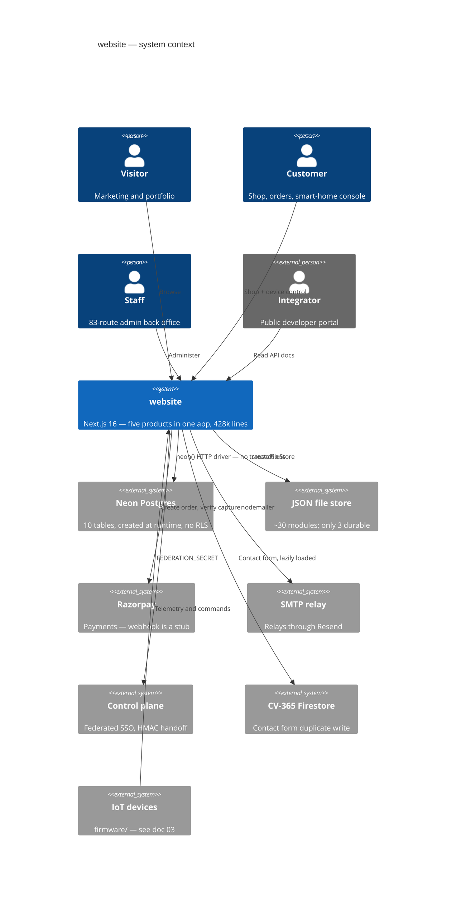

---

## 4. Module map

```
   src/lib — 288 modules

   ADMIN BACK OFFICE      29 files   admin-*.ts — pricing, tax, CRM, fraud,
                                     vendors, SSO provisioning, password policy
   SMART HOME             ~30 files  device auth, cameras, energy budget,
                                     geofencing, recipes, scene scheduler
   INCIDENT MANAGEMENT    14 files   icm*.ts — severity, TTA/TTM state machine,
                                     Teams notify, postmortems.  icm.ts is PURE
   APP INSIGHTS            9 files   a working clone of Azure Monitor's cost,
                                     usage, dependency and query telemetry
   REPORTS                10 files   CSV / PDF / scheduled generation, charts
   COMMERCE               16 files   shop-*, order-core, bundle-pricing,
                                     coupons, delivery-estimate, warranty,
                                     inventory, razorpay
   AUTH & SECURITY        10 files   passkeys, passkey-ceremony, admin-auth,
                                     account, sso, totp, session-expiry, secrets
   TELEMETRY             ~20 files   health probes, synthetic checks, anomaly
                                     monitor, cron health, control-plane,
                                     guardian, tank, fan-speed, predictive
                                     maintenance, traffic, visitor tracking
   MARKETING CONTENT      17 files   PURE constant exports
   INFRASTRUCTURE         18 files   cache, config, csp, client-ip, data-file,
                                     db, logger, rate-limit, validation, fuzzy
   DEVICE LOGIC            8 files   agri, avi, device-history, device-normalize,
                                     camera-audio, camera-relay, drone-mixer,
                                     switchboard
   NOTIFICATIONS           5 files   alerts, email-log, web-push
   SEO / BRAND             5 files   metadata, OG image generation

   PURE modules (arguments in, values out, no I/O):
     icm.ts · session-expiry.ts · delivery-estimate.ts · device-normalize.ts
     validation.ts · fuzzy.ts · all *-data.ts · most seo/brand builders
```

### The twelve largest files

| # | File | Lines |
| --- | --- | ---: |
| 1 | `src/app/smarthome/DeviceControls.tsx` | **4,870** |
| 2 | `src/app/admin/AppInsightsPanel.tsx` | 2,208 |
| 3 | `src/lib/control-plane.ts` | 2,182 |
| 4 | `src/lib/store.ts` | 2,071 |
| 5 | `src/app/admin/IcmPanel.tsx` | 1,823 |
| 6 | `src/app/smarthome/security/VehiclesPanel.tsx` | 1,539 |
| 7 | `src/lib/blog-data.ts` | 1,309 |
| 8 | `src/app/shop/account/page.tsx` | 1,284 |
| 9 | `src/lib/smarthome-command-map.ts` | 1,272 |
| 10 | `src/components/DataVisualization.tsx` | 1,261 |
| 11 | `src/app/smarthome/_kit/primitives.tsx` | 1,244 |
| 12 | `src/app/admin/page.tsx` | 1,225 |

> A single 4,870-line React component is the largest file in the repository. Doc 05.

---

## 5. The 150 API routes

| Group | # | Auth | Purpose |
| --- | ---: | --- | --- |
| **`admin/*`** | **83** | Staff HMAC token + `requireArea` role gate. Plus two exceptions: `admin/external-stats` uses a static `ADMIN_API_KEY`, and `admin/availability/probe` uses `CRON_SECRET` | The whole back office |
| `account/*` | 14 | Customer HMAC token for 9; **none** for the 5 pre-session routes (login, register, verify-otp, forgot/reset-password) | Identity and self-service |
| `smarthome/*` | 10 | ⚠️ Not resolved — matched neither known session helper | Device alerts, cameras, prefs |
| `shop/*` | 5 | None — public catalogue | Bundles, products, questions, quote, reviews |
| `devices/*` | 5 | Customer token for claim/command; firmware/sync unresolved | Claim and command devices |
| `orders/*` | 4 | Customer token; `track` is public by order number | Order lifecycle |
| `payments/*` | 3 | `create-order` **public** (guest checkout) · `webhook` HMAC only · `verify` | Razorpay |
| `ai/*` | 3 | `chat` customer token; `analyze`/`fleet` unresolved | AI chat and fleet analysis |
| `health` · `push` · `telemetry` · `visitors` · `wallet` | 2 each | Mostly public beacons; `wallet` and `push/subscribe` require a token | |
| 13 singletons | 13 | blog, contact, coupons/validate, giftcards/redeem, github, loyalty, newsletter, notify-restock, projects, referral, returns, support, weather | |
| **Total** | **150** | | reconciled exactly |

```
   🟠 SEVEN ROUTES COULD NOT BE RESOLVED to any known authentication
      mechanism by a repository-wide sweep:

        giftcards/redeem   referral        returns
        ai/analyze         ai/fleet
        devices/firmware   devices/sync
        …plus all 10 smarthome/* routes

      That means either an undiscovered check, or a genuine gap.
      `giftcards/redeem` and `returns` are the ones to check first —
      both move money. Doc 05, D-06.
```

---

## 6. Authentication — home-grown, and entirely separate from the suite

```
   ╔══════════════════════════════════════════════════════════════════════╗
   ║  A repository-wide search across src/ for                            ║
   ║      AUTH_JWT_SECRET · JWT_SECRET · jsonwebtoken · jose              ║
   ║  returns ZERO MATCHES.                                               ║
   ║                                                                      ║
   ║  Every other Circuvent application shares one HS256 suite session.   ║
   ║  This one does not participate in it at all.                         ║
   ╚══════════════════════════════════════════════════════════════════════╝
```

```ts
// src/lib/account.ts
function sign(payload: string): string {
  return crypto.createHmac("sha256", secret()).update(payload).digest("hex");
}
export function signToken(email: string, version?: number): string {
  const payload = `${e}|${Date.now().toString(36)}|${ver}`;
  return Buffer.from(`${payload}:${sign(payload)}`).toString("base64");
}
```

| Property | Detail |
| --- | --- |
| Algorithm | HMAC-SHA256 over `email\|issuedAt\|tokenVersion` |
| Customer key | `ACCOUNT_SECRET` |
| Staff key | `ADMIN_SECRET` — *"Staff sessions get their own key so a leaked customer key cannot mint one."* |
| Transport | **Not cookies.** No `Set-Cookie` anywhere in `src/app/api`. Tokens travel in `Authorization: Bearer`, `x-account-token` or `x-admin-token` |
| Storage | Client-side; admin tokens explicitly in `sessionStorage` |
| Revocation | `tokenVersion` — bump it and every prior token dies |
| Lifetime | **24-hour absolute cap** via `session-expiry.ts`, independent of renewal |

### Why `tokenVersion` exists

> **`src/lib/admin-auth.ts`** — *"The old format was `base64(email + ":" + HMAC(email))`… It never expired and could not be revoked, so changing a password left every previously issued token fully valid, **including one a departing employee had already copied.**"*

### Five ways in

| Path | Mechanism |
| --- | --- |
| Password | scrypt + timing-safe compare |
| **Passkey** | `@simplewebauthn/server`, single-use 5-minute challenges, **cloned-authenticator detection via counter regression** |
| Email OTP | 6-digit code via `crypto.randomInt`, sign-up step two |
| Password reset | An **OTP code, not a magic link**, 15-minute TTL |
| SSO federation | `verifyAgainstControlPlane()` adopts a control-plane password when the local account has none |

```ts
/** Which sign-in a credential belongs to. They must never be interchangeable. */
export type PasskeyScope = "admin" | "account";
```

### Authorization — capability areas, not just roles

```ts
export type AdminRole = "superadmin" | "manager" | "inventory" | "orders" | "support";

export type AdminArea =
  | "overview" | "analytics" | "inventory" | "orders" | "returns" | "customers"
  | "coupons" | "support" | "staff" | "settings" | "cms" | "marketing"
  | ... | "icm" | "insights";

const ROLE_AREAS: Record<AdminRole, AdminArea[]> = { superadmin: [...], ... };
```

Admin 2FA is TOTP or email code, gated by a `TOTP_PENDING` sentinel proving the password stage passed first. The QR code is rendered **server-side**, deliberately, *so the secret is never sent to a third-party QR service.*

### The gate does not gate

`src/proxy.ts` (Next 16's rename of `middleware.ts`) handles host mounts, a legacy `/shop?cat=X` → `/shop/c/x` 308 redirect, `X-Request-Id` propagation and the CSP header.

**It performs no authentication whatsoever.** Every route enforces its own. With at least five coexisting credential schemes and seven unresolved routes, that is the structural weakness of this design. Doc 05, D-05.

### Security headers, on the other hand, are complete

```ts
const securityHeaders = [
  { key: "Strict-Transport-Security", value: "max-age=63072000; includeSubDomains; preload" },
  { key: "Content-Security-Policy", value: CSP },
  { key: "X-Content-Type-Options", value: "nosniff" },
  { key: "X-Frame-Options", value: "DENY" },
  { key: "Referrer-Policy", value: "strict-origin-when-cross-origin" },
  { key: "X-DNS-Prefetch-Control", value: "on" },
  { key: "Permissions-Policy", value: "camera=(), microphone=(), geolocation=(self), browsing-topics=()" },
  { key: "Cross-Origin-Opener-Policy", value: "same-origin" },
];
```

Applied both at the edge in `proxy.ts` and globally via `headers()`, so routes the proxy matcher skips are still covered. Non-production deployments additionally get `X-Robots-Tag: noindex, nofollow`.

---

## 7. Commerce — and the webhook that does nothing

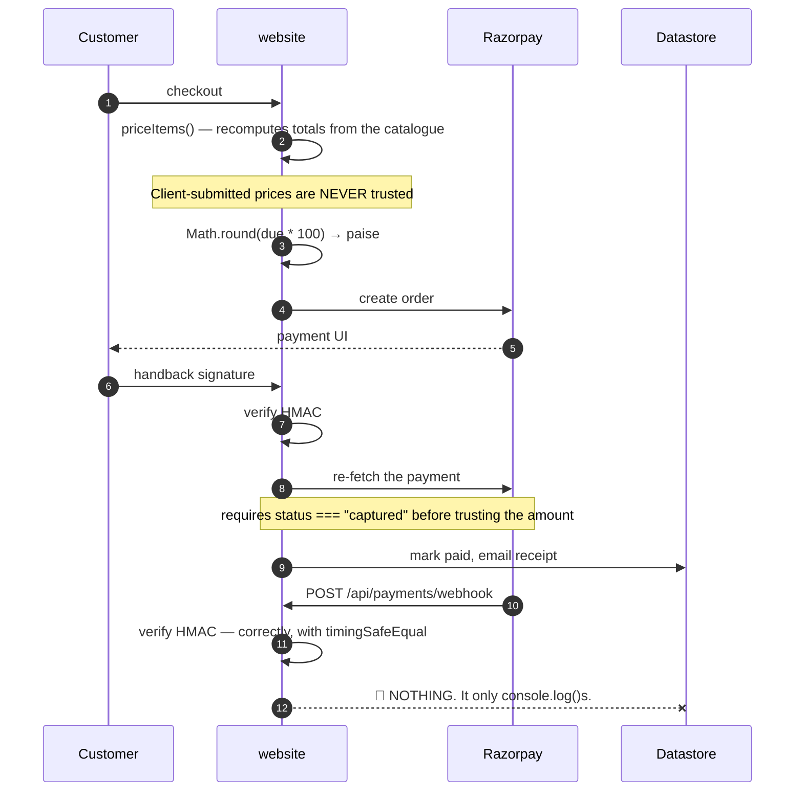

```
   THE WEBHOOK IS A STUB.

     const expected = crypto.createHmac("sha256", secret).update(raw).digest("hex");
     const valid = sigBuf.length === expBuf.length && crypto.timingSafeEqual(sigBuf, expBuf);

   The signature check is correct and constant-time. Then the handler
   logs the event and returns. Its own comment admits it:

     // Reconciliation hook: when a persistent order store exists,
     // mark the order paid/failed here...

   So any payment that completes at the gateway but whose browser never
   returns — a closed tab, a dropped connection, a failed redirect —
   is captured by Razorpay and never reconciled here. Doc 05, D-04.
```

**Money is a hybrid.** The catalogue uses `price: number; // whole INR` — a float in major units. The gateway boundary uses `amountPaise: number` — an integer in minor units, converted once with `Math.round(due * 100)`. No fractional rupee exists in the sample data, so no wrong number is demonstrable today. But nothing in the type system prevents one.

**`delivery-estimate.ts` is a good module.** Pure, no courier API, buckets Indian PIN-code prefixes into metro / remote / no-COD sets, and returns a **range** with explicit "estimate" framing rather than a firm promise.

---

## 8. Notifications and documents

| Dependency | Reality |
| --- | --- |
| `nodemailer` | ✅ Real. SMTP transport for orders, OTPs, password resets, contact. **Awaited inline, not queued** — failures are logged and the request proceeds |
| `resend` | ⚠️ **Declared but its SDK is never imported.** Mail goes out over SMTP, which *relays through* Resend. A direct Resend-API fallback was deliberately removed |
| `web-push` | ✅ Real browser push |
| `pdf-lib` | ✅ Real, server-side admin report generation |
| `qrcode` | ✅ **One import site** — TOTP enrolment, rendered server-side on purpose |

> **`src/app/api/contact/route.ts`** documents why the Resend path went away: *"This route used to call the Resend API directly, from `onboarding@resend.dev` to a hardcoded gmail address… these sends consumed the Resend free allowance without ever appearing in the outbound counts."*

**And every contact submission is written twice.** `ContactForm.tsx` calls `saveContactMessage()` (Firestore, in a separate CV-365 project) **and** `fetch("/api/contact")` (local store + SMTP) on the same submit. Two independent persistence paths for one form. Doc 05, D-12.

---

## 9. The comment convention — the best thing in this repository

Module headers name the exact incident that motivated the module. These are worth reading in full.

> **`src/lib/passkeys.ts`** — *"The update branch used to store whatever case the caller passed, so re-registering an existing credential wrote back `Mixed@Example.COM` and every later lookup — which normalises — stopped finding it. **The passkey still existed, still verified, and belonged to nobody.** It only appeared on the second save of the same credential, which is why it survived the first run of its own test."*

> **`src/lib/sso.ts`** — *"So on dev, a sign-in that missed locally fell through to `api.circuvent.com/auth/login`, the live fleet vouched for a real customer, and `/api/account/login` then created that customer in the dev database with a hash of their real password. **Production users could sign in to dev, and dev quietly accumulated live credentials while doing it.** The isolation guard was pointed at the wrong door."*

> **`next.config.ts`** — *"A dev server and a production build share `.next`, and the dev server keeps rewriting it — which silently deleted `BUILD_ID` twice while auditing, so `next start` served nothing and **the audit reported a clean sweep of an empty site.**"*

> **`scripts/verify-icm-durability.ts`** — *"Incidents were written to a JSON file that the serverless host cannot write… The next request — a cold start, or simply one routed elsewhere — began from an empty seed and rendered an empty queue. **Incidents filed weeks ago were not hidden; they were gone.**"*

> **`src/lib/db.ts`** — the environment guard exists because *"dev.circuvent.com came to serve real customer accounts, orders and wallet balances."*

---

## 10. Design patterns actually in use

| Pattern | Where |
| --- | --- |
| **Pure core / impure shell** | `icm.ts`, `session-expiry.ts`, `delivery-estimate.ts`, `device-normalize.ts` — each with an impure store or transport sibling |
| **Stateless tokens with a version counter** | Revocation without a session table |
| **Capability-gated RBAC** | `AdminArea` + `ROLE_AREAS`, not bare role checks |
| **Fail closed in production, warn in development** | `secrets.ts` — *"A hardcoded fallback therefore fails open"* |
| **Signature, then re-verify** | Payment capture is re-fetched from Razorpay; a forged client signature cannot credit an order |
| **Host allow-lists, not block-lists** | `PROD_DATA_HOSTS`, `PROD_IDENTITY_HOSTS` |
| **Estimate, not promise** | `delivery-estimate.ts` returns a range and says so |
| **Degrade rather than throw** | `createFileStore` — which is also the source of the largest data risk in the system |

---

## 11. Health assessment

```
   Incident documentation    ████████████████████░  9/10  best in the suite
   Security headers          ██████████████████░░░  8/10  complete set
   Passkey implementation    ██████████████████░░░  8/10  scoped, clone-detected
   Payment capture path      ████████████████░░░░░  7/10  re-verified server-side
   Session design            ██████████████░░░░░░░  6/10  versioned, 24 h cap
   ─────────────────────────────────────────────────
   Auth architecture         ████████████░░░░░░░░░  5/10  5 schemes, no central gate
   Money typing              ██████████░░░░░░░░░░░  4/10  float rupees in catalogue
   Payment reconciliation    ██████░░░░░░░░░░░░░░░  3/10  🔴 webhook is a stub
   Schema management         ██████░░░░░░░░░░░░░░░  3/10  🔴 created at boot
   Documentation accuracy    ████░░░░░░░░░░░░░░░░░  2/10  🔴 README off by 10×
   Tenancy / DB access ctrl  ████░░░░░░░░░░░░░░░░░  2/10  🔴 none whatsoever
   Data durability           ██░░░░░░░░░░░░░░░░░░░  1/10  🔴 ~27 modules memory-only
```

**What is genuinely excellent:** the incident-comment convention; a complete security-header set applied twice over; passkeys with scoped credentials and cloned-authenticator detection; server-side TOTP QR rendering; payment capture that re-fetches from the gateway rather than trusting a client signature; a pure, honest delivery estimator; and `verify-icm-durability.ts`, which spawns four real operating-system processes to prove a durability claim rather than mocking it.

**What needs attention:** roughly twenty-seven storage modules that lose all data on a serverless cold start; a payment webhook that verifies its signature and then does nothing; a README describing a tenth of the system; five coexisting credential schemes with no central gate and seven routes whose authentication could not be established; and a database with no migrations, no foreign keys and no access control of any kind.

---

## 12. Where to start reading

```
   1. src/lib/db.ts                       and understand initDb()
   2. src/lib/data-file.ts                then count the `durable: true` callers
   3. scripts/verify-icm-durability.ts    read the header
   4. src/lib/account.ts + admin-auth.ts  the two session schemes
   5. src/lib/passkeys.ts                 read the header
   6. src/lib/sso.ts                      read the header
   7. src/proxy.ts                        note what it does NOT do
   8. src/app/api/payments/webhook        note what it does NOT do
   9. NOT README.md                       it describes a different system
```

---

*Next: **02_DATABASE_AND_DATA_MODELS.md** · **03_INTEGRATIONS_AND_ECOSYSTEM.md** · **04_MAINTENANCE_AND_OPERATIONS.md** · **05_AREAS_OF_ENHANCEMENT.md***


---


<a id="part-2-database-data-models"></a>


# Part 2 · Database & Data Models

> **Audience:** engineers and anyone responsible for not losing customer data.
> **Engine:** Neon Postgres via the **HTTP driver** · no ORM · no migrations · **and a JSON-file store that most features actually use**

---

## 1. The headline: schema is a side effect of the application booting

```
   ╔══════════════════════════════════════════════════════════════════════╗
   ║  THERE ARE ZERO .sql FILES IN THIS ENTIRE REPOSITORY.                ║
   ║                                                                      ║
   ║  There is no ORM. No Drizzle, no Prisma, no Knex.                    ║
   ║  There is no migrations directory.                                   ║
   ║  There is no schema version table.                                   ║
   ║                                                                      ║
   ║  Schema is an array of raw SQL strings in a TypeScript file, run as  ║
   ║  CREATE TABLE IF NOT EXISTS the first time any database function is  ║
   ║  called — which means on effectively every serverless cold start.    ║
   ╚══════════════════════════════════════════════════════════════════════╝
```

```ts
// src/lib/db.ts
const SCHEMA_STATEMENTS: string[] = [
  `CREATE TABLE IF NOT EXISTS accounts (
     email TEXT PRIMARY KEY,
     name TEXT,
     password_hash TEXT,
     ...
];

/** Creates the schema if it does not yet exist (idempotent, runs once). */
export function initDb(): Promise<void> {
  if (_initPromise) return _initPromise;
  _initPromise = (async () => {
    const q = await getQuery();
    for (const stmt of SCHEMA_STATEMENTS) await q(stmt);
  })();
  return _initPromise;
}
```

Every exported `db*` function `await`s `initDb()` before its query. `.env.example` states it plainly: *"The schema is created automatically on first run."*

```
   WHAT THIS COSTS
   ───────────────
   • No record of when or why any column was added
   • No rollback path
   • No way to review a schema change in a pull request as a schema change
   • The connecting role MUST hold DDL rights, forever — see §6
   • A fresh environment gets "whatever SCHEMA_STATEMENTS says today",
     which is not necessarily what production actually has

   WHAT IT BUYS
   ────────────
   • A new environment needs no migration step at all. It just works.

   For a site that began as a marketing page, that trade was reasonable.
   For something now holding orders, wallets and passkeys, it is not.
   Doc 05, D-02.
```

---

## 2. Ten tables

Counted by reading `SCHEMA_STATEMENTS` verbatim — `grep "CREATE TABLE"` returns 10 hits, all in `src/lib/db.ts`. This count is provably complete.

| Table | Notable columns | Key | Indexes |
| --- | --- | --- | --- |
| `accounts` | `email`, `name`, `password_hash`, `password_salt`, `phone`, `blocked`, **`data JSONB`** | PK `email` | `created_at` |
| `admin_users` | `email`, `name`, `role`, `active`, `password_hash`/`salt`, **`data JSONB`** | PK `email` | `role` |
| `pending_registrations` | `email`, `otp`, `expires`, `attempts`, `ref`, **`data JSONB`** | PK `email` | — |
| **`store_kv`** | `collection`, `key` DEFAULT `'_all'`, **`data JSONB`**, `updated_at` | PK `(collection, key)` | — |
| `email_history` | `to`, `from_addr`, `subject`, `type`, `status`, `provider`, `message_id`, `error`, `body_html`, `meta` | PK `id` BIGSERIAL | 4: `created_at DESC`, `type`, `to`, `status` |
| `request_metrics` | `endpoint`, `method`, `status`, `ms REAL`, `region` | PK `id` BIGSERIAL | `ts DESC`, `endpoint` |
| `camera_frames` | `device_id`, **`jpeg_b64`**, `bytes`, `captured_at`, `upload_token`, `token_expires` | PK `device_id` | — |
| `camera_audio` | `device_id`, **`wav_b64`**, `bytes`, `captured_at` | PK `id` BIGSERIAL | `device_id, captured_at DESC` |
| `camera_audio_session` | `device_id`, `listen_token`/`expires`, `speak_token`/`wav_b64`/`expires` | PK `device_id` | — |
| `page_views` | `path`, **`visitor_hash`** (salted, daily-rotating), `referrer_host`, `device`, `browser`, `country` | PK `id` BIGSERIAL | `ts DESC`, `ts+path`, `ts+visitor_hash` |

```
   THREE CONVENTIONS WORTH STATING

   1. Every entity table carries a full-fidelity `data JSONB` column, and
      the file header says it is "the source of truth on read". The typed
      columns exist only for indexing and human inspection.

   2. THERE ARE NO FOREIGN KEYS. Anywhere. Not one.

   3. THERE IS NO TENANT OR ORG COLUMN. Anywhere. See §6.

   ✅ One genuinely good detail: page_views stores a SALTED, DAILY-ROTATING
      visitor_hash rather than an IP address or a persistent identifier.
      That is privacy-conscious analytics, done deliberately.

   ⚠ And two that are not: camera_frames.jpeg_b64 and camera_audio.wav_b64
     store base64 media INSIDE Postgres rows. Doc 05, D-11.
```


---

## 3. `store_kv` — 23 collections in one table, one row each

```
   store_kv is a generic key-value multiplexer, reused for three
   unrelated purposes:

   ┌──────────────────────────────────────────────────────────────────────┐
   │  (a) THE ENTIRE SHOP — 23 collections, via KV_COLLECTIONS            │
   │                                                                      │
   │      orders          products      wallets        devices            │
   │      reviews         addresses     notifyRequests logins             │
   │      coupons         tickets       returns        audit              │
   │      loyalty         referrals     referralCodes  giftCards          │
   │      questions       notifications passwordResets admin2fa           │
   │      alertSettings   contactMessages consumedPayments                │
   │                                                                      │
   │      ⚠ EACH IS **ONE ROW**, with key = '_all'.                       │
   │        Every order in the system lives inside a single JSONB value.  │
   │        Reading one order reads all of them. Writing one order        │
   │        rewrites all of them.                                         │
   │        There is no index into it, and no way to page it.             │
   │        Doc 05, D-03.                                                 │
   ├──────────────────────────────────────────────────────────────────────┤
   │  (b) collection='user_prefs', key = an arbitrary user id             │
   ├──────────────────────────────────────────────────────────────────────┤
   │  (c) collection='file_store', key = an arbitrary filename            │
   │      — this is where the JSON modules opt into Postgres. See §5.     │
   └──────────────────────────────────────────────────────────────────────┘
```

Because any module can call `dbWriteFileStore("<anything>.json", …)` with a name chosen at runtime, **the logical contents of `store_kv` cannot be enumerated statically.** The ten physical tables are knowable; what is inside them is not.

---

## 4. The client — HTTP driver, so no transactions

```ts
async function getQuery(): Promise<QueryFn> {
  if (_query) return _query;
  const url = process.env.DATABASE_URL;
  if (!url) throw new Error("DATABASE_URL is not set");
  assertNotProductionData(url);
  const { neon } = await import("@neondatabase/serverless");
  const client = neon(url);
  _query = (text, params = []) =>
    client.query(text, params) as Promise<Record<string, unknown>[]>;
  return _query;
}
```

| Aspect | Finding |
| --- | --- |
| Driver | **`neon()` HTTP only.** No `Pool`, no `Client`, no `neonConfig.webSocketConstructor` anywhere |
| Pooling | None — and none is needed; the HTTP driver is stateless per call |
| Memoization | ✅ Module-scope `let _query`, built once per lambda instance |
| Test seam | ✅ `__setQueryForTests` swaps in PGlite |
| **Transactions** | 🔴 **None exist, and none are possible.** Zero `BEGIN`/`COMMIT`/`ROLLBACK` in the codebase. The HTTP driver cannot hold one open |

The workaround is real and reasonable — single-statement atomic SQL with a JSONB merge:

```sql
INSERT INTO store_kv (collection, key, data)
VALUES ($1, $2, jsonb_build_object($3::text, $4::jsonb))
ON CONFLICT (collection, key)
DO UPDATE SET data = store_kv.data || jsonb_build_object($3::text, $4::jsonb), ...
```

That is correct for the cases it covers. It is also a structural ceiling: nothing here can ever be made atomic across two tables without changing driver. Doc 05, D-10.

---

## 5. The finding that matters most: most data has no database behind it

```
   ╔══════════════════════════════════════════════════════════════════════╗
   ║  src/lib/data-file.ts — createFileStore(), header comment:           ║
   ║                                                                      ║
   ║   "an in-memory working copy is the source of truth for the life of  ║
   ║    the process, and every mutation is best-effort written through    ║
   ║    to a JSON file under DATA_DIR. On read-only filesystems           ║
   ║    (serverless production without a database) writes silently stop   ║
   ║    and the module degrades to in-memory-only for that instance,      ║
   ║    instead of throwing and breaking the request."                    ║
   ║                                                                      ║
   ║  ROUGHLY 30 MODULES ARE BUILT ON THIS.                               ║
   ║  EXACTLY THREE OPT INTO THE POSTGRES MIRROR ({ durable: true }):     ║
   ║                                                                      ║
   ║      icm-store.ts  ·  admin-warranty.ts  ·  api-failures.ts          ║
   ║                                                                      ║
   ║  THE OTHER ~27 ARE MEMORY-ONLY IN PRODUCTION.                        ║
   ║                                                                      ║
   ║  On Vercel's read-only filesystem the write silently fails, the      ║
   ║  catch block swallows it, and the data lives in one lambda           ║
   ║  instance's memory until that instance recycles. Then it is gone.    ║
   ║  Not corrupted. Not stale. Gone.                                     ║
   ╚══════════════════════════════════════════════════════════════════════╝
```

### What is in the non-durable ~27

```
   admin-cms          admin-crm           admin-currency      admin-flags
   admin-jobs         admin-macros        admin-marketing     admin-report-builder
   admin-seo          admin-staff-activity admin-subscriptions admin-surveys
   admin-tax          admin-bulk          admin-affiliates    admin-bundles
   admin-telemetry  ← 570 KB on disk
   console-dev-portal ← developer portal tokens
   passkeys         ← 🔴 WebAuthn credentials
   smarthome-admin-config
   smarthome-user-prefs
   …and more

   CMS content. CRM records. Pricing and currency. Tax configuration.
   Feature flags. Marketing. Staff activity. Developer tokens. Passkeys.

   None of it survives a cold start in production.
```

`.data/` at the repository root (29 files) is simply what this same code path writes when the disk *is* writable — locally. It is **not tracked by git**, and is doubly ignored:

```
# local dev data fallback (email evidence log, file store)
/.data/
# Shop runtime data (orders/products/wallets)
.data/
```

| Source module | Files it writes |
| --- | --- |
| `src/lib/store.ts` | `shop-db.json`, `inventory-db.json` |
| `src/lib/data-file.ts` | ~20 `admin-*.json`, `console-dev-portal.json`, `passkeys.json`, `smarthome-*.json` |
| `src/lib/email-log.ts` | `email-history.jsonl` — the append-only fallback for `email_history` |

---

## 6. Access control at the data layer: there is none

```
   NO tenant or organisation column on any table.
   NO per-query scoping predicate.
   NO Postgres row-level security — a repository-wide search for
      ROW LEVEL SECURITY · CREATE POLICY · GRANT · REVOKE
      returns ZERO matches across src/ and scripts/.
   NO foreign keys.

   And because initDb() runs CREATE TABLE and CREATE INDEX on every cold
   start, the configured role MUST hold DDL rights. It cannot be a
   narrowly-scoped runtime role. There is no separate migration-time
   credential.
```

### The only isolation that exists is a string comparison

```
   assertNotProductionData(url)  — src/lib/db.ts

   Refuses to run against a host listed in PROD_DATA_HOSTS when
   VERCEL_ENV is not production. A parallel PROD_IDENTITY_HOSTS guard
   does the same for the federated-login control plane.

   ⭐ AND THE CODE DOCUMENTS THE INCIDENT THAT CREATED IT:

      "dev.circuvent.com came to serve real customer accounts, orders
       and wallet balances."

   🔴 BUT BOTH GUARDS ARE OPT-IN AND SHIP EMPTY in .env.example.
      A new deployment that does not set them has no protection at all
      against exactly the incident that motivated them. Doc 05, D-07.
```

### It is not the suite database

Nothing in `db.ts` schema-qualifies any table — no `hrms.`, no `identity.`. Every table is created unqualified in `public`. Cross-application identity is handled **out of band**, over HTTPS, via `CONTROL_PLANE_URL` + `FEDERATION_SECRET`.

> Whether `DATABASE_URL` happens to point at the same Neon *project* as HRMS cannot be determined from committed code. But the code treats these tables as its own private, unshared, unscoped set. **From an architectural standpoint this is a separate database.**

---

## 7. Firebase — live, but narrow

```
   firebase@12.11.0 is a real dependency, not a dead remnant.

   EXACTLY ONE module imports it:  src/lib/cv365-firebase.ts
   EXACTLY ONE caller:             src/components/ContactForm.tsx
```

```ts
// CV-365 Firestore contact bridge — Firebase is imported lazily (dynamic
// import inside the submit path) so the heavy SDK is NOT in the initial page
// bundle; it only loads when a visitor actually submits the contact form.
const [{ initializeApp, getApps, getApp }, { getFirestore, collection, addDoc, Timestamp }] =
  await Promise.all([import("firebase/app"), import("firebase/firestore")]);
return addDoc(collection(db, "contactMessages"), { ...data, status: "new", createdAt: Timestamp.now() });
```

It writes contact-form submissions into a **separate Firebase project** so that `work.circuvent.com/admin/messages` can see them. It is entirely decoupled from Postgres. The 18 other files matching "firebase" are marketing pages listing a tech stack.

**There is no `firestore.rules` or `database.rules.json` in this repository.** So the permissiveness of that project's rules cannot be assessed here — a sibling application in this suite shipped a rules file granting root read/write to any signed-in user, and this one lives in a repository nobody in this audit can see. Doc 05, D-13.

---

## 8. PGlite — a real Postgres, in-process

`@electric-sql/pglite` is a dev dependency used in three places:

| Use | What it does |
| --- | --- |
| `scripts/test-db.ts` | Runs the real DDL and query logic against a fresh in-memory `new PGlite()` |
| `scripts/icm-instance.ts` | An **on-disk** PGlite shared across separate OS processes — see §9 |
| `src/lib/user-prefs.test.ts` | Unit tests for the KV merge logic |

It proves `SCHEMA_STATEMENTS` is valid, executable Postgres DDL and that the query logic is correct. **It proves nothing about the live database** — not its actual state, not its permissions, not its extensions.

---

## 9. `verify-icm-durability.ts` — the best script in the repository

```
   "ICM" is the internal incident queue.

   FROM THE FILE'S OWN HEADER:

     "The bug was never in the UI. Incidents were written to a JSON file
      that the serverless host cannot write, so `createFileStore` caught
      the failure and kept them in one lambda instance's memory. The next
      request — a cold start, or simply one routed elsewhere — began from
      an empty seed and rendered an empty queue.

      Incidents filed weeks ago were not hidden; they were gone."
```

**What makes it exceptional:** it does not mock the failure. It spawns **four separate operating-system processes**, sharing no module cache and no memory, each acting as a distinct cold lambda, against one on-disk PGlite instance.

It was **executed during this audit** and passed:

```
   instance A files an incident…
     ✓ a cold instance starts with an empty queue — this was the bug
     ✓ the store reports itself durable
     ✓ filed as INC-0001

   instance B — a different process — files another…
     ✓ it too starts empty, sharing no memory with A
     ✓ after loading, it sees its own and A's incident
     ✓ A's incident survived the process that filed it
     ✓ the id counter continued at INC-0002 rather than restarting

   instance C acknowledges A's incident…
     ✓ a later process can act on an incident it did not file

   instance D reads the queue afresh…
     ✓ both incidents are still there
     ✓ the acknowledgement survived
     ✓ and so did who took ownership

   ALL PASSED
```

> **And here is the uncomfortable part.** This script proves durability for **one** of the roughly thirty modules built on `createFileStore`. The bug it was written to catch is still live in the other twenty-seven, and nothing checks them.

---

## 10. Secrets

`src/lib/secrets.ts` handles session-signing secrets only.

```ts
export function lazySecret(names: string[], label: string): () => string {
  let cached: string | undefined;
  return () => (cached ??= requireSecret(names, label));
}
```

| Behaviour | Detail |
| --- | --- |
| Minimum length | **32 characters**, enforced in production |
| Hardcoded fallback | ✅ **None** — *"A hardcoded fallback therefore fails open… Production now refuses to start without a real secret"* |
| Lazy loading | ✅ Deliberate, so `next build` does not fail at import time |
| Development | A **per-process ephemeral random secret** from `randomBytes(48)`, cached in memory, never persisted, warned about once |
| Admin bootstrap | `seedAdminPassword()` generates a random one-time password if `ADMIN_DEFAULT_PASSWORD` is unset, and prints it once |
| Encryption at rest | ❌ None — everything is read straight from `process.env` |
| Rotation | ❌ No mechanism. Rotating a secret simply invalidates every session |

### `scripts/secret-inventory.mjs` — a genuinely good idea

It records the **path, presence, git-tracked status and SHA-256** of each credential-bearing file — for drift detection — and never the contents:

> *"An inventory that contains the secrets is just another copy of the secrets… which is the thing this whole exercise exists to avoid."*

### Environment variables the data layer needs

| Variable | Purpose |
| --- | --- |
| `DATABASE_URL` | Neon connection. **Absence silently activates the file/memory fallback** |
| `PROD_DATA_HOSTS` | Non-production guard against a production database host |
| `PROD_IDENTITY_HOSTS` | The same for the control plane |
| `CONTROL_PLANE_URL`, `FEDERATION_SECRET` | Federated SSO handoff |
| `DATA_DIR` | Overrides the `.data` location |
| `ACCOUNT_SECRET`, `ADMIN_SECRET` | Session-token signing |
| `ADMIN_DEFAULT_EMAIL`, `ADMIN_DEFAULT_PASSWORD` | Super-admin bootstrap |
| `NEXT_PUBLIC_CV365_FIREBASE_*` (5) | The separate Firestore project |

---

## 11. Data-layer risk register

| # | Finding | Sev |
| --- | --- | :-: |
| 1 | **~27 of ~30 storage modules have no database backing.** CMS, CRM, pricing, tax, feature flags, marketing, staff activity, 570 KB of telemetry, developer-portal tokens and **passkeys** are memory-only in production and vanish on every instance recycle — silently, by design of the degrade-to-memory catch block | 🔴 |
| 2 | **Schema is not versioned or reproducible.** It exists only as an array executed at boot. No history, no rollback, no review surface | 🔴 |
| 3 | **Every shop collection is a single JSONB row.** Reading one order reads all of them; writing one rewrites all of them. No index, no paging | 🔴 |
| 4 | **No RLS, no tenant column, no foreign keys, no database-level access control of any kind** | 🔴 |
| 5 | **The two environment guards ship empty**, and the code documents the incident they exist to prevent — *"dev.circuvent.com came to serve real customer accounts, orders and wallet balances"* | 🟠 |
| 6 | **The database role must hold DDL rights permanently**, because `initDb()` runs `CREATE TABLE` on every cold start | 🟠 |
| 7 | **Transactions are structurally impossible** with the HTTP driver | 🟠 |
| 8 | **No backup or restore story anywhere.** `export-business-data.ts` exports marketing catalogue content, not customer data. Durability rests entirely on Neon's own backups, which this repository neither configures nor verifies | 🟠 |
| 9 | **`.data/*.json` holds unencrypted PII on local disk** — customer emails, order records, tax and warranty data, staff activity | 🟡 |
| 10 | **Base64 media in Postgres rows** — `camera_frames.jpeg_b64` and `camera_audio.wav_b64` | 🟡 |
| 11 | **The Firebase satellite is unauditable from here** — a second datastore, with its rules in a repository this audit cannot see | 🟡 |
| 12 | **No key rotation** for `ACCOUNT_SECRET` or `ADMIN_SECRET`; rotating either logs everyone out | 🟡 |

---

*Next: **03_INTEGRATIONS_AND_ECOSYSTEM.md** · Back to **01_SYSTEM_OVERVIEW.md***


---


<a id="part-3-integrations-ecosystem"></a>


# Part 3 · Integrations & Ecosystem

> **Audience:** anyone who needs to know what this repository actually talks to.
> **The short version:** this is not a website. It is a company — a retail IoT hardware line, a self-hosted MQTT cloud on a real virtual machine, a shipped mobile app, a drone, and a separate internal HR and payroll SaaS.

---

## 1. What is actually in the repository

```
   ╔══════════════════════════════════════════════════════════════════════╗
   ║  SIX SUB-PROJECTS SIT ALONGSIDE THE NEXT.JS APP                      ║
   ╠═══════════════════════╤══════════╤═══════════════════════════════════╣
   ║  Directory            │ Files on │ What it actually is               ║
   ║                       │   disk   │                                   ║
   ╠═══════════════════════╪══════════╪═══════════════════════════════════╣
   ║  firmware/            │  13,003  │ ESP32/ESP8266 firmware for a      ║
   ║                       │          │ 17-product retail hardware line   ║
   ║                       │          │ ⚠ ONLY 84 FILES ARE FIRST-PARTY   ║
   ║                       │          │   99.35% is PlatformIO build      ║
   ║                       │          │   cache, gitignored               ║
   ╟───────────────────────┼──────────┼───────────────────────────────────╢
   ║  mobile/              │   1,280  │ Expo React Native — SHIPPED on    ║
   ║                       │          │ the Play Store, v1.13.1           ║
   ╟───────────────────────┼──────────┼───────────────────────────────────╢
   ║  circuvent-platform/  │   1,202  │ A COMPLETELY DIFFERENT PRODUCT:   ║
   ║                       │          │ an internal Turborepo SaaS for    ║
   ║                       │          │ project tracking, HR, payroll     ║
   ║                       │          │ and a client portal               ║
   ╟───────────────────────┼──────────┼───────────────────────────────────╢
   ║  native/              │     999  │ Kotlin + Swift parity prototype.  ║
   ║                       │          │ The iOS half has NEVER COMPILED.  ║
   ╟───────────────────────┼──────────┼───────────────────────────────────╢
   ║  hardware/            │     771  │ Real KiCad PCBs, Gerbers, BOMs    ║
   ║                       │          │ and enclosures for 17 products    ║
   ╟───────────────────────┼──────────┼───────────────────────────────────╢
   ║  platform/            │     317  │ The self-hosted IoT control plane:║
   ║                       │          │ Mosquitto + Node/TS + Postgres +  ║
   ║                       │          │ Caddy, on ONE Oracle free-tier VM ║
   ╚═══════════════════════╧══════════╧═══════════════════════════════════╝
```

> ⚠️ **A file count is a lie here.** `firmware/` looks like the biggest thing in the repository at 13,003 files. `git ls-files firmware` returns **84**. The rest is regenerated PlatformIO output, correctly gitignored: *"# PlatformIO build output — regenerated on build, never commit."* Anyone sizing this project by file count overstates the firmware by roughly 150×.

---

## 2. The ecosystem map

```
   ┌───────────────────────────────────────────────────────────────────┐
   │            17-SKU RETAIL HARDWARE LINE (ESP32 / ESP8266)          │
   │   hub · plug · switch · light · fan · lock · curtain · motion     │
   │   energy monitor · camera · facedoor · rfid-gate · sentinel       │
   │   touchboard · watertank · guardian · agri-starter                │
   │   + an RC car (ESP-NOW) + a drone (MAVLink)                       │
   └────┬──────────┬──────────┬──────────────┬──────────────┬──────────┘
        │ Wi-Fi    │ GSM      │ LoRa 433MHz  │ ESP-NOW      │ MAVLink
        │ MQTT/TLS │ SIM800L  │ point-to-    │ 2.4 GHz      │
        │ :8883    │          │ point        │ 50 Hz        │
        ▼          ▼          ▼              ▼              ▼
   ╔══════════════════════════════════════════════════════════════════╗
   ║   platform/  —  THE CONTROL PLANE                                ║
   ║   ONE Oracle Cloud free-tier VM · 140.245.238.154                ║
   ║   api.circuvent.com  ·  mqtt.circuvent.com                       ║
   ║                                                                  ║
   ║   Mosquitto (own broker, own CA)  ·  Express/TS  ·  Postgres     ║
   ║   Caddy reverse proxy  ·  a face-embedding microservice          ║
   ║   + an Alexa smart-home Lambda                                   ║
   ╚═══════╤═══════════════════════╤══════════════════════╤═══════════╝
           │ wss + REST            │ FEDERATION_SECRET    │
           ▼                       ▼                      ▼
   ┌───────────────┐    ┌──────────────────────┐   ┌────────────────┐
   │  mobile/      │    │  website  src/       │   │  native/       │
   │  Expo, SHIPPED│    │  /smarthome console  │   │  prototype     │
   │  com.circuvent│    │  60+ sections        │   │  .nativeclient │
   │  .app v1.13.1 │    │                      │   │  v0.1.0        │
   └───────────────┘    └──────────────────────┘   └────────────────┘

   ┌───────────────────────────────────────────────────────────────────┐
   │  circuvent-platform/  — UNRELATED. Internal staff SaaS.           │
   │  Turborepo · 7 microservices · Prisma · its own Next.js on :3005  │
   │  project-tracker · hr-payroll · financial-ledger · client-portal  │
   │  ats-engine · ai-orchestrator · iot-registry (asset tracking)     │
   │  ⚠ Its README publishes working seed logins.                      │
   └───────────────────────────────────────────────────────────────────┘
```

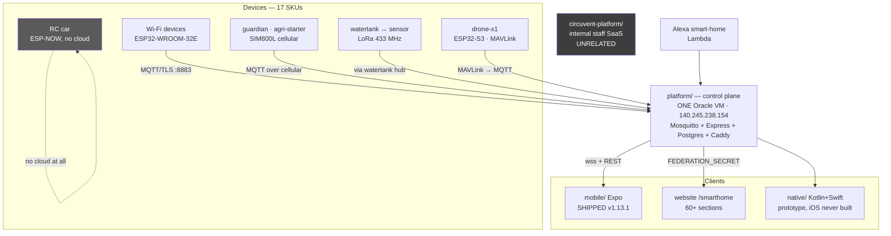

---

## 3. `platform/` vs `circuvent-platform/` — a naming trap

**These are two entirely different products.** Neither supersedes the other. Someone skimming directory names would get this badly wrong.

| | `platform/` | `circuvent-platform/` |
| --- | --- | --- |
| **Is** | The **device-facing IoT control plane** | An **internal staff SaaS** |
| README title | *"Circuvent Control Plane — self-hosted IoT platform"* | *"Circuvent Technologies — Internal Management Platform"* |
| Users | ESP32 devices, the mobile app, the website's `/smarthome` pages | Circuvent employees |
| Structure | One Node/TS Express service + Mosquitto + Caddy + a face service, plain Docker Compose | Turborepo + pnpm, **7 microservices** + a gateway + its own Next.js 14 dashboard |
| Database | Postgres, hand-rolled `pool.query` | Postgres via **Prisma**, shared `packages/database` |
| Ports | 80/443 (Caddy), **8883** (MQTT/TLS) | 3000 gateway, 3001–3008 services, 3005 web |
| Secrets in `.env.example` | Real annotated device/broker secrets, with incident post-mortems in the comments | 🔴 **Literal placeholders** — `JWT_SECRET=your-super-secret-jwt-key-change-in-production` |
| Seed credentials | None | 🔴 **Published in the README**: `admin@circuvent.com / admin@123`, `engineer@123`, `client@123` — for an application that handles **HR, payroll and a financial ledger** |

> The only thing they share is the word "IoT": `circuvent-platform/apps/services/iot-registry` is an **internal asset and firmware-version tracker for engineering and R&D bookkeeping**, not a broker. Doc 05, D-08.

---

## 4. The device protocol

```
   TRANSPORT   MQTT over TLS, port 8883, self-hosted Mosquitto
               mqtts://mqtt.circuvent.com:8883

   "Everything is JSON over MQTT on our own broker."
   "no third-party IoT cloud."

   ENCRYPTION  ✅ TLS with Circuvent's OWN EMBEDDED CA
               (CIRCUVENT_DEFAULT_CA in CircuventDevice.h)
               The README notes what was removed to get here:
               "setInsecure() no longer used for MQTT"

   TOPICS      cv/<id>/cmd        commands in
               cv/<id>/state      current state out
               cv/<id>/telemetry  measurements
               cv/<id>/frame      camera stills
               cv/<id>/anpr       plate reads
               cv/<id>/track      drone position (16-byte header
                                  + 40-byte fixed records)
               cv/<id>/status     online/offline

   LIVE APP    wss://api.circuvent.com/ws?token=<JWT>   — a separate hop
```

```json
// state — AquaGuard tank controller
{ "level": 72, "pump": true, "mode": "auto",
  "startPct": 30, "stopPct": 90, "dryRun": false }

// cmd
{ "action": "set", "ch": 2, "on": true }
```

### Device authentication

```
   ✅ WHAT IT IS
      A per-device secret. username = deviceId, password = key.
      Minted by POST /devices/provision.
      Stored BCRYPT-HASHED. The registry doc is emphatic:

        "A device key cannot be looked up. Not by support, not by
         engineering, not by an administrator. devices.key_hash is
         bcrypt. There is no plaintext anywhere in the system."

      Broker ACLs restrict each device to its own namespace: cv/<deviceId>/#

   ⚠ WHAT IT IS NOT
      Not mutual TLS. Not an X.509 client certificate. There is no
      hardware-backed secret storage on an ESP32. A leaked device key
      is enough to impersonate that device — though only within its
      own topic namespace, which meaningfully limits blast radius.

   ⚠ AND PROVISIONING IS STILL SEMI-MANUAL
      The API mints the credential; granting broker access is a
      separate operator step (scripts/add-device.sh, mosquitto_passwd).
      The firmware README flags it:
        "Future: delegate broker auth to Postgres (mosquitto-go-auth)
         so provisioning alone grants broker access without add-device.sh."
```

**Wi-Fi handoff during setup is separately encrypted** with NaCl sealed boxes (`crypto_box_keypair` / `crypto_box_open`, via the vendored `tweetnacl.c`) — so the household Wi-Fi password never crosses the captive portal in the clear. That is a genuinely good detail.

---

## 5. Over-the-air updates — the most serious finding in this document

```
   ╔══════════════════════════════════════════════════════════════════════╗
   ║  THERE IS NO FIRMWARE IMAGE SIGNATURE VERIFICATION.                  ║
   ╠══════════════════════════════════════════════════════════════════════╣
   ║                                                                      ║
   ║  Both OTA paths call httpUpdate.update(otaClient, binUrl) over a     ║
   ║  certificate-PINNED TLS connection. That authenticates the SERVER.   ║
   ║  It does not authenticate the FIRMWARE.                              ║
   ║                                                                      ║
   ║  Searched for and NOT found anywhere in CircuventDevice.h:           ║
   ║    • Ed25519 or RSA signature verification                           ║
   ║    • a hash manifest checked against an on-device public key         ║
   ║    • ESP32 Secure Boot or signed-partition configuration in any      ║
   ║      of the 29 platformio.ini files                                  ║
   ║                                                                      ║
   ║  "Signed OTA" in the documentation means "downloaded over a pinned   ║
   ║  HTTPS connection." That is a materially weaker guarantee.           ║
   ║                                                                      ║
   ║  And the code itself already articulates the stakes, in the comment  ║
   ║  explaining why setInsecure() was removed:                           ║
   ║                                                                      ║
   ║    "It used to use setInsecure(), which disables certificate         ║
   ║     validation entirely — anyone able to intercept that connection   ║
   ║     ... could serve arbitrary firmware and take permanent control    ║
   ║     of a board that switches MAINS RELAYS AND DOOR LOCKS."           ║
   ║                                                                      ║
   ║  The transport hole was closed. The integrity hole was not.          ║
   ╚══════════════════════════════════════════════════════════════════════╝
```

**And the checklist is honest about it.** `hardware/CHECKLIST.md` marks both of these unchecked:

- `[ ]` *"OTA manifest endpoint (`/api/devices/firmware`) serving signed builds"*
- `[ ]` *"Field OTA rollout + rollback plan; key rotation policy"*

**Confirmed server-side:** `platform/api/src/routes/` contains no `firmware.ts` or `ota.ts`. So the device's periodic pull-OTA check polls an endpoint **that does not exist**. Pull-OTA is dead code today. Push-OTA works, and trusts whatever URL an administrator supplies.

> A shared-library fix worth noting: OTA is handled generically in `CircuventDevice.h` **after a bug in which all twenty product sketches individually forgot to implement it.** That is the right correction — move it to the one place, not twenty.

---

## 6. Mobile — and a collision deliberately avoided

| | `mobile/` | `native/android` | `native/ios` |
| --- | --- | --- | --- |
| Stack | Expo ~53 · RN 0.79.6 · React 19 | Kotlin + Jetpack Compose | Swift + SwiftUI via XcodeGen |
| App id | **`com.circuvent.app`** | `com.circuvent.app.nativeclient` | `com.circuvent.app.nativeclient` |
| Version | **1.13.1**, build 24 | 0.1.0, versionCode 1 | 0.1.0 |
| Shipped? | ✅ **Yes — on the Play Store** | ❌ Debug side-load only | ❌ **Never compiled, once** |
| Evidence | `mobile/dist/` holds real signed artifacts spanning **1.1.0 → 1.12.0+**, `play-upload-key.json`, `PLAYSTORE.md` | Gradle assembleDebug works | *"There is no Mac in this pipeline."* |

```
   ⭐ THE GOOD DECISION

   A sibling repository in this suite shipped TWO mobile implementations
   under ONE app id, which is a real hazard. This repository used a
   DIFFERENT app id on purpose, and said why:

     "That is deliberate twice over: the first thing anybody needs while
      replacing an app is to run both on one phone and compare them, and
      it removes any chance of a debug build replacing somebody's
      provisioned installation."

   And native/README.md is candid rather than aspirational:
     "mobile/ is what is on the Play Store and it has not been modified."
     "The Swift is not compiled by anything."
```

---

## 7. The same rule, written four times

```
   THE RULE: a per-device "capability table" — which fields a device
   type reports, which command keys control it, and critically which
   device types must expose NO toggle at all (a camera's only switch is
   `streaming`; a drone's is flight permission).

   IMPLEMENTED INDEPENDENTLY IN FOUR PLACES:

     TypeScript (Expo, shipping)  mobile/src/store.tsx  capabilitiesFor()
     Kotlin                       native/android/.../core/Capabilities.kt
     Swift                        native/ios/Circuvent/Core/Capabilities.swift
     TypeScript (web console)     src/ — referenced by name in native/README

   AND native/README.md NAMES THE FAILURE, TWICE OVER:

     "A Home Hub reports `power2` and is commanded with {ch: 1, on: true}
      ... Send the state key to a device that wanted the command key and
      nothing errors...
      THAT BUG HAS ALREADY SHIPPED TWICE — once on the web and once in
      the Expo app."

   The only guard is tests/native-client-parity.test.ts, which diffs the
   Kotlin, Swift and Expo tables at test time.

   Drift is CAUGHT BY AN ASSERTION, not PREVENTED BY A SHARED SCHEMA.
   Doc 05, D-07.
```

A second, lower-severity instance: the device serial-number and QR format is defined server-side in `platform/api/src/serial.ts` and re-implemented for parsing in `mobile/src/qr.ts`.

---

## 8. The hardware

```
   17 SKUs, sold on circuvent.com, Amazon.in and Flipkart

   Home Automation Hub · AquaGuard tank controller · Smart Plug ·
   Smart Switch · Smart Light · Smart Fan · Smart Lock · Curtain
   controller · Motion Sensor · Energy Monitor · Guardian (wearable SOS) ·
   Agri Pump Starter · Touch Switchboard · FaceDoor · RFID Gate ·
   Sentinel (gas/climate) · Load Controller

   MCU: ESP32-WROOM-32E for most; ESP32-S3-WROOM-1 for the drone

   hardware/ IS REAL FIRST-PARTY DESIGN SOURCE — not datasheets.
   Every product except the drone has:
     pcb/  .kicad_pcb · .kicad_pro · .kicad_dru · BOM.csv ·
           SCHEMATIC.md · gerbers/
     enclosure/ · listings/ · DATASHEET.md · MANUAL.md

   Generated, not hand-drawn: gen-hardware.js (Node) + gen-pcb.py
   (Python) build real boards and Gerbers for all 17 devices from
   SCHEMATIC.md + BOM.csv. CHECKLIST.md flags this itself:
     "the netlist is derived by the generator... not captured from a
      drawn schematic"

   ⚠ NOT MANUFACTURED. CHECKLIST.md's own legend marks BIS/WPC/CE
     certification, tooling, photography and seller accounts as
     "requires an external vendor, lab, physical process, or account."

   ⚠ 97 unconnected nets remain across the 17 boards (47 blocked on
     mains-isolation clearance), and the ESP32 antenna keepout was
     reduced from Espressif's recommended 48×21 mm to 7 mm.
     DRC-clean is not the same as safe to fabricate for mains products.
```

### The drone is the least mature thing here

```
   feat/drone-x1 · feature/drone-link · fix/drone-stale-control-plane
   — three long-lived branches for one physical product.

   TWO COMPETING FIRMWARE ARCHITECTURES CO-EXIST:

     firmware/drone-fc     an IN-HOUSE flight-controller stack —
                           motor mixer, arm/disarm, IMU loop.
                           The datasheet warns: "This airframe carries
                           a new flight stack."

     firmware/drone-link   a COMPANION COMPUTER that explicitly refuses
                           to be a flight controller:
                             "It sits on the airframe next to a real
                              flight controller — ArduPilot or PX4...
                              WHY THE CLOUD IS NEVER IN THE CONTROL
                              LOOP... There is deliberately no 'nudge
                              forward while I hold this button'."
                           Bridges MAVLink → MQTT with whole-intent
                           commands only: takeoff, goto, RTL, land.

   The second design is excellent and its reasoning is right.
   The first contradicts it.

   ⚠ AND drone-x1 IS THE ONE PRODUCT WITH NO pcb/ DIRECTORY.
     A DATASHEET only. Spinning propellers, no certification, no PCB
     source, and a documented warning not to fit props before reading
     the commissioning ladder. Doc 05, D-09.
```

---

## 9. Build and release reality

| Sub-project | Build | Automated? | Evidence it has run |
| --- | --- | :-: | --- |
| `firmware/` | PlatformIO per device | ❌ `CHECKLIST.md`: `[ ]` *"Build in CI (arduino-cli) + signed release binaries hosted for OTA"* | ✅ Every device has a populated `.pio/build` with compiled `.elf`/`.bin` — built locally at least once |
| `platform/` | `tsc` → `dist/`, Docker Compose | ❌ none found | ✅ `dist/` has 129 compiled files; deployed to a real VM with an SSH runbook |
| `circuvent-platform/` | Turborepo, pnpm, Prisma | ❌ none found | 🟡 A real 196 KB `pnpm-lock.yaml` and installed modules — run locally, no deployment evidence |
| **`mobile/`** | **EAS Build** — production profile, App Bundle, `autoIncrement: true` | 🟡 Managed cloud CI, invoked manually | ✅ **The strongest release evidence in the repository** — signed artifacts across many versions |
| `native/android` | Gradle | ❌ | 🟡 Debug only, no release signing |
| `native/ios` | XcodeGen | ❌ | ❌ **Never built** |
| `hardware/` | Generators, not a software build | ❌ | ✅ Generated Gerbers and BOMs on disk; `CHECKLIST.md` tracks DRC pass/fail per board |

---

## 10. Signing keys and a documented loss

```
   Creds/  — at the repository root, gitignored wholesale (verified:
             `git ls-files -- Creds` returns nothing, and .gitignore:110
             carries the rule with an explanation:
               "A keystore or an SSH key committed once is in every
                clone and every fork forever.")

     circuvent-cp.key              SSH key for the control-plane VM
     circuvent-upload.jks          Play upload keystore
     circuvent-upload-2026.jks     a second one
     circuvent-upload.keystore     a third
     upload-keystore.properties    passwords, IN PLAINTEXT
     README.md                     VM and key runbook

   Mirrored again under mobile/credentials/, whose .gitignore says:
     "# Signing keystores — NEVER commit"

   🔴 upload-keystore.properties DOCUMENTS A REAL LOSS:

     "This file was overwritten on 2026-08-03 and that is how the
      password for circuvent-upload.jks was lost... do not delete
      [the .bak] until the original key is either recovered or
      permanently retired"

     Three keystore variants plus a .bak now coexist. Losing a Play
     upload key is recoverable; losing an app-signing key is not.
     Doc 05, D-06.
```

---

## 11. Integration risk register

| # | Risk | Sev |
| --- | --- | :-: |
| 1 | **No firmware signature verification.** OTA authenticates the transport, never the image. On devices that switch mains relays and door locks — a risk the code's own comments already articulate | 🔴 |
| 2 | **Pull-OTA polls an endpoint that does not exist.** `/api/devices/firmware` has no route. A mechanism that appears to exist and does not is worse than none | 🔴 |
| 3 | **`circuvent-platform/` publishes working seed logins in its README** — `admin@123` and friends — for an application handling HR, payroll and a financial ledger | 🔴 |
| 4 | **Placeholder JWT secrets ship as defaults** in `circuvent-platform/.env.example`, and its own README records that this exact class of misconfiguration has already happened once | 🟠 |
| 5 | **The capability table exists in four languages** with no shared schema. The bug it causes has already shipped twice | 🟠 |
| 6 | **A Play upload keystore password was permanently lost**, and passwords sit in plaintext beside three keystore variants | 🟠 |
| 7 | **Device auth is a shared secret, not mutual TLS**, with no hardware-backed storage on the ESP32 | 🟠 |
| 8 | **The whole IoT cloud is one free-tier virtual machine.** No redundancy, no documented backup, no failover | 🟠 |
| 9 | **The drone has two competing firmware architectures, three branches and no PCB source** — the least mature and most physically dangerous product in the line | 🟠 |
| 10 | **RF and mains-isolation compliance is unresolved** — 97 unconnected nets, antenna keepout cut from 48×21 mm to 7 mm | 🟡 |
| 11 | **No firmware CI.** Nothing builds the 29 sketches automatically; a compile break is found by a human | 🟡 |
| 12 | **Provisioning is semi-manual** — the API mints a key, an operator must still run `add-device.sh` | 🟡 |

### And what is genuinely well done

> Its own CA and pinned TLS after removing `setInsecure()` · bcrypt-hashed device keys that *nobody* can look up · per-device broker ACLs · NaCl sealed boxes for the Wi-Fi handoff so a household password never crosses the captive portal in the clear · OTA fixed once in the shared library rather than twenty times in twenty sketches · a companion-computer design that refuses to put the cloud in a flight control loop · a deliberately different app id so a debug build can never replace a customer's installation · and a hardware checklist honest enough to mark its own unfinished items unchecked.

---

*Next: **04_MAINTENANCE_AND_OPERATIONS.md** · Back to **02_DATABASE_AND_DATA_MODELS.md***


---


<a id="part-4-maintenance-operations"></a>


# Part 4 · Maintenance & Operations

> **Audience:** anyone who has to run, deploy, debug or extend this.
> **The finding that shapes this document:** the CI pipeline here is the most thorough in the entire Circuvent suite — fourteen steps, thirteen of them hard gates, including the control plane's own test suite and a full Playwright run. **It has never executed once.**

---

## 1. The CI that has never run

```
   ╔══════════════════════════════════════════════════════════════════════╗
   ║  gh run list --limit 30                                              ║
   ║                                                                      ║
   ║     27 runs on record.                                               ║
   ║     27 startup_failure.                                              ║
   ║     0 seconds, every one.                                            ║
   ║     Spanning 2026-08-09 → 2026-08-20, across main, develop,          ║
   ║     master and a dozen feature branches.                             ║
   ║                                                                      ║
   ║  AND IT IS WORSE THAN IT LOOKS. Going deeper via the API:            ║
   ║                                                                      ║
   ║     The registered workflow "CI" (id 336804312, ci.yml, state        ║
   ║     ACTIVE, created 2026-08-18) has ZERO RUNS EVER RECORDED          ║
   ║     AGAINST IT.                                                      ║
   ║                                                                      ║
   ║     All 27 runs are attributed instead to a synthetic, DELETED       ║
   ║     workflow named "" / BuildFailed — GitHub's placeholder for       ║
   ║     "could not even start". Every one returns                        ║
   ║     {"total_count": 0, "jobs": []}.                                  ║
   ║                                                                      ║
   ║  This pipeline has never executed one line of its own YAML,          ║
   ║  even after ci.yml became syntactically valid and active.            ║
   ║                                                                      ║
   ║  No YAML defect was found. The billing API returned 403 on the       ║
   ║  audit token, so the precise trigger is unconfirmed — but this is    ║
   ║  the same signature the ATS repository shows.                        ║
   ╚══════════════════════════════════════════════════════════════════════╝
```

### What it would do

`.github/workflows/ci.yml` — the only workflow. Push to `main`/`master`/`feature/shopping`, PR to `main`/`master`. Ubuntu, Node 20, 20-minute timeout, `cancel-in-progress`. *"Deterministic, secret-free build. Real values are configured in Vercel."*

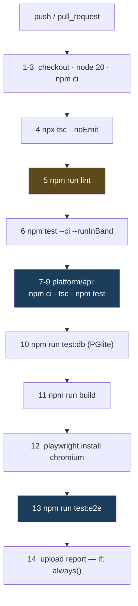

**Only step 5 (`lint`) is `continue-on-error`.** Everything else is a hard gate. That is stricter than most of the suite.

**And the workflow narrates its own history in comments:**

> *"The control plane is a separate package with its own dependencies and its own runner, so `npm test` at the root never touched it. That left **~290 tests** — the MQTT bridge, session revocation, the device registry, the whole ANPR recognition and visit-pairing pipeline — **unable to block a deploy**."*

> *"E2E was never run in CI, which is how the sitemap assertion below stayed broken (it expected the wrong domain)… Must match the browsers `playwright.config.ts` runs. These disagreed: only chromium was installed while the config declared three projects, so every run failed on 'Executable doesn't exist' for firefox and webkit."*

Both are real fixes to real gaps. Neither has ever run.

### Thirteen scripts CI never touches

| Script | Status |
| --- | --- |
| **`verify:secrets`** | 🔴 **Not a CI gate.** Only a bypassable local hook — see §2 |
| `test:coverage` | ❌ not in CI |
| `verify:icm` | ❌ not in CI — the durability proof from doc 02 §9 |
| `audit:contrast`, `audit:admin-theme`, `audit:perf`, `audit:live`, `audit:images` | ❌ **none of the five** |
| `docs:business`, `docs:business:verify`, `docs:kt`, `docs:kt:verify`, `docs:business:data` | ❌ **the entire documentation pipeline** |

**No real database in CI.** `test:db` runs PGlite in-process. Production uses Neon. Neon is never touched by CI.

---

## 2. The git hook

```
   package.json:  "prepare": "node scripts/install-hooks.mjs"
   Runs on every npm install / npm ci.

   INSTALLS EXACTLY ONE HOOK:

     #!/bin/sh
     # Installed by scripts/install-hooks.mjs — edit that, not this.
     node "$(git rev-parse --show-toplevel)/scripts/check-no-secrets.js" --staged || exit 1

   ✅ VERIFIED PRESENT: .git/hooks/pre-commit exists, 163 bytes,
      byte-identical to the template.
```

Its header explains both why hooks are installed rather than committed, and why it is a Node script:

> *"Hooks live in `.git/hooks`, which is not tracked, so a hook that exists on one machine does not exist on the next clone… The hook is deliberately a single node call. **An earlier guard in this repo was written in bash and never ran once, because `bash` on the Windows box that does the builds is WSL with no distribution installed — it failed silently and the build carried on with the wrong signing key.**"*

```
   🔴 BUT IT IS TRIVIALLY BYPASSABLE, THREE WAYS:
        git commit --no-verify
        skip npm install (the hook is then never installed)
        delete .git/hooks/pre-commit

   And because verify:secrets is not in CI, a developer who bypasses the
   hook has NOTHING stopping a secret at push time. Doc 05, D-03.
```

---

## 3. The audit scripts — and what happened when they were run

| Script | What it checks | Run result |
| --- | --- | :-- |
| `check-no-secrets.js` | Forbidden filenames and content patterns, staged or whole-tree | **exit 0** — `✓ no-secrets — checked the tracked tree` |
| `audit-images.mjs` | Every asset in `public/` against a per-type size budget | **exit 1** — 3 over budget: `logo.png` and `logo-mark.png` at **368 kB against an 80 kB budget**, `icon-512.png` at 172 kB |
| `verify_business_docs.py` | The generated business documents actually contain what they claim | **exit 0** — `All 43 checks passed` across 7 artefacts |
| `verify_kt_docs.py` | The same for the knowledge-transfer pack | **exit 1** — `61/73 checks passed` — see §5 |
| `audit-code-contrast.mjs` | Computed CSS contrast of code surfaces, in a real browser | **exit 2** — needs `next start -p 3199` first. It correctly refused to claim success: `FAILED: no code/pre elements were examined — the audit proved nothing.` |
| `audit-admin-theme.js` | Screenshots the console under every theme, no login required | not run — needs a server |
| `perf-probe.mjs` | Real latency, transferred bytes from the Resource Timing API, **directly observed CLS** | not run — needs a server |
| `audit-live.mjs` | Every read-only production surface; `--control` round-trips one live device command | not run — needs production |

### Three quotes worth keeping

> **`scripts/check-no-secrets.js`** — *"`.gitignore` stops the files it knows about. It does not stop `git add -f`, a secret pasted into a source file, a new `.env` under a name nobody thought of, or an archive of the whole credentials directory… **a secret pushed once is in every clone and every fork, and deleting the file in a later commit does not remove it from history.**"*

> **`scripts/audit-code-contrast.mjs`** — *"Written because the bug it checks for was invisible to every existing test: the stylesheet compiled, the page rendered, and **the only symptom was that a human could not read it.** Asserting the computed colours in a real browser is the only thing that would have caught it."*

> **`scripts/verify_kt_docs.py`** — *"`npm run docs:kt` printing 'ok' only proves three files were written. It does not prove the deck has slides, that the device list reached the page, or that the traps table survived being parsed out of a markdown file — and **a build script in this repository has previously reported success while publishing the previous run's artifact**, so 'the command succeeded' is not evidence."*

That last one is the philosophy of this whole repository in one paragraph.

---

## 4. The documentation pipeline

```
   FOUR PYTHON SCRIPTS. TWO BUILD, TWO VERIFY.

   build_business_docs.py     investor deck · sales deck · company profile ·
                              business plan · new-joiner handbook ·
                              product catalogue · price list
                              → PPTX, DOCX, PDF into Docs/business/
                              SOURCE: business-data.json, itself exported
                              from the LIVE SHOP CATALOGUE by
                              scripts/export-business-data.ts

   build_kt_docs.py           onboarding deck · handbook · quick reference
                              → Docs/kt/
                              SOURCE: the repository itself — device list
                              from the firmware tree, doc index from Docs/,
                              traps table parsed out of 00-start-here.md
```

**Why generate rather than write:**

> *"business documents quote prices, and prices move. A deck, a catalogue and a price list that each carry their own typed copy will disagree with the shop within a quarter… **Refuses to run if the export is missing or stale** rather than quietly producing documents from yesterday's prices."*

**And the verifiers check content, not existence:**

| Pack | Asserts |
| --- | --- |
| Business | The company name is in every document · every priced document contains a **real catalogue price** · **no raw unformatted price** slipped past the formatter · exact slide counts · PDFs have extractable text · placeholders appear only where intended |
| KT | Every document names the company **and the commit it was generated from** · the deck has slides, speaker notes and the parity rule · the handbook lists every file in `Docs/` · **every device in the firmware tree appears somewhere** · **nothing in the KT pack carries the business pack's "live product catalogue" stamp** — a claim it has no right to make |

**Neither is run by CI or by a hook.** And the difference shows: the business pack is fresh at 43/43; the KT pack is stale at 61/73.

---

## 5. Test suite — 4,328 tests, one failing

```
   npm test -- --ci --runInBand          EXIT CODE 1

   Test Suites:   1 failed, 235 passed, 236 total
   Tests:         1 failed, 4,327 passed, 4,328 total
   Time:          49.5 s

   THE FAILURE:
     src/lib/report-logo.test.ts
       › "the embedded mark matches the artwork"
         › "re-derives byte for byte from public/logo-mark-160.png"

     The embedded base64 logo bytes have drifted from the PNG on disk.
     A small failure — and a test that is doing exactly its job.

   FILE COUNT RECONCILES EXACTLY:
     tests/**                     120
     co-located src/**/*.test.*   116
     ─────────────────────────────────
     236 files = 236 Jest suites
```

| Aspect | Finding |
| --- | --- |
| Coverage threshold | 🔴 **`jest.config.js` has no `coverageThreshold` key at all.** `test:coverage` exists; nothing fails on low coverage; and it is not in CI anyway |
| Playwright | 8 specs in `e2e/`. `test-results/.last-run.json` says `"passed"` — but per the workflow's own comment e2e *"was never run in CI"*, so this is an undated local cache and should not be trusted |
| **Untested** | 🔴 **`src/lib/db.ts`** — the entire database access layer. 🔴 **`src/lib/csp.ts`** — which generates the Content-Security-Policy string that `next.config.ts` ships |

### Largest test files

| Lines | File | Covers |
| ---: | --- | --- |
| 443 | `src/app/api/admin/icm/route.test.ts` | Incident management API |
| 424 | `tests/firmware-avi.test.ts` | Firmware AVI parsing |
| 382 | `src/app/api/admin/availability/probe/route.test.ts` | Availability probe |
| 362 | `src/lib/app-insights-usage.test.ts` | Telemetry usage reporting |
| 355 | `tests/camera-fps-parity.test.ts` | Camera FPS parity |
| 342 | `tests/icm.test.ts` | Incident state machine |
| 336 | **`tests/drone-flight-safety.test.ts`** | **Drone flight-safety limits** |
| 324 | `src/lib/app-insights-query.test.ts` | Telemetry queries |
| 322 | `src/app/admin/insights-charts.test.tsx` | Admin charts |
| 316 | `tests/lib/extended-utils.test.ts` | Utilities |

---

## 6. Code quality, measured

| Metric in `src/` | Count |
| --- | ---: |
| `TODO` / `FIXME` | **1** |
| `@ts-ignore` / `@ts-expect-error` | **0** |
| `eslint-disable` | 47 across 38 files |
| literal `console.log(` | 7 across 4 files — including one in `payments/webhook/route.ts`, which is the stub |
| Files using `any` | 9 files, 46 occurrences — `AnalyticsPanel.tsx` alone accounts for 24 |
| `.ts`/`.tsx` files | 971 |

For a 971-file tree that is a genuinely clean signal.

```
   npx tsc --noEmit            EXIT 0. Clean. tsconfig strict: true.

   ⚠ BUT tsconfig `exclude` covers scripts, e2e, jest.setup.tsx and
     circuvent-platform — so the scripts and e2e specs are NOT typechecked.

   npm run lint                EXIT 1 — 29,687 problems
                               (5,726 errors, 23,961 warnings)

   AND ALMOST NONE OF IT IS REAL:
     .next-audit/          1,050 files   23,271 problems
     circuvent-platform/     543 files    4,627
     mobile/                 247 files      378
     platform/api/dist       117 files      706   ← COMPILED OUTPUT
     ──────────────────────────────────────────
     src/ + tests/ + scripts/  IN SCOPE          ≈705   (2.4%)

   CAUSE: eslint.config.mjs's globalIgnores lists only SHALLOW patterns
   — .next/**, out/**, build/**, next-env.d.ts — which do not match
   nested paths in a monorepo. So ESLint is linting build output and two
   unrelated sub-projects.

   Fixing the ignore patterns turns a 29,687-problem wall of noise into
   roughly 705 actionable items. Doc 05, D-05.
```

---

## 7. Deployment

```json
// vercel.json — this is the ENTIRE file
{
  "$schema": "https://openapi.vercel.sh/vercel.json",
  "crons": [
    { "path": "/api/admin/alerts/run",          "schedule": "0 8 * * *" },
    { "path": "/api/admin/reports/send",        "schedule": "0 4 * * *" },
    { "path": "/api/smarthome/alerts/cron",     "schedule": "0 6 * * *" },
    { "path": "/api/admin/availability/probe",  "schedule": "0 5 * * *" }
  ]
}
```

Four crons. No regions, no function config, no rewrites, no headers — headers live in `next.config.ts`.

### Security headers — complete, and applied twice

```js
const securityHeaders = [
  { key: "Strict-Transport-Security", value: "max-age=63072000; includeSubDomains; preload" },
  { key: "Content-Security-Policy", value: CSP },
  { key: "X-Content-Type-Options", value: "nosniff" },
  { key: "X-Frame-Options", value: "DENY" },
  { key: "Referrer-Policy", value: "strict-origin-when-cross-origin" },
  { key: "X-DNS-Prefetch-Control", value: "on" },
  { key: "Permissions-Policy", value: "camera=(), microphone=(), geolocation=(self), browsing-topics=()" },
  { key: "Cross-Origin-Opener-Policy", value: "same-origin" },
];
```

Applied to `/:path*`, with `/_next/static/:path*` getting `max-age=31536000, immutable` and `/api/:path*` getting `no-store, must-revalidate`. Non-production deployments add `X-Robots-Tag: noindex, nofollow`.

> ⚠️ The CSP string comes from `src/lib/csp.ts` — **which has no test anywhere.**

**Image remote patterns are scoped to exactly two hosts**, with a comment that shows why: *"`/**` would turn the Next image optimizer into an open proxy for every tenant on `res.cloudinary.com`."*

**Two redirects, both with a reason:**
- `/fw/:file` → an R2 bucket, because *"Eighteen images, about twenty megabytes, were committed under `public/fw/` and shipped with every deployment."*
- `/developers` → `/developer`, avoiding a stale static-prerender 200 followed by a JavaScript redirect.

**`distDir` is conditional on an env var**, because the dev server previously deleted `BUILD_ID` from a shared `.next` and an audit silently ran against an empty site.

---

## 8. Secrets — history is clean

```
   git log --all --diff-filter=A --name-only --pretty=format:
     | Sort-Object -Unique
     | Select-String 'creds|\.env|\.jks|\.keystore|\.key$|\.pem$|secret'

   MATCHES — all benign:
     circuvent-platform/.env.example    platform/.env.example
     Docs/11-secrets.md                 scripts/check-no-secrets.js
     scripts/secret-inventory.mjs       src/lib/secrets.ts
     tests/check-no-secrets.test.ts     tests/unit/secrets-lazy.test.ts

   ✅ NO REAL .env, .jks, .keystore, .pem OR .key HAS EVER BEEN ADDED
      IN THIS REPOSITORY'S HISTORY, ON ANY BRANCH.

   `.gitignore` carries redundant, overlapping coverage: *.jks,
   *.keystore, *.p12, *.pfx, *.pem, *.key, id_rsa, id_ed25519,
   credentials/, *.vault, circuvent-vault/, Creds/ and .env*.

   Docs/11-secrets.md is a full inventory and rotation document with no
   values in it.
```

**The gap is procedural, not historical:** the scanner runs only in a bypassable local hook. Getting it into CI is a two-line change.

### But the history is not clean of bloat

```
   The 15 largest blobs in `git rev-list --objects --all` are ALL
   firmware images — public/fw/camera-*.bin and sentinel-cam-*.bin —
   at 1.12 to 1.25 MB EACH, across dozens of versions.

   They are GONE from HEAD and from the index. They are PERMANENT in
   history. Every clone still pays for them.

   .git/ on disk is ~191 MB. Doc 05, D-10.
```

---

## 9. Documentation

`Docs/` holds 61 files — 39 numbered documents from `00-start-here.md` to `38-rc-platform.md`, plus generated `business/` and `kt/` packs.

| Claim | Reality | Verdict |
| --- | --- | --- |
| `README.md`: *"18 routes", "50+ React components"* | **151 `route.ts`, 108 `page.tsx`** | 🔴 **FALSE.** The README describes an early landing-page stage and was never updated as the monorepo grew |
| The KT pack is current | `verify_kt_docs.py` **exit 1** — missing 5 devices (`rc-link`, `rc-remote`, `rccar`, `rfid-attend`, `switchboard`) and 10 newer documents; **no commit stamp at all** | 🔴 **STALE** |
| `test-results/.last-run.json` says `"passed"` | An undated local cache; e2e *"was never run in CI"* | 🟠 not evidence |

**And several documents check out as accurate:**

| Document | Status |
| --- | --- |
| `Docs/25-git-and-releases.md` | ✅ Branch table matches the real `ci.yml` triggers and branch list exactly |
| `Docs/05-databases.md` | ✅ Correctly names Neon |
| `Docs/13-maintenance.md` | ✅ *"There is no monitoring stack."* — an honest absence claim, still true |

> **Notably, the sibling-repository failure mode is inverted here.** Other Circuvent repositories had documents describing systems that no longer existed. This one has documents describing a **fraction** of a system that grew past them.

### `.agents/`, `skills-lock.json` and `Prompt.txt`

| Artefact | What it is |
| --- | --- |
| `.agents/skills/workflow-init/SKILL.md` | ✅ A genuine AI-coding-agent "skill" teaching how to configure the Vercel Workflow SDK — which matches the `workflow` dependency and the `withWorkflow()` wrapper actually used in `next.config.ts` |
| `skills-lock.json` | ✅ Pins that skill by `computedHash` for reproducibility |
| **`Prompt.txt`** | 🔴 A verbatim AI prompt for building an **entirely unrelated** internal management platform. No connection to this Next.js site. An accidentally-committed scratch file |

The first two are a real convention a future contributor must respect. The third is hygiene debt.

---

## 10. Repository state

```
   533 commits  ·  2026-03-08 → 2026-08-20  ·  currently on `develop`

   FIVE REMOTES — and only one is the working repository:
     origin          Hemakotibonthada/WebSite.circuvent.git   ← THE REAL ONE
     hema            Hemakotibonthada/circuvent-technologies.git
     vercel          Hemakotibonthada/circuvent-technologies.git  (same URL)
     circuvent       Circuvent-Technologies/circuvent.git
     company-portal  Circuvent-Technologies/Company-Portal.git    (a DIFFERENT repo)

   git status: Architecture_Docs/ untracked (this audit), plus four
   deleted-but-unstaged screenshot scripts.

   ✅ test-results/, node_modules/, .next/ and *.log are all UNTRACKED.
```

---

## 11. Observability

```
   WHAT EXISTS                        WHAT DOES NOT
   ───────────                        ─────────────
   ✅ /api/health                      🔴 NO error tracking. No Sentry,
   ✅ /api/health/db                      Datadog, New Relic, Bugsnag or
   ✅ /api/admin/cron-health              LogRocket in package.json.
   ✅ api.circuvent.com/health            Only @vercel/analytics and
      → { ok, db }                        speed-insights — usage and
   ✅ /admin/health (admin token)          performance, not errors.
      → MQTT, DB, uptime               🔴 NO alerting of any kind.
   ✅ src/lib/logger.ts —              🔴 NO log shipper or sink.
      structured logging               🔴 The logger itself has NO TEST.
   ✅ Neon point-in-time recovery      🔴 No custom backup tooling.

   Docs/13-maintenance.md says it plainly, and is still correct:
     "There is no monitoring stack. The endpoints exist...
      Point any uptime service at /health."

   Nothing is pointed at /health.
```

### What you could not diagnose today

1. **Any production error.** There is no aggregation and no alerting — only a `/health` endpoint nobody is polling.
2. **Whether a bad deploy correlates with a broken build** — there is no CI signal at all to correlate against.
3. **A database or CSP regression** — `db.ts` and `csp.ts` are the two modules with no test anywhere.
4. **Whether the ~27 non-durable storage modules have lost data** — nothing reports it, by construction (doc 02 §5).
5. **Whether a device is running the firmware you think it is** — there is no OTA manifest endpoint (doc 03 §5).

---

## 12. Routine maintenance

| Cadence | Task |
| --- | --- |
| **Immediately** | Fix whatever prevents GitHub Actions from starting. Fourteen well-designed gates are worth nothing until then |
| **Immediately** | Add `verify:secrets` to CI. It is currently guarded only by a hook that `--no-verify` defeats |
| **Immediately** | Fix the `report-logo` test — regenerate the embedded bytes from `public/logo-mark-160.png` |
| **This week** | Fix `eslint.config.mjs`'s ignore patterns so `npm run lint` reports ~705 real problems rather than 29,687 |
| **Every deploy** | Run locally what CI cannot: `tsc --noEmit`, `npm test`, `npm run test:db`, `npm run build`, `npm run test:e2e` |
| **Every deploy** | Also run `verify:icm`, `verify:secrets` and `audit:images` — none run anywhere else |
| **After any device or Docs change** | Re-run `npm run docs:kt && npm run docs:kt:verify`. It is currently failing at 61/73 |
| **After any price change** | Re-run `docs:business:data` then `docs:business` — the documents are generated from the live catalogue precisely so they cannot drift |
| **Monthly** | Point an uptime service at `/api/health` and `api.circuvent.com/health`. `Docs/13-maintenance.md` has been asking for this |
| **Before scaling** | Nothing in `.data/`-backed modules survives a second instance. See doc 02 §5 first |

---

*Next: **05_AREAS_OF_ENHANCEMENT.md** · Back to **03_INTEGRATIONS_AND_ECOSYSTEM.md***


---


<a id="part-5-areas-of-enhancement"></a>


# Part 5 · Areas of Enhancement

> **Audience:** engineering leadership.
> **Method:** every item is traceable to a file, a command executed during this audit, or a comment in the codebase itself.

---

## 1. Gap analysis

```
   ┌──────────────────────────┬────────┬────────┬───────────────────────┐
   │ Dimension                │  Now   │ Target │ Gap                   │
   ├──────────────────────────┼────────┼────────┼───────────────────────┤
   │ Incident documentation   │████████│████████│ best in the suite     │
   │ Security headers         │████████│████████│ complete, applied 2×  │
   │ Secret history hygiene   │████████│████████│ provably clean        │
   │ Verification thinking    │███████ │████████│ scripts prove, not    │
   │                          │        │        │ assert                │
   │ Test volume              │███████ │████████│ 4,328 tests, 1 red    │
   │ Hardware engineering     │██████  │████████│ 17 real board designs │
   ├──────────────────────────┼────────┼────────┼───────────────────────┤
   │ Code hygiene             │██████  │████████│ lint config broken    │
   │ Documentation accuracy   │████    │████████│ 🔴 README off by 8×   │
   │ Auth architecture        │████    │████████│ 🔴 5 schemes, no gate │
   │ Payment reconciliation   │███     │████████│ 🔴 webhook is a stub  │
   │ Schema management        │███     │████████│ 🔴 created at boot    │
   │ Firmware supply chain    │██      │████████│ 🔴 no image signing   │
   │ Data durability          │██      │████████│ 🔴 ~27 modules memory │
   │ Observability            │█       │██████  │ 🔴 nothing at all     │
   │ CI actually running      │        │████████│ 🔴 0 of 27 runs       │
   └──────────────────────────┴────────┴────────┴───────────────────────┘
```

---

## 2. The four things that would keep me awake

### 2.1 Roughly twenty-seven storage modules lose all data on a cold start

```
   src/lib/data-file.ts — createFileStore()

     "On read-only filesystems (serverless production without a
      database) writes silently stop and the module degrades to
      in-memory-only for that instance, instead of throwing and
      breaking the request."

   ~30 modules use this. THREE pass { durable: true }:
     icm-store.ts · admin-warranty.ts · api-failures.ts

   THE OTHER ~27 INCLUDE:
     CMS content · CRM records · pricing · currency · tax configuration
     feature flags · marketing · staff activity · 570 KB of telemetry
     developer-portal tokens · AND PASSKEYS

   In production these live in one lambda instance's memory. When that
   instance recycles, the data is gone. Not stale. Not corrupted. Gone.

   AND THE REPOSITORY ALREADY KNOWS. From verify-icm-durability.ts:

     "Incidents were written to a JSON file that the serverless host
      cannot write... The next request — a cold start, or simply one
      routed elsewhere — began from an empty seed and rendered an empty
      queue. Incidents filed weeks ago were not hidden; THEY WERE GONE."

   That bug was found, understood, written down, and fixed for ONE
   module. The excellent four-process durability test proves ICM works.
   Nothing checks the other twenty-seven.
```

### 2.2 Firmware has no signature verification

```
   Devices that switch MAINS RELAYS and DOOR LOCKS accept over-the-air
   firmware whose only integrity guarantee is that it arrived over a
   certificate-pinned TLS connection.

   No Ed25519. No RSA. No hash manifest against an on-device key.
   No ESP32 Secure Boot in any of the 29 platformio.ini files.

   The code articulates the stakes itself, explaining why setInsecure()
   was removed:

     "anyone able to intercept that connection ... could serve arbitrary
      firmware and take permanent control of a board that switches mains
      relays and door locks."

   The transport hole was closed. The integrity hole was not.

   And hardware/CHECKLIST.md is honest about it — both unchecked:
     [ ] "OTA manifest endpoint (/api/devices/firmware) serving signed builds"
     [ ] "Field OTA rollout + rollback plan; key rotation policy"

   Meanwhile the device polls that manifest endpoint on a timer.
   It does not exist. platform/api/src/routes/ has no firmware route.
```

### 2.3 The payment webhook verifies its signature, then does nothing

```
   const expected = crypto.createHmac("sha256", secret).update(raw).digest("hex");
   const valid = sigBuf.length === expBuf.length && crypto.timingSafeEqual(sigBuf, expBuf);

   Correct. Constant-time. Then it console.log()s and returns.

     // Reconciliation hook: when a persistent order store exists,
     // mark the order paid/failed here...

   Any payment captured at Razorpay whose browser never returns — a
   closed tab, a dead connection, a failed redirect — is money taken
   and an order never marked paid.

   The checkout-side path is genuinely good: verifyCapturedPayment()
   re-fetches from Razorpay and requires status === "captured" before
   trusting the amount. A forged client signature cannot credit an
   order. The webhook was meant to be the safety net under that, and
   it is a stub.
```

### 2.4 CI has never run

```
   27 runs. 27 startup_failure. 0 seconds each.

   The registered "CI" workflow has ZERO runs ever attributed to it;
   all 27 belong to a synthetic deleted workflow. No YAML defect exists.

   What is not running: a typecheck, 4,328 root tests, the control
   plane's own ~290 tests, a PGlite database test, a production build,
   and a full Playwright suite — thirteen hard gates.

   The workflow's own comments describe fixing exactly the gaps that
   made those tests unable to block a deploy. Those fixes have never
   executed either.

   This is the second Circuvent repository with this precise signature.
```

---

## 3. Technical debt log

Severity: 🔴 critical · 🟠 high · 🟡 medium · ⚪ low

| ID | Finding | Sev | Effort |
| --- | --- | :-: | :-: |
| **D-01** | **~27 storage modules are memory-only in production** — CMS, CRM, pricing, tax, flags, telemetry, developer tokens and **passkeys** vanish on every instance recycle | 🔴 | L |
| **D-02** | **No firmware image signature verification** on devices controlling mains relays and door locks; the pull-OTA manifest endpoint does not exist at all | 🔴 | L |
| **D-03** | **CI has never executed** — 27 of 27 `startup_failure` — and `verify:secrets` is guarded only by a `--no-verify`-able local hook | 🔴 | S |
| **D-04** | **The payment webhook is a stub.** Signature verified correctly, then nothing. Payments captured without a browser return are never reconciled | 🔴 | M |
| **D-05** | **Schema is created at runtime** by `initDb()` on every cold start. No migrations, no version table, no rollback, no review surface | 🔴 | M |
| **D-06** | **No RLS, no tenant column, no foreign keys, no database access control of any kind** | 🔴 | L |
| **D-07** | **`circuvent-platform/` publishes working seed logins** (`admin@123`) in its README — for an application handling HR, payroll and a financial ledger | 🔴 | S |
| **D-08** | **README describes a fraction of the system** — *"18 routes, 50+ components"* against 151 routes and 108 pages, plus firmware, hardware and two native apps | 🔴 | S |
| **D-09** | **Every shop collection is one JSONB row.** Reading one order reads all of them; writing one rewrites all of them | 🟠 | M |
| **D-10** | **The capability table exists in four languages** with no shared schema; the bug it causes *"has already shipped twice"* | 🟠 | M |
| **D-11** | **`npm run lint` reports 29,687 problems**, of which ~705 are in scope. `globalIgnores` uses shallow patterns that miss nested monorepo paths | 🟠 | S |
| **D-12** | **Five coexisting credential schemes and no central gate.** `proxy.ts` performs no authentication; seven routes could not be matched to any known mechanism | 🟠 | M |
| **D-13** | **No observability at all** — no error tracking, no alerting, no log sink. `Docs/13-maintenance.md` says so plainly and has been ignored | 🟠 | M |
| **D-14** | **A failing test on `main`** — `report-logo.test.ts`; the embedded logo bytes have drifted from the PNG on disk | 🟠 | S |
| **D-15** | **The KT documentation pack is stale** — `verify_kt_docs.py` exits 1 at 61/73, missing 5 devices and 10 documents, with no commit stamp | 🟠 | S |
| **D-16** | **A Play upload keystore password was permanently lost** on 2026-08-03, and passwords sit in plaintext beside three keystore variants | 🟠 | M |
| **D-17** | **`db.ts` and `csp.ts` have no test anywhere** — the database layer and the module that generates the shipped Content-Security-Policy | 🟠 | M |
| **D-18** | **The environment guards ship empty.** `PROD_DATA_HOSTS` and `PROD_IDENTITY_HOSTS` are opt-in, and the code records the incident they exist to prevent | 🟠 | S |
| **D-19** | **The whole IoT cloud is one free-tier virtual machine** — no redundancy, no failover, no documented backup | 🟠 | L |
| **D-20** | **Transactions are structurally impossible** with the Neon HTTP driver | 🟡 | M |
| **D-21** | **Git history carries ~20 MB of firmware binaries** permanently. `.git` is ~191 MB | 🟡 | M |
| **D-22** | **No coverage threshold** in `jest.config.js`, and `test:coverage` runs nowhere | 🟡 | S |
| **D-23** | **Money is a float in the catalogue** — `price: number; // whole INR` — with integer paise only at the gateway boundary | 🟡 | M |
| **D-24** | **Every contact submission is written twice**, to Firestore and to the local store, from the same handler | 🟡 | S |
| **D-25** | **The drone has two competing firmware architectures, three branches and no PCB source** | 🟡 | L |
| **D-26** | **`resend` is declared but its SDK is never imported** | 🟡 | S |
| **D-27** | **13 npm scripts run nowhere automated** — including all five audits and the entire documentation pipeline | 🟡 | S |
| **D-28** | **`DeviceControls.tsx` is 4,870 lines** in a single React component | 🟡 | L |
| **D-29** | **Three public assets exceed their size budget** — `logo.png` and `logo-mark.png` at 368 kB against 80 kB | ⚪ | S |
| **D-30** | **`Prompt.txt` is an accidentally-committed AI prompt** for an unrelated project | ⚪ | S |
| **D-31** | **Device auth is a shared secret, not mutual TLS**, with no hardware-backed storage on the ESP32 | 🟠 | L |
| **D-32** | **97 unconnected nets across the 17 boards**, and the ESP32 antenna keepout was cut from 48×21 mm to 7 mm | 🟡 | L |
| **D-33** | **`tsconfig` excludes `scripts` and `e2e`** — a clean `tsc --noEmit` does not cover them | 🟡 | S |
| **D-34** | **Firmware provisioning is semi-manual** — the API mints a key, an operator still runs `add-device.sh` | 🟡 | M |

---

## 4. The pattern worth naming

```
   This repository does something almost nothing else does: when it
   finds a bug, it writes the bug down in the file that fixes it.

     passkeys.ts       "The passkey still existed, still verified, and
                        belonged to nobody."
     sso.ts            "Production users could sign in to dev, and dev
                        quietly accumulated live credentials while doing
                        it. The isolation guard was pointed at the wrong
                        door."
     next.config.ts    "silently deleted BUILD_ID twice while auditing,
                        so `next start` served nothing and the audit
                        reported a clean sweep of an empty site."
     verify-icm-       "Incidents filed weeks ago were not hidden;
     durability.ts      they were gone."
     install-hooks.mjs "bash on the Windows box that does the builds is
                        WSL with no distribution installed — it failed
                        silently and the build carried on with the wrong
                        signing key."
     db.ts             "dev.circuvent.com came to serve real customer
                        accounts, orders and wallet balances."
     check-no-secrets  "a secret pushed once is in every clone and every
                        fork, and deleting the file in a later commit
                        does not remove it from history."
     verify_kt_docs.py "a build script in this repository has previously
                        reported success while publishing the previous
                        run's artifact, so 'the command succeeded' is
                        not evidence."
     native/README     "That bug has already shipped twice — once on the
                        web and once in the Expo app."
     CircuventDevice.h "could serve arbitrary firmware and take permanent
                        control of a board that switches mains relays and
                        door locks."

   AND THE VERIFICATION SCRIPTS FOLLOW THE SAME PHILOSOPHY:
   they PROVE rather than assert.

     verify-icm-durability.ts   spawns FOUR REAL OS PROCESSES rather
                                than mocking a cold start
     audit-code-contrast.mjs    reads COMPUTED CSS in a real browser,
                                because "the only symptom was that a
                                human could not read it"
     perf-probe.mjs             uses the Resource Timing API for real
                                transferred bytes, and DIRECTLY OBSERVES
                                CLS rather than inferring it
     verify_business_docs.py    opens the generated PPTX and asserts a
                                REAL CATALOGUE PRICE is inside it

   The engineering instinct here is excellent.
   Almost none of it is automated.
```

---

## 5. Phased roadmap

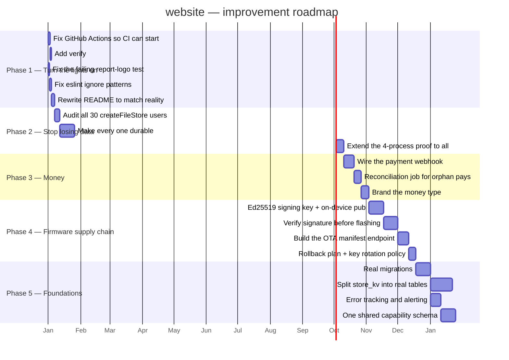

### Phase 1 — Turn the lights on (about a week)

| Task | Debt | Why |
| --- | --- | --- |
| Fix whatever prevents Actions from starting | D-03 | Thirteen hard gates are worth nothing until then |
| Add `verify:secrets` to CI | D-03 | It is currently defeated by `git commit --no-verify` |
| Fix `report-logo.test.ts` | D-14 | Regenerate the embedded bytes from the PNG |
| Fix `eslint.config.mjs`'s ignore patterns | D-11 | Turns 29,687 problems into ~705 real ones |
| Rewrite the README | D-08 | It currently describes about one-eighth of the system |

### Phase 2 — Stop losing data (about a month)

Enumerate every `createFileStore` caller. Decide, per module, whether its data matters. For everything that does, pass `durable: true` — the Postgres mirror already exists and is already proven to work. Then generalise `verify-icm-durability.ts` from one module to all of them; the four-process harness is already written.

**This is the highest-value work in the document**, because the failure is silent, and because the fix is largely a flag on a function that already supports it.

### Phase 3 — Money (about a month)

Wire the webhook to actually mark orders paid or failed. Add a reconciliation job that reconciles Razorpay's captures against local orders and reports the difference. Then give money a branded integer type so a fractional rupee can never reach `Math.round(due * 100)`.

### Phase 4 — Firmware supply chain (about two months)

Generate an Ed25519 signing key. Embed the public key in `CircuventDevice.h`. Verify the signature over the downloaded image **before** `httpUpdate.update()` commits it. Build the `/api/devices/firmware` manifest endpoint the devices are already polling. Then write the rollback plan and key-rotation policy the checklist already has unchecked boxes for.

> This should arguably be Phase 2. It is ranked lower only because the data loss in Phase 2 is happening **now**, whereas this is a serious latent risk requiring an attacker.

### Phase 5 — Foundations (a quarter)

Real migrations with a version table. Split `store_kv`'s 23 single-row collections into actual tables with actual indexes. Install error tracking and point an uptime service at the health endpoints that already exist. Replace the four hand-written capability tables with one schema and generated bindings.

---

## 6. What must not change

```
   ✅ THE INCIDENT-COMMENT CONVENTION
      Eleven examples are quoted in §4. It made this audit possible and
      it is worth more than any documentation folder.

   ✅ VERIFICATION THAT PROVES RATHER THAN ASSERTS
      Four real OS processes instead of a mocked cold start. Computed
      CSS in a real browser. Directly observed CLS. A generated deck
      opened and checked for a real catalogue price.
      "'the command succeeded' is not evidence."

   ✅ THE COMPLETE SECURITY-HEADER SET, applied both at the edge and
      globally so routes the proxy skips are still covered.

   ✅ IMAGE remotePatterns SCOPED TO TWO HOSTS
      "'/**' would turn the Next image optimizer into an open proxy for
       every tenant on res.cloudinary.com."

   ✅ SEPARATE SECRETS FOR STAFF AND CUSTOMER SESSIONS
      "Staff sessions get their own key so a leaked customer key cannot
       mint one." Plus tokenVersion, added after a departing employee's
       copied token stayed valid forever.

   ✅ PASSKEY SCOPES
      "Which sign-in a credential belongs to. They must never be
       interchangeable." Plus cloned-authenticator detection.

   ✅ SERVER-SIDE TOTP QR RENDERING
      So the secret never reaches a third-party QR service.

   ✅ PAYMENT CAPTURE RE-FETCHED FROM THE GATEWAY
      A forged client signature cannot credit an order.

   ✅ DOCUMENTS GENERATED FROM THE LIVE CATALOGUE
      "prices move... Refuses to run if the export is missing or stale."

   ✅ A DIFFERENT APP ID FOR THE NATIVE PROTOTYPE
      Deliberately avoiding the exact collision a sibling repository hit.

   ✅ THE DRONE COMPANION-COMPUTER DESIGN
      "WHY THE CLOUD IS NEVER IN THE CONTROL LOOP... There is
       deliberately no 'nudge forward while I hold this button'."

   ✅ NaCl SEALED BOXES FOR THE WI-FI HANDOFF
      A household password never crosses the captive portal in the clear.

   ✅ A HARDWARE CHECKLIST HONEST ENOUGH TO LEAVE ITS OWN BOXES UNCHECKED.
```

---

## 7. If you only do five things

```
   ┌────┬─────────────────────────────────────────────────┬────────────┐
   │ 1  │ Fix GitHub Actions, and add verify:secrets      │ 1 day      │
   │    │ to CI. Thirteen hard gates and 4,328 tests are  │            │
   │    │ currently decorative.                           │            │
   ├────┼─────────────────────────────────────────────────┼────────────┤
   │ 2  │ Set durable: true on every createFileStore      │ 3 weeks    │
   │    │ module whose data matters. Passkeys and         │            │
   │    │ developer tokens are among the ~27 that vanish  │            │
   │    │ on every cold start.                            │            │
   ├────┼─────────────────────────────────────────────────┼────────────┤
   │ 3  │ Wire the payment webhook. It verifies its       │ 2 weeks    │
   │    │ signature correctly and then does nothing.      │            │
   ├────┼─────────────────────────────────────────────────┼────────────┤
   │ 4  │ Sign firmware images and verify the signature   │ 6 weeks    │
   │    │ on-device before flashing — and build the       │            │
   │    │ manifest endpoint devices already poll.         │            │
   ├────┼─────────────────────────────────────────────────┼────────────┤
   │ 5  │ Rewrite the README. It describes an eighth of   │ 1 day      │
   │    │ this system, and it is the first thing anyone   │            │
   │    │ reads.                                          │            │
   └────┴─────────────────────────────────────────────────┴────────────┘

   #1 and #5 together take two days and change what every future
   contributor sees and what every future commit is checked against.

   #2 is the only item on this list where data is being lost right now.
```

---

*Back to **01_SYSTEM_OVERVIEW.md** · **02_DATABASE_AND_DATA_MODELS.md** · **03_INTEGRATIONS_AND_ECOSYSTEM.md** · **04_MAINTENANCE_AND_OPERATIONS.md***


---


<a id="part-6-architecture-diagram-atlas"></a>


# Part 6 · Architecture Diagram Atlas

> **What this is.** Every other document in this set explains. This one *shows*. It is a
> complete visual inventory of the repository the rest of `Architecture_Docs/` calls
> "website" — 150 API routes, 108 pages, 10 database tables, 35 file-backed stores (only
> 3 of them durable), five coexisting authentication schemes, and the six other things
> that live in this same working tree but are not part of the Next.js application at all.
> Nothing here is summarised away: where a list is long, the list is printed in full.
>
> **How to read it.** Every numbered section gives the same picture twice: an
> ASCII/Unicode block that renders in a terminal, a diff or a printed page, and a Mermaid
> block that renders as an interactive graphic on GitHub, in VS Code and in most wikis.
> Read whichever one displays for you; they are redundant by design, not complementary.
> Sections 3 and 5 are the two that must be *complete* rather than representative — §3
> maps every top-level thing in this working tree and §5 names all 150 routes and all
> 108 pages by path. Every fact below was read from the source in this repository. Where
> it differs from **01_SYSTEM_OVERVIEW.md** through
> **05_AREAS_OF_ENHANCEMENT.md**, this document follows the
> source and says so inline — it corrects one such case in §8.3.

### Legend

```
   ┌──────────────┐        a component whose code lives in THIS repository (website)
   │  like this   │
   └──────────────┘

   ╭┈┈┈┈┈┈┈┈┈┈┈┈┈┈╮        a component that lives somewhere else — another repository
   ┊  like this   ┊        in this same working tree, a third-party service, or a
   ╰┈┈┈┈┈┈┈┈┈┈┈┈┈┈╯        physical device

   ──────▶                 synchronous call, made and awaited
   ┈┈┈┈┈▶                 asynchronous, fire-and-forget, or "best effort"
   ══════▶                 redirect, navigation, or a physical-world action (a relay
                           switching, a lock turning)

   [S]  static      rendered once at build time              [R] route handler
   [D]  dynamic     rendered per request, "no-store"          [C] client component
   [M]  memory-only store — gone on cold start / redeploy
   [P]  Postgres-durable store — the 3 exceptions to [M], see §7.4

   No [A] tag appears anywhere in this document: `grep`ing the whole of `src/` for
   `"use server"` returns nothing. Every mutation in this application is a fetch to a
   route handler, never a Next.js Server Action.
```

---

## 1. C4 Level 1 — System context

Six things share this working tree (full detail in §3). This section's system boundary
is only the first of them: the Next.js application under `src/`, deployed as one Vercel
project. The other five — `firmware/`, `platform/`, `hardware/`, `mobile/`, `native/` —
are separate deployables that happen to sit beside it in the same repository, and
`circuvent-platform/` is not part of Circuvent at all (§3.1).

```
     ╭┈┈┈┈┈┈┈┈┈┈┈┈┈╮ ╭┈┈┈┈┈┈┈┈┈┈┈┈┈╮ ╭┈┈┈┈┈┈┈┈┈┈┈┈┈╮ ╭┈┈┈┈┈┈┈┈┈┈┈┈┈┈┈╮
     ┊  Shopper    ┊ ┊ Admin/staff ┊ ┊ Developer   ┊ ┊ Smart-home    ┊
     ┊ (browser)   ┊ ┊ (browser)   ┊ ┊(browser +   ┊ ┊ owner (browser┊
     ┊             ┊ ┊             ┊ ┊ API token)  ┊ ┊ or mobile app)┊
     ╰┈┈┈┈┈┬┈┈┈┈┈┈┈╯ ╰┈┈┈┈┈┬┈┈┈┈┈┈┈╯ ╰┈┈┈┈┈┬┈┈┈┈┈┈┈╯ ╰┈┈┈┈┈┬┈┈┈┈┈┈┈┈┈╯
           │  HTTPS         │  HTTPS         │  HTTPS         │  HTTPS
           ▼                ▼                ▼                ▼
   ┌────────────────────────────────────────────────────────────────────────┐
   │                                                                        │
   │             CIRCUVENT — WEBSITE   (this repository, `WebSite`)         │
   │                                                                        │
   │   Next.js 16.2 / React 19, one Vercel deployment. Five products in     │
   │   one app: marketing site, e-commerce store, 83-route admin back       │
   │   office, smart-home console (59 pages), developer portal. 150 API     │
   │   routes, 108 pages, ~428k lines, 4,328 tests.                         │
   │                                                                        │
   └──┬─────────┬──────────┬───────────┬────────────┬───────────┬──────────┘
      │         │          │           │            │           │
      ▼         ▼          ▼           ▼             ▼           ▼
 ╭┈┈┈┈┈┈┈┈┈╮╭┈┈┈┈┈┈┈┈┈╮╭┈┈┈┈┈┈┈┈┈┈╮╭┈┈┈┈┈┈┈┈┈┈┈╮╭┈┈┈┈┈┈┈┈┈┈┈╮╭┈┈┈┈┈┈┈┈┈┈┈┈┈╮
 ┊ Neon    ┊┊Razorpay ┊┊ AI provider┊┊Mail: Resend┊┊ GitHub    ┊┊ platform/   ┊
 ┊ Postgres┊┊(payments)┊┊(OpenAI-   ┊┊+ mx.circu- ┊┊ REST API  ┊┊ control     ┊
 ┊ (HTTP   ┊┊         ┊┊ compatible)┊┊vent.com    ┊┊(repo sync)┊┊ plane (own  ┊
 ┊ driver) ┊┊         ┊┊           ┊┊(SMTP)      ┊┊          ┊┊ Oracle VM)  ┊
 ╰┈┈┈┈┈┈┈┈┈╯╰┈┈┈┈┈┈┈┈┈╯╰┈┈┈┈┈┈┈┈┈┈╯╰┈┈┈┈┈┈┈┈┈┈┈╯╰┈┈┈┈┈┈┈┈┈┈┈╯╰┈┈┈┈┈┈┈┈┈┈┈┈┈╯
                                                                     ▲
                                                                     │ MQTT/TLS,
                                                            ╭┈┈┈┈┈┈┈┈┴┈┈┈┈┈┈┈┈╮
                                                            ┊ 17 ESP32 device ┊
                                                            ┊ SKUs (firmware/)┊
                                                            ╰┈┈┈┈┈┈┈┈┈┈┈┈┈┈┈┈╯

   THE ONE-LINE VERSION
   This app is a face for two backends at once: its own Neon Postgres for the shop
   and admin data, and someone else's control plane (`platform/`, a single Oracle
   free-tier VM) for almost everything the smart-home console shows. The devices
   never call this app directly — they call the VM. See §1.1 and §6.
```

**1.1 — what does NOT appear above, on purpose.** `circuvent-platform/` (an unrelated
internal HR/payroll SaaS, §3.1) has no network path to or from this system: it is not
omitted for brevity, it genuinely does not connect. The mobile app (`mobile/`, shipped
Expo build) also does not call this website's API — its `API_BASE` constant points at
`https://api.circuvent.com`, the same `platform/` control plane the smart-home console
uses (verified in `mobile/src/config.ts`). This website's only two roles in the
smart-home story are: rendering the console's page shells and relaying a handful of
server-side calls (AI analysis, the alerts cron, one admin probe), and brokering a
one-time identity exchange so a shop customer's session can be traded for a console
session (`/api/account/sso/console`, detailed in §8.4).

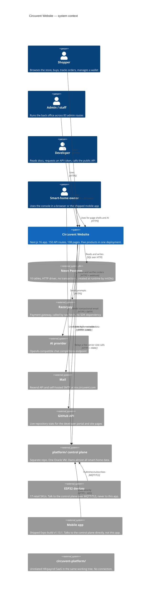

---

## 2. C4 Level 2 — Containers

```
   ┌═══════════════════════════════════════════════════════════════════════┐
   ║                       VERCEL EDGE NETWORK                             ║
   ║                                                                       ║
   ║  ┌────────────────┐  ┌────────────────┐  ┌────────────────────────┐  ║
   ║  │  Static assets │  │ Image optimiser│  │ src/proxy.ts (middleware)│ ║
   ║  │  /public       │  │  next/image,   │  │ host-mount rewrites,    │  ║
   ║  │                │  │  sharp         │  │ 1 legacy redirect, CSP  │  ║
   ║  │                │  │                │  │ + x-request-id headers │  ║
   ║  │                │  │                │  │ NO AUTHENTICATION HERE │  ║
   ║  └────────────────┘  └────────────────┘  └───────────┬─────────────┘  ║
   ╚══════════════════════════════════════════════════════╪════════════════╝
                                                            │
   ┌────────────────────────────────────────────────────────▼───────────────┐
   │                    NEXT.JS 16.2 APP ROUTER RUNTIME (Node.js)           │
   │                                                                        │
   │  ┌───────────────┐  ┌────────────────┐  ┌─────────────────────────┐  │
   │  │  RSC PAGES [D] │  │ CLIENT ISLANDS │  │  ROUTE HANDLERS   [R]   │  │
   │  │  108 pages     │  │      [C]       │  │  150 route.ts files    │  │
   │  │  5 products —  │  │  smart-home    │  │  account, admin (83),  │  │
   │  │  see §3.2      │  │  console is    │  │  ai, devices, orders,  │  │
   │  │                │  │  almost all    │  │  payments, shop,       │  │
   │  │                │  │  client-side   │  │  smarthome, misc — §5  │  │
   │  └───────┬───────┘  └────────┬────────┘  └────────────┬────────────┘  │
   │          └────────────────────┼─────────────────────────┘             │
   │                                ▼                                       │
   │  ┌─────────────────────────────────────────────────────────────────┐  │
   │  │                     src/lib — 291 files (205 modules + 86 tests) │  │
   │  │                                                                 │  │
   │  │  DATA         db.ts, store.ts, data-file.ts (35 createFileStore │  │
   │  │               call sites, 32 memory-only, 3 durable — §7.4)     │  │
   │  │  IDENTITY     account.ts, admin-auth.ts, sso.ts, passkeys via   │  │
   │  │               data-file.ts, admin-sso.ts — 5 schemes, §10.1     │  │
   │  │  CONTROL-     control-plane.ts (~2,300 lines, used from 86      │  │
   │  │  PLANE CLIENT smart-home files AND 7 server routes) — §6.2      │  │
   │  │  COMMERCE     razorpay.ts, shop-data.ts, invoicing (pdf-lib)     │  │
   │  │  AI           lib/ai/* — provider.ts (OpenAI-compatible)        │  │
   │  └──────────────────────────────┬──────────────────────────────────┘  │
   └─────────────────────────────────┼────────────────────────────────────┘
                                     │
        ┌────────────┬──────────────┼──────────────┬────────────┬─────────┐
        ▼            ▼              ▼              ▼            ▼         ▼
   ╭┈┈┈┈┈┈┈┈┈┈╮ ╭┈┈┈┈┈┈┈┈┈┈╮ ╭┈┈┈┈┈┈┈┈┈┈┈╮ ╭┈┈┈┈┈┈┈┈┈┈╮ ╭┈┈┈┈┈┈┈┈┈┈┈╮ ╭┈┈┈┈┈┈┈╮
   ┊  Neon    ┊ ┊ Razorpay ┊ ┊ AI provider┊ ┊ Mail:    ┊ ┊ platform/ ┊ ┊ .data/┊
   ┊  Postgres┊ ┊          ┊ ┊            ┊ ┊ Resend + ┊ ┊ control   ┊ ┊ (dev  ┊
   ┊  10      ┊ ┊          ┊ ┊            ┊ ┊ SMTP     ┊ ┊ plane VM  ┊ ┊ only) ┊
   ┊  tables  ┊ ┊          ┊ ┊            ┊ ┊          ┊ ┊           ┊ ┊       ┊
   ╰┈┈┈┈┈┈┈┈┈┈╯ ╰┈┈┈┈┈┈┈┈┈┈╯ ╰┈┈┈┈┈┈┈┈┈┈┈╯ ╰┈┈┈┈┈┈┈┈┈┈╯ ╰┈┈┈┈┈┈┈┈┈┈┈╯ ╰┈┈┈┈┈┈┈╯

   NOTE ON THAT LAST BOX: `data-file.ts` writes every non-durable store to
   `.data/<name>.json` on every mutation. On Vercel the filesystem is read-only and
   ephemeral, so the very first write throws, `canWrite` latches to false for the
   life of the instance, and the module quietly becomes pure in-memory state for the
   rest of that lambda's life. Locally, and only locally, that file is real.
```

```mermaid
flowchart TB
    subgraph edge["Vercel edge network"]
        static["Static assets<br/>/public"]
        imgopt["Image optimiser<br/>next/image + sharp"]
        proxy["src/proxy.ts middleware<br/>host-mounts, 1 redirect, CSP,<br/>x-request-id — NO AUTH"]
    end

    subgraph runtime["Next.js 16.2 App Router runtime (Node.js)"]
        pages["RSC pages · 108<br/>marketing, shop, admin,<br/>smart-home, developer"]
        islands["Client islands<br/>smart-home console is<br/>almost entirely client-side"]
        handlers["Route handlers · 150<br/>account, admin x83, ai,<br/>devices, orders, payments,<br/>shop, smarthome, misc"]

        subgraph lib["src/lib — 291 files"]
            data["Data<br/>db.ts, store.ts, data-file.ts<br/>35 createFileStore sites"]
            identity["Identity<br/>account.ts, admin-auth.ts,<br/>sso.ts, admin-sso.ts"]
            cp["control-plane.ts<br/>~2,300 lines<br/>used client AND server side"]
            commerce["razorpay.ts, shop-data.ts,<br/>pdf-lib invoicing"]
            ai["lib/ai/*<br/>provider.ts"]
        end
    end

    neon[("Neon Postgres<br/>10 tables, HTTP driver")]
    razorpay(["Razorpay"])
    aiprovider(["AI provider<br/>OpenAI-compatible"])
    mail(["Mail<br/>Resend + SMTP"])
    controlplane(["platform/ control plane<br/>one Oracle VM"])
    diskfile[("`.data/*.json`<br/>dev only")]

    static --> pages
    imgopt --> pages
    proxy --> handlers
    pages --> lib
    islands --> lib
    handlers --> lib
    data --> neon
    data -.->|"dev fallback only"| diskfile
    commerce --> razorpay
    ai --> aiprovider
    identity --> mail
    cp <-->|"HTTPS + Bearer"| controlplane

    style proxy fill:#FEE2E2,stroke:#B91C1C
    style neon fill:#DCFCE7,stroke:#15803D
    style diskfile fill:#FEF3C7,stroke:#B45309
    style controlplane fill:#E0E7FF,stroke:#4338CA
```

## 3. Container map, level 3 — the complete repository

This is one of the two sections this atlas promises to make *complete*, not
representative (§5 is the other). Every top-level entry below was counted with
`git ls-files`, run fresh while writing this document — not copied from an older audit.

**3.1 — what is actually in this repository.**

```
REPOSITORY ROOT  C:\...\WebSite                            3,101 git-tracked files total
│
├── src/                            978 files  THE WEBSITE — this whole atlas is it
│     Next.js 16 App Router, one Vercel deployment, five web products bundled as one
│     app: marketing, e-commerce shop, admin back office, smart-home console,
│     developer portal. Full internal tree in §3.3.
│
├── firmware/                       89 files  30 ESP32 SKETCHES for 17 RETAIL SKUs
│     13,003 files on disk; 12,914 of those are PlatformIO's .pio/ build cache, all
│     gitignored. Only source, headers and platformio.ini are tracked. See §3.2/§11.1.
│
├── platform/                      188 files  THE IoT CONTROL PLANE — ONE ORACLE VM
│     Mosquitto (MQTT+TLS, own CA) + Express API + Postgres + Caddy, plus an Alexa
│     Lambda and a face-recognition service. Single point of failure. See §3.2/§11.2.
│
├── hardware/                      638 files  REAL KiCad PCBs — 25 product folders
│     Schematics, board layouts, Gerbers, enclosures, marketplace listings, product
│     photography. This is not a mockup: these boards are manufacturable. See §3.2.
│
├── mobile/                        279 files  SHIPPED Expo app — Play Store v1.13.1
│     Talks DIRECTLY to platform/ at api.circuvent.com — bypasses this website's own
│     API entirely (verified in mobile/src/config.ts). Includes a native Siri /
│     Shortcuts bridge module (mobile/modules/circuvent-siri/). See §3.2.
│
├── native/                          39 files  Kotlin/Swift PROTOTYPE — iOS unbuilt
│     A from-scratch rewrite attempt with deliberately different application ids
│     (…nativeclient) so it can never be confused with the shipped app. The ios/
│     half has never successfully compiled. Not a release candidate.
│
├── circuvent-platform/             585 files  UNRELATED HR / PAYROLL SaaS
│     Its own Turborepo — apps/{api-gateway,services,web}, packages/{auth,database,
│     event-bus,...}. Shares a brand prefix with everything above and NOTHING else.
│     THE NAME IS A TRAP. See 3.1.1 below.
│
├── Docs/                            55 files  internal 39-chapter knowledge base
│     00-start-here.md ... 39-witness.md — web app, control plane, MQTT protocol,
│     every device, mobile, Play Store, Siri/HomeKit, drone, ANPR, and more. Titles
│     read and listed in §3.2; contents not re-verified for this atlas.
│
├── Architecture_Docs/               11 files  audits 01-05 plus this atlas (06)
├── tests/ + e2e/                   129 files  4,328 automated tests — see §12
├── public/ + scripts/                90 files  static assets, build/ops scripts
│
└── Creds/ + mobile/credentials/      0 tracked  Android signing keystores and one
      control-plane key sit on local disk but are gitignored (`Creds/`, `credentials/`,
      `*.jks`, `*.keystore`, `*.key`) and confirmed absent from `git ls-files`. This is
      correct secrets hygiene, called out here as one of this repo's few unambiguous
      positives.
```

**3.1.1 — the trap, explicitly.** `circuvent-platform/` shares three characters of
naming with `platform/` (this app's real IoT control plane) and a "Circuvent" brand
prefix with everything else in this working tree — and nothing more. It is a
completely separate Turborepo: its own `package.json`, its own `.turbo/` cache, its
own `.vercel/` project link, its own `apps/{api-gateway,services,web}` and its own
`packages/{audit,auth,database,event-bus,pdf-engine,shared,testing,websocket}` — a
full independent `auth` package and a full independent `database` package, sharing
zero source files, zero database connections and zero deployment target with the
website this atlas describes. Its own `README.md` publishes seed login credentials for
its own demo environment; that is a defect **of that unrelated project**, not of this
one, and is out of scope beyond this warning. If a search of this working tree for
"circuvent" ever lands you in `circuvent-platform/`, this paragraph is why — turn back.

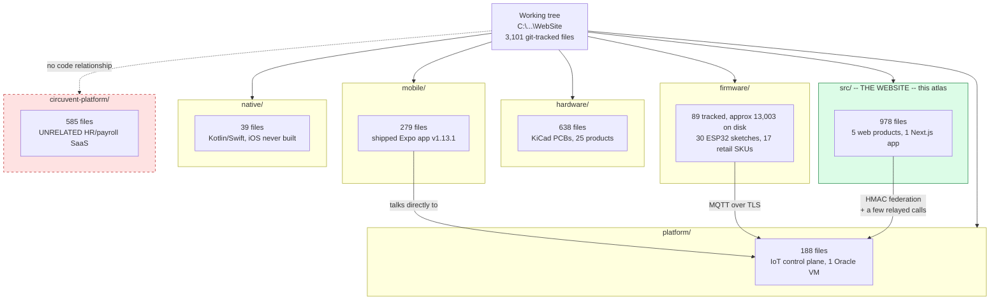

**3.2 — inside the six non-website projects.**

```
firmware/                     30 sketches (one .ino each) + 2 shared libraries
├── CircuventDevice/          shared base library -- Wi-Fi/MQTT/OTA client, no .ino
├── CircuventRC/               shared RC-vehicle library -- ESP-NOW/MAVLink, no .ino
├── agri-starter/ anpr-cam/ aquaguard/ camera/ curtain/ drone-fc/ drone-link/
├── energy-monitor/ facedoor/ guardian/ home-hub/ meter/ motion-sensor/
├── rc-link/ rc-remote/ rccar/ rfid-attend/ rfid-gate/ sentinel/ smart-fan/
├── smart-light/ smart-lock/ smart-plug/ smart-switch/ switchboard/
├── touchboard/ touchboard-8/ watertank/ watertank-sensor/ witness/
└── each sketch dir: <name>.ino + platformio.ini + .pio/ (cache, gitignored)
      30 sketches total; 17 of them ship as retail SKUs -- device table in §11.1.

platform/                     the IoT control plane -- one Oracle free-tier VM
├── mosquitto/                 MQTT broker config + its own certificate authority
├── api/src/                   Express/Node API -- devices, auth, MQTT bridge, ANPR
├── api/dist/, node_modules/, scripts/    build output, dependencies, ops scripts
├── caddy/                     reverse proxy / TLS termination in front of api/
├── alexa-lambda/              Alexa Smart Home skill Lambda -- voice control bridge
└── face/                      face-recognition service, backs the facedoor/ SKU

hardware/                     25 product directories + one shared KiCad library
├── lib/Circuvent.pretty/      shared KiCad footprint library (".pretty" is KiCad's
│                              own naming convention for a footprint-library folder)
├── agri-starter/ anpr-camera/ curtain/ drone-x1/ energy-monitor/ facedoor/
├── guardian/ home-automation/ load-controller/ meter-1ch/ meter-3ch/
├── motion-sensor/ psu-5v3v3/ psu-adapter-12v/ psu-adapter-5v/ rfid-gate/
├── sentinel/ smart-fan/ smart-light/ smart-lock/ smart-plug/ smart-switch/
├── touchboard/ water-tank-controller/        (plus a near-empty anpr-cam/ stub)
└── each product dir: pcb/ (schematic + layout + Gerbers), enclosure/, images/,
      listings/ (marketplace copy) -- this is a real, manufacturable hardware line.

mobile/                        the shipped Expo / React Native app, v1.13.1
├── src/                       app source -- screens mirror the smart-home console
├── modules/circuvent-siri/    native Expo module -- Siri Shortcuts + App Intents
├── android/                   native Android project (the Play Store release build)
├── credentials/                signing keystores -- gitignored, not tracked (§3.1)
├── design-system/, assets/     shared UI tokens, images, fonts
├── store/                      Play Store listing assets -- screenshots, icons
└── plugins/, scripts/, dist/   Expo config plugins, build/release scripts, output

native/                        Kotlin/Swift PROTOTYPE -- a from-scratch rewrite try
├── android/                   Kotlin client -- different application id (nativeclient)
└── ios/                       Swift client -- has NEVER SUCCESSFULLY COMPILED

circuvent-platform/            UNRELATED -- see 3.1.1. Shown only for completeness.
├── apps/api-gateway/, apps/services/, apps/web/    its own Next.js/Node apps
├── packages/auth/, packages/database/, packages/event-bus/    its own primitives
├── packages/audit/, packages/pdf-engine/, packages/shared/, packages/testing/
├── packages/websocket/
└── docker/, .turbo/                                 its own containers + build cache
```

**3.3 — inside `src/` — the website's own five products.**

```
src/
├── app/                       108 pages + 150 route.ts + layout/error/robots/sitemap
│     Route groups by product (page counts in §5.2, API counts in §5.1):
│     marketing (25 singleton pages: /, /about, /services, /faq, /docs, /dev, ...)
│     shop/ (6 pages: /shop, /cart, /checkout, /account/*, /wallet, /orders/[id])
│     admin/ (1 page shell driving 83 API routes -- a client-rendered app-in-a-route)
│     smarthome/ (59 pages -- the largest single product, almost entirely [C])
│     developer/ (10 pages -- docs, playground, token management)
│     projects/ (2) blog/ (2) careers/ (2) domains/ (2) case-studies, roadmap, ...
│     api/ (150 route.ts files -- full tree in §5.1)
│     .well-known/ (workflow SDK + well-known probes; excluded by proxy's matcher)
│
├── components/                119 files
│     ai/ (chat/assistant widgets)   shop/ (cart, product cards, checkout UI)
│     ui/ (shared design-system primitives)   weather/ (widget used on 2 pages)
│
├── hooks/                      15 files   shared client-side React hooks
│
├── lib/                       291 files   205 modules + 86 co-located *.test.ts
│     full category breakdown in §4: data, identity, control-plane client, commerce,
│     AI, notifications, PDF/report generation, validation, rate limiting, ...
│
└── workflows/                   2 files   icm-postmortem.ts, icm-watch.ts --
      Vercel Workflow SDK (beta) jobs behind the durable Incident Management feature
```

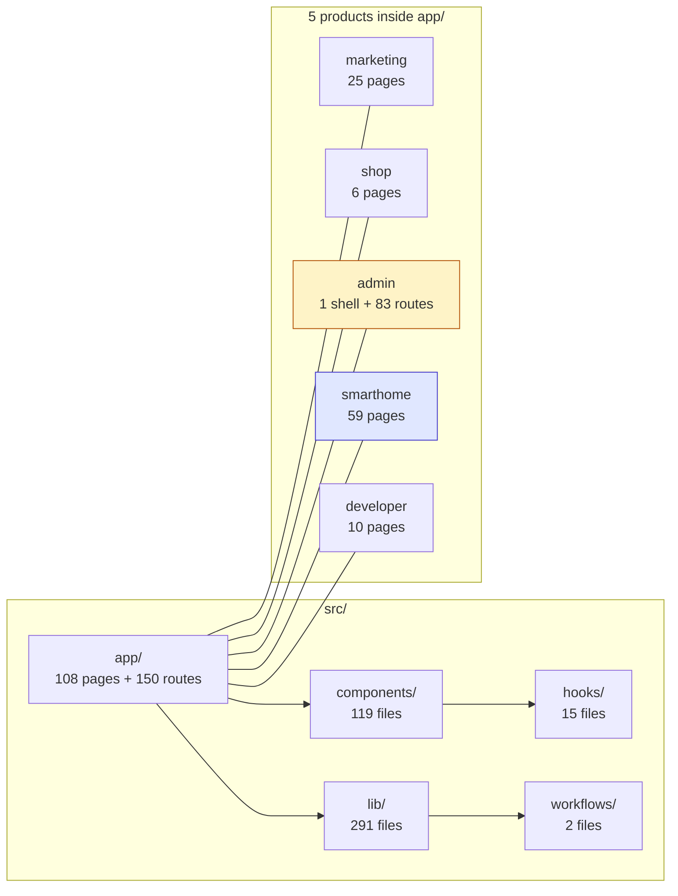

---

## 4. Module / library layer

`src/lib` holds 205 non-test modules (plus 86 co-located `*.test.ts` files, §12). 98 of
them fall into an unambiguous group by filename prefix alone (`admin-*`, `smarthome-*`,
`icm*`, `report*`, `*insights*`, `shop-*`, `control-plane*`, and the nine files under
`lib/ai/`). The other 107 do not share a prefix, so they are grouped here by theme; that
split was verified to be an exact partition of all 107 filenames — no module counted
twice, none left out. Nothing in this section is estimated.

```
CATEGORY                        COUNT  REPRESENTATIVE MODULES
------------------------------- -----  ---------------------------------------------
ADMIN DOMAIN            (admin-*)   29  admin-crm, admin-cms, admin-pricing, admin-
                                        tax, admin-fraud, admin-sso, admin-vendors,
                                        admin-report-builder, admin-password-policy
SMART-HOME / DEVICE DOMAIN          60  smarthome-* (30 prefixed: -dashboard, -auth,
  (30 prefixed + 30 thematic)            -security, -firmware, -realtime, -groups...)
                                        + 30 thematic: camera-relay, camera-audio,
                                        guardian-health/-hold, tank-health/-link,
                                        switchboard, witness, energy-advisor,
                                        predictive-maintenance, device-history/
                                        -normalize, firmware-catalog.generated, agri
OBSERVABILITY & REPORTING           21  icm* (7: incident mgmt store/bridge/notify),
                                        app-insights*/insights* (8: cost, usage,
                                        anomalies, alert rules), reports*/report-
                                        logo (6: PDF generation via pdf-lib)
SHOP / COMMERCE      (shop-* + 10)   16  shop-catalog, shop-data, shop-policy +
                                        razorpay, order-core, coupons, inventory,
                                        warranty, bundle-pricing, delivery-estimate
AI                    (lib/ai/*)     9  provider (OpenAI-compatible), assistant,
                                        fleet, analysis, tools, console-identity
IDENTITY & SESSIONS                 11  account, sso, passkeys, passkey-ceremony,
                                        totp, session-expiry, identity-groups
CORE DATA / INFRASTRUCTURE          16  db, store, data-file, cache, rate-limit,
                                        secrets, validation, api-handler, csp, config
CONTROL-PLANE CLIENT                 3  control-plane, control-plane-health, -live
CONTENT & MARKETING DATA            28  blog-data, showcase-data, stack-data, seo,
                                        brand, animations, quiz-data, case-studies-
                                        data (mostly static arrays, no I/O)
DEVELOPER PORTAL                     3  developer-api.generated, developer-docs,
                                        v1-shapes
INTEGRATIONS (misc external)         3  cv365-firebase, github-sync, weather
NOTIFICATIONS                        2  web-push, useWebPush
MISC                                  4  console-layout, deployments, documents, utils
------------------------------- -----  ---------------------------------------------
TOTAL MODULES                       205  (+ 86 co-located *.test.ts files -- see §12)
```

The dependency picture below is a category-level view, not a line-by-line import audit
of all 205 files: it is built from the naming convention above plus the two import
greps already performed for `control-plane.ts` (86 client call sites, 7 server route
call sites) and `db.ts`/`store.ts` (imported from nearly every domain category).

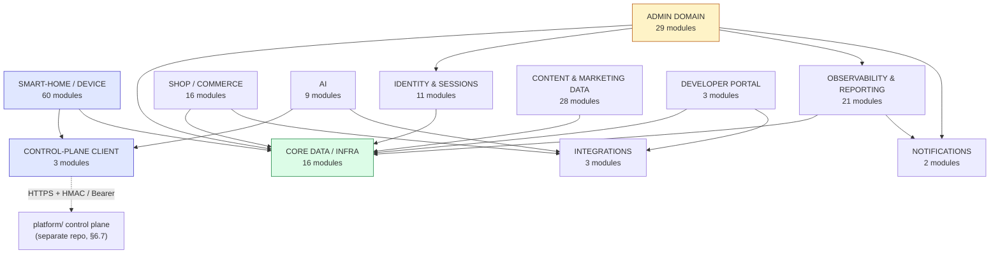

---

## 5. The complete route map

This is the section the spec singles out for exhaustive treatment, and the
numbers explain why: **150** files under `src/app/api/**/route.ts` and **108**
files under `src/app/**/page.tsx` — 258 routable paths in one Next.js App
Router tree, against the Career.circuvent example's few dozen. Per the spec's
own rule ("if there are more than ~60 routes, give a full ASCII tree of every
route path plus tables for the most important groups"), §5.1 and §5.3 below
are the complete trees — every path, no sampling — and §5.2 and §5.4 add
method, auth and purpose detail on top. Every one of the 150 API routes is
named explicitly at least twice: once in the tree, once in a table.

### 5.1 API routes — the complete tree (150 routes, 26 top-level groups)

```
src/app/api/                                            150 route.ts files
│                                                        26 top-level groups
├── account/                                                          14 routes
│   ├── addresses/route.ts
│   ├── avatar/route.ts
│   ├── change-password/route.ts
│   ├── documents/[orderNo]/route.ts
│   ├── forgot-password/route.ts
│   ├── login/route.ts
│   ├── notifications/route.ts
│   ├── orders/route.ts
│   ├── passkey/route.ts
│   ├── profile/route.ts
│   ├── register/route.ts
│   ├── reset-password/route.ts
│   ├── sso/console/route.ts
│   └── verify-otp/route.ts
│
├── admin/                                                            83 routes
│   ├── 2fa/route.ts
│   ├── 2fa/totp/route.ts
│   ├── affiliates/route.ts
│   ├── alerts/route.ts
│   ├── alerts/rules/route.ts
│   ├── alerts/run/route.ts
│   ├── analytics/route.ts
│   ├── audit/route.ts
│   ├── auth/route.ts
│   ├── auth/sso/callback/route.ts
│   ├── auth/sso/exchange/route.ts
│   ├── auth/sso/start/route.ts
│   ├── auth/verify-2fa/route.ts
│   ├── availability/probe/route.ts
│   ├── bulk/route.ts
│   ├── bundles/route.ts
│   ├── cms/route.ts
│   ├── coupons/route.ts
│   ├── crm/route.ts
│   ├── cron-health/route.ts
│   ├── currency/route.ts
│   ├── customers/route.ts
│   ├── emails/route.ts
│   ├── external-stats/route.ts
│   ├── flags/route.ts
│   ├── forecasting/route.ts
│   ├── fraud/route.ts
│   ├── giftcards/route.ts
│   ├── groups/route.ts
│   ├── icm/route.ts
│   ├── insights/route.ts
│   ├── insights-failures/route.ts
│   ├── insights-query/route.ts
│   ├── insights-rules/route.ts
│   ├── insights-telemetry/route.ts
│   ├── insights-usage/route.ts
│   ├── insights/export/route.ts
│   ├── integrations/route.ts
│   ├── inventory/batches/route.ts
│   ├── inventory/counts/route.ts
│   ├── inventory/export/route.ts
│   ├── inventory/locations/route.ts
│   ├── inventory/meta/route.ts
│   ├── inventory/movements/route.ts
│   ├── inventory/purchase-orders/route.ts
│   ├── inventory/reports/route.ts
│   ├── inventory/settings/route.ts
│   ├── inventory/suppliers/route.ts
│   ├── inventory/taxonomy/route.ts
│   ├── inventory/transfers/route.ts
│   ├── jobs/route.ts
│   ├── latency/route.ts
│   ├── macros/route.ts
│   ├── marketing/route.ts
│   ├── messages/route.ts
│   ├── orders/route.ts
│   ├── passkey/route.ts
│   ├── password/route.ts
│   ├── pricing/route.ts
│   ├── privacy/route.ts
│   ├── products/route.ts
│   ├── questions/route.ts
│   ├── report-builder/route.ts
│   ├── reports/catalog/route.ts
│   ├── reports/csv/route.ts
│   ├── reports/data/route.ts
│   ├── reports/pdf/route.ts
│   ├── reports/schedules/route.ts
│   ├── reports/schedules/run/route.ts
│   ├── reports/send/route.ts
│   ├── returns/route.ts
│   ├── seo/route.ts
│   ├── shipping/route.ts
│   ├── staff/route.ts
│   ├── staff-activity/route.ts
│   ├── stats/route.ts
│   ├── subscriptions/route.ts
│   ├── support/route.ts
│   ├── surveys/route.ts
│   ├── tax/route.ts
│   ├── traffic/route.ts
│   ├── vendor-portal/route.ts
│   └── warranty/route.ts
│
├── ai/                                                               3 routes
│   ├── analyze/route.ts
│   ├── chat/route.ts
│   └── fleet/route.ts
│
├── blog/route.ts                                                     1 route
│
├── contact/route.ts                                                  1 route
│
├── coupons/                                                          1 route
│   └── validate/route.ts
│
├── devices/                                                          5 routes
│   ├── route.ts
│   ├── claim/route.ts
│   ├── command/route.ts
│   ├── firmware/route.ts
│   └── sync/route.ts
│
├── giftcards/                                                        1 route
│   └── redeem/route.ts
│
├── github/route.ts                                                   1 route
│
├── health/                                                           2 routes
│   ├── route.ts
│   └── db/route.ts
│
├── loyalty/route.ts                                                  1 route
│
├── newsletter/route.ts                                               1 route
│
├── notify-restock/route.ts                                           1 route
│
├── orders/                                                           4 routes
│   ├── route.ts
│   ├── cancel/route.ts
│   ├── reorder/route.ts
│   └── track/route.ts
│
├── payments/                                                         3 routes
│   ├── create-order/route.ts
│   ├── verify/route.ts
│   └── webhook/route.ts
│
├── projects/route.ts                                                 1 route
│
├── push/                                                             2 routes
│   ├── key/route.ts
│   └── subscribe/route.ts
│
├── referral/route.ts                                                 1 route
│
├── returns/route.ts                                                  1 route
│
├── shop/                                                             5 routes
│   ├── bundles/route.ts
│   ├── products/route.ts
│   ├── questions/route.ts
│   ├── quote/route.ts
│   └── reviews/route.ts
│
├── smarthome/                                                        10 routes
│   ├── admin/config/route.ts
│   ├── alerts/route.ts
│   ├── alerts/cron/route.ts
│   ├── camera/audio/route.ts
│   ├── camera/frame/route.ts
│   ├── camera/listen/route.ts
│   ├── camera/speak/route.ts
│   ├── camera/watch/route.ts
│   ├── dev-portal/route.ts
│   └── prefs/route.ts
│
├── support/route.ts                                                  1 route
│
├── telemetry/                                                        2 routes
│   ├── route.ts
│   └── failure/route.ts
│
├── visitors/                                                         2 routes
│   ├── route.ts
│   └── stream/route.ts
│
├── wallet/                                                           2 routes
│   ├── route.ts
│   └── topup/route.ts
│
└── weather/route.ts                                                  1 route
```

Group sizes at a glance: `admin` (83) is 55% of the whole API surface by
itself — one back office out-weighs the marketing site, the store, the
smart-home console, the developer portal and every utility endpoint combined.
`smarthome` (10 routes) is deceptively small: most of the console's 59 pages
read and write through `platform/`'s own HTTP API on the Oracle VM, not
through these 10 — they are the exceptions that need a Next.js-side proxy
(camera relay, dev-portal token issuance, cron-triggered alert sweep, an
admin-config panel, and a preferences store). Route *count* under-represents
`smarthome`'s real footprint; §6 traces the outbound calls that make up for it.

### 5.2 API routes — grouped tables

Auth-column shorthand used below (all confirmed by reading the route file or
its imported verifier, not inferred from the path):

- **shop token** — HMAC-signed cookie/bearer token, `verifyToken` /
  `tokenFromRequest` in `src/lib/account.ts` (§10.1).
- **admin session** — `guard(req, area)` in `src/lib/admin-auth.ts`: HMAC
  token plus a per-area role check (§10.2).
- **device header keys** — `x-device-id` + `x-device-key` request headers,
  checked against the device row itself; no shared secret, no JWT.
- **control-plane bearer** — the caller's bearer token is forwarded as-is to
  an endpoint on `platform/` (the Oracle VM) and *that* service's answer is
  trusted; nothing is decoded or verified locally. Four independent call
  sites do this against four different control-plane endpoints (§10.7).
- **cron secret** — a single static bearer value (`CRON_SECRET`) compared
  with `===`; shared by whatever scheduler is configured, not per-caller.
- **none** — no authentication check in the route at all; only rate limiting
  (if present) restrains use.

#### 5.2.1 `account/*` — shop customer identity (14 routes)

| Path | Method(s) | Auth | Purpose |
|---|---|---|---|
| `account/register` | POST | none | create a shop account, send verification OTP |
| `account/verify-otp` | POST | none | confirm the OTP, activate the account |
| `account/login` | POST | none | password login, issues the shop token |
| `account/forgot-password` | POST | none | request a reset link |
| `account/reset-password` | POST | none (reset token) | consume the reset link |
| `account/change-password` | POST | shop token | change password while signed in |
| `account/profile` | GET, PATCH | shop token | read / edit profile fields |
| `account/avatar` | GET, POST, DELETE | shop token | upload / remove avatar image |
| `account/addresses` | GET, POST, PATCH, DELETE | shop token | address book CRUD |
| `account/orders` | GET | shop token | this customer's order history |
| `account/documents/[orderNo]` | GET | shop token | invoice/receipt PDF for one order |
| `account/notifications` | GET, PATCH, DELETE | shop token | in-app notification inbox |
| `account/passkey` | GET, POST, DELETE | shop token | WebAuthn passkey register/list/remove |
| `account/sso/console` | POST | shop token | mint a bridge token so the smart-home console can trust an already-signed-in shop customer (§8.4) |

#### 5.2.2 `devices/*` — the split that isn't obvious from the folder name (5 routes)

Three routes are called by the **signed-in shop customer** (web or mobile);
two are called by **the device itself**. Nothing in the URL signals the
difference — it is only visible by opening each file.

| Path | Method | Auth | Purpose |
|---|---|---|---|
| `devices` | GET | shop token | list the devices this account owns |
| `devices/claim` | POST | shop token | bind a purchased device's serial to this account |
| `devices/command` | POST | shop token | queue a command (lock, relay toggle, etc.) for a device |
| `devices/sync` | POST | device header keys | device pushes state/telemetry up |
| `devices/firmware` | GET | device header keys | device polls for a pending OTA manifest (§8.2) |

#### 5.2.3 `orders/*`, `payments/*`, `coupons/*`, `giftcards/*` — checkout (4 + 3 + 1 + 1 routes)

| Path | Method | Auth | Purpose |
|---|---|---|---|
| `orders` | POST | shop token | create an order from the current cart |
| `orders/cancel` | POST | shop token | cancel before fulfillment |
| `orders/reorder` | POST | shop token | duplicate a past order into a new cart |
| `orders/track` | GET | none (order no. + email) | public order-status lookup |
| `payments/create-order` | POST | shop token | open a Razorpay order for the cart total |
| `payments/verify` | POST | shop token | verify the client-side payment signature on browser return |
| `payments/webhook` | POST | Razorpay HMAC signature | server-to-server payment event — **verifies the signature and stops; see §8.1** |
| `coupons/validate` | POST | none | check a coupon code before checkout |
| `giftcards/redeem` | POST | shop token | apply a gift-card balance to an order |

#### 5.2.4 `shop/*` — storefront catalogue (5 routes)

| Path | Method | Auth | Purpose |
|---|---|---|---|
| `shop/products` | GET | none | catalogue listing/search |
| `shop/bundles` | GET | none | multi-product bundle listing |
| `shop/quote` | POST | none | freight/installation quote request |
| `shop/questions` | GET, POST, PATCH | none / shop token | product Q&A, read public, post signed in |
| `shop/reviews` | GET, POST, PATCH | none / shop token | product reviews, read public, post signed in |

#### 5.2.5 `ai/*` — the assistant surface (3 routes)

| Path | Method | Auth | Purpose |
|---|---|---|---|
| `ai/chat` | POST | shop token **or** admin session | one endpoint, two personas — `resolveConsoleIdentity`/`mergePersona` pick shop-customer or admin voice from whichever token is present |
| `ai/analyze` | POST | (rate-limited) | ad hoc content/data analysis helper |
| `ai/fleet` | POST | control-plane bearer | forwards the caller's own console token to `GET /admin/devices` on `platform/`; **this route deliberately makes no access decision itself** (its own source comment says so) — the control plane's answer is the only gate |

#### 5.2.6 `smarthome/*` — console-side proxy and utility routes (10 routes)

Four different auth styles inside one 10-route folder — the console has no
single "smart-home auth" of its own:

| Path | Method | Auth | Purpose |
|---|---|---|---|
| `smarthome/dev-portal` | GET, POST, PATCH, DELETE | control-plane bearer (`verifyConsolePrincipal` → `/devices`) | issue/list/revoke developer-portal API tokens |
| `smarthome/admin/config` | GET, POST, PATCH, DELETE | control-plane bearer (`verifyOperator` → `/admin/me`) | console-wide admin configuration panel |
| `smarthome/prefs` | GET, PUT, DELETE | control-plane bearer (`verifyCaller` → `/rooms`) | per-user console preferences (layout, units, theme) |
| `smarthome/alerts` | POST | control-plane bearer (forwarded) | create/acknowledge an alert |
| `smarthome/alerts/cron` | GET, POST | cron secret (`CRON_SECRET`) | scheduled sweep that evaluates alert rules |
| `smarthome/camera/frame` | POST, GET | device short-lived token / control-plane bearer | camera relay: device uploads a JPEG frame (POST), owner views it (GET) |
| `smarthome/camera/watch` | POST | control-plane bearer | arm a camera session, mint the device's short-lived upload token |
| `smarthome/camera/listen`, `camera/speak` | POST, GET | device short-lived token / control-plane bearer | two-way audio relay, same pattern as `camera/frame` |
| `smarthome/camera/audio` | POST | device short-lived token | device uploads an audio chunk |

Three of these routes call three *different* control-plane endpoints
(`/devices`, `/admin/me`, `/rooms`) through three separately-written verifier
functions (`verifyConsolePrincipal` in `smarthome-auth.ts`, `verifyOperator`
in `admin-config.ts`, `verifyCaller` in `user-prefs.ts`) — plus `ai/fleet`'s
inline check against a fourth (`/admin/devices`). No shared helper decodes a
session locally; every one of these is a live round trip to the Oracle VM.
See §10.7.

#### 5.2.7 `admin/*` — the 83-route back office, partitioned into seven themes

83 routes is too many for one table. They are partitioned below by what the
route is *for*, verified as an exact, non-overlapping split of all 83 files
(9 + 19 + 8 + 12 + 14 + 14 + 7 = 83). Unless noted otherwise, auth is
**admin session** — `guard(request, "<area>")` — where `<area>` is one of the
role-based `AdminArea` values checked by `roleCan()` in `admin-auth.ts`.

**a) Identity and session establishment (9 routes)** — the routes that *are*
the login, so they cannot themselves require the session they create:

| Path | Method | Auth | Purpose |
|---|---|---|---|
| `admin/auth` | POST, GET | none / sets session | password login; GET reads current session |
| `admin/auth/verify-2fa` | POST | pending-2FA state | second factor to complete login |
| `admin/auth/sso/start` | GET | none | begin OIDC/PKCE redirect to `auth.circuvent.com` |
| `admin/auth/sso/callback` | GET | OIDC state param | receive the authorization code |
| `admin/auth/sso/exchange` | POST | OIDC code | exchange code for tokens, issue admin session |
| `admin/2fa` | GET, PUT | admin session | view/enable TOTP enrollment |
| `admin/2fa/totp` | POST, PUT, DELETE | admin session | TOTP secret lifecycle |
| `admin/passkey` | GET, POST, DELETE | admin session | WebAuthn passkey register/list/remove |
| `admin/password` | GET, POST | admin session | change password, view policy |

**b) Insights, alerts and observability (19 routes)** — the admin console's
own telemetry and monitoring surface, distinct from `platform/`'s:

| Path | Method | Purpose |
|---|---|---|
| `admin/analytics` | GET | site-wide traffic/conversion analytics |
| `admin/stats` | GET | headline dashboard counters |
| `admin/traffic` | GET | request-volume time series |
| `admin/latency` | GET | route-latency percentiles |
| `admin/audit` | GET | admin action audit log |
| `admin/cron-health` | GET | last-run status of scheduled jobs |
| `admin/external-stats` | GET | third-party/integration health counters |
| `admin/forecasting` | GET | demand/revenue forecasting |
| `admin/availability/probe` | GET, POST | external reachability probe of the control-plane VM, deliberately **not** run from the VM itself — the source comment explains that a self-hosted prober goes silent at exactly the moment it should alert |
| `admin/alerts` | GET | list configured alert conditions |
| `admin/alerts/rules` | GET, PUT | edit alert-rule thresholds |
| `admin/alerts/run` | GET, POST | manually trigger an alert sweep |
| `admin/insights` | GET | insights dashboard root |
| `admin/insights/export` | GET | export insights data |
| `admin/insights-query` | POST, GET | ad hoc insights query |
| `admin/insights-rules` | GET, POST, DELETE | saved insight rule CRUD |
| `admin/insights-failures` | GET | failed-insight-run log |
| `admin/insights-telemetry` | GET, DELETE | raw telemetry feeding insights |
| `admin/insights-usage` | GET, POST | insights feature usage metering |

**c) Scheduled and exportable reports (8 routes)** — includes the `groups`
lookup from §5.2.7(f) as its recipient list:

| Path | Method | Purpose |
|---|---|---|
| `admin/report-builder` | GET, POST, DELETE | define a custom report template |
| `admin/reports/catalog` | GET | list available report types |
| `admin/reports/data` | GET | run a report, return JSON |
| `admin/reports/csv` | GET | run a report, return CSV |
| `admin/reports/pdf` | GET | run a report, return PDF |
| `admin/reports/schedules` | GET, POST, PUT, DELETE | recurring report schedule CRUD |
| `admin/reports/schedules/run` | GET, POST | force one scheduled run now |
| `admin/reports/send` | GET, POST | email a report immediately |

**d) Inventory and warehouse operations (12 routes)** — all under
`admin/inventory/*`, all admin-session gated:

| Path | Method | Purpose |
|---|---|---|
| `inventory/batches` | GET, POST, DELETE | lot/batch tracking |
| `inventory/counts` | GET, POST, PATCH | cycle-count sessions |
| `inventory/locations` | GET, POST, DELETE | warehouse/bin locations |
| `inventory/movements` | GET, POST | stock movement ledger |
| `inventory/transfers` | GET, POST, PATCH | inter-location transfers |
| `inventory/purchase-orders` | GET, POST, PATCH, DELETE | supplier purchase orders |
| `inventory/suppliers` | GET, POST, DELETE | supplier directory |
| `inventory/taxonomy` | GET, POST, DELETE | category/attribute taxonomy |
| `inventory/meta` | GET, PATCH | inventory module metadata |
| `inventory/settings` | GET, PATCH | inventory module settings |
| `inventory/export` | GET | CSV/bulk export |
| `inventory/reports` | GET | inventory-specific reports |

**e) Commerce and catalogue configuration (14 routes)**:

| Path | Method | Purpose |
|---|---|---|
| `admin/products` | GET, POST, PATCH, DELETE | product catalogue CRUD |
| `admin/bundles` | GET, POST, DELETE | bundle configuration |
| `admin/pricing` | GET, POST, PATCH, DELETE | price list / rule management |
| `admin/currency` | GET, POST, DELETE | supported currencies and rates |
| `admin/tax` | GET, POST, DELETE | tax rule configuration |
| `admin/shipping` | GET, POST, DELETE | shipping method/zone configuration |
| `admin/coupons` | GET, POST, PATCH, DELETE | coupon code management |
| `admin/giftcards` | GET, POST, PATCH | gift-card issuance/balance |
| `admin/subscriptions` | GET, POST, PATCH, DELETE | recurring-order plans |
| `admin/warranty` | GET, POST, PATCH | warranty term configuration |
| `admin/returns` | GET, PATCH | returns/RMA processing |
| `admin/orders` | GET, PATCH | order management |
| `admin/questions` | GET, PATCH, DELETE | moderate product Q&A |
| `admin/fraud` | GET, POST, PATCH, DELETE | fraud-rule / risk-flag management |

**f) CRM, marketing, support and content (14 routes)**:

| Path | Method | Purpose |
|---|---|---|
| `admin/customers` | GET, PATCH | customer record management |
| `admin/crm` | GET, POST, DELETE | lead/contact pipeline |
| `admin/affiliates` | GET, POST, PATCH | affiliate program management |
| `admin/marketing` | GET, POST, PATCH, DELETE | campaign configuration |
| `admin/emails` | GET | transactional/marketing email log |
| `admin/messages` | GET, PATCH | internal admin messaging |
| `admin/support` | GET, PATCH | support-ticket queue |
| `admin/macros` | GET, POST, DELETE | canned support-reply macros |
| `admin/surveys` | GET, POST | customer survey management |
| `admin/vendor-portal` | GET, POST, PATCH, DELETE | vendor-facing self-service panel |
| `admin/cms` | GET, POST, PATCH, DELETE | blog/content posts, revisions, scheduling |
| `admin/seo` | GET, POST, DELETE | SEO metadata overrides and redirects |
| `admin/privacy` | GET, POST, PATCH | data-subject access/export/delete requests |
| `admin/groups` | GET | mail-enabled distribution groups fetched live from `auth.circuvent.com` (`GET {ISSUER}/api/groups`) for addressing scheduled reports — this is the company's own identity domain, **not** the unrelated `circuvent-platform/` repository (§3) |

**g) Platform ops and staff tooling (7 routes)**:

| Path | Method | Purpose |
|---|---|---|
| `admin/staff` | GET, POST, PATCH, DELETE | admin user/role management |
| `admin/staff-activity` | GET | staff action activity feed |
| `admin/integrations` | GET, POST, PATCH, DELETE | third-party integration credentials/config |
| `admin/flags` | GET, POST, PATCH, DELETE | feature flags and experiments |
| `admin/jobs` | GET, POST, PATCH, DELETE | background/scheduled job registry and run log |
| `admin/bulk` | GET, POST | CSV bulk import/export for products and customers |
| `admin/icm` | GET, POST, PATCH, DELETE | incident and change management: file/track incidents, on-call rotations, postmortems |

#### 5.2.8 Public and utility routes — everything not yet named (21 routes)

The remaining single-purpose routes, none of them part of a themed group
above. §5.2.1–§5.2.7 between them name 129 routes (14 account + 5 devices +
9 orders/payments/coupons/giftcards + 5 shop + 3 ai + 10 smarthome +
83 admin); this table supplies the last 21, for 150 named in total.

| Path | Method | Auth | Purpose |
|---|---|---|---|
| `blog` | GET | none | blog post listing (public marketing site) |
| `contact` | POST | none, rate-limited | contact-form submission |
| `github` | GET | none | live GitHub repo/stat card for the marketing site |
| `health` | GET | none | liveness probe |
| `health/db` | GET | none | database-reachability probe (`initDb()` round trip) |
| `loyalty` | GET, POST | shop token | loyalty-points balance and redemption |
| `newsletter` | POST | none, rate-limited | newsletter signup |
| `notify-restock` | POST | none | "notify me" back-in-stock signup |
| `projects` | GET | none | portfolio/projects listing |
| `push/key` | GET | none | public VAPID key for Web Push |
| `push/subscribe` | POST, DELETE | none | register/remove a Web Push subscription |
| `referral` | GET | shop token | referral code and reward status |
| `returns` | GET, POST | shop token | self-service return request |
| `support` | GET, POST | none / shop token | support ticket create/list |
| `telemetry` | POST | none, rate-limited | client-side telemetry beacon |
| `telemetry/failure` | POST | none, rate-limited | client-side error beacon |
| `visitors` | POST, GET | none | live-visitor counter, write and read |
| `visitors/stream` | GET | none | Server-Sent-Events stream of the same counter |
| `wallet` | GET | shop token | store-credit wallet balance |
| `wallet/topup` | POST | shop token | add funds to the wallet |
| `weather` | GET | none | weather widget data (proxies a third-party API) |

That table has 21 rows, one per route (`health` and `health/db` are two
distinct files, likewise `push/key`+`push/subscribe`, `telemetry`+
`telemetry/failure`, `visitors`+`visitors/stream`, `wallet`+`wallet/topup`) —
the last 21 of 150, so 129 + 21 = 150 routes named in total across
§5.2.1–§5.2.8, in addition to every one of them already appearing in the
§5.1 tree.

### 5.3 Pages — the complete tree (108 pages, 32 top-level groups)

```
src/app/                                                   108 page.tsx files
│                                                        32 top-level groups
├── about/page.tsx                                                    1 page
│
├── admin/page.tsx                                                    1 page
│
├── app/page.tsx                                                      1 page
│
├── architecture/page.tsx                                             1 page
│
├── blog/                                                             2 pages
│   ├── page.tsx
│   └── [slug]/page.tsx
│
├── careers/                                                          2 pages
│   ├── page.tsx
│   └── [id]/page.tsx
│
├── cart/page.tsx                                                     1 page
│
├── case-studies/page.tsx                                             1 page
│
├── checkout/page.tsx                                                 1 page
│
├── contact/page.tsx                                                  1 page
│
├── dev/                                                              1 page
│   └── controls/page.tsx
│
├── developer/                                                        10 pages
│   ├── page.tsx
│   ├── authentication/page.tsx
│   ├── browser/page.tsx
│   ├── commands/page.tsx
│   ├── endpoints/page.tsx
│   ├── errors/page.tsx
│   ├── limits/page.tsx
│   ├── quickstart/page.tsx
│   ├── scopes/page.tsx
│   └── webhooks/page.tsx
│
├── docs/page.tsx                                                     1 page
│
├── domains/                                                          2 pages
│   ├── page.tsx
│   └── [slug]/page.tsx
│
├── faq/page.tsx                                                      1 page
│
├── open-source/page.tsx                                              1 page
│
├── page.tsx                                                          1 page
│
├── privacy/page.tsx                                                  1 page
│
├── projects/                                                         2 pages
│   ├── page.tsx
│   └── [id]/page.tsx
│
├── returns-policy/page.tsx                                           1 page
│
├── roadmap/page.tsx                                                  1 page
│
├── services/page.tsx                                                 1 page
│
├── shipping/page.tsx                                                 1 page
│
├── shop/                                                             6 pages
│   ├── page.tsx
│   ├── [slug]/page.tsx
│   ├── account/page.tsx
│   ├── c/[category]/page.tsx
│   ├── devices/page.tsx
│   └── invoice/[orderNo]/page.tsx
│
├── smart-home/page.tsx                                               1 page
│
├── smarthome/                                                        59 pages
│   ├── page.tsx
│   ├── admin/page.tsx
│   ├── admin/access/page.tsx
│   ├── admin/alerts/page.tsx
│   ├── admin/dashboards/page.tsx
│   ├── admin/fleet/page.tsx
│   ├── admin/intelligence/page.tsx
│   ├── admin/latency/page.tsx
│   ├── admin/ota/page.tsx
│   ├── admin/platform/page.tsx
│   ├── admin/provisioning/page.tsx
│   ├── admin/registry/page.tsx
│   ├── admin/rules/page.tsx
│   ├── admin/security/page.tsx
│   ├── admin/telemetry/page.tsx
│   ├── anpr/page.tsx
│   ├── assistants/page.tsx
│   ├── attendance/page.tsx
│   ├── automation/page.tsx
│   ├── automations/page.tsx
│   ├── away-mode/page.tsx
│   ├── backup/page.tsx
│   ├── benchmark/page.tsx
│   ├── camera/page.tsx
│   ├── cameras/page.tsx
│   ├── command-center/page.tsx
│   ├── developer/page.tsx
│   ├── device/[id]/page.tsx
│   ├── devices/page.tsx
│   ├── diagnostics/page.tsx
│   ├── drone/page.tsx
│   ├── energy/page.tsx
│   ├── energy-budget/page.tsx
│   ├── firmware/page.tsx
│   ├── floorplan/page.tsx
│   ├── groups/page.tsx
│   ├── insights/page.tsx
│   ├── kiosk/page.tsx
│   ├── lifecycle/page.tsx
│   ├── maintenance/page.tsx
│   ├── notification-rules/page.tsx
│   ├── notifications/page.tsx
│   ├── presence/page.tsx
│   ├── profile/page.tsx
│   ├── properties/page.tsx
│   ├── quick-actions/page.tsx
│   ├── recipes/page.tsx
│   ├── reports/page.tsx
│   ├── rooms/page.tsx
│   ├── scene-scheduler/page.tsx
│   ├── scenes/page.tsx
│   ├── security/page.tsx
│   ├── settings/page.tsx
│   ├── solar/page.tsx
│   ├── spaces/page.tsx
│   ├── timeline/page.tsx
│   ├── traffic/page.tsx
│   ├── weather/page.tsx
│   └── widgets/page.tsx
│
├── stack/page.tsx                                                    1 page
│
├── team/page.tsx                                                     1 page
│
├── terms/page.tsx                                                    1 page
│
├── track/page.tsx                                                    1 page
│
├── warranty/page.tsx                                                 1 page
│
└── weather/page.tsx                                                  1 page
```

Note the near-collision at the top level: `smart-home/page.tsx` (one page,
hyphenated) is the public **marketing** page describing the smart-home
product line; `smarthome/` (59 pages, no hyphen) is the **console
application** itself. Same product, two different route prefixes, one
character apart — worth remembering when grepping this tree.

### 5.4 Pages — grouped tables

#### 5.4.1 Marketing, storefront and singleton pages (24 pages)

| Path | Purpose |
|---|---|
| `/` (`page.tsx`) | home page |
| `/about` | company/about page |
| `/services` | services overview |
| `/case-studies` | case studies listing |
| `/team` | team page |
| `/stack` | technology-stack showcase |
| `/architecture` | public architecture overview (marketing framing) |
| `/smart-home` | smart-home **product** marketing page (see note above) |
| `/roadmap` | public product roadmap |
| `/open-source` | open-source projects/licensing page |
| `/docs` | documentation landing page |
| `/faq` | frequently asked questions |
| `/contact` | contact page (renders the `contact` API's form) |
| `/app` | mobile-app download/marketing page |
| `/privacy`, `/terms` | legal pages |
| `/shipping`, `/returns-policy`, `/warranty` | policy pages |
| `/track` | public order tracking UI (calls `orders/track`) |
| `/weather` | weather widget demo page |
| `/cart`, `/checkout` | storefront cart and checkout flow |
| `/admin` | admin console entry point (redirects into the guarded area) |
| `/dev/controls` | internal developer-only control panel |

#### 5.4.2 Content collections (8 pages)

| Path | Purpose |
|---|---|
| `/blog`, `/blog/[slug]` | blog index and article |
| `/careers`, `/careers/[id]` | careers listing and posting detail |
| `/projects`, `/projects/[id]` | portfolio listing and project detail |
| `/domains`, `/domains/[slug]` | domain-for-sale/portfolio listing and detail |

#### 5.4.3 Storefront (6 pages)

| Path | Purpose |
|---|---|
| `/shop` | catalogue home |
| `/shop/[slug]` | product detail |
| `/shop/c/[category]` | category listing |
| `/shop/devices` | device-specific storefront section |
| `/shop/account` | shop customer account area |
| `/shop/invoice/[orderNo]` | order invoice view |

#### 5.4.4 Developer portal (10 pages)

| Path | Purpose |
|---|---|
| `/developer` | portal home |
| `/developer/quickstart` | getting-started guide |
| `/developer/authentication` | auth-scheme documentation |
| `/developer/scopes` | API scope reference |
| `/developer/endpoints` | endpoint reference |
| `/developer/commands` | device-command reference |
| `/developer/webhooks` | webhook documentation |
| `/developer/errors` | error-code reference |
| `/developer/limits` | rate-limit documentation |
| `/developer/browser` | in-browser API explorer |

#### 5.4.5 Smart-home console — operator-facing (45 pages)

The console's largest single area, clustered by function (all under
`/smarthome/*`, all client-rendered against `platform/`'s control-plane API,
not against the 10 `smarthome/*` routes in §5.2.6 except where those proxy):

| Cluster | Pages |
|---|---|
| Core dashboard | `page` (home), `command-center`, `quick-actions`, `widgets`, `timeline` |
| Devices and rooms | `devices`, `device/[id]`, `rooms`, `spaces`, `properties`, `floorplan`, `groups` |
| Security and access | `security`, `camera`, `cameras`, `anpr`, `away-mode`, `presence` |
| Automation | `automation`, `automations`, `scenes`, `scene-scheduler`, `recipes`, `notification-rules` |
| Energy | `energy`, `energy-budget`, `solar` |
| Maintenance and lifecycle | `maintenance`, `lifecycle`, `diagnostics`, `backup`, `firmware`, `benchmark` |
| Notifications and profile | `notifications`, `profile`, `settings` |
| Extras | `assistants`, `attendance`, `drone`, `kiosk`, `weather`, `traffic`, `reports`, `insights`, `developer` |

That is 5 + 7 + 6 + 6 + 3 + 6 + 3 + 9 = 45 operator-facing pages.

#### 5.4.6 Smart-home console — admin sub-area (14 pages)

A second tier of role-gated pages nested under `/smarthome/admin/*`, mapping
loosely to the same operator concept `verifyOperator` checks server-side:

| Path | Purpose |
|---|---|
| `admin` (index) | admin area home |
| `admin/access` | operator/role access management |
| `admin/registry` | device registry management |
| `admin/provisioning` | new-device provisioning workflow |
| `admin/fleet` | fleet-wide device overview (feeds `ai/fleet`) |
| `admin/ota` | OTA firmware release management (§8.2) |
| `admin/security` | console-wide security settings |
| `admin/rules` | automation/alert rule administration |
| `admin/alerts` | alert configuration |
| `admin/dashboards` | custom dashboard builder |
| `admin/intelligence` | AI/analytics configuration |
| `admin/latency` | latency monitoring |
| `admin/telemetry` | telemetry stream administration |
| `admin/platform` | control-plane connection/platform settings |

45 + 14 = 59, matching the tree's `smarthome/` count exactly.

### 5.5 Route map — Mermaid mirror

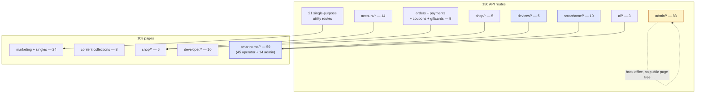

---

## 6. External contracts & integrations

Career.circuvent had one upstream (its ATS). This application has none of its network
surface concentrated like that: eight independent external systems, each reached by a
different `src/lib` module, plus one internal-but-separate system (`platform/`) that is
also called directly by a completely different repository (`mobile/`) without this
website ever being on that path. Every entry below was confirmed either in source or in
`.env.example` / `Docs/11-secrets.md` — nothing here is inferred from the variable name
alone.

```
   ┌────────────────────────────────────────────────────────────────────────┐
   │  PAYMENTS                                                               │
   ├────────────────────────────────────────────────────────────────────────┤
   │  Razorpay          raw fetch, no SDK installed. Basic auth, base64     │
   │                    (keyId:keySecret). api.razorpay.com/v1/orders and   │
   │                    /v1/payments/{id}. Inbound webhook verifies its     │
   │                    HMAC signature, then does nothing else -- §8.1.     │
   ├────────────────────────────────────────────────────────────────────────┤
   │  AI                                                                     │
   ├────────────────────────────────────────────────────────────────────────┤
   │  lib/ai/provider   raw fetch, OpenAI chat-completions wire format,      │
   │                    no vendor SDK. Default https://api.openai.com/v1,   │
   │                    model gpt-4o-mini. AI_BASE_URL/AI_API_KEY/AI_MODEL  │
   │                    (or OPENAI_* fallbacks) repoint it at Azure OpenAI,  │
   │                    Groq, Together, or a self-hosted Ollama/vLLM with    │
   │                    zero code changes. aiConfigured()==false -> every    │
   │                    caller (assistant, fleet analysis) degrades to a     │
   │                    deterministic, model-free analysis instead of an     │
   │                    error -- resilience by design, not by accident.      │
   ├────────────────────────────────────────────────────────────────────────┤
   │  EMAIL  --  three independent providers, chosen per call site           │
   ├────────────────────────────────────────────────────────────────────────┤
   │  Resend            RESEND_API_KEY -- transactional mail                │
   │  SMTP / nodemailer SMTP_HOST/PORT/USER/PASS -- transactional, 2nd path  │
   │  Buttondown        BUTTONDOWN_API_KEY -- /api/newsletter signups only,  │
   │                    the ONLY caller of this provider in the codebase     │
   ├────────────────────────────────────────────────────────────────────────┤
   │  CIRCUVENT'S OWN IDENTITY DOMAIN  (not this repository, §3.1)           │
   ├────────────────────────────────────────────────────────────────────────┤
   │  auth.circuvent.com   OIDC/PKCE issuer for admin SSO login (§8.5) AND   │
   │                       the live mail-group directory read by            │
   │                       GET /api/admin/groups for report recipients      │
   ├────────────────────────────────────────────────────────────────────────┤
   │  PLATFORM  --  separate repo, same working tree (§11.2, C4 in §1-2)     │
   ├────────────────────────────────────────────────────────────────────────┤
   │  CONTROL_PLANE_URL    HTTPS to 140.245.238.154. Two different auth      │
   │                       shapes depending on caller: HMAC device sync/     │
   │                       command from 2 of 5 device/* routes, and a       │
   │                       control-plane-delegated bearer token re-checked   │
   │                       at 4 independent call sites (§10.7). mobile/      │
   │                       calls the SAME control plane directly and does    │
   │                       NOT go through this website at all (§1.1).        │
   ├────────────────────────────────────────────────────────────────────────┤
   │  MISCELLANEOUS THIRD PARTIES                                            │
   ├────────────────────────────────────────────────────────────────────────┤
   │  GitHub REST API      GITHUB_TOKEN -- live commit/star stats for the    │
   │                       public /projects page                            │
   │  weather provider     lib/weather.ts -- backs /api/weather; no key      │
   │                       variable catalogued in .env.example               │
   │  CV-365 Firebase      NEXT_PUBLIC_CV365_FIREBASE_* -- relays the        │
   │                       public contact form to work.circuvent.com/admin/  │
   │                       messages. A THIRD legitimate circuvent.com         │
   │                       subdomain, and still nothing to do with the       │
   │                       unrelated circuvent-platform/ repo (§3.1).        │
   │  web-push (VAPID)     browser push subscriptions, delivered directly,   │
   │                       no third-party push relay in front of it          │
   ├────────────────────────────────────────────────────────────────────────┤
   │  DECLARED IN .env.example -- NOT WIRED UP ANYWHERE                      │
   ├────────────────────────────────────────────────────────────────────────┤
   │  GOOGLE_CLIENT_ID / GOOGLE_CLIENT_SECRET / GOOGLE_CALLBACK_URL appear    │
   │  in .env.example and Docs/11-secrets.md. `grep`ing all of src/ for      │
   │  either name returns nothing: there is no "Sign in with Google" route,  │
   │  page, or library call in this codebase. Vestigial, not a 6th scheme.   │
   └────────────────────────────────────────────────────────────────────────┘
```

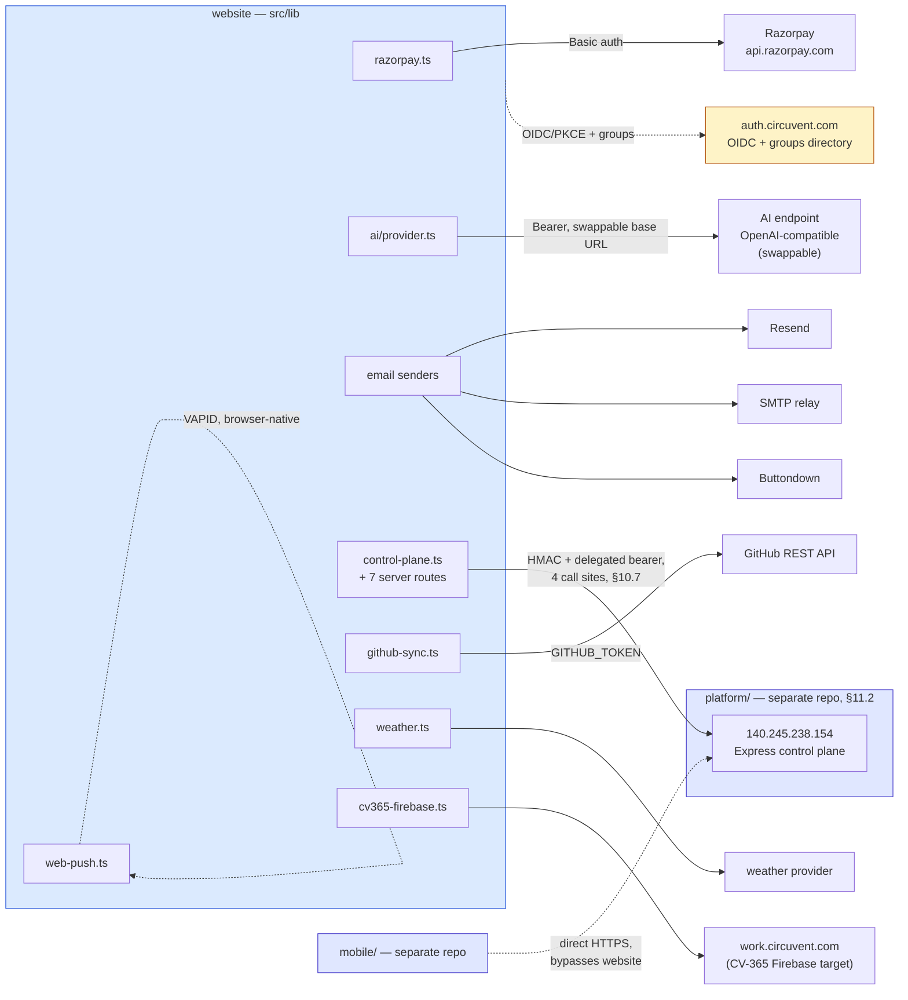

Two asymmetries are worth naming explicitly. First, `platform/` is the only external
system this website both calls *and* shares with a caller it has no control over
(`mobile/`) — every other integration above is this website's private dependency.
Second, `GOOGLE_CLIENT_ID` is the only variable in this whole inventory that is
documented in two places (`.env.example`, `Docs/11-secrets.md`) and used in zero: it is
carried forward here, not silently dropped, because an atlas that only reports what is
wired up would miss a real piece of the deployment's configuration surface.

---

## 7. Data model

Exactly 10 tables, all created by `initDb()` (§7.2) from one TypeScript array of DDL
strings in `src/lib/db.ts` — no Prisma, no Drizzle, no `.sql` migration files anywhere
in the repository. **Zero** `FOREIGN KEY`, `REFERENCES`, or `UNIQUE` constraints appear
in any of the 10 `CREATE TABLE` statements: every `PK` below is real (a real Postgres
primary key), every relationship implied by an `FK`-shaped comment is enforced only in
application code. Row-level security: **none**, on any table — this database has no
concept of a tenant, so there is nothing for a policy to scope.

### 7.1 Entity-relationship diagram

```
   ┌────────────────────────────────────────────────────────────────────────┐
   │  IDENTITY  --  3 dedicated, typed tables                                │
   ├────────────────────────────────────────────────────────────────────────┤
   │  accounts               PK email    shop customers                     │
   │  admin_users            PK email    staff / admin accounts + role       │
   │  pending_registrations  PK email    signup OTP, in-flight only          │
   ├────────────────────────────────────────────────────────────────────────┤
   │  GENERIC KV  --  1 table, 26 logical documents (§7.3)                   │
   ├────────────────────────────────────────────────────────────────────────┤
   │  store_kv   PK (collection, key)    23 shop collections @ key='_all' +  │
   │             data JSONB NOT NULL     3 durable file-stores (§7.4)        │
   ├────────────────────────────────────────────────────────────────────────┤
   │  ANALYTICS / AUDIT  --  3 tables, append-only, no updates               │
   ├────────────────────────────────────────────────────────────────────────┤
   │  email_history    BIGSERIAL id    every email ever sent (evidence log)  │
   │  request_metrics  BIGSERIAL id    per-request latency/status samples    │
   │  page_views       BIGSERIAL id    anonymised visits, salt rotates daily │
   ├────────────────────────────────────────────────────────────────────────┤
   │  SMART-HOME CAMERA RELAY  --  3 tables, deliberately NOT history        │
   ├────────────────────────────────────────────────────────────────────────┤
   │  camera_frames         PK device_id  newest frame only, overwritten     │
   │  camera_audio          BIGSERIAL id  rolling live-listen buffer, pruned │
   │  camera_audio_session  PK device_id  one pending listen/speak token     │
   └────────────────────────────────────────────────────────────────────────┘
   RLS on all 10 tables above: NONE. No policy, no tenant column, no schema
   separation -- a single Neon connection string sees every row in the app.
```

```mermaid
erDiagram
    accounts {
        text email PK
        text name
        text password_hash
        text password_salt
        text phone
        boolean blocked
        jsonb data "full entity, source of truth"
    }
    admin_users {
        text email PK
        text role
        boolean active
        text password_hash
        jsonb data
    }
    pending_registrations {
        text email PK
        text otp
        bigint expires
        int attempts
        text ref
    }
    store_kv {
        text collection PK "23 shop names + 'file_store'"
        text key PK "'_all', or a filename (§7.4)"
        jsonb data
        timestamptz updated_at
    }
    email_history {
        bigserial id PK
        text to
        text type
        text status
        text provider
        text message_id
    }
    request_metrics {
        bigserial id PK
        text endpoint
        text method
        int status
        real ms
    }
    page_views {
        bigserial id PK
        text path
        text visitor_hash "salted, rotates daily"
        text device
        text country
    }
    camera_frames {
        text device_id PK
        text jpeg_b64
        text upload_token
        timestamptz token_expires
    }
    camera_audio {
        bigserial id PK
        text device_id
        text wav_b64
        timestamptz captured_at
    }
    camera_audio_session {
        text device_id PK
        text listen_token
        text speak_token
        text speak_wav_b64
    }
```

No relationship lines connect the ten boxes above because none exist in the schema —
that absence is not an omission from this diagram, it is the finding. `accounts.email`
and `admin_users.email` are referenced by string from application code (sessions, the
shop-console SSO bridge, audit rows) but Postgres itself enforces none of it.

### 7.2 `initDb()` — runtime schema, not migrations

```
   cold start (new lambda instance, or first import after a deploy)
        |
        v
   store.ts evaluates -> top-level `await bootstrap()` blocks every route
   handler in this module graph until it resolves (plain ESM semantics,
   no framework hook involved)
        |
        v
   dbLayer.initDb()  -- memoized into a module-level `_initPromise`, so
   |                    every later call from THIS instance is a free,
   |                    already-resolved promise for the rest of its life
   |
   +--> first call only: for (stmt of SCHEMA_STATEMENTS) await q(stmt)
   |      10x  CREATE TABLE IF NOT EXISTS ...     run sequentially, in
   |      12x  CREATE INDEX IF NOT EXISTS ...      the array's literal order
   |
        v
   dbLayer.dbHydrate()  -- SELECT data FROM every typed table, plus every
   |                       store_kv row, assembled into one `mem` object
        v
   first run only: products/coupons seed data is generated, written into
   `mem`, and flushed immediately -- the database becomes source of truth
   from boot one, not from the first admin edit
        |
        v
   route handlers now read/write `mem` only. Postgres is touched again
   only by scheduleFlush() (changed collections, after the response is
   built) and by revalidate() (an explicit targeted re-read, called only
   from login/signup/admin routes that need cross-instance consistency)
```

```mermaid
sequenceDiagram
    participant L as Lambda cold start
    participant S as store.ts (bootstrap)
    participant D as db.ts (initDb / dbHydrate)
    participant PG as Neon Postgres (HTTP driver)

    L->>S: module import graph evaluates
    S->>S: top-level await bootstrap()
    S->>D: initDb()
    alt first call in this instance
        D->>PG: CREATE TABLE IF NOT EXISTS x10
        D->>PG: CREATE INDEX IF NOT EXISTS x12
    else already memoized
        Note over D: cached _initPromise, no network call
    end
    S->>D: dbHydrate()
    D->>PG: SELECT data FROM &lt;every table / store_kv row&gt;
    PG-->>D: rows
    D-->>S: Partial&lt;DB&gt;
    S->>S: mem = merge(emptyDB(), data); seed products/coupons if empty
    Note over S,PG: every request now reads/writes mem only;<br/>PG is touched again solely by flush() and revalidate()
```

There is no schema-version table and no rollback path: `IF NOT EXISTS` on every
statement is the entire migration strategy. A column rename would need a second,
additive `CREATE TABLE IF NOT EXISTS` block, hand-written, run through this same
memoized function — the same shape as every table already here.

### 7.3 `store_kv` — one JSONB document per collection

```
   ┌────────────────────────────────────────────────────────────────────────┐
   │  store_kv     PRIMARY KEY (collection, key)     data JSONB NOT NULL     │
   ├────────────────────────────────────────────────────────────────────────┤
   │  23 x  collection = <shop collection name>,  key = '_all'               │
   │        the ENTIRE collection -- an array or an email-keyed map --       │
   │        serialised as ONE JSONB value. Not one row per order, per        │
   │        wallet, per ticket: one row per COLLECTION, full stop.           │
   │        e.g. collection='orders', key='_all', data={ [orderId]: ... }    │
   ├────────────────────────────────────────────────────────────────────────┤
   │   3 x  collection = 'file_store',  key = <filename>                    │
   │        one durable createFileStore module's whole document (§7.4)       │
   │        e.g. collection='file_store', key='icm-incidents.json'           │
   └────────────────────────────────────────────────────────────────────────┘
   26 logical documents, 1 physical table. Writing a single order rewrites
   the WHOLE `orders` blob (read-modify-write of the entire collection).
   Neon's HTTP driver has no transactions (§7.2), and store.ts's flush
   chain only serialises writes WITHIN one instance -- two lambda
   instances flushing `orders` at the same moment can still race.
```

The 23 shop collections, named exactly as declared in `db.ts`'s `KV_COLLECTIONS`
array: `orders`, `products`, `wallets`, `devices`, `reviews`, `addresses`,
`notifyRequests`, `logins`, `coupons`, `tickets`, `returns`, `audit`, `loyalty`,
`referrals`, `referralCodes`, `giftCards`, `questions`, `notifications`,
`passwordResets`, `admin2fa`, `alertSettings`, `contactMessages`, `consumedPayments`.

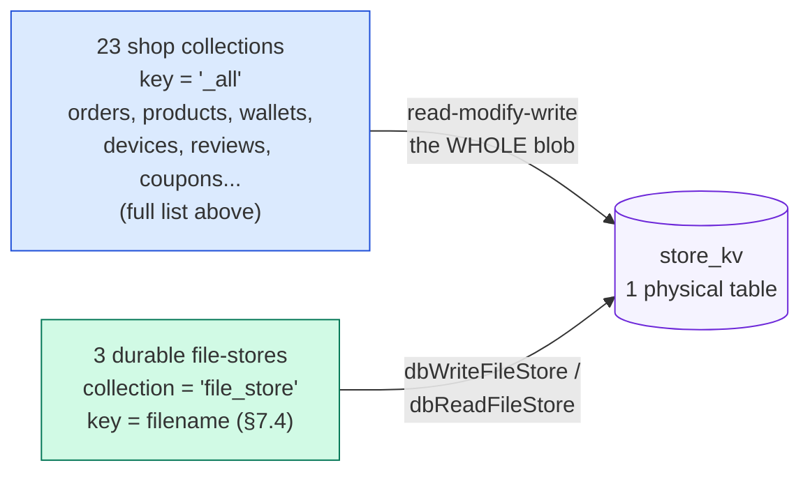

### 7.4 Storage durability — `createFileStore` and the memory-only majority

`src/lib/data-file.ts`'s `createFileStore()` is a second, entirely separate
persistence mechanism from §7.1–7.3 — used by standalone feature modules that never
touch `store.ts`'s `DB` interface. It tries a disk write under `DATA_DIR`
(`.data/` by default) first; on Vercel's read-only production filesystem that write
fails exactly once, `canWrite` latches `false` for the rest of the instance's life,
and a console warning is logged. Only if the caller passed `{ durable: true }` **and**
`DATABASE_URL` is set does the module *also* mirror into `store_kv` (§7.3) — otherwise
it is memory-only from that point on, for that instance.

Counted directly from source (`createFileStore<` call sites, test file excluded):
**37 call sites across 35 modules. Exactly 3 modules pass `durable: true`** —
`admin-warranty.ts`, `api-failures.ts`, and `icm-store.ts` (which alone accounts for 2
of the 4 durable call sites). The other **32 modules are memory-only in production**,
slightly more than doc 03's rough estimate of "27 of about 30" — this atlas corrects
that figure to the exact one, in the same spirit as the OTA correction in §8.3.

```
   ┌────────────────────────────────────────────────────────────────────────┐
   │  DURABLE  (3 modules -- mirrored into store_kv, survive a cold start)   │
   ├────────────────────────────────────────────────────────────────────────┤
   │  admin-warranty.ts    warranty claims and policies                      │
   │  api-failures.ts      recorded upstream API failures for diagnostics    │
   │  icm-store.ts         incident/change records (2 durable call sites)    │
   ├────────────────────────────────────────────────────────────────────────┤
   │  MEMORY-ONLY IN PRODUCTION  (32 modules -- gone on cold start/redeploy) │
   ├────────────────────────────────────────────────────────────────────────┤
   │  Commerce config   admin-pricing, admin-currency, admin-tax, admin-     │
   │                    bundles, admin-shipping, admin-subscriptions,        │
   │                    admin-fraud, admin-marketing, admin-vendors,         │
   │                    admin-affiliates                                    │
   │  Content / CRM     admin-cms (every CMS post), admin-crm (every note    │
   │                    and tag), admin-seo-manager, admin-macros,           │
   │                    admin-surveys                                       │
   │  Platform ops      admin-bulk, admin-jobs, admin-flags (every feature   │
   │                    flag and experiment), admin-integrations (API keys, │
   │                    webhooks, deliveries), admin-staff-activity,         │
   │                    admin-report-builder, reports-schedule, admin-       │
   │                    privacy, deployments                                │
   │  Smart-home        admin-config, alerts-store, device-history,         │
   │                    smarthome-dev-portal (every developer-portal         │
   │                    token), user-prefs                                  │
   │  Security-adjacent telemetry-store (2 call sites), web-push (every      │
   │                    push subscription), passkeys.ts (every registered    │
   │                    WebAuthn credential in the whole application)        │
   └────────────────────────────────────────────────────────────────────────┘
```

The last row is the sharpest edge: a credential class (passkeys) and a delivery
mechanism (push subscriptions) that most engineers would assume are durable by
category are, in this deployment, exactly as ephemeral as a cached CMS draft.

```mermaid
flowchart TB
    call["createFileStore(filename, seed, opts)<br/>37 call sites, 35 modules"]
    diskTry{"disk write<br/>under DATA_DIR"}
    diskOK["written to .data/*.json<br/>-- true on a persistent disk,<br/>never true on Vercel prod"]
    diskFail["canWrite = false<br/>(latched for this instance)"]
    durFlag{"opts.durable === true<br/>AND DATABASE_URL set?"}
    pgMirror["mirrored into store_kv<br/>collection='file_store' (§7.3)<br/>3 modules only"]
    memOnly["in-memory only<br/>gone on cold start / redeploy<br/>32 modules"]

    call --> diskTry
    diskTry -->|"writable FS"| diskOK
    diskTry -->|"read-only FS<br/>(Vercel production)"| diskFail
    diskFail --> durFlag
    durFlag -->|"yes, 3 modules"| pgMirror
    durFlag -->|"no, 32 modules"| memOnly

    style pgMirror fill:#D1FAE5,stroke:#047857
    style memOnly fill:#FEE2E2,stroke:#B91C1C
    style diskFail fill:#FEF3C7,stroke:#B45309
```

---

## 8. Workflows, end to end

Five flows, chosen because each one crosses a trust boundary this atlas has already
named: shop money, device firmware, and the two SSO bridges (`§6`, `§10`). Mermaid is
the primary notation here, as it is for Career.circuvent's own §8 — a sequence is a
poor fit for a monospace box, and the same information is not repeated in ASCII.

### 8.1 Checkout and payment — Razorpay, and the reconciliation gap

```mermaid
sequenceDiagram
    autonumber
    actor U as Shopper
    participant B as Browser (checkout.js)
    participant W as website /api/payments/*
    participant R as Razorpay
    participant S as store.ts (mem + Postgres)

    U->>B: place order
    B->>W: POST create-order { items, coupon, walletApply }
    W->>W: priceItems() recomputes the total server-side
    W->>R: POST /v1/orders (Basic auth keyId:keySecret)
    R-->>W: { id: orderId }
    W-->>B: { orderId, keyId, amount }
    B->>R: open Checkout.js modal
    U->>R: pays
    alt browser JS callback fires
        R-->>B: razorpay_order_id, payment_id, signature
        B->>W: POST /api/payments/verify
        W->>W: checkoutSignatureValid(): HMAC-SHA256(order_id|payment_id)
        W->>R: GET /v1/payments/{id} -- re-fetch, never trust the request body
        R-->>W: { status: "captured", amount }
        W->>W: amount == recomputed total? consumePayment() claims the id once
        W->>S: recordOrder, adjustStock, earnPoints, flushNow()
        W-->>B: 200 { order }
    else tab closes / network dies before the callback
        Note over B,R: Razorpay HAS captured the money;<br/>the browser never comes back
        R->>W: POST /api/payments/webhook (server-to-server, independent of the browser)
        W->>W: verify x-razorpay-signature, HMAC-SHA256 over the raw body
        W->>W: console.log(event) -- the reconciliation hook is a comment, not code
        W-->>R: 200 { success: true }
        Note over W,S: NO order is ever recorded for this captured payment
    end
```

The happy path is genuinely well defended: the handback signature only proves the
browser saw a real Razorpay response, so `verify` re-fetches the payment from
Razorpay's own API, requires `status === "captured"`, compares the gateway's
`amount` against a total recomputed from the catalogue (never the request body),
and claims the payment id exactly once through `consumePayment` so the same
triple cannot be replayed into a second order. What is missing is the second
channel that exists specifically to cover the first one failing: Razorpay's
webhook is configured, its signature is verified correctly, and then nothing
downstream of the `console.log` ever touches `orders`, `wallets` or the emails
in `lib/order-core.ts`. A captured payment whose browser never returns is
captured money with no order — permanently, not until the next poll.

### 8.2 OTA firmware update — the pull path, and the missing signature

```mermaid
sequenceDiagram
    autonumber
    participant D as ESP32 device (CircuventDevice::checkOTA)
    participant W as website GET /api/devices/firmware
    participant M as fw/manifest.json (public bucket)
    participant E as process.env OTA_<TYPE>

    loop every _otaInterval (device-side timer, ~6h)
        D->>D: WiFiClientSecure + _pinRoot() -- TLS pinned, no other CA accepted
        D->>W: GET ?type&id&ver=CV_FW_VERSION<br/>headers x-device-id, x-device-key
        W->>W: require both headers present, else 401
        W->>E: read OTA_<TYPE> (operator override)
        alt env var set
            E-->>W: "version|url"
        else env not set
            W->>M: GET manifest.json (5 min in-instance cache)
            M-->>W: { version, url, sha256? }
        end
        W->>W: compare versions as OPAQUE strings, not "is newer" --<br/>this is what makes a rollback possible
        Note over W,D: sha256, even on the rare manifest entry that<br/>carries one, is never read or returned here
        W-->>D: { version, url } or { version: current, url: "" }
        alt url present and version != current
            D->>D: _applyOta(): a second WiFiClientSecure + _pinRoot()
            D->>W: GET binUrl (same pinned TLS, no further check)
            W-->>D: firmware.bin bytes
            Note over D: httpUpdate.update() flashes the image.<br/>TLS proves the HOST; nothing proves the BINARY --<br/>no hash check and no signature anywhere in this path.
            D->>D: reboot into the new image
        end
    end
```

TLS pinning is real and does its job: an on-path attacker cannot answer the manifest
request or the binary download with a certificate this device will accept. What
pinning cannot do is prove the *content* served by the legitimate, correctly
authenticated host is the build the fleet owner intended to publish — a compromised
publish credential, a mis-uploaded object in the bucket, or a bug in
`scripts/publish-firmware.cjs` all flash straight to the chip. Several of the 17
SKUs behind this exact code path switch mains relays or operate a door lock
(`facedoor.ino`, `switchboard.ino`); an unsigned OTA channel is a materially
different risk on those than on a soil-moisture sensor.

### 8.3 Correcting the fact base — the manifest endpoint exists

```
   ┌──────────────────────────────────────────────────────────────────────┐
   │  CORRECTION to 03_INTEGRATIONS_AND_ECOSYSTEM.md                       │
   ├──────────────────────────────────────────────────────────────────────┤
   │  Doc 03 describes the OTA pull path as polling a manifest endpoint    │
   │  that "DOES NOT EXIST". That is no longer accurate: this repository  │
   │  contains a working handler at                                       │
   │  `src/app/api/devices/firmware/route.ts` (§5.3, §8.2 above), which    │
   │  every sketch's `CircuventDevice::checkOTA()` calls successfully.     │
   │                                                                       │
   │  What doc 03 identified correctly, one layer down from where it       │
   │  placed it, still stands: the endpoint answers with a version and a   │
   │  URL only, never a signature and never an enforced hash. The real     │
   │  defect is image authenticity, not endpoint existence -- see §8.2.    │
   └──────────────────────────────────────────────────────────────────────┘
```

This is the one place this atlas's own reading of the source disagrees with the
fact base it was handed, per the promise in the opening paragraph. Nothing else
in docs 01–05 needed correcting against `src/`; this single case is called out
because the difference between "no endpoint" and "an endpoint with no signature
check" changes what an engineer would fix first.

### 8.4 Shop → console SSO bridge

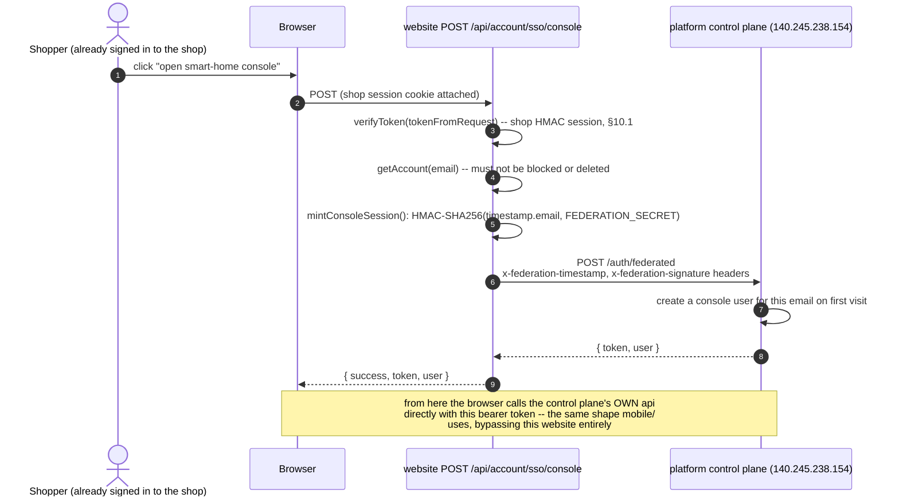

The storefront and the smart-home console keep separate user tables by design, so
this route is a vouching step, not a login: the website proves to itself that the
caller already holds a valid shop session, then asks the control plane to open or
create a console account for that same address. `FEDERATION_SECRET` never leaves
this process — it signs an outbound request, it is never handed to the browser —
and a second guard, `federationAllowedHere()`, stops a preview deployment that
happens to hold the production secret from minting live console sessions.

### 8.5 Admin sign-in via Circuvent SSO (OIDC + PKCE)

```mermaid
sequenceDiagram
    autonumber
    actor A as Admin
    participant B as Browser
    participant S as GET .../sso/start
    participant C as GET .../sso/callback
    participant X as POST .../sso/exchange
    participant I as auth.circuvent.com (OIDC issuer)

    A->>B: "Sign in with Circuvent"
    B->>S: GET
    S->>S: beginSso(): PKCE code_challenge, random state
    S-->>B: redirect to I, Set-Cookie state+verifier (sealed, path-scoped)
    B->>I: GET /authorize?...
    A->>I: authenticates at the identity service
    I-->>B: redirect to C ?code&state
    B->>C: GET ?code&state (cookie attached)
    C->>C: state must equal the cookie's state, else abort
    C->>I: POST /api/oauth/token (code_verifier)
    I-->>C: { access_token, id_token }
    C->>C: role claim read from id_token -- a group grant surfaces here
    C->>I: GET /api/oauth/userinfo (bearer access_token)
    I-->>C: { email, email_verified, name, picture }
    C->>C: email_verified must be true, else abort
    C->>C: provision/update admin_users -- staff-list role OR an SSO-granted<br/>role, NEVER the bare default "staff" role
    C->>C: signHandoff(email, nonce) -- 90 seconds, single use
    C-->>B: redirect /admin?sso=handoff, Set-Cookie nonce
    B->>X: POST { code: handoff } (nonce cookie attached)
    X->>X: verifyHandoff(code, nonce) -- re-checks staff.active again
    X->>X: signAdminToken(email) -- the SAME HMAC session password login issues, §10.2
    X-->>B: { token, role, ... }
```

Three hops, not one, and each exists for a reason found in the source comments: the
token never rides in a URL (so it never sits in browser history or a proxy log),
the code is single-use and expires in ninety seconds, and staff status is checked
twice — once at the callback and again at the exchange — because a role can be
revoked in the gap between them. The flow's real subtlety is authorisation, not
authentication: the identity service will happily sign in anyone with a Circuvent
account, so `roleClaimFromIdToken` only grants console access from an explicit
per-console role or group grant, never from the ordinary `staff` default every
employee already has.

**The common thread across 8.1, 8.4 and 8.5:** each cross-boundary exchange is
server-verified and single-use-claimed (`consumePayment`, the SSO nonce, the OTP-
like handoff code). The one exception is the payment webhook in 8.1, which has the
verification but not the claim — the only flow in this section where a second,
independent confirmation channel exists on paper and is not wired to anything.

---

## 9. State machines

### 9.1 Order lifecycle, and the return it can spawn

```mermaid
stateDiagram-v2
    [*] --> placed: POST /api/payments/verify (or COD) records the order
    placed --> shipped: admin/orders marks shipped
    shipped --> delivered: admin/orders marks delivered
    placed --> cancelled: customer or admin cancels
    shipped --> cancelled: customer or admin cancels
    cancelled --> [*]
    delivered --> requested: customer opens a return within the window
    requested --> approved: admin approves
    requested --> rejected: admin rejects
    approved --> refunded
    rejected --> [*]
    refunded --> [*]
    delivered --> [*]: no return ever opened
```

`placed`, `shipped`, `delivered` and `cancelled` are the order's own `status` field;
`requested`, `approved`, `rejected` and `refunded` belong to a separate row in the
`returns` collection (`store.ts:262`) that references the order rather than
replacing its status. Warranty eligibility (`warranty.ts`) reads the same
`delivered` transition to start its own clock.

### 9.2 Device online/offline

```mermaid
stateDiagram-v2
    [*] --> Provisioning: no Wi-Fi credentials saved -- soft AP + portal up
    Provisioning --> Connecting: credentials received via the captive portal
    Connecting --> Reconnecting: Wi-Fi association fails
    Reconnecting --> Connecting: exponential backoff, 3s doubling to a 96s cap
    Connecting --> Online: Wi-Fi + MQTT both up --<br/>publishes retained cv/id/status {"online":true}
    Online --> Online: heartbeat interval OR an immediate publish on local change
    Online --> Offline: broker detects an unclean disconnect --<br/>LWT delivers {"online":false}
    Offline --> Connecting: device reboots or Wi-Fi returns
```

"Online" and "offline" as the console displays them are entirely MQTT's own
retained-message-plus-Last-Will mechanism (`CircuventDevice.h:12`); there is no
separate heartbeat table on the server side that ages a device out.

### 9.3 Session and token lifecycle

```mermaid
stateDiagram-v2
    [*] --> Issued: sign-in succeeds -- password, one-time code, passkey, or SSO
    Issued --> Valid: HMAC verifies AND tokenVersion matches account state
    Valid --> Valid: re-checked against account state on every request
    Valid --> Revoked: password reset or an admin block bumps tokenVersion
    Valid --> Expired: sign-in age exceeds the cap for this session kind
    Revoked --> [*]
    Expired --> [*]

    note right of Valid
        Shop session: 24h flat cap (account.ts), down from 30 days
        Admin session: 12h token TTL, PLUS a 24h absolute sign-in cap
        (session-expiry.ts) measured from the original sign-in, not
        the token -- a renewal cannot extend it
        Console session (platform-owned, minted at 8.4/8.5): 30-day
        access token backed by a 60-day refresh token that renews
        itself silently on a 401 -- a materially longer, differently
        shaped lifecycle this repository does not control
    end note
```

None of the three schemes issue a classic refresh token from this codebase: a
shop or admin session simply stops working at its cap and the person signs in
again. Only the console session, owned by `platform/`, renews itself.

### 9.4 CI pipeline — the intended shape, and the observed one

```mermaid
stateDiagram-v2
    [*] --> Queued: push or PR against main, master, feature/shopping
    Queued --> Running: a GitHub-hosted runner claims the job
    Running --> StartupFailure: OBSERVED 27 of 27 real runs --<br/>fails before Checkout, step 1 of 14, ever executes
    Running --> Checkout
    Checkout --> SetupAndInstall: setup-node, then npm ci
    SetupAndInstall --> TypeCheck: tsc --noEmit
    TypeCheck --> Lint: continue-on-error true -- reported, never blocks
    Lint --> UnitTests: npm test --ci --runInBand
    UnitTests --> ControlPlaneChecks: platform/api install, type-check, test -- ~290 tests
    ControlPlaneChecks --> DbAdapterTest: PGlite adapter test
    DbAdapterTest --> Build: next build
    Build --> E2e: chromium install, Playwright, then upload the report (always)
    E2e --> Passed
    Passed --> [*]
    StartupFailure --> [*]: none of the 13 hard gates is ever reached
```

Fourteen named steps; `Lint` is the only one marked `continue-on-error`, so the
other thirteen are hard gates in the ordinary sense — a real failure at
`Unit tests`, `Control-plane tests` or `End-to-end tests` would stop a deploy.
None of that machinery has been exercised: every one of the 27 recorded runs
ends in `startup_failure`, the state GitHub Actions reports when the workflow
never starts executing steps at all — a runner or configuration problem
upstream of the YAML shown above, per `04_MAINTENANCE_AND_OPERATIONS.md`.

## 10. Cross-cutting concerns

### 10.1 The five authentication schemes — and the edge layer that checks none of them

```
 ┌─────┬────────────┬───────────────────────────────┬─────────────────────┐
 │  #  │ Subject    │ Mechanism                     │ Session cap         │
 ├─────┼────────────┼───────────────────────────────┼─────────────────────┤
 │  1  │ Shop       │ HMAC-SHA256(email, issuedAt,  │ 24h flat from       │
 │     │ customer   │ tokenVersion); password        │ sign-in, re-checked │
 │     │            │ (scrypt) or a WebAuthn passkey │ live every request  │
 │  2  │ Admin      │ HMAC-SHA256(email, issuedAt,  │ 12h token TTL PLUS  │
 │     │ staff      │ tokenVersion); password,       │ a 24h absolute cap  │
 │     │            │ passkey, or OIDC/PKCE (8.5)    │ from sign-in        │
 │  3  │ Device     │ static x-device-id +           │ none -- one long-   │
 │     │ (ESP32)    │ x-device-key header pair,      │ lived shared secret │
 │     │            │ checked against the store      │ printed per unit    │
 │  4  │ Console    │ Authorization: Bearer, either  │ owned by platform/: │
 │     │ user       │ password direct to the control │ 30d access + 60d    │
 │     │            │ plane, or bridged from #1 (8.4)│ refresh, self-renews│
 │  5  │ Scheduler  │ Authorization: Bearer          │ static; the same    │
 │     │ (cron)     │ <CRON_SECRET>, checked inline  │ check hand-written  │
 │     │            │ at 5 separate route files      │ five separate times │
 └─────┴────────────┴───────────────────────────────┴─────────────────────┘
```

```mermaid
flowchart TB
    subgraph Edge["Edge proxy -- runs on almost every matched request"]
        PX["proxy.ts<br/>x-request-id + Content-Security-Policy + host-mount routing<br/>NO AUTHENTICATION CHECK OF ANY KIND"]
    end

    PX -.->|"passes through unchanged"| R1["shop routes"]
    PX -.->|"passes through unchanged"| R2["admin routes"]
    PX -.->|"passes through unchanged"| R3["/api/devices/*"]
    PX -.->|"passes through unchanged"| R4["SSO / console-bridge routes"]
    PX -.->|"passes through unchanged"| R5["cron-triggered routes"]

    R1 --> S1["1. Shop HMAC session<br/>account.ts"]
    R2 --> S2["2. Admin HMAC session<br/>admin-auth.ts"]
    R3 --> S3["3. Device header key pair<br/>store.ts deviceSync()"]
    R4 --> S4["4. Console bearer token<br/>control-plane.ts / sso.ts"]
    R5 --> S5["5. Cron shared-secret bearer<br/>five inline checks"]

    style PX fill:#FEF2F2,stroke:#B91C1C,stroke-width:2px
```

Every route decides its own authentication for itself; nothing upstream of the
route handler enforces any of the five. `proxy.ts`'s own header comment says what
it is for: "request correlation + Content-Security-Policy" — nowhere does it read
a session, a device key, or a bearer token. A new route that forgets to call
`verifyToken` is a public route, and the platform gives no warning that this
happened. `GET /api/devices/firmware` (8.2) shows the quiet end of this: the
handler checks that `x-device-id`/`x-device-key` are *present*, then never
reads either value again — scheme 3 exists in name on that one endpoint only.

### 10.2 Security headers — complete, and applied twice

```
 ┌────────────────────────────┬──────────────────────────────────────────┐
 │ Header                     │ Value                                    │
 ├────────────────────────────┼──────────────────────────────────────────┤
 │ Strict-Transport-Security  │ max-age=63072000; includeSubDomains;     │
 │                            │ preload                                  │
 │ Content-Security-Policy    │ built from CSP_DIRECTIVES, lib/csp.ts    │
 │ X-Content-Type-Options     │ nosniff                                  │
 │ X-Frame-Options            │ DENY                                     │
 │ Referrer-Policy            │ strict-origin-when-cross-origin          │
 │ X-DNS-Prefetch-Control     │ on                                       │
 │ Permissions-Policy         │ camera=(), microphone=(),                │
 │                            │ geolocation=(self), browsing-topics=()   │
 │ Cross-Origin-Opener-Policy │ same-origin                              │
 └────────────────────────────┴──────────────────────────────────────────┘
```

All eight are declared once, globally, in `next.config.ts`'s `headers()` — every
response, every route, no opt-in required. The CSP is declared a *second* time,
identically, inside `proxy.ts`, precisely so a path the edge matcher excludes
(`_next/static`, the Workflow SDK's own callback path) still gets the policy from
`next.config.ts` alone. `connect-src` allow-lists exactly the external services
6.1 names (Razorpay, Firebase, Google Analytics, Vercel); `frame-ancestors 'none'`
and `object-src 'none'` are set; nothing here is partial or deferred.

### 10.3 Error handling — a wrapper nobody imports

```
   ┌───────────────────────────────────────────────────────────────────┐
   │ lib/api-handler.ts — withApi()                                    │
   │   Correlation id, structured request/error logging, a consistent  │
   │   { success:false, error, requestId } envelope, method guarding,  │
   │   optional rate limiting. Fully built, fully documented.          │
   │   IMPORTED BY ZERO ROUTES out of roughly 150.                     │
   ├───────────────────────────────────────────────────────────────────┤
   │ Every actual route                                                 │
   │   Hand-writes its own NextResponse.json({...}, {status}) for the  │
   │   errors it anticipated. What it did not anticipate throws.       │
   ├───────────────────────────────────────────────────────────────────┤
   │ app/error.tsx                                                     │
   │   The one Next.js route-segment boundary in the tree. Catches a   │
   │   throw from any page below it; shows a retry button.             │
   ├───────────────────────────────────────────────────────────────────┤
   │ app/global-error.tsx — DOES NOT EXIST                             │
   │   If the root layout itself throws, Next's own unstyled fallback  │
   │   is what a visitor sees. Nothing in this repository catches it.  │
   └───────────────────────────────────────────────────────────────────┘
```

A uniform, well-designed API wrapper was built and then never adopted: every one
of the ~150 route handlers rolls its own response shape and its own decision
about whether an unexpected throw is caught at all. Some do; a route with no
top-level `try`/`catch` and no `withApi` simply 500s with Next's default body,
carrying no `requestId` for support to search logs by.

### 10.4 No tenancy, and the guard against crossing it by accident

There is no tenant model anywhere in this application: one deployment, one
catalogue, one `admin_users` table, one Postgres database. "Tenancy" here means
only environment isolation — production data must never be reachable from a
preview deployment — and that boundary has already been crossed twice, by
accident, which is why two purpose-built guards now exist:

```
 ┌──────────────────────────┬──────────────────────────┬──────────────────┐
 │ Guard                    │ Incident it followed     │ Failure mode     │
 ├──────────────────────────┼──────────────────────────┼──────────────────┤
 │ assertNotProductionData()│ A preview deployment's   │ THROWS -- refuses│
 │ + PROD_DATA_HOSTS        │ DATABASE_URL pointed at  │ to boot rather   │
 │ (db.ts)                  │ prod; dev.circuvent.com  │ than silently    │
 │                          │ served real orders and   │ serving the      │
 │                          │ wallet balances           │ wrong database   │
 │ federationAllowedHere()  │ A preview build's SSO    │ RETURNS FALSE --│
 │ + PROD_IDENTITY_HOSTS    │ config vouched for real  │ looks exactly    │
 │ (sso.ts)                 │ customers against the    │ like a bad       │
 │                          │ live fleet; dev created  │ password, so a   │
 │                          │ accounts from real       │ refusal never    │
 │                          │ password hashes           │ confirms an      │
 │                          │                           │ address exists   │
 └──────────────────────────┴──────────────────────────┴──────────────────┘
```

Both guards share the same shape: a comma-separated host list, checked only on
*non*-production deployments, safe to leave unset, and safe to set everywhere
because a hostname is not a credential. They differ in what a match does —
`db.ts` throws (an empty shop is an obvious incident); `sso.ts` returns `false`
(a loud federation error would leak which emails are real customers). Neither
guard is a tenancy system; both are the scar tissue from not having one.

## 11. Deployment topology

### 11.1 Device and connectivity topology — 17 SKUs, five radios, one VM

Every one of the 30 firmware sketches counted in §3.2 ends up on the same box:
the Oracle VM at `140.245.238.154`. Nothing in `firmware/` talks to Vercel, to
Neon, or to this website at all — the split this atlas keeps repeating (website
owns commerce and content; `platform/` owns every device) is physical, not just
architectural. This table is the 17 retail SKUs; the paragraph below it is the
other 13 tracked sketches, which are not sold.

```
 Retail SKU (as sold)        Firmware directory(ies)         Code   Radio to the VM
 --------------------------- ------------------------------- ------ ---------------
 Home Automation Hub         home-hub/                       HUB    Wi-Fi -> MQTTS
 AquaGuard tank controller   aquaguard/                      AQG    Wi-Fi -> MQTTS
   -- split variant --       watertank/ + watertank-sensor/  TNK    LoRa, then Wi-Fi
 Smart Plug                  smart-plug/                     PLG    Wi-Fi -> MQTTS
 Smart Switch                smart-switch/                   SWT    Wi-Fi -> MQTTS
 Smart Light                 smart-light/                    LGT    Wi-Fi -> MQTTS
 Smart Fan                   smart-fan/                      FAN    Wi-Fi -> MQTTS
 Smart Lock                  smart-lock/                     LCK    Wi-Fi -> MQTTS
 Curtain controller          curtain/                        CRT    Wi-Fi -> MQTTS
 Motion Sensor               motion-sensor/                  MOT    Wi-Fi -> MQTTS
 Energy Monitor              energy-monitor/ (older)         NRG    Wi-Fi -> MQTTS
   -- replacement, see note  meter/ (cv-em1 / cv-em3)        NRG    Wi-Fi -> MQTTS
 Guardian (wearable SOS)     guardian/                       GRD    SIM800L cellular
 Agri Pump Starter           agri-starter/                   AGR    SIM800L cellular
 Touch Switchboard           touchboard/ + touchboard-8/     TCH    Wi-Fi -> MQTTS
 FaceDoor                    facedoor/                       FCD    Wi-Fi -> MQTTS
 RFID Gate                   rfid-gate/ + rfid-attend/       GAT    Wi-Fi -> MQTTS
 Sentinel (gas/climate)      sentinel/                       SNL    Wi-Fi -> MQTTS
 Load Controller             switchboard/                    none*  Wi-Fi -> MQTTS
```
\* `switchboard` has no row in `platform/api/src/serial.ts`'s `PRODUCT_CODES`
table. Per `DEVICE_REGISTRY.md`'s own documented rule, a serial minted from the
generic fallback code can be generated but can never be resolved back to a
device type by `typeFromProductCode()` — this one retail SKU is a genuine,
narrow gap in a registry that is otherwise careful about exactly this. The
"replacement, see note" row is explained just below the table: `meter/` is a
newer metering-IC redesign of the same Energy Monitor SKU, not a duplicate.

The other 13 tracked sketches are not sold, and reach the VM differently or not
at all: `camera/` (Wi-Fi, product code `CAM`, no first-party PCB in `hardware/`
— an accessory module, not a named line) and `anpr-cam/` (Wi-Fi, `ANP`, a gate
camera for the ANPR/visit-pairing feature in `platform/api/src/routes/anpr.ts`,
sold to businesses, not retail) both reach the VM over Wi-Fi like the SKUs
above. The drone (`drone-fc/`, ESP32-S3, plus `drone-link/` and `witness/`) and
the RC car (`rccar/`, `rc-link/`, `rc-remote/`) are the two items the fact base
calls out as present but not sold — see the connectivity notes below.

**Wi-Fi, direct (12 of 17 SKUs).** `CircuventDevice.h`'s base library joins the
home network, then opens `mqtts://mqtt.circuvent.com:8883`. TLS verifies the
broker's certificate against Circuvent's own CA (`O=Circuvent Technologies,
CN=Circuvent Device CA`, generated once by `platform/scripts/gen-certs.sh` and
embedded as `ca.crt` in every sketch that links the shared library) — a public
CA is never consulted, so a device will not trust anything else on the internet
that merely holds a valid certificate for `mqtt.circuvent.com`.

**GSM / cellular (guardian, agri-starter).** Both link a SIM800L modem over
`TinyGSM` instead of a Wi-Fi radio — confirmed by grep, no other sketch
includes `TinyGSM` or `SIM800`. A wearable SOS button and a pump starter bolted
to a field motor are exactly the two device classes that cannot assume a home
router is nearby. MQTTS still terminates on the same broker, over carrier data
instead of Wi-Fi; the broker cannot tell the two transports apart.

**LoRa 433 MHz (the AquaGuard split pair, `CvTankLink.h`).** `watertank-sensor`
floats in the tank and has no Wi-Fi radio at all; it speaks LoRa only, to
`watertank`, which is the unit within router range. Only `watertank` ever opens
a socket — the sensor's readings reach the VM by relay, one more hop than every
other SKU, and the sensor cannot be claimed or diagnosed except through it.

**ESP-NOW (two unrelated uses of the same radio mode, never the VM).**
`rccar` <-> `rc-remote` is peer-to-peer with no broker, no account and no
record in this application at all — switching it off is switching off the
toy, not a claim in a database (`CircuventRC/rc-protocol.h`). Separately,
`touchboard-8` <-> `switchboard` uses ESP-NOW for the *panel-to-relay* hop
inside one Load Controller/Touch Switchboard installation (`CvHomeLink.h`);
unlike the RC car, one side of that pair still reaches the VM afterwards over
Wi-Fi/MQTTS. The two uses share a radio mode and nothing else.

**MAVLink (drone-fc, internal only).** The flight-control loop is split across
the ESP32-S3's two cores on purpose: core 1 runs a 1 kHz gyro/cascade/motor
loop that "never touches Wi-Fi" (the sketch's own comment), speaking MAVLink to
the flight peripherals; core 0 owns Wi-Fi and MQTT and publishes batched
40-byte position records to `cv/<id>/track` (stored in `flight_track`, per
`PROTOCOL.md`, never as ordinary telemetry). MAVLink is the real-time control
protocol; MQTT is the reporting path — they never touch the same core.

```
   THE VM ITSELF -- 140.245.238.154, Oracle Cloud "Always Free" tier,
   VM.Standard.A1.Flex (4 OCPU / 24 GB, ARM), one docker-compose stack,
   5 containers on a single private bridge network ("internal"):

     caddy       :80 (ACME + redirect), :443 (HTTPS + WSS)   PUBLISHED
     mosquitto   :8883 (device MQTT/TLS, own CA)              PUBLISHED
                 :1883 (plaintext, healthcheck only)          internal
     api         :8080 Express control plane                  internal, behind caddy
     postgres    :5432 -- platform's OWN database, NOT Neon    internal only
     face        :8000 OpenCV face-embedder for FaceDoor,     internal only
                 384 MB hard cap so a leak cannot OOM-kill postgres instead

   DNS: api.circuvent.com and mqtt.circuvent.com both resolve to the same
   public IP. Port 22 (SSH) is the only other opening; everything else is
   the OS firewall default-deny plus one matching Oracle Cloud security list.
```

```mermaid
flowchart TB
    subgraph skus["17 retail SKUs + camera/anpr-cam"]
        wifi["12 SKUs, direct Wi-Fi<br/>hub · plug · switch · light · fan · lock<br/>curtain · motion · energy · touch · facedoor<br/>rfid-gate · sentinel · switchboard"]
        gsm["guardian · agri-starter<br/>SIM800L / TinyGSM cellular"]
        lora["watertank-sensor --LoRa 433MHz--> watertank<br/>the AquaGuard split pair"]
    end

    subgraph notsold["Not sold (fact base calls these out)"]
        rc["rccar <--ESP-NOW--> rc-remote<br/>peer-to-peer, no cloud, no account"]
        drone["drone-fc (ESP32-S3)<br/>core1: MAVLink @1kHz, never Wi-Fi<br/>core0: Wi-Fi/MQTT --> cv/id/track"]
        panel["touchboard-8 <--ESP-NOW--> switchboard<br/>panel-to-relay hop, then Wi-Fi/MQTTS"]
    end

    subgraph vm["Oracle VM 140.245.238.154 (5 containers, 1 network)"]
        caddy["caddy :80/:443<br/>reverse proxy, ACME"]
        mosq["mosquitto :8883<br/>own CA, ACL cv/&lt;id&gt;/#"]
        api["api :8080 Express<br/>internal only"]
        pg["postgres :5432<br/>internal only, own DB"]
        face["face :8000 OpenCV<br/>internal only, 384MB cap"]
    end

    wifi -->|"MQTTS :8883"| mosq
    gsm -->|"MQTTS over carrier data"| mosq
    lora -->|"Wi-Fi/MQTTS :8883"| mosq
    drone -->|"MQTTS :8883, track topic"| mosq
    panel -->|"Wi-Fi/MQTTS :8883"| mosq
    rc -.->|"never reaches this VM"| mosq

    mosq --> api --> pg
    facedoor2["facedoor SKU"] -.->|"embeddings"| face
    caddy --> api

    style rc fill:#F8FAFC,stroke:#94A3B8,stroke-dasharray: 5 5
    style vm fill:#FEF3C7,stroke:#B45309
```

### 11.2 Hosting — five clouds, one Vercel project, one VM, zero orchestration

```
                 ╭┈┈┈┈┈┈┈┈┈┈┈┈┈┈┈┈╮
                 ┊     GitHub      ┊  source + Actions CI
                 ┊  circuvent/web  ┊  14 steps, 27/27 startup_failure (§9.4)
                 ╰┈┈┈┈┈┈┈┈┈┈┈┈┈┈┈┈┈╯
                          │  push / PR
                          ▼
   ┌═══════════════════════════════════════════════════════════════════╗
   ║                            VERCEL                                  ║
   ║  one project, five web products, host-mounted (§3.3, proxy.ts):    ║
   ║    circuvent.com               marketing + shop + admin (default)  ║
   ║    home.circuvent.com          -> /smarthome  (also iot.*)          ║
   ║    developer.circuvent.com     -> /developer                       ║
   ║    dev.circuvent.com           persistent preview alias (§10.4)     ║
   ║                                                                     ║
   ║   EDGE (proxy.ts): request-id, CSP header, host-mount rewrite,      ║
   ║          one 308 category redirect -- NO auth check (§10.1)         ║
   ║   SERVERLESS: 150 route handlers, RSC pages -- ad hoc error         ║
   ║          handling per route, withApi() wrapper unused (§10.3)       ║
   ║   CRON (vercel.json, 4 schedules): alerts/run 08:00, reports/send   ║
   ║          04:00, smarthome/alerts/cron 06:00, availability/probe     ║
   ║          05:00 -- each checks its own CRON_SECRET bearer (§10.1)    ║
   ╚═══════════════════════════╤═══════════════╤═══════════════════════╝
                                │               │
                    DATABASE_URL│               │CONTROL_PLANE_URL
                        (HTTP)  │               │  (HTTPS, §6)
                                ▼               ▼
                ╭┈┈┈┈┈┈┈┈┈┈┈┈┈┈┈┈┈╮   ╭┈┈┈┈┈┈┈┈┈┈┈┈┈┈┈┈┈┈┈┈┈┈┈┈┈┈┈┈┈╮
                ┊ Neon Postgres   ┊   ┊ platform/ -- 140.245.238.154  ┊
                ┊ HTTP driver     ┊   ┊ Express + Mosquitto + its OWN ┊
                ┊ 10 tables (§7) ┊   ┊ Postgres + Caddy -- see §11.1  ┊
                ╰┈┈┈┈┈┈┈┈┈┈┈┈┈┈┈┈┈╯   ╰┈┈┈┈┈┈┈┈┈┈┈┈┈┈┈┈┈┈┈┈┈┈┈┈┈┈┈┈┈╯

   Other environment-scoped destinations from the same Vercel deployment:
     R2 (public, no credentials)  https://pub-...r2.dev/fw/manifest.json (§8.2)
     auth.circuvent.com           OIDC/PKCE issuer, admin SSO only (§8.5, §10.1)
     api.razorpay.com             checkout order + webhook signature (§8.1)
     GOOGLE_HOMEGRAPH_KEY / ALEXA_*  voice-assistant push, via platform/ (§6)

   mobile/ (Expo, shipped v1.13.1, Play Store) talks to BOTH systems from
   the same app, and says why in its own source comment (mobile/src/config.ts):
   device control (API_BASE, WS_URL) goes straight to platform/'s
   api.circuvent.com over REST + `wss://.../ws`, bypassing Vercel entirely --
   but the in-app assistant and "home analysis" call SITE_URL, this website,
   because only it holds the product catalogue and order history. One app,
   two backends, on purpose. native/ (Kotlin/Swift, iOS half never built)
   is not wired to either -- it has never shipped.
```

```mermaid
flowchart TB
    gh["GitHub<br/>push / PR"] -->|"webhook"| vercel

    subgraph vercel["VERCEL -- one project, five web products"]
        direction TB
        edge["Edge: proxy.ts<br/>request-id + CSP + host-mount<br/>NO auth check"]
        fn["Serverless: 150 routes, RSC<br/>ad hoc error handling"]
        cron["4 vercel.json crons<br/>CRON_SECRET each"]
    end

    gh -.->|"Actions CI, 27/27 startup_failure"| ciFail(("never once green"))

    vercel -->|"DATABASE_URL, HTTP"| neon[("Neon Postgres<br/>10 tables, §7")]
    vercel -->|"CONTROL_PLANE_URL"| vm
    vercel -->|"public GET, no creds"| r2[("Cloudflare R2<br/>firmware manifest")]
    vercel -->|"OIDC/PKCE"| authcv[("auth.circuvent.com<br/>admin SSO issuer")]
    vercel -->|"orders + webhook"| razor[("Razorpay")]

    subgraph vm["platform/ -- Oracle VM 140.245.238.154"]
        vmapi["Express :8080"]
        vmpg[("Postgres :5432<br/>NOT Neon")]
        vmmq["Mosquitto :8883"]
    end

    mob["mobile/ Expo v1.13.1<br/>Play Store"] -->|"REST + wss, direct"| vmapi
    mob -->|"assistant + home analysis<br/>SITE_URL, via Vercel"| vercel
    nat["native/ prototype<br/>iOS never built"] -.->|"not deployed anywhere"| vmapi

    style ciFail fill:#FEE2E2,stroke:#B91C1C
    style edge fill:#FEE2E2,stroke:#B91C1C
    style vm fill:#FEF3C7,stroke:#B45309
```

## 12. The test map

```mermaid
flowchart LR
    subgraph colocated["CO-LOCATED -- 116 files, next to the code they cover"]
        routes["route.test.ts<br/>API handlers -- largest is<br/>admin/icm/route.test.ts (443 lines)"]
        libts["lib/*.test.ts<br/>app-insights-usage (362)<br/>app-insights-query (324)"]
        admints["admin/*.test.tsx<br/>insights-charts.test.tsx (322)"]
    end

    subgraph dedicated["tests/** -- 120 files, cross-cutting"]
        fwsim["firmware simulation<br/>drone-flight-safety (336)<br/>camera-fps-parity (355)<br/>firmware-avi (424)"]
        icm2["icm.test.ts (342)<br/>incident state machine"]
        util2["lib/extended-utils.test.ts (316)"]
        logo["report-logo.test.ts<br/>THE ONE FAILURE TODAY"]
    end

    subgraph e2edir["e2e/ -- 8 Playwright specs"]
        pw["never run in CI --<br/>the workflow's own comment<br/>says so; .last-run.json is an<br/>undated local cache, not proof"]
    end

    subgraph untested2["UNTESTED -- confirmed by grep"]
        dbts["src/lib/db.ts<br/>the entire DB access layer"]
        cspts["src/lib/csp.ts<br/>generates the CSP header"]
    end

    style logo fill:#FEE2E2,stroke:#B91C1C
    style pw fill:#FEF3C7,stroke:#B45309
    style untested2 fill:#FEE2E2,stroke:#B91C1C
```

```
   236 Jest suite files (120 under tests/**, 116 co-located src/**/*.test.*  --
   the file count reconciles exactly against the runner's own report) run
   4,328 tests in 49.5s. One fails today: report-logo.test.ts, because the
   embedded base64 logo bytes drifted from the PNG on disk -- a small, honest
   failure, not a flaky one. jest.config.js has no coverageThreshold key, so
   none of this is enforced by a number -- and the 8 e2e/ Playwright specs,
   the only tests that exercise a real browser, have never once run in CI (§9.4).
```

---

## 13. Everything, on one page

```
   ╔══════════════════════════════════════════════════════════════════════════════════╗
   ║         THE CIRCUVENT SUITE -- EVERYTHING IN THIS WORKING TREE, ONE PAGE         ║
   ╠══════════════════════════════════════════════════════════════════════════════════╣
   ║                                                                                  ║
   ║ 5 web products, 1 Next.js app -> VERCEL EDGE (proxy.ts, NO auth gate)            ║
   ║ -> 150 routes -> Neon Postgres, HTTP driver, NO transactions, 10 tables,         ║
   ║    schema created at runtime by initDb() on every single call (§7.2)             ║
   ║                                                                                  ║
   ║ website/  -- this Next.js app, all of §1-10 below:                               ║
   ║   marketing site + e-commerce/Razorpay -- admin back office, 83 routes           ║
   ║   -- smart-home IoT console, 60+ sections -- public developer portal             ║
   ║   150 API routes, 108 pages, 428,355 loc, 4,328 tests (1 failing)                ║
   ║   35 file stores: 32 memory-only, 3 durable -- 5 auth schemes, and               ║
   ║   proxy.ts, which does not gate a single one of them                             ║
   ║                                                                                  ║
   ║ everything else living in this same tree, none of it part of website/:           ║
   ║   firmware/   30 sketches, 17 retail SKUs, ESP32, MQTTS -> one Oracle VM         ║
   ║   platform/   that Oracle VM -- Mosquitto + Express + its OWN Postgres           ║
   ║               + Caddy, none of it Vercel, none of it Neon (§11)                  ║
   ║   hardware/   real KiCad PCB designs and Gerbers for the 17 SKUs                 ║
   ║   mobile/     Expo app, SHIPPED v1.13.1 to the Play Store -- talks to            ║
   ║               BOTH platform/ (device control) and website (catalogue)            ║
   ║   native/     Kotlin/Swift prototype, iOS half has NEVER COMPILED                ║
   ║   a drone and an RC car -- present on disk, never sold to anyone                 ║
   ║   circuvent-platform/  an UNRELATED HR/payroll SaaS. Its README                  ║
   ║               PUBLISHES SEED LOGINS. It shares a name and nothing                ║
   ║               else -- see §3 for the diagram that says so loudly                 ║
   ║                                                                                  ║
   ╠══════════════════════════════════════════════════════════════════════════════════╣
   ║ THE BIGGEST DEFECTS, IN ONE PLACE                                                ║
   ║                                                                                  ║
   ║ 32 of 35 file stores are memory-only in production -- CMS, CRM, pricing,         ║
   ║ currency, tax config, feature flags, telemetry, dev-portal tokens, and           ║
   ║ PASSKEYS all vanish on the next cold start (§7.4)                                ║
   ║ Payment webhook verifies its signature, then does nothing -- a payment           ║
   ║ with no browser return is never reconciled (§8.1)                                ║
   ║ OTA is TLS-pinned but never checks an image hash or signature; the               ║
   ║ manifest endpoint DOES exist, correcting 03_INTEGRATIONS (§8.2, §8.3)            ║
   ║ proxy.ts sets the request id, the CSP header and the host rewrite --             ║
   ║ it does not gate one single route (§10.1)                                        ║
   ║ CI: 14 steps, 13 hard gates, 27 of 27 observed runs = startup_failure,           ║
   ║ never once reaching step 1 of 14 (§9.4)                                          ║
   ║ Neon's HTTP driver makes transactions impossible everywhere, always              ║
   ║ (§7.2) -- the co-located platform/ Postgres is a different database              ║
   ║ and does not share this limitation (§11.2)                                       ║
   ║                                                                                  ║
   ╠══════════════════════════════════════════════════════════════════════════════════╣
   ║ OWNS: five customer-facing web products, a home-grown HMAC session               ║
   ║       scheme, 35 file stores (32 of them one redeploy from empty), and           ║
   ║       all 150 routes and 108 pages catalogued in §5.                             ║
   ║ OWNS NOT: a transaction, a signed firmware image, a reconciled webhook,          ║
   ║       a green CI run, or any relationship to the payroll app three               ║
   ║       folders up that happens to share half its name.                            ║
   ╚══════════════════════════════════════════════════════════════════════════════════╝
```

---

*Back to [`README.md`](./README.md) · **01_SYSTEM_OVERVIEW.md** ·
**02_DATABASE_AND_DATA_MODELS.md** ·
**03_INTEGRATIONS_AND_ECOSYSTEM.md** ·
**04_MAINTENANCE_AND_OPERATIONS.md** ·
**05_AREAS_OF_ENHANCEMENT.md***


---


*Generated by `generate_docs.py` on 2026-08-20.*
