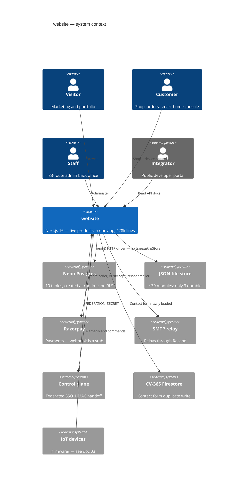
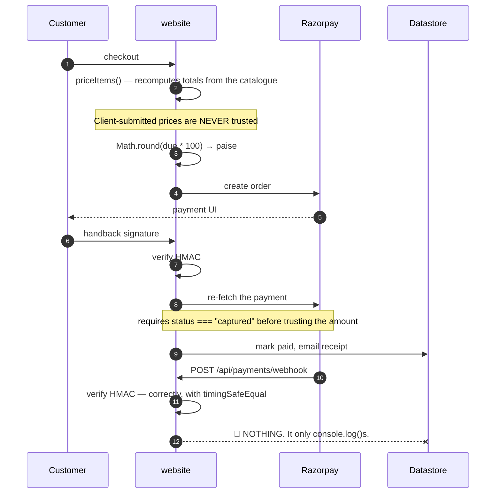
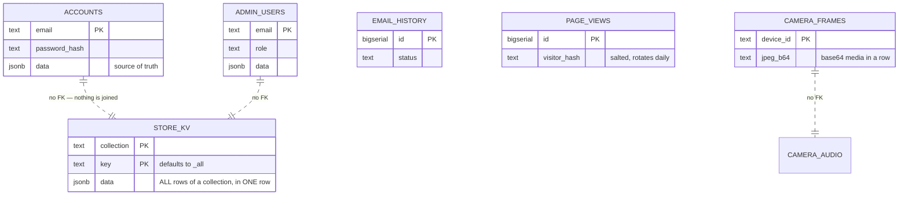
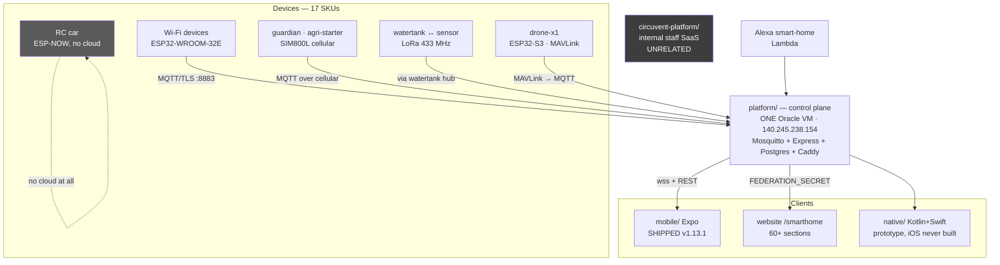
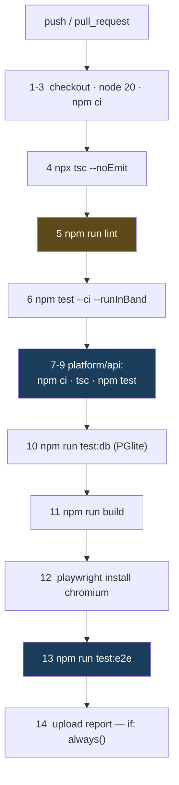
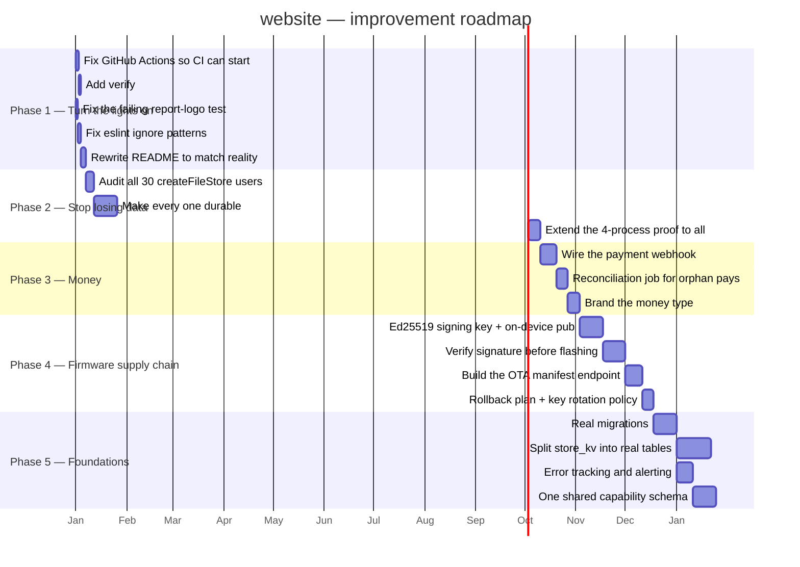

# Circuvent Technologies — Architecture & Technical Audit

> **Organisation:** Circuvent Technologies  
> **Generated:** 2026-08-19  
> **Scope:** full technical audit and architecture reverse-engineering.


This is the aggregated master reference. The same content is maintained as five focused documents in this directory; edit those, then re-run `generate_docs.py` to rebuild this file and the Word, PDF and PowerPoint deliverables.


---


## Contents

1. [Part 1 · System Overview](#part-1-system-overview)
2. [Part 2 · Database & Data Models](#part-2-database-data-models)
3. [Part 3 · Integrations & Ecosystem](#part-3-integrations-ecosystem)
4. [Part 4 · Maintenance & Operations](#part-4-maintenance-operations)
5. [Part 5 · Areas of Enhancement](#part-5-areas-of-enhancement)

---


<a id="part-1-system-overview"></a>


# Part 1 · System Overview

> **Audience:** everyone. An intern reads §1–§5; a CTO reads §1 and §11.
> **System:** the repository called `website` — which is a marketing site, an e-commerce store, an admin console, an IoT SaaS platform, a developer portal, firmware, hardware designs and two native apps.

---

## 1. Executive summary

```
   ╔══════════════════════════════════════════════════════════════════════╗
   ║  THE FIRST THING TO KNOW                                             ║
   ╠══════════════════════════════════════════════════════════════════════╣
   ║                                                                      ║
   ║  README.md says:                                                     ║
   ║    "Premium portfolio and services website... showcasing 53+         ║
   ║     projects across 6 technology domains"                            ║
   ║    "src/app — Next.js App Router pages (18 routes)"                  ║
   ║    "components/ — 50+ React components"                              ║
   ║                                                                      ║
   ║  THE REPOSITORY ACTUALLY CONTAINS:                                   ║
   ║    23,184 files · 428,355 lines · 150 API routes · 108 pages         ║
   ║    a full e-commerce storefront with payments                        ║
   ║    an 83-route admin back office                                     ║
   ║    a smart-home / IoT SaaS console with 60+ sections                 ║
   ║    a public developer API portal                                     ║
   ║    13,003 files of firmware · hardware designs                       ║
   ║    two separate native mobile codebases                              ║
   ║                                                                      ║
   ║  Someone onboarding from the README would misunderstand this         ║
   ║  system by roughly an order of magnitude.                            ║
   ╚══════════════════════════════════════════════════════════════════════╝
```

### At a glance

| | |
| --- | --- |
| **Type** | A company monorepo — five web products plus firmware, hardware and native apps |
| **Framework** | Next.js 16.2.11 App Router · React 19.2.3 · TypeScript 5 strict · Tailwind 4 |
| **Scale** | 23,184 files · **1,810 src TypeScript files** · **428,355 lines** · 150 API routes · 108 pages |
| **`src/lib`** | 288 modules |
| **Database** | Neon Postgres, HTTP driver · **10 tables, created at runtime** · no migrations · no ORM |
| **Sessions** | **Home-grown HMAC-SHA256 tokens. No JWT library is used at all.** |
| **Tests** | **370 test files** · Jest 30 + Playwright + PGlite |
| **Repository** | `github.com/Hemakotibonthada/WebSite.circuvent` · **529 commits · 5 remotes · 10+ branches** |
| **Payments** | Razorpay — and **the webhook is a stub** |

### The five decisions that define it

| # | Decision | Consequence |
| --- | --- | --- |
| 1 | **Everything in one Next app** | One deployment, one build. Also: a marketing page and an IoT fleet console share a bundle, a router and a security posture |
| 2 | **No JWT, no cookies — HMAC tokens in headers** | Simple, dependency-free, revocable by version. Also: entirely separate from every other Circuvent application |
| 3 | **Schema created by the app at boot** | Zero-friction new environments. Also: no history, no rollback, no review |
| 4 | **A JSON-file store that degrades to memory** | Nothing crashes when the disk is read-only. Also: **~27 modules silently lose all data on every cold start** |
| 5 | **Write down the incident in the file that fixes it** | The single most valuable convention in the repository. Quoted throughout these documents |

---

## 2. What is actually in here

```
   ┌──────────────────────────────────────────────────────────────────────┐
   │  ONE NEXT.JS APPLICATION, FIVE PRODUCTS                              │
   ├──────────────────────────────────────────────────────────────────────┤
   │                                                                      │
   │  1. MARKETING / PORTFOLIO   ← the only part the README describes     │
   │     about · architecture · blog · careers · case-studies · docs      │
   │     domains · faq · open-source · privacy · projects · roadmap       │
   │     services · stack · team · terms · contact                        │
   │                                                                      │
   │  2. E-COMMERCE STOREFRONT                                            │
   │     shop · shop/[slug] · shop/c/[category] · shop/account            │
   │     shop/invoice/[orderNo] · shop/devices                            │
   │     cart · checkout · track · warranty · returns-policy · shipping   │
   │                                                                      │
   │  3. ADMIN BACK OFFICE                       83 of the 150 API routes │
   │     admin · admin/insights · admin/inventory                         │
   │     inventory · orders · CMS · marketing · pricing · tax · fraud     │
   │     ICM incident management · App Insights telemetry clone           │
   │                                                                      │
   │  4. SMART-HOME / IoT SaaS CONSOLE          the largest surface       │
   │     60+ sections: admin/{access,fleet,ota,provisioning,registry,     │
   │     telemetry} · automation · camera · security · energy · solar     │
   │     drone · anpr · attendance · kiosk · command-center · floorplan   │
   │     groups · rooms · scenes · recipes · reports · widgets            │
   │                                                                      │
   │  5. PUBLIC DEVELOPER PORTAL                                          │
   │     authentication · browser · commands · endpoints · errors         │
   │     limits · quickstart · scopes · webhooks                          │
   │                                                                      │
   │  Plus, outside src/: firmware/ · hardware/ · mobile/ · native/       │
   │  platform/ · circuvent-platform/  — see doc 03                       │
   └──────────────────────────────────────────────────────────────────────┘

   ⚠ THERE ARE NO NEXT.JS ROUTE GROUPS. Not one `(name)` folder.
     Every top-level directory is a literal URL segment, so the five
     products share one flat router with no structural boundary between
     a public marketing page and a fleet-management console.
```

---

## 3. Topology

```
   ┌──────────────┐   ┌───────────────┐   ┌──────────────┐  ┌────────────┐
   │  Visitors    │   │  Customers    │   │  Staff       │  │  Devices   │
   │  marketing   │   │  shop + IoT   │   │  admin       │  │  firmware  │
   └──────┬───────┘   └───────┬───────┘   └──────┬───────┘  └─────┬──────┘
          │                   │ ACCOUNT_SECRET   │ ADMIN_SECRET   │
          │                   │ HMAC token       │ HMAC token     │
          └───────────────────┴──────────────────┴────────────────┘
                                     │
   ╔═════════════════════════════════▼════════════════════════════════════╗
   ║                    website  (circuvent-technologies)                 ║
   ║                                                                      ║
   ║   src/proxy.ts — host mounts, redirects, X-Request-Id, CSP           ║
   ║                  ⚠ IT DOES NO AUTHENTICATION AT ALL                  ║
   ║                                                                      ║
   ║   150 API routes · 108 pages · 288 lib modules                       ║
   ║   Auth is enforced PER ROUTE, by helper calls, not centrally.        ║
   ╚═══╤═════════════╤═══════════════╤══════════════╤════════════════╤════╝
       │             │               │              │                │
       ▼             ▼               ▼              ▼                ▼
   ┌────────┐  ┌──────────┐  ┌────────────┐  ┌──────────┐  ┌──────────────┐
   │ Neon   │  │ .data/   │  │  Razorpay  │  │   SMTP   │  │ Control plane│
   │ 10     │  │ JSON     │  │  payments  │  │ (relays  │  │ CONTROL_     │
   │ tables │  │ files    │  │  ⚠ webhook │  │ through  │  │ PLANE_URL +  │
   │ made   │  │ ~27 mods │  │  is a STUB │  │ Resend)  │  │ FEDERATION_  │
   │ at boot│  │ memory-  │  │            │  │          │  │ SECRET       │
   │        │  │ only in  │  │            │  │          │  │              │
   │        │  │ prod     │  │            │  │          │  │ + CV-365     │
   │        │  │          │  │            │  │          │  │ Firestore    │
   └────────┘  └──────────┘  └────────────┘  └──────────┘  └──────────────┘
```



---

## 4. Module map

```
   src/lib — 288 modules

   ADMIN BACK OFFICE      29 files   admin-*.ts — pricing, tax, CRM, fraud,
                                     vendors, SSO provisioning, password policy
   SMART HOME             ~30 files  device auth, cameras, energy budget,
                                     geofencing, recipes, scene scheduler
   INCIDENT MANAGEMENT    14 files   icm*.ts — severity, TTA/TTM state machine,
                                     Teams notify, postmortems.  icm.ts is PURE
   APP INSIGHTS            9 files   a working clone of Azure Monitor's cost,
                                     usage, dependency and query telemetry
   REPORTS                10 files   CSV / PDF / scheduled generation, charts
   COMMERCE               16 files   shop-*, order-core, bundle-pricing,
                                     coupons, delivery-estimate, warranty,
                                     inventory, razorpay
   AUTH & SECURITY        10 files   passkeys, passkey-ceremony, admin-auth,
                                     account, sso, totp, session-expiry, secrets
   TELEMETRY             ~20 files   health probes, synthetic checks, anomaly
                                     monitor, cron health, control-plane,
                                     guardian, tank, fan-speed, predictive
                                     maintenance, traffic, visitor tracking
   MARKETING CONTENT      17 files   PURE constant exports
   INFRASTRUCTURE         18 files   cache, config, csp, client-ip, data-file,
                                     db, logger, rate-limit, validation, fuzzy
   DEVICE LOGIC            8 files   agri, avi, device-history, device-normalize,
                                     camera-audio, camera-relay, drone-mixer,
                                     switchboard
   NOTIFICATIONS           5 files   alerts, email-log, web-push
   SEO / BRAND             5 files   metadata, OG image generation

   PURE modules (arguments in, values out, no I/O):
     icm.ts · session-expiry.ts · delivery-estimate.ts · device-normalize.ts
     validation.ts · fuzzy.ts · all *-data.ts · most seo/brand builders
```

### The twelve largest files

| # | File | Lines |
| --- | --- | ---: |
| 1 | `src/app/smarthome/DeviceControls.tsx` | **4,870** |
| 2 | `src/app/admin/AppInsightsPanel.tsx` | 2,208 |
| 3 | `src/lib/control-plane.ts` | 2,182 |
| 4 | `src/lib/store.ts` | 2,071 |
| 5 | `src/app/admin/IcmPanel.tsx` | 1,823 |
| 6 | `src/app/smarthome/security/VehiclesPanel.tsx` | 1,539 |
| 7 | `src/lib/blog-data.ts` | 1,309 |
| 8 | `src/app/shop/account/page.tsx` | 1,284 |
| 9 | `src/lib/smarthome-command-map.ts` | 1,272 |
| 10 | `src/components/DataVisualization.tsx` | 1,261 |
| 11 | `src/app/smarthome/_kit/primitives.tsx` | 1,244 |
| 12 | `src/app/admin/page.tsx` | 1,225 |

> A single 4,870-line React component is the largest file in the repository. Doc 05.

---

## 5. The 150 API routes

| Group | # | Auth | Purpose |
| --- | ---: | --- | --- |
| **`admin/*`** | **83** | Staff HMAC token + `requireArea` role gate. Plus two exceptions: `admin/external-stats` uses a static `ADMIN_API_KEY`, and `admin/availability/probe` uses `CRON_SECRET` | The whole back office |
| `account/*` | 14 | Customer HMAC token for 9; **none** for the 5 pre-session routes (login, register, verify-otp, forgot/reset-password) | Identity and self-service |
| `smarthome/*` | 10 | ⚠️ Not resolved — matched neither known session helper | Device alerts, cameras, prefs |
| `shop/*` | 5 | None — public catalogue | Bundles, products, questions, quote, reviews |
| `devices/*` | 5 | Customer token for claim/command; firmware/sync unresolved | Claim and command devices |
| `orders/*` | 4 | Customer token; `track` is public by order number | Order lifecycle |
| `payments/*` | 3 | `create-order` **public** (guest checkout) · `webhook` HMAC only · `verify` | Razorpay |
| `ai/*` | 3 | `chat` customer token; `analyze`/`fleet` unresolved | AI chat and fleet analysis |
| `health` · `push` · `telemetry` · `visitors` · `wallet` | 2 each | Mostly public beacons; `wallet` and `push/subscribe` require a token | |
| 13 singletons | 13 | blog, contact, coupons/validate, giftcards/redeem, github, loyalty, newsletter, notify-restock, projects, referral, returns, support, weather | |
| **Total** | **150** | | reconciled exactly |

```
   🟠 SEVEN ROUTES COULD NOT BE RESOLVED to any known authentication
      mechanism by a repository-wide sweep:

        giftcards/redeem   referral        returns
        ai/analyze         ai/fleet
        devices/firmware   devices/sync
        …plus all 10 smarthome/* routes

      That means either an undiscovered check, or a genuine gap.
      `giftcards/redeem` and `returns` are the ones to check first —
      both move money. Doc 05, D-06.
```

---

## 6. Authentication — home-grown, and entirely separate from the suite

```
   ╔══════════════════════════════════════════════════════════════════════╗
   ║  A repository-wide search across src/ for                            ║
   ║      AUTH_JWT_SECRET · JWT_SECRET · jsonwebtoken · jose              ║
   ║  returns ZERO MATCHES.                                               ║
   ║                                                                      ║
   ║  Every other Circuvent application shares one HS256 suite session.   ║
   ║  This one does not participate in it at all.                         ║
   ╚══════════════════════════════════════════════════════════════════════╝
```

```ts
// src/lib/account.ts
function sign(payload: string): string {
  return crypto.createHmac("sha256", secret()).update(payload).digest("hex");
}
export function signToken(email: string, version?: number): string {
  const payload = `${e}|${Date.now().toString(36)}|${ver}`;
  return Buffer.from(`${payload}:${sign(payload)}`).toString("base64");
}
```

| Property | Detail |
| --- | --- |
| Algorithm | HMAC-SHA256 over `email\|issuedAt\|tokenVersion` |
| Customer key | `ACCOUNT_SECRET` |
| Staff key | `ADMIN_SECRET` — *"Staff sessions get their own key so a leaked customer key cannot mint one."* |
| Transport | **Not cookies.** No `Set-Cookie` anywhere in `src/app/api`. Tokens travel in `Authorization: Bearer`, `x-account-token` or `x-admin-token` |
| Storage | Client-side; admin tokens explicitly in `sessionStorage` |
| Revocation | `tokenVersion` — bump it and every prior token dies |
| Lifetime | **24-hour absolute cap** via `session-expiry.ts`, independent of renewal |

### Why `tokenVersion` exists

> **`src/lib/admin-auth.ts`** — *"The old format was `base64(email + ":" + HMAC(email))`… It never expired and could not be revoked, so changing a password left every previously issued token fully valid, **including one a departing employee had already copied.**"*

### Five ways in

| Path | Mechanism |
| --- | --- |
| Password | scrypt + timing-safe compare |
| **Passkey** | `@simplewebauthn/server`, single-use 5-minute challenges, **cloned-authenticator detection via counter regression** |
| Email OTP | 6-digit code via `crypto.randomInt`, sign-up step two |
| Password reset | An **OTP code, not a magic link**, 15-minute TTL |
| SSO federation | `verifyAgainstControlPlane()` adopts a control-plane password when the local account has none |

```ts
/** Which sign-in a credential belongs to. They must never be interchangeable. */
export type PasskeyScope = "admin" | "account";
```

### Authorization — capability areas, not just roles

```ts
export type AdminRole = "superadmin" | "manager" | "inventory" | "orders" | "support";

export type AdminArea =
  | "overview" | "analytics" | "inventory" | "orders" | "returns" | "customers"
  | "coupons" | "support" | "staff" | "settings" | "cms" | "marketing"
  | ... | "icm" | "insights";

const ROLE_AREAS: Record<AdminRole, AdminArea[]> = { superadmin: [...], ... };
```

Admin 2FA is TOTP or email code, gated by a `TOTP_PENDING` sentinel proving the password stage passed first. The QR code is rendered **server-side**, deliberately, *so the secret is never sent to a third-party QR service.*

### The gate does not gate

`src/proxy.ts` (Next 16's rename of `middleware.ts`) handles host mounts, a legacy `/shop?cat=X` → `/shop/c/x` 308 redirect, `X-Request-Id` propagation and the CSP header.

**It performs no authentication whatsoever.** Every route enforces its own. With at least five coexisting credential schemes and seven unresolved routes, that is the structural weakness of this design. Doc 05, D-05.

### Security headers, on the other hand, are complete

```ts
const securityHeaders = [
  { key: "Strict-Transport-Security", value: "max-age=63072000; includeSubDomains; preload" },
  { key: "Content-Security-Policy", value: CSP },
  { key: "X-Content-Type-Options", value: "nosniff" },
  { key: "X-Frame-Options", value: "DENY" },
  { key: "Referrer-Policy", value: "strict-origin-when-cross-origin" },
  { key: "X-DNS-Prefetch-Control", value: "on" },
  { key: "Permissions-Policy", value: "camera=(), microphone=(), geolocation=(self), browsing-topics=()" },
  { key: "Cross-Origin-Opener-Policy", value: "same-origin" },
];
```

Applied both at the edge in `proxy.ts` and globally via `headers()`, so routes the proxy matcher skips are still covered. Non-production deployments additionally get `X-Robots-Tag: noindex, nofollow`.

---

## 7. Commerce — and the webhook that does nothing



```
   THE WEBHOOK IS A STUB.

     const expected = crypto.createHmac("sha256", secret).update(raw).digest("hex");
     const valid = sigBuf.length === expBuf.length && crypto.timingSafeEqual(sigBuf, expBuf);

   The signature check is correct and constant-time. Then the handler
   logs the event and returns. Its own comment admits it:

     // Reconciliation hook: when a persistent order store exists,
     // mark the order paid/failed here...

   So any payment that completes at the gateway but whose browser never
   returns — a closed tab, a dropped connection, a failed redirect —
   is captured by Razorpay and never reconciled here. Doc 05, D-04.
```

**Money is a hybrid.** The catalogue uses `price: number; // whole INR` — a float in major units. The gateway boundary uses `amountPaise: number` — an integer in minor units, converted once with `Math.round(due * 100)`. No fractional rupee exists in the sample data, so no wrong number is demonstrable today. But nothing in the type system prevents one.

**`delivery-estimate.ts` is a good module.** Pure, no courier API, buckets Indian PIN-code prefixes into metro / remote / no-COD sets, and returns a **range** with explicit "estimate" framing rather than a firm promise.

---

## 8. Notifications and documents

| Dependency | Reality |
| --- | --- |
| `nodemailer` | ✅ Real. SMTP transport for orders, OTPs, password resets, contact. **Awaited inline, not queued** — failures are logged and the request proceeds |
| `resend` | ⚠️ **Declared but its SDK is never imported.** Mail goes out over SMTP, which *relays through* Resend. A direct Resend-API fallback was deliberately removed |
| `web-push` | ✅ Real browser push |
| `pdf-lib` | ✅ Real, server-side admin report generation |
| `qrcode` | ✅ **One import site** — TOTP enrolment, rendered server-side on purpose |

> **`src/app/api/contact/route.ts`** documents why the Resend path went away: *"This route used to call the Resend API directly, from `onboarding@resend.dev` to a hardcoded gmail address… these sends consumed the Resend free allowance without ever appearing in the outbound counts."*

**And every contact submission is written twice.** `ContactForm.tsx` calls `saveContactMessage()` (Firestore, in a separate CV-365 project) **and** `fetch("/api/contact")` (local store + SMTP) on the same submit. Two independent persistence paths for one form. Doc 05, D-12.

---

## 9. The comment convention — the best thing in this repository

Module headers name the exact incident that motivated the module. These are worth reading in full.

> **`src/lib/passkeys.ts`** — *"The update branch used to store whatever case the caller passed, so re-registering an existing credential wrote back `Mixed@Example.COM` and every later lookup — which normalises — stopped finding it. **The passkey still existed, still verified, and belonged to nobody.** It only appeared on the second save of the same credential, which is why it survived the first run of its own test."*

> **`src/lib/sso.ts`** — *"So on dev, a sign-in that missed locally fell through to `api.circuvent.com/auth/login`, the live fleet vouched for a real customer, and `/api/account/login` then created that customer in the dev database with a hash of their real password. **Production users could sign in to dev, and dev quietly accumulated live credentials while doing it.** The isolation guard was pointed at the wrong door."*

> **`next.config.ts`** — *"A dev server and a production build share `.next`, and the dev server keeps rewriting it — which silently deleted `BUILD_ID` twice while auditing, so `next start` served nothing and **the audit reported a clean sweep of an empty site.**"*

> **`scripts/verify-icm-durability.ts`** — *"Incidents were written to a JSON file that the serverless host cannot write… The next request — a cold start, or simply one routed elsewhere — began from an empty seed and rendered an empty queue. **Incidents filed weeks ago were not hidden; they were gone.**"*

> **`src/lib/db.ts`** — the environment guard exists because *"dev.circuvent.com came to serve real customer accounts, orders and wallet balances."*

---

## 10. Design patterns actually in use

| Pattern | Where |
| --- | --- |
| **Pure core / impure shell** | `icm.ts`, `session-expiry.ts`, `delivery-estimate.ts`, `device-normalize.ts` — each with an impure store or transport sibling |
| **Stateless tokens with a version counter** | Revocation without a session table |
| **Capability-gated RBAC** | `AdminArea` + `ROLE_AREAS`, not bare role checks |
| **Fail closed in production, warn in development** | `secrets.ts` — *"A hardcoded fallback therefore fails open"* |
| **Signature, then re-verify** | Payment capture is re-fetched from Razorpay; a forged client signature cannot credit an order |
| **Host allow-lists, not block-lists** | `PROD_DATA_HOSTS`, `PROD_IDENTITY_HOSTS` |
| **Estimate, not promise** | `delivery-estimate.ts` returns a range and says so |
| **Degrade rather than throw** | `createFileStore` — which is also the source of the largest data risk in the system |

---

## 11. Health assessment

```
   Incident documentation    ████████████████████░  9/10  best in the suite
   Security headers          ██████████████████░░░  8/10  complete set
   Passkey implementation    ██████████████████░░░  8/10  scoped, clone-detected
   Payment capture path      ████████████████░░░░░  7/10  re-verified server-side
   Session design            ██████████████░░░░░░░  6/10  versioned, 24 h cap
   ─────────────────────────────────────────────────
   Auth architecture         ████████████░░░░░░░░░  5/10  5 schemes, no central gate
   Money typing              ██████████░░░░░░░░░░░  4/10  float rupees in catalogue
   Payment reconciliation    ██████░░░░░░░░░░░░░░░  3/10  🔴 webhook is a stub
   Schema management         ██████░░░░░░░░░░░░░░░  3/10  🔴 created at boot
   Documentation accuracy    ████░░░░░░░░░░░░░░░░░  2/10  🔴 README off by 10×
   Tenancy / DB access ctrl  ████░░░░░░░░░░░░░░░░░  2/10  🔴 none whatsoever
   Data durability           ██░░░░░░░░░░░░░░░░░░░  1/10  🔴 ~27 modules memory-only
```

**What is genuinely excellent:** the incident-comment convention; a complete security-header set applied twice over; passkeys with scoped credentials and cloned-authenticator detection; server-side TOTP QR rendering; payment capture that re-fetches from the gateway rather than trusting a client signature; a pure, honest delivery estimator; and `verify-icm-durability.ts`, which spawns four real operating-system processes to prove a durability claim rather than mocking it.

**What needs attention:** roughly twenty-seven storage modules that lose all data on a serverless cold start; a payment webhook that verifies its signature and then does nothing; a README describing a tenth of the system; five coexisting credential schemes with no central gate and seven routes whose authentication could not be established; and a database with no migrations, no foreign keys and no access control of any kind.

---

## 12. Where to start reading

```
   1. src/lib/db.ts                       and understand initDb()
   2. src/lib/data-file.ts                then count the `durable: true` callers
   3. scripts/verify-icm-durability.ts    read the header
   4. src/lib/account.ts + admin-auth.ts  the two session schemes
   5. src/lib/passkeys.ts                 read the header
   6. src/lib/sso.ts                      read the header
   7. src/proxy.ts                        note what it does NOT do
   8. src/app/api/payments/webhook        note what it does NOT do
   9. NOT README.md                       it describes a different system
```

---

*Next: **02_DATABASE_AND_DATA_MODELS.md** · **03_INTEGRATIONS_AND_ECOSYSTEM.md** · **04_MAINTENANCE_AND_OPERATIONS.md** · **05_AREAS_OF_ENHANCEMENT.md***


---


<a id="part-2-database-data-models"></a>


# Part 2 · Database & Data Models

> **Audience:** engineers and anyone responsible for not losing customer data.
> **Engine:** Neon Postgres via the **HTTP driver** · no ORM · no migrations · **and a JSON-file store that most features actually use**

---

## 1. The headline: schema is a side effect of the application booting

```
   ╔══════════════════════════════════════════════════════════════════════╗
   ║  THERE ARE ZERO .sql FILES IN THIS ENTIRE REPOSITORY.                ║
   ║                                                                      ║
   ║  There is no ORM. No Drizzle, no Prisma, no Knex.                    ║
   ║  There is no migrations directory.                                   ║
   ║  There is no schema version table.                                   ║
   ║                                                                      ║
   ║  Schema is an array of raw SQL strings in a TypeScript file, run as  ║
   ║  CREATE TABLE IF NOT EXISTS the first time any database function is  ║
   ║  called — which means on effectively every serverless cold start.    ║
   ╚══════════════════════════════════════════════════════════════════════╝
```

```ts
// src/lib/db.ts
const SCHEMA_STATEMENTS: string[] = [
  `CREATE TABLE IF NOT EXISTS accounts (
     email TEXT PRIMARY KEY,
     name TEXT,
     password_hash TEXT,
     ...
];

/** Creates the schema if it does not yet exist (idempotent, runs once). */
export function initDb(): Promise<void> {
  if (_initPromise) return _initPromise;
  _initPromise = (async () => {
    const q = await getQuery();
    for (const stmt of SCHEMA_STATEMENTS) await q(stmt);
  })();
  return _initPromise;
}
```

Every exported `db*` function `await`s `initDb()` before its query. `.env.example` states it plainly: *"The schema is created automatically on first run."*

```
   WHAT THIS COSTS
   ───────────────
   • No record of when or why any column was added
   • No rollback path
   • No way to review a schema change in a pull request as a schema change
   • The connecting role MUST hold DDL rights, forever — see §6
   • A fresh environment gets "whatever SCHEMA_STATEMENTS says today",
     which is not necessarily what production actually has

   WHAT IT BUYS
   ────────────
   • A new environment needs no migration step at all. It just works.

   For a site that began as a marketing page, that trade was reasonable.
   For something now holding orders, wallets and passkeys, it is not.
   Doc 05, D-02.
```

---

## 2. Ten tables

Counted by reading `SCHEMA_STATEMENTS` verbatim — `grep "CREATE TABLE"` returns 10 hits, all in `src/lib/db.ts`. This count is provably complete.

| Table | Notable columns | Key | Indexes |
| --- | --- | --- | --- |
| `accounts` | `email`, `name`, `password_hash`, `password_salt`, `phone`, `blocked`, **`data JSONB`** | PK `email` | `created_at` |
| `admin_users` | `email`, `name`, `role`, `active`, `password_hash`/`salt`, **`data JSONB`** | PK `email` | `role` |
| `pending_registrations` | `email`, `otp`, `expires`, `attempts`, `ref`, **`data JSONB`** | PK `email` | — |
| **`store_kv`** | `collection`, `key` DEFAULT `'_all'`, **`data JSONB`**, `updated_at` | PK `(collection, key)` | — |
| `email_history` | `to`, `from_addr`, `subject`, `type`, `status`, `provider`, `message_id`, `error`, `body_html`, `meta` | PK `id` BIGSERIAL | 4: `created_at DESC`, `type`, `to`, `status` |
| `request_metrics` | `endpoint`, `method`, `status`, `ms REAL`, `region` | PK `id` BIGSERIAL | `ts DESC`, `endpoint` |
| `camera_frames` | `device_id`, **`jpeg_b64`**, `bytes`, `captured_at`, `upload_token`, `token_expires` | PK `device_id` | — |
| `camera_audio` | `device_id`, **`wav_b64`**, `bytes`, `captured_at` | PK `id` BIGSERIAL | `device_id, captured_at DESC` |
| `camera_audio_session` | `device_id`, `listen_token`/`expires`, `speak_token`/`wav_b64`/`expires` | PK `device_id` | — |
| `page_views` | `path`, **`visitor_hash`** (salted, daily-rotating), `referrer_host`, `device`, `browser`, `country` | PK `id` BIGSERIAL | `ts DESC`, `ts+path`, `ts+visitor_hash` |

```
   THREE CONVENTIONS WORTH STATING

   1. Every entity table carries a full-fidelity `data JSONB` column, and
      the file header says it is "the source of truth on read". The typed
      columns exist only for indexing and human inspection.

   2. THERE ARE NO FOREIGN KEYS. Anywhere. Not one.

   3. THERE IS NO TENANT OR ORG COLUMN. Anywhere. See §6.

   ✅ One genuinely good detail: page_views stores a SALTED, DAILY-ROTATING
      visitor_hash rather than an IP address or a persistent identifier.
      That is privacy-conscious analytics, done deliberately.

   ⚠ And two that are not: camera_frames.jpeg_b64 and camera_audio.wav_b64
     store base64 media INSIDE Postgres rows. Doc 05, D-11.
```



---

## 3. `store_kv` — 23 collections in one table, one row each

```
   store_kv is a generic key-value multiplexer, reused for three
   unrelated purposes:

   ┌──────────────────────────────────────────────────────────────────────┐
   │  (a) THE ENTIRE SHOP — 23 collections, via KV_COLLECTIONS            │
   │                                                                      │
   │      orders          products      wallets        devices            │
   │      reviews         addresses     notifyRequests logins             │
   │      coupons         tickets       returns        audit              │
   │      loyalty         referrals     referralCodes  giftCards          │
   │      questions       notifications passwordResets admin2fa           │
   │      alertSettings   contactMessages consumedPayments                │
   │                                                                      │
   │      ⚠ EACH IS **ONE ROW**, with key = '_all'.                       │
   │        Every order in the system lives inside a single JSONB value.  │
   │        Reading one order reads all of them. Writing one order        │
   │        rewrites all of them.                                         │
   │        There is no index into it, and no way to page it.             │
   │        Doc 05, D-03.                                                 │
   ├──────────────────────────────────────────────────────────────────────┤
   │  (b) collection='user_prefs', key = an arbitrary user id             │
   ├──────────────────────────────────────────────────────────────────────┤
   │  (c) collection='file_store', key = an arbitrary filename            │
   │      — this is where the JSON modules opt into Postgres. See §5.     │
   └──────────────────────────────────────────────────────────────────────┘
```

Because any module can call `dbWriteFileStore("<anything>.json", …)` with a name chosen at runtime, **the logical contents of `store_kv` cannot be enumerated statically.** The ten physical tables are knowable; what is inside them is not.

---

## 4. The client — HTTP driver, so no transactions

```ts
async function getQuery(): Promise<QueryFn> {
  if (_query) return _query;
  const url = process.env.DATABASE_URL;
  if (!url) throw new Error("DATABASE_URL is not set");
  assertNotProductionData(url);
  const { neon } = await import("@neondatabase/serverless");
  const client = neon(url);
  _query = (text, params = []) =>
    client.query(text, params) as Promise<Record<string, unknown>[]>;
  return _query;
}
```

| Aspect | Finding |
| --- | --- |
| Driver | **`neon()` HTTP only.** No `Pool`, no `Client`, no `neonConfig.webSocketConstructor` anywhere |
| Pooling | None — and none is needed; the HTTP driver is stateless per call |
| Memoization | ✅ Module-scope `let _query`, built once per lambda instance |
| Test seam | ✅ `__setQueryForTests` swaps in PGlite |
| **Transactions** | 🔴 **None exist, and none are possible.** Zero `BEGIN`/`COMMIT`/`ROLLBACK` in the codebase. The HTTP driver cannot hold one open |

The workaround is real and reasonable — single-statement atomic SQL with a JSONB merge:

```sql
INSERT INTO store_kv (collection, key, data)
VALUES ($1, $2, jsonb_build_object($3::text, $4::jsonb))
ON CONFLICT (collection, key)
DO UPDATE SET data = store_kv.data || jsonb_build_object($3::text, $4::jsonb), ...
```

That is correct for the cases it covers. It is also a structural ceiling: nothing here can ever be made atomic across two tables without changing driver. Doc 05, D-10.

---

## 5. The finding that matters most: most data has no database behind it

```
   ╔══════════════════════════════════════════════════════════════════════╗
   ║  src/lib/data-file.ts — createFileStore(), header comment:           ║
   ║                                                                      ║
   ║   "an in-memory working copy is the source of truth for the life of  ║
   ║    the process, and every mutation is best-effort written through    ║
   ║    to a JSON file under DATA_DIR. On read-only filesystems           ║
   ║    (serverless production without a database) writes silently stop   ║
   ║    and the module degrades to in-memory-only for that instance,      ║
   ║    instead of throwing and breaking the request."                    ║
   ║                                                                      ║
   ║  ROUGHLY 30 MODULES ARE BUILT ON THIS.                               ║
   ║  EXACTLY THREE OPT INTO THE POSTGRES MIRROR ({ durable: true }):     ║
   ║                                                                      ║
   ║      icm-store.ts  ·  admin-warranty.ts  ·  api-failures.ts          ║
   ║                                                                      ║
   ║  THE OTHER ~27 ARE MEMORY-ONLY IN PRODUCTION.                        ║
   ║                                                                      ║
   ║  On Vercel's read-only filesystem the write silently fails, the      ║
   ║  catch block swallows it, and the data lives in one lambda           ║
   ║  instance's memory until that instance recycles. Then it is gone.    ║
   ║  Not corrupted. Not stale. Gone.                                     ║
   ╚══════════════════════════════════════════════════════════════════════╝
```

### What is in the non-durable ~27

```
   admin-cms          admin-crm           admin-currency      admin-flags
   admin-jobs         admin-macros        admin-marketing     admin-report-builder
   admin-seo          admin-staff-activity admin-subscriptions admin-surveys
   admin-tax          admin-bulk          admin-affiliates    admin-bundles
   admin-telemetry  ← 570 KB on disk
   console-dev-portal ← developer portal tokens
   passkeys         ← 🔴 WebAuthn credentials
   smarthome-admin-config
   smarthome-user-prefs
   …and more

   CMS content. CRM records. Pricing and currency. Tax configuration.
   Feature flags. Marketing. Staff activity. Developer tokens. Passkeys.

   None of it survives a cold start in production.
```

`.data/` at the repository root (29 files) is simply what this same code path writes when the disk *is* writable — locally. It is **not tracked by git**, and is doubly ignored:

```
# local dev data fallback (email evidence log, file store)
/.data/
# Shop runtime data (orders/products/wallets)
.data/
```

| Source module | Files it writes |
| --- | --- |
| `src/lib/store.ts` | `shop-db.json`, `inventory-db.json` |
| `src/lib/data-file.ts` | ~20 `admin-*.json`, `console-dev-portal.json`, `passkeys.json`, `smarthome-*.json` |
| `src/lib/email-log.ts` | `email-history.jsonl` — the append-only fallback for `email_history` |

---

## 6. Access control at the data layer: there is none

```
   NO tenant or organisation column on any table.
   NO per-query scoping predicate.
   NO Postgres row-level security — a repository-wide search for
      ROW LEVEL SECURITY · CREATE POLICY · GRANT · REVOKE
      returns ZERO matches across src/ and scripts/.
   NO foreign keys.

   And because initDb() runs CREATE TABLE and CREATE INDEX on every cold
   start, the configured role MUST hold DDL rights. It cannot be a
   narrowly-scoped runtime role. There is no separate migration-time
   credential.
```

### The only isolation that exists is a string comparison

```
   assertNotProductionData(url)  — src/lib/db.ts

   Refuses to run against a host listed in PROD_DATA_HOSTS when
   VERCEL_ENV is not production. A parallel PROD_IDENTITY_HOSTS guard
   does the same for the federated-login control plane.

   ⭐ AND THE CODE DOCUMENTS THE INCIDENT THAT CREATED IT:

      "dev.circuvent.com came to serve real customer accounts, orders
       and wallet balances."

   🔴 BUT BOTH GUARDS ARE OPT-IN AND SHIP EMPTY in .env.example.
      A new deployment that does not set them has no protection at all
      against exactly the incident that motivated them. Doc 05, D-07.
```

### It is not the suite database

Nothing in `db.ts` schema-qualifies any table — no `hrms.`, no `identity.`. Every table is created unqualified in `public`. Cross-application identity is handled **out of band**, over HTTPS, via `CONTROL_PLANE_URL` + `FEDERATION_SECRET`.

> Whether `DATABASE_URL` happens to point at the same Neon *project* as HRMS cannot be determined from committed code. But the code treats these tables as its own private, unshared, unscoped set. **From an architectural standpoint this is a separate database.**

---

## 7. Firebase — live, but narrow

```
   firebase@12.11.0 is a real dependency, not a dead remnant.

   EXACTLY ONE module imports it:  src/lib/cv365-firebase.ts
   EXACTLY ONE caller:             src/components/ContactForm.tsx
```

```ts
// CV-365 Firestore contact bridge — Firebase is imported lazily (dynamic
// import inside the submit path) so the heavy SDK is NOT in the initial page
// bundle; it only loads when a visitor actually submits the contact form.
const [{ initializeApp, getApps, getApp }, { getFirestore, collection, addDoc, Timestamp }] =
  await Promise.all([import("firebase/app"), import("firebase/firestore")]);
return addDoc(collection(db, "contactMessages"), { ...data, status: "new", createdAt: Timestamp.now() });
```

It writes contact-form submissions into a **separate Firebase project** so that `work.circuvent.com/admin/messages` can see them. It is entirely decoupled from Postgres. The 18 other files matching "firebase" are marketing pages listing a tech stack.

**There is no `firestore.rules` or `database.rules.json` in this repository.** So the permissiveness of that project's rules cannot be assessed here — a sibling application in this suite shipped a rules file granting root read/write to any signed-in user, and this one lives in a repository nobody in this audit can see. Doc 05, D-13.

---

## 8. PGlite — a real Postgres, in-process

`@electric-sql/pglite` is a dev dependency used in three places:

| Use | What it does |
| --- | --- |
| `scripts/test-db.ts` | Runs the real DDL and query logic against a fresh in-memory `new PGlite()` |
| `scripts/icm-instance.ts` | An **on-disk** PGlite shared across separate OS processes — see §9 |
| `src/lib/user-prefs.test.ts` | Unit tests for the KV merge logic |

It proves `SCHEMA_STATEMENTS` is valid, executable Postgres DDL and that the query logic is correct. **It proves nothing about the live database** — not its actual state, not its permissions, not its extensions.

---

## 9. `verify-icm-durability.ts` — the best script in the repository

```
   "ICM" is the internal incident queue.

   FROM THE FILE'S OWN HEADER:

     "The bug was never in the UI. Incidents were written to a JSON file
      that the serverless host cannot write, so `createFileStore` caught
      the failure and kept them in one lambda instance's memory. The next
      request — a cold start, or simply one routed elsewhere — began from
      an empty seed and rendered an empty queue.

      Incidents filed weeks ago were not hidden; they were gone."
```

**What makes it exceptional:** it does not mock the failure. It spawns **four separate operating-system processes**, sharing no module cache and no memory, each acting as a distinct cold lambda, against one on-disk PGlite instance.

It was **executed during this audit** and passed:

```
   instance A files an incident…
     ✓ a cold instance starts with an empty queue — this was the bug
     ✓ the store reports itself durable
     ✓ filed as INC-0001

   instance B — a different process — files another…
     ✓ it too starts empty, sharing no memory with A
     ✓ after loading, it sees its own and A's incident
     ✓ A's incident survived the process that filed it
     ✓ the id counter continued at INC-0002 rather than restarting

   instance C acknowledges A's incident…
     ✓ a later process can act on an incident it did not file

   instance D reads the queue afresh…
     ✓ both incidents are still there
     ✓ the acknowledgement survived
     ✓ and so did who took ownership

   ALL PASSED
```

> **And here is the uncomfortable part.** This script proves durability for **one** of the roughly thirty modules built on `createFileStore`. The bug it was written to catch is still live in the other twenty-seven, and nothing checks them.

---

## 10. Secrets

`src/lib/secrets.ts` handles session-signing secrets only.

```ts
export function lazySecret(names: string[], label: string): () => string {
  let cached: string | undefined;
  return () => (cached ??= requireSecret(names, label));
}
```

| Behaviour | Detail |
| --- | --- |
| Minimum length | **32 characters**, enforced in production |
| Hardcoded fallback | ✅ **None** — *"A hardcoded fallback therefore fails open… Production now refuses to start without a real secret"* |
| Lazy loading | ✅ Deliberate, so `next build` does not fail at import time |
| Development | A **per-process ephemeral random secret** from `randomBytes(48)`, cached in memory, never persisted, warned about once |
| Admin bootstrap | `seedAdminPassword()` generates a random one-time password if `ADMIN_DEFAULT_PASSWORD` is unset, and prints it once |
| Encryption at rest | ❌ None — everything is read straight from `process.env` |
| Rotation | ❌ No mechanism. Rotating a secret simply invalidates every session |

### `scripts/secret-inventory.mjs` — a genuinely good idea

It records the **path, presence, git-tracked status and SHA-256** of each credential-bearing file — for drift detection — and never the contents:

> *"An inventory that contains the secrets is just another copy of the secrets… which is the thing this whole exercise exists to avoid."*

### Environment variables the data layer needs

| Variable | Purpose |
| --- | --- |
| `DATABASE_URL` | Neon connection. **Absence silently activates the file/memory fallback** |
| `PROD_DATA_HOSTS` | Non-production guard against a production database host |
| `PROD_IDENTITY_HOSTS` | The same for the control plane |
| `CONTROL_PLANE_URL`, `FEDERATION_SECRET` | Federated SSO handoff |
| `DATA_DIR` | Overrides the `.data` location |
| `ACCOUNT_SECRET`, `ADMIN_SECRET` | Session-token signing |
| `ADMIN_DEFAULT_EMAIL`, `ADMIN_DEFAULT_PASSWORD` | Super-admin bootstrap |
| `NEXT_PUBLIC_CV365_FIREBASE_*` (5) | The separate Firestore project |

---

## 11. Data-layer risk register

| # | Finding | Sev |
| --- | --- | :-: |
| 1 | **~27 of ~30 storage modules have no database backing.** CMS, CRM, pricing, tax, feature flags, marketing, staff activity, 570 KB of telemetry, developer-portal tokens and **passkeys** are memory-only in production and vanish on every instance recycle — silently, by design of the degrade-to-memory catch block | 🔴 |
| 2 | **Schema is not versioned or reproducible.** It exists only as an array executed at boot. No history, no rollback, no review surface | 🔴 |
| 3 | **Every shop collection is a single JSONB row.** Reading one order reads all of them; writing one rewrites all of them. No index, no paging | 🔴 |
| 4 | **No RLS, no tenant column, no foreign keys, no database-level access control of any kind** | 🔴 |
| 5 | **The two environment guards ship empty**, and the code documents the incident they exist to prevent — *"dev.circuvent.com came to serve real customer accounts, orders and wallet balances"* | 🟠 |
| 6 | **The database role must hold DDL rights permanently**, because `initDb()` runs `CREATE TABLE` on every cold start | 🟠 |
| 7 | **Transactions are structurally impossible** with the HTTP driver | 🟠 |
| 8 | **No backup or restore story anywhere.** `export-business-data.ts` exports marketing catalogue content, not customer data. Durability rests entirely on Neon's own backups, which this repository neither configures nor verifies | 🟠 |
| 9 | **`.data/*.json` holds unencrypted PII on local disk** — customer emails, order records, tax and warranty data, staff activity | 🟡 |
| 10 | **Base64 media in Postgres rows** — `camera_frames.jpeg_b64` and `camera_audio.wav_b64` | 🟡 |
| 11 | **The Firebase satellite is unauditable from here** — a second datastore, with its rules in a repository this audit cannot see | 🟡 |
| 12 | **No key rotation** for `ACCOUNT_SECRET` or `ADMIN_SECRET`; rotating either logs everyone out | 🟡 |

---

*Next: **03_INTEGRATIONS_AND_ECOSYSTEM.md** · Back to **01_SYSTEM_OVERVIEW.md***


---


<a id="part-3-integrations-ecosystem"></a>


# Part 3 · Integrations & Ecosystem

> **Audience:** anyone who needs to know what this repository actually talks to.
> **The short version:** this is not a website. It is a company — a retail IoT hardware line, a self-hosted MQTT cloud on a real virtual machine, a shipped mobile app, a drone, and a separate internal HR and payroll SaaS.

---

## 1. What is actually in the repository

```
   ╔══════════════════════════════════════════════════════════════════════╗
   ║  SIX SUB-PROJECTS SIT ALONGSIDE THE NEXT.JS APP                      ║
   ╠═══════════════════════╤══════════╤═══════════════════════════════════╣
   ║  Directory            │ Files on │ What it actually is               ║
   ║                       │   disk   │                                   ║
   ╠═══════════════════════╪══════════╪═══════════════════════════════════╣
   ║  firmware/            │  13,003  │ ESP32/ESP8266 firmware for a      ║
   ║                       │          │ 17-product retail hardware line   ║
   ║                       │          │ ⚠ ONLY 84 FILES ARE FIRST-PARTY   ║
   ║                       │          │   99.35% is PlatformIO build      ║
   ║                       │          │   cache, gitignored               ║
   ╟───────────────────────┼──────────┼───────────────────────────────────╢
   ║  mobile/              │   1,280  │ Expo React Native — SHIPPED on    ║
   ║                       │          │ the Play Store, v1.13.1           ║
   ╟───────────────────────┼──────────┼───────────────────────────────────╢
   ║  circuvent-platform/  │   1,202  │ A COMPLETELY DIFFERENT PRODUCT:   ║
   ║                       │          │ an internal Turborepo SaaS for    ║
   ║                       │          │ project tracking, HR, payroll     ║
   ║                       │          │ and a client portal               ║
   ╟───────────────────────┼──────────┼───────────────────────────────────╢
   ║  native/              │     999  │ Kotlin + Swift parity prototype.  ║
   ║                       │          │ The iOS half has NEVER COMPILED.  ║
   ╟───────────────────────┼──────────┼───────────────────────────────────╢
   ║  hardware/            │     771  │ Real KiCad PCBs, Gerbers, BOMs    ║
   ║                       │          │ and enclosures for 17 products    ║
   ╟───────────────────────┼──────────┼───────────────────────────────────╢
   ║  platform/            │     317  │ The self-hosted IoT control plane:║
   ║                       │          │ Mosquitto + Node/TS + Postgres +  ║
   ║                       │          │ Caddy, on ONE Oracle free-tier VM ║
   ╚═══════════════════════╧══════════╧═══════════════════════════════════╝
```

> ⚠️ **A file count is a lie here.** `firmware/` looks like the biggest thing in the repository at 13,003 files. `git ls-files firmware` returns **84**. The rest is regenerated PlatformIO output, correctly gitignored: *"# PlatformIO build output — regenerated on build, never commit."* Anyone sizing this project by file count overstates the firmware by roughly 150×.

---

## 2. The ecosystem map

```
   ┌───────────────────────────────────────────────────────────────────┐
   │            17-SKU RETAIL HARDWARE LINE (ESP32 / ESP8266)          │
   │   hub · plug · switch · light · fan · lock · curtain · motion     │
   │   energy monitor · camera · facedoor · rfid-gate · sentinel       │
   │   touchboard · watertank · guardian · agri-starter                │
   │   + an RC car (ESP-NOW) + a drone (MAVLink)                       │
   └────┬──────────┬──────────┬──────────────┬──────────────┬──────────┘
        │ Wi-Fi    │ GSM      │ LoRa 433MHz  │ ESP-NOW      │ MAVLink
        │ MQTT/TLS │ SIM800L  │ point-to-    │ 2.4 GHz      │
        │ :8883    │          │ point        │ 50 Hz        │
        ▼          ▼          ▼              ▼              ▼
   ╔══════════════════════════════════════════════════════════════════╗
   ║   platform/  —  THE CONTROL PLANE                                ║
   ║   ONE Oracle Cloud free-tier VM · 140.245.238.154                ║
   ║   api.circuvent.com  ·  mqtt.circuvent.com                       ║
   ║                                                                  ║
   ║   Mosquitto (own broker, own CA)  ·  Express/TS  ·  Postgres     ║
   ║   Caddy reverse proxy  ·  a face-embedding microservice          ║
   ║   + an Alexa smart-home Lambda                                   ║
   ╚═══════╤═══════════════════════╤══════════════════════╤═══════════╝
           │ wss + REST            │ FEDERATION_SECRET    │
           ▼                       ▼                      ▼
   ┌───────────────┐    ┌──────────────────────┐   ┌────────────────┐
   │  mobile/      │    │  website  src/       │   │  native/       │
   │  Expo, SHIPPED│    │  /smarthome console  │   │  prototype     │
   │  com.circuvent│    │  60+ sections        │   │  .nativeclient │
   │  .app v1.13.1 │    │                      │   │  v0.1.0        │
   └───────────────┘    └──────────────────────┘   └────────────────┘

   ┌───────────────────────────────────────────────────────────────────┐
   │  circuvent-platform/  — UNRELATED. Internal staff SaaS.           │
   │  Turborepo · 7 microservices · Prisma · its own Next.js on :3005  │
   │  project-tracker · hr-payroll · financial-ledger · client-portal  │
   │  ats-engine · ai-orchestrator · iot-registry (asset tracking)     │
   │  ⚠ Its README publishes working seed logins.                      │
   └───────────────────────────────────────────────────────────────────┘
```



---

## 3. `platform/` vs `circuvent-platform/` — a naming trap

**These are two entirely different products.** Neither supersedes the other. Someone skimming directory names would get this badly wrong.

| | `platform/` | `circuvent-platform/` |
| --- | --- | --- |
| **Is** | The **device-facing IoT control plane** | An **internal staff SaaS** |
| README title | *"Circuvent Control Plane — self-hosted IoT platform"* | *"Circuvent Technologies — Internal Management Platform"* |
| Users | ESP32 devices, the mobile app, the website's `/smarthome` pages | Circuvent employees |
| Structure | One Node/TS Express service + Mosquitto + Caddy + a face service, plain Docker Compose | Turborepo + pnpm, **7 microservices** + a gateway + its own Next.js 14 dashboard |
| Database | Postgres, hand-rolled `pool.query` | Postgres via **Prisma**, shared `packages/database` |
| Ports | 80/443 (Caddy), **8883** (MQTT/TLS) | 3000 gateway, 3001–3008 services, 3005 web |
| Secrets in `.env.example` | Real annotated device/broker secrets, with incident post-mortems in the comments | 🔴 **Literal placeholders** — `JWT_SECRET=your-super-secret-jwt-key-change-in-production` |
| Seed credentials | None | 🔴 **Published in the README**: `admin@circuvent.com / admin@123`, `engineer@123`, `client@123` — for an application that handles **HR, payroll and a financial ledger** |

> The only thing they share is the word "IoT": `circuvent-platform/apps/services/iot-registry` is an **internal asset and firmware-version tracker for engineering and R&D bookkeeping**, not a broker. Doc 05, D-08.

---

## 4. The device protocol

```
   TRANSPORT   MQTT over TLS, port 8883, self-hosted Mosquitto
               mqtts://mqtt.circuvent.com:8883

   "Everything is JSON over MQTT on our own broker."
   "no third-party IoT cloud."

   ENCRYPTION  ✅ TLS with Circuvent's OWN EMBEDDED CA
               (CIRCUVENT_DEFAULT_CA in CircuventDevice.h)
               The README notes what was removed to get here:
               "setInsecure() no longer used for MQTT"

   TOPICS      cv/<id>/cmd        commands in
               cv/<id>/state      current state out
               cv/<id>/telemetry  measurements
               cv/<id>/frame      camera stills
               cv/<id>/anpr       plate reads
               cv/<id>/track      drone position (16-byte header
                                  + 40-byte fixed records)
               cv/<id>/status     online/offline

   LIVE APP    wss://api.circuvent.com/ws?token=<JWT>   — a separate hop
```

```json
// state — AquaGuard tank controller
{ "level": 72, "pump": true, "mode": "auto",
  "startPct": 30, "stopPct": 90, "dryRun": false }

// cmd
{ "action": "set", "ch": 2, "on": true }
```

### Device authentication

```
   ✅ WHAT IT IS
      A per-device secret. username = deviceId, password = key.
      Minted by POST /devices/provision.
      Stored BCRYPT-HASHED. The registry doc is emphatic:

        "A device key cannot be looked up. Not by support, not by
         engineering, not by an administrator. devices.key_hash is
         bcrypt. There is no plaintext anywhere in the system."

      Broker ACLs restrict each device to its own namespace: cv/<deviceId>/#

   ⚠ WHAT IT IS NOT
      Not mutual TLS. Not an X.509 client certificate. There is no
      hardware-backed secret storage on an ESP32. A leaked device key
      is enough to impersonate that device — though only within its
      own topic namespace, which meaningfully limits blast radius.

   ⚠ AND PROVISIONING IS STILL SEMI-MANUAL
      The API mints the credential; granting broker access is a
      separate operator step (scripts/add-device.sh, mosquitto_passwd).
      The firmware README flags it:
        "Future: delegate broker auth to Postgres (mosquitto-go-auth)
         so provisioning alone grants broker access without add-device.sh."
```

**Wi-Fi handoff during setup is separately encrypted** with NaCl sealed boxes (`crypto_box_keypair` / `crypto_box_open`, via the vendored `tweetnacl.c`) — so the household Wi-Fi password never crosses the captive portal in the clear. That is a genuinely good detail.

---

## 5. Over-the-air updates — the most serious finding in this document

```
   ╔══════════════════════════════════════════════════════════════════════╗
   ║  THERE IS NO FIRMWARE IMAGE SIGNATURE VERIFICATION.                  ║
   ╠══════════════════════════════════════════════════════════════════════╣
   ║                                                                      ║
   ║  Both OTA paths call httpUpdate.update(otaClient, binUrl) over a     ║
   ║  certificate-PINNED TLS connection. That authenticates the SERVER.   ║
   ║  It does not authenticate the FIRMWARE.                              ║
   ║                                                                      ║
   ║  Searched for and NOT found anywhere in CircuventDevice.h:           ║
   ║    • Ed25519 or RSA signature verification                           ║
   ║    • a hash manifest checked against an on-device public key         ║
   ║    • ESP32 Secure Boot or signed-partition configuration in any      ║
   ║      of the 29 platformio.ini files                                  ║
   ║                                                                      ║
   ║  "Signed OTA" in the documentation means "downloaded over a pinned   ║
   ║  HTTPS connection." That is a materially weaker guarantee.           ║
   ║                                                                      ║
   ║  And the code itself already articulates the stakes, in the comment  ║
   ║  explaining why setInsecure() was removed:                           ║
   ║                                                                      ║
   ║    "It used to use setInsecure(), which disables certificate         ║
   ║     validation entirely — anyone able to intercept that connection   ║
   ║     ... could serve arbitrary firmware and take permanent control    ║
   ║     of a board that switches MAINS RELAYS AND DOOR LOCKS."           ║
   ║                                                                      ║
   ║  The transport hole was closed. The integrity hole was not.          ║
   ╚══════════════════════════════════════════════════════════════════════╝
```

**And the checklist is honest about it.** `hardware/CHECKLIST.md` marks both of these unchecked:

- `[ ]` *"OTA manifest endpoint (`/api/devices/firmware`) serving signed builds"*
- `[ ]` *"Field OTA rollout + rollback plan; key rotation policy"*

**Confirmed server-side:** `platform/api/src/routes/` contains no `firmware.ts` or `ota.ts`. So the device's periodic pull-OTA check polls an endpoint **that does not exist**. Pull-OTA is dead code today. Push-OTA works, and trusts whatever URL an administrator supplies.

> A shared-library fix worth noting: OTA is handled generically in `CircuventDevice.h` **after a bug in which all twenty product sketches individually forgot to implement it.** That is the right correction — move it to the one place, not twenty.

---

## 6. Mobile — and a collision deliberately avoided

| | `mobile/` | `native/android` | `native/ios` |
| --- | --- | --- | --- |
| Stack | Expo ~53 · RN 0.79.6 · React 19 | Kotlin + Jetpack Compose | Swift + SwiftUI via XcodeGen |
| App id | **`com.circuvent.app`** | `com.circuvent.app.nativeclient` | `com.circuvent.app.nativeclient` |
| Version | **1.13.1**, build 24 | 0.1.0, versionCode 1 | 0.1.0 |
| Shipped? | ✅ **Yes — on the Play Store** | ❌ Debug side-load only | ❌ **Never compiled, once** |
| Evidence | `mobile/dist/` holds real signed artifacts spanning **1.1.0 → 1.12.0+**, `play-upload-key.json`, `PLAYSTORE.md` | Gradle assembleDebug works | *"There is no Mac in this pipeline."* |

```
   ⭐ THE GOOD DECISION

   A sibling repository in this suite shipped TWO mobile implementations
   under ONE app id, which is a real hazard. This repository used a
   DIFFERENT app id on purpose, and said why:

     "That is deliberate twice over: the first thing anybody needs while
      replacing an app is to run both on one phone and compare them, and
      it removes any chance of a debug build replacing somebody's
      provisioned installation."

   And native/README.md is candid rather than aspirational:
     "mobile/ is what is on the Play Store and it has not been modified."
     "The Swift is not compiled by anything."
```

---

## 7. The same rule, written four times

```
   THE RULE: a per-device "capability table" — which fields a device
   type reports, which command keys control it, and critically which
   device types must expose NO toggle at all (a camera's only switch is
   `streaming`; a drone's is flight permission).

   IMPLEMENTED INDEPENDENTLY IN FOUR PLACES:

     TypeScript (Expo, shipping)  mobile/src/store.tsx  capabilitiesFor()
     Kotlin                       native/android/.../core/Capabilities.kt
     Swift                        native/ios/Circuvent/Core/Capabilities.swift
     TypeScript (web console)     src/ — referenced by name in native/README

   AND native/README.md NAMES THE FAILURE, TWICE OVER:

     "A Home Hub reports `power2` and is commanded with {ch: 1, on: true}
      ... Send the state key to a device that wanted the command key and
      nothing errors...
      THAT BUG HAS ALREADY SHIPPED TWICE — once on the web and once in
      the Expo app."

   The only guard is tests/native-client-parity.test.ts, which diffs the
   Kotlin, Swift and Expo tables at test time.

   Drift is CAUGHT BY AN ASSERTION, not PREVENTED BY A SHARED SCHEMA.
   Doc 05, D-07.
```

A second, lower-severity instance: the device serial-number and QR format is defined server-side in `platform/api/src/serial.ts` and re-implemented for parsing in `mobile/src/qr.ts`.

---

## 8. The hardware

```
   17 SKUs, sold on circuvent.com, Amazon.in and Flipkart

   Home Automation Hub · AquaGuard tank controller · Smart Plug ·
   Smart Switch · Smart Light · Smart Fan · Smart Lock · Curtain
   controller · Motion Sensor · Energy Monitor · Guardian (wearable SOS) ·
   Agri Pump Starter · Touch Switchboard · FaceDoor · RFID Gate ·
   Sentinel (gas/climate) · Load Controller

   MCU: ESP32-WROOM-32E for most; ESP32-S3-WROOM-1 for the drone

   hardware/ IS REAL FIRST-PARTY DESIGN SOURCE — not datasheets.
   Every product except the drone has:
     pcb/  .kicad_pcb · .kicad_pro · .kicad_dru · BOM.csv ·
           SCHEMATIC.md · gerbers/
     enclosure/ · listings/ · DATASHEET.md · MANUAL.md

   Generated, not hand-drawn: gen-hardware.js (Node) + gen-pcb.py
   (Python) build real boards and Gerbers for all 17 devices from
   SCHEMATIC.md + BOM.csv. CHECKLIST.md flags this itself:
     "the netlist is derived by the generator... not captured from a
      drawn schematic"

   ⚠ NOT MANUFACTURED. CHECKLIST.md's own legend marks BIS/WPC/CE
     certification, tooling, photography and seller accounts as
     "requires an external vendor, lab, physical process, or account."

   ⚠ 97 unconnected nets remain across the 17 boards (47 blocked on
     mains-isolation clearance), and the ESP32 antenna keepout was
     reduced from Espressif's recommended 48×21 mm to 7 mm.
     DRC-clean is not the same as safe to fabricate for mains products.
```

### The drone is the least mature thing here

```
   feat/drone-x1 · feature/drone-link · fix/drone-stale-control-plane
   — three long-lived branches for one physical product.

   TWO COMPETING FIRMWARE ARCHITECTURES CO-EXIST:

     firmware/drone-fc     an IN-HOUSE flight-controller stack —
                           motor mixer, arm/disarm, IMU loop.
                           The datasheet warns: "This airframe carries
                           a new flight stack."

     firmware/drone-link   a COMPANION COMPUTER that explicitly refuses
                           to be a flight controller:
                             "It sits on the airframe next to a real
                              flight controller — ArduPilot or PX4...
                              WHY THE CLOUD IS NEVER IN THE CONTROL
                              LOOP... There is deliberately no 'nudge
                              forward while I hold this button'."
                           Bridges MAVLink → MQTT with whole-intent
                           commands only: takeoff, goto, RTL, land.

   The second design is excellent and its reasoning is right.
   The first contradicts it.

   ⚠ AND drone-x1 IS THE ONE PRODUCT WITH NO pcb/ DIRECTORY.
     A DATASHEET only. Spinning propellers, no certification, no PCB
     source, and a documented warning not to fit props before reading
     the commissioning ladder. Doc 05, D-09.
```

---

## 9. Build and release reality

| Sub-project | Build | Automated? | Evidence it has run |
| --- | --- | :-: | --- |
| `firmware/` | PlatformIO per device | ❌ `CHECKLIST.md`: `[ ]` *"Build in CI (arduino-cli) + signed release binaries hosted for OTA"* | ✅ Every device has a populated `.pio/build` with compiled `.elf`/`.bin` — built locally at least once |
| `platform/` | `tsc` → `dist/`, Docker Compose | ❌ none found | ✅ `dist/` has 129 compiled files; deployed to a real VM with an SSH runbook |
| `circuvent-platform/` | Turborepo, pnpm, Prisma | ❌ none found | 🟡 A real 196 KB `pnpm-lock.yaml` and installed modules — run locally, no deployment evidence |
| **`mobile/`** | **EAS Build** — production profile, App Bundle, `autoIncrement: true` | 🟡 Managed cloud CI, invoked manually | ✅ **The strongest release evidence in the repository** — signed artifacts across many versions |
| `native/android` | Gradle | ❌ | 🟡 Debug only, no release signing |
| `native/ios` | XcodeGen | ❌ | ❌ **Never built** |
| `hardware/` | Generators, not a software build | ❌ | ✅ Generated Gerbers and BOMs on disk; `CHECKLIST.md` tracks DRC pass/fail per board |

---

## 10. Signing keys and a documented loss

```
   Creds/  — at the repository root, gitignored wholesale (verified:
             `git ls-files -- Creds` returns nothing, and .gitignore:110
             carries the rule with an explanation:
               "A keystore or an SSH key committed once is in every
                clone and every fork forever.")

     circuvent-cp.key              SSH key for the control-plane VM
     circuvent-upload.jks          Play upload keystore
     circuvent-upload-2026.jks     a second one
     circuvent-upload.keystore     a third
     upload-keystore.properties    passwords, IN PLAINTEXT
     README.md                     VM and key runbook

   Mirrored again under mobile/credentials/, whose .gitignore says:
     "# Signing keystores — NEVER commit"

   🔴 upload-keystore.properties DOCUMENTS A REAL LOSS:

     "This file was overwritten on 2026-08-03 and that is how the
      password for circuvent-upload.jks was lost... do not delete
      [the .bak] until the original key is either recovered or
      permanently retired"

     Three keystore variants plus a .bak now coexist. Losing a Play
     upload key is recoverable; losing an app-signing key is not.
     Doc 05, D-06.
```

---

## 11. Integration risk register

| # | Risk | Sev |
| --- | --- | :-: |
| 1 | **No firmware signature verification.** OTA authenticates the transport, never the image. On devices that switch mains relays and door locks — a risk the code's own comments already articulate | 🔴 |
| 2 | **Pull-OTA polls an endpoint that does not exist.** `/api/devices/firmware` has no route. A mechanism that appears to exist and does not is worse than none | 🔴 |
| 3 | **`circuvent-platform/` publishes working seed logins in its README** — `admin@123` and friends — for an application handling HR, payroll and a financial ledger | 🔴 |
| 4 | **Placeholder JWT secrets ship as defaults** in `circuvent-platform/.env.example`, and its own README records that this exact class of misconfiguration has already happened once | 🟠 |
| 5 | **The capability table exists in four languages** with no shared schema. The bug it causes has already shipped twice | 🟠 |
| 6 | **A Play upload keystore password was permanently lost**, and passwords sit in plaintext beside three keystore variants | 🟠 |
| 7 | **Device auth is a shared secret, not mutual TLS**, with no hardware-backed storage on the ESP32 | 🟠 |
| 8 | **The whole IoT cloud is one free-tier virtual machine.** No redundancy, no documented backup, no failover | 🟠 |
| 9 | **The drone has two competing firmware architectures, three branches and no PCB source** — the least mature and most physically dangerous product in the line | 🟠 |
| 10 | **RF and mains-isolation compliance is unresolved** — 97 unconnected nets, antenna keepout cut from 48×21 mm to 7 mm | 🟡 |
| 11 | **No firmware CI.** Nothing builds the 29 sketches automatically; a compile break is found by a human | 🟡 |
| 12 | **Provisioning is semi-manual** — the API mints a key, an operator must still run `add-device.sh` | 🟡 |

### And what is genuinely well done

> Its own CA and pinned TLS after removing `setInsecure()` · bcrypt-hashed device keys that *nobody* can look up · per-device broker ACLs · NaCl sealed boxes for the Wi-Fi handoff so a household password never crosses the captive portal in the clear · OTA fixed once in the shared library rather than twenty times in twenty sketches · a companion-computer design that refuses to put the cloud in a flight control loop · a deliberately different app id so a debug build can never replace a customer's installation · and a hardware checklist honest enough to mark its own unfinished items unchecked.

---

*Next: **04_MAINTENANCE_AND_OPERATIONS.md** · Back to **02_DATABASE_AND_DATA_MODELS.md***


---


<a id="part-4-maintenance-operations"></a>


# Part 4 · Maintenance & Operations

> **Audience:** anyone who has to run, deploy, debug or extend this.
> **The finding that shapes this document:** the CI pipeline here is the most thorough in the entire Circuvent suite — fourteen steps, thirteen of them hard gates, including the control plane's own test suite and a full Playwright run. **It has never executed once.**

---

## 1. The CI that has never run

```
   ╔══════════════════════════════════════════════════════════════════════╗
   ║  gh run list --limit 30                                              ║
   ║                                                                      ║
   ║     27 runs on record.                                               ║
   ║     27 startup_failure.                                              ║
   ║     0 seconds, every one.                                            ║
   ║     Spanning 2026-08-09 → 2026-08-20, across main, develop,          ║
   ║     master and a dozen feature branches.                             ║
   ║                                                                      ║
   ║  AND IT IS WORSE THAN IT LOOKS. Going deeper via the API:            ║
   ║                                                                      ║
   ║     The registered workflow "CI" (id 336804312, ci.yml, state        ║
   ║     ACTIVE, created 2026-08-18) has ZERO RUNS EVER RECORDED          ║
   ║     AGAINST IT.                                                      ║
   ║                                                                      ║
   ║     All 27 runs are attributed instead to a synthetic, DELETED       ║
   ║     workflow named "" / BuildFailed — GitHub's placeholder for       ║
   ║     "could not even start". Every one returns                        ║
   ║     {"total_count": 0, "jobs": []}.                                  ║
   ║                                                                      ║
   ║  This pipeline has never executed one line of its own YAML,          ║
   ║  even after ci.yml became syntactically valid and active.            ║
   ║                                                                      ║
   ║  No YAML defect was found. The billing API returned 403 on the       ║
   ║  audit token, so the precise trigger is unconfirmed — but this is    ║
   ║  the same signature the ATS repository shows.                        ║
   ╚══════════════════════════════════════════════════════════════════════╝
```

### What it would do

`.github/workflows/ci.yml` — the only workflow. Push to `main`/`master`/`feature/shopping`, PR to `main`/`master`. Ubuntu, Node 20, 20-minute timeout, `cancel-in-progress`. *"Deterministic, secret-free build. Real values are configured in Vercel."*



**Only step 5 (`lint`) is `continue-on-error`.** Everything else is a hard gate. That is stricter than most of the suite.

**And the workflow narrates its own history in comments:**

> *"The control plane is a separate package with its own dependencies and its own runner, so `npm test` at the root never touched it. That left **~290 tests** — the MQTT bridge, session revocation, the device registry, the whole ANPR recognition and visit-pairing pipeline — **unable to block a deploy**."*

> *"E2E was never run in CI, which is how the sitemap assertion below stayed broken (it expected the wrong domain)… Must match the browsers `playwright.config.ts` runs. These disagreed: only chromium was installed while the config declared three projects, so every run failed on 'Executable doesn't exist' for firefox and webkit."*

Both are real fixes to real gaps. Neither has ever run.

### Thirteen scripts CI never touches

| Script | Status |
| --- | --- |
| **`verify:secrets`** | 🔴 **Not a CI gate.** Only a bypassable local hook — see §2 |
| `test:coverage` | ❌ not in CI |
| `verify:icm` | ❌ not in CI — the durability proof from doc 02 §9 |
| `audit:contrast`, `audit:admin-theme`, `audit:perf`, `audit:live`, `audit:images` | ❌ **none of the five** |
| `docs:business`, `docs:business:verify`, `docs:kt`, `docs:kt:verify`, `docs:business:data` | ❌ **the entire documentation pipeline** |

**No real database in CI.** `test:db` runs PGlite in-process. Production uses Neon. Neon is never touched by CI.

---

## 2. The git hook

```
   package.json:  "prepare": "node scripts/install-hooks.mjs"
   Runs on every npm install / npm ci.

   INSTALLS EXACTLY ONE HOOK:

     #!/bin/sh
     # Installed by scripts/install-hooks.mjs — edit that, not this.
     node "$(git rev-parse --show-toplevel)/scripts/check-no-secrets.js" --staged || exit 1

   ✅ VERIFIED PRESENT: .git/hooks/pre-commit exists, 163 bytes,
      byte-identical to the template.
```

Its header explains both why hooks are installed rather than committed, and why it is a Node script:

> *"Hooks live in `.git/hooks`, which is not tracked, so a hook that exists on one machine does not exist on the next clone… The hook is deliberately a single node call. **An earlier guard in this repo was written in bash and never ran once, because `bash` on the Windows box that does the builds is WSL with no distribution installed — it failed silently and the build carried on with the wrong signing key.**"*

```
   🔴 BUT IT IS TRIVIALLY BYPASSABLE, THREE WAYS:
        git commit --no-verify
        skip npm install (the hook is then never installed)
        delete .git/hooks/pre-commit

   And because verify:secrets is not in CI, a developer who bypasses the
   hook has NOTHING stopping a secret at push time. Doc 05, D-03.
```

---

## 3. The audit scripts — and what happened when they were run

| Script | What it checks | Run result |
| --- | --- | :-- |
| `check-no-secrets.js` | Forbidden filenames and content patterns, staged or whole-tree | **exit 0** — `✓ no-secrets — checked the tracked tree` |
| `audit-images.mjs` | Every asset in `public/` against a per-type size budget | **exit 1** — 3 over budget: `logo.png` and `logo-mark.png` at **368 kB against an 80 kB budget**, `icon-512.png` at 172 kB |
| `verify_business_docs.py` | The generated business documents actually contain what they claim | **exit 0** — `All 43 checks passed` across 7 artefacts |
| `verify_kt_docs.py` | The same for the knowledge-transfer pack | **exit 1** — `61/73 checks passed` — see §5 |
| `audit-code-contrast.mjs` | Computed CSS contrast of code surfaces, in a real browser | **exit 2** — needs `next start -p 3199` first. It correctly refused to claim success: `FAILED: no code/pre elements were examined — the audit proved nothing.` |
| `audit-admin-theme.js` | Screenshots the console under every theme, no login required | not run — needs a server |
| `perf-probe.mjs` | Real latency, transferred bytes from the Resource Timing API, **directly observed CLS** | not run — needs a server |
| `audit-live.mjs` | Every read-only production surface; `--control` round-trips one live device command | not run — needs production |

### Three quotes worth keeping

> **`scripts/check-no-secrets.js`** — *"`.gitignore` stops the files it knows about. It does not stop `git add -f`, a secret pasted into a source file, a new `.env` under a name nobody thought of, or an archive of the whole credentials directory… **a secret pushed once is in every clone and every fork, and deleting the file in a later commit does not remove it from history.**"*

> **`scripts/audit-code-contrast.mjs`** — *"Written because the bug it checks for was invisible to every existing test: the stylesheet compiled, the page rendered, and **the only symptom was that a human could not read it.** Asserting the computed colours in a real browser is the only thing that would have caught it."*

> **`scripts/verify_kt_docs.py`** — *"`npm run docs:kt` printing 'ok' only proves three files were written. It does not prove the deck has slides, that the device list reached the page, or that the traps table survived being parsed out of a markdown file — and **a build script in this repository has previously reported success while publishing the previous run's artifact**, so 'the command succeeded' is not evidence."*

That last one is the philosophy of this whole repository in one paragraph.

---

## 4. The documentation pipeline

```
   FOUR PYTHON SCRIPTS. TWO BUILD, TWO VERIFY.

   build_business_docs.py     investor deck · sales deck · company profile ·
                              business plan · new-joiner handbook ·
                              product catalogue · price list
                              → PPTX, DOCX, PDF into Docs/business/
                              SOURCE: business-data.json, itself exported
                              from the LIVE SHOP CATALOGUE by
                              scripts/export-business-data.ts

   build_kt_docs.py           onboarding deck · handbook · quick reference
                              → Docs/kt/
                              SOURCE: the repository itself — device list
                              from the firmware tree, doc index from Docs/,
                              traps table parsed out of 00-start-here.md
```

**Why generate rather than write:**

> *"business documents quote prices, and prices move. A deck, a catalogue and a price list that each carry their own typed copy will disagree with the shop within a quarter… **Refuses to run if the export is missing or stale** rather than quietly producing documents from yesterday's prices."*

**And the verifiers check content, not existence:**

| Pack | Asserts |
| --- | --- |
| Business | The company name is in every document · every priced document contains a **real catalogue price** · **no raw unformatted price** slipped past the formatter · exact slide counts · PDFs have extractable text · placeholders appear only where intended |
| KT | Every document names the company **and the commit it was generated from** · the deck has slides, speaker notes and the parity rule · the handbook lists every file in `Docs/` · **every device in the firmware tree appears somewhere** · **nothing in the KT pack carries the business pack's "live product catalogue" stamp** — a claim it has no right to make |

**Neither is run by CI or by a hook.** And the difference shows: the business pack is fresh at 43/43; the KT pack is stale at 61/73.

---

## 5. Test suite — 4,328 tests, one failing

```
   npm test -- --ci --runInBand          EXIT CODE 1

   Test Suites:   1 failed, 235 passed, 236 total
   Tests:         1 failed, 4,327 passed, 4,328 total
   Time:          49.5 s

   THE FAILURE:
     src/lib/report-logo.test.ts
       › "the embedded mark matches the artwork"
         › "re-derives byte for byte from public/logo-mark-160.png"

     The embedded base64 logo bytes have drifted from the PNG on disk.
     A small failure — and a test that is doing exactly its job.

   FILE COUNT RECONCILES EXACTLY:
     tests/**                     120
     co-located src/**/*.test.*   116
     ─────────────────────────────────
     236 files = 236 Jest suites
```

| Aspect | Finding |
| --- | --- |
| Coverage threshold | 🔴 **`jest.config.js` has no `coverageThreshold` key at all.** `test:coverage` exists; nothing fails on low coverage; and it is not in CI anyway |
| Playwright | 8 specs in `e2e/`. `test-results/.last-run.json` says `"passed"` — but per the workflow's own comment e2e *"was never run in CI"*, so this is an undated local cache and should not be trusted |
| **Untested** | 🔴 **`src/lib/db.ts`** — the entire database access layer. 🔴 **`src/lib/csp.ts`** — which generates the Content-Security-Policy string that `next.config.ts` ships |

### Largest test files

| Lines | File | Covers |
| ---: | --- | --- |
| 443 | `src/app/api/admin/icm/route.test.ts` | Incident management API |
| 424 | `tests/firmware-avi.test.ts` | Firmware AVI parsing |
| 382 | `src/app/api/admin/availability/probe/route.test.ts` | Availability probe |
| 362 | `src/lib/app-insights-usage.test.ts` | Telemetry usage reporting |
| 355 | `tests/camera-fps-parity.test.ts` | Camera FPS parity |
| 342 | `tests/icm.test.ts` | Incident state machine |
| 336 | **`tests/drone-flight-safety.test.ts`** | **Drone flight-safety limits** |
| 324 | `src/lib/app-insights-query.test.ts` | Telemetry queries |
| 322 | `src/app/admin/insights-charts.test.tsx` | Admin charts |
| 316 | `tests/lib/extended-utils.test.ts` | Utilities |

---

## 6. Code quality, measured

| Metric in `src/` | Count |
| --- | ---: |
| `TODO` / `FIXME` | **1** |
| `@ts-ignore` / `@ts-expect-error` | **0** |
| `eslint-disable` | 47 across 38 files |
| literal `console.log(` | 7 across 4 files — including one in `payments/webhook/route.ts`, which is the stub |
| Files using `any` | 9 files, 46 occurrences — `AnalyticsPanel.tsx` alone accounts for 24 |
| `.ts`/`.tsx` files | 971 |

For a 971-file tree that is a genuinely clean signal.

```
   npx tsc --noEmit            EXIT 0. Clean. tsconfig strict: true.

   ⚠ BUT tsconfig `exclude` covers scripts, e2e, jest.setup.tsx and
     circuvent-platform — so the scripts and e2e specs are NOT typechecked.

   npm run lint                EXIT 1 — 29,687 problems
                               (5,726 errors, 23,961 warnings)

   AND ALMOST NONE OF IT IS REAL:
     .next-audit/          1,050 files   23,271 problems
     circuvent-platform/     543 files    4,627
     mobile/                 247 files      378
     platform/api/dist       117 files      706   ← COMPILED OUTPUT
     ──────────────────────────────────────────
     src/ + tests/ + scripts/  IN SCOPE          ≈705   (2.4%)

   CAUSE: eslint.config.mjs's globalIgnores lists only SHALLOW patterns
   — .next/**, out/**, build/**, next-env.d.ts — which do not match
   nested paths in a monorepo. So ESLint is linting build output and two
   unrelated sub-projects.

   Fixing the ignore patterns turns a 29,687-problem wall of noise into
   roughly 705 actionable items. Doc 05, D-05.
```

---

## 7. Deployment

```json
// vercel.json — this is the ENTIRE file
{
  "$schema": "https://openapi.vercel.sh/vercel.json",
  "crons": [
    { "path": "/api/admin/alerts/run",          "schedule": "0 8 * * *" },
    { "path": "/api/admin/reports/send",        "schedule": "0 4 * * *" },
    { "path": "/api/smarthome/alerts/cron",     "schedule": "0 6 * * *" },
    { "path": "/api/admin/availability/probe",  "schedule": "0 5 * * *" }
  ]
}
```

Four crons. No regions, no function config, no rewrites, no headers — headers live in `next.config.ts`.

### Security headers — complete, and applied twice

```js
const securityHeaders = [
  { key: "Strict-Transport-Security", value: "max-age=63072000; includeSubDomains; preload" },
  { key: "Content-Security-Policy", value: CSP },
  { key: "X-Content-Type-Options", value: "nosniff" },
  { key: "X-Frame-Options", value: "DENY" },
  { key: "Referrer-Policy", value: "strict-origin-when-cross-origin" },
  { key: "X-DNS-Prefetch-Control", value: "on" },
  { key: "Permissions-Policy", value: "camera=(), microphone=(), geolocation=(self), browsing-topics=()" },
  { key: "Cross-Origin-Opener-Policy", value: "same-origin" },
];
```

Applied to `/:path*`, with `/_next/static/:path*` getting `max-age=31536000, immutable` and `/api/:path*` getting `no-store, must-revalidate`. Non-production deployments add `X-Robots-Tag: noindex, nofollow`.

> ⚠️ The CSP string comes from `src/lib/csp.ts` — **which has no test anywhere.**

**Image remote patterns are scoped to exactly two hosts**, with a comment that shows why: *"`/**` would turn the Next image optimizer into an open proxy for every tenant on `res.cloudinary.com`."*

**Two redirects, both with a reason:**
- `/fw/:file` → an R2 bucket, because *"Eighteen images, about twenty megabytes, were committed under `public/fw/` and shipped with every deployment."*
- `/developers` → `/developer`, avoiding a stale static-prerender 200 followed by a JavaScript redirect.

**`distDir` is conditional on an env var**, because the dev server previously deleted `BUILD_ID` from a shared `.next` and an audit silently ran against an empty site.

---

## 8. Secrets — history is clean

```
   git log --all --diff-filter=A --name-only --pretty=format:
     | Sort-Object -Unique
     | Select-String 'creds|\.env|\.jks|\.keystore|\.key$|\.pem$|secret'

   MATCHES — all benign:
     circuvent-platform/.env.example    platform/.env.example
     Docs/11-secrets.md                 scripts/check-no-secrets.js
     scripts/secret-inventory.mjs       src/lib/secrets.ts
     tests/check-no-secrets.test.ts     tests/unit/secrets-lazy.test.ts

   ✅ NO REAL .env, .jks, .keystore, .pem OR .key HAS EVER BEEN ADDED
      IN THIS REPOSITORY'S HISTORY, ON ANY BRANCH.

   `.gitignore` carries redundant, overlapping coverage: *.jks,
   *.keystore, *.p12, *.pfx, *.pem, *.key, id_rsa, id_ed25519,
   credentials/, *.vault, circuvent-vault/, Creds/ and .env*.

   Docs/11-secrets.md is a full inventory and rotation document with no
   values in it.
```

**The gap is procedural, not historical:** the scanner runs only in a bypassable local hook. Getting it into CI is a two-line change.

### But the history is not clean of bloat

```
   The 15 largest blobs in `git rev-list --objects --all` are ALL
   firmware images — public/fw/camera-*.bin and sentinel-cam-*.bin —
   at 1.12 to 1.25 MB EACH, across dozens of versions.

   They are GONE from HEAD and from the index. They are PERMANENT in
   history. Every clone still pays for them.

   .git/ on disk is ~191 MB. Doc 05, D-10.
```

---

## 9. Documentation

`Docs/` holds 61 files — 39 numbered documents from `00-start-here.md` to `38-rc-platform.md`, plus generated `business/` and `kt/` packs.

| Claim | Reality | Verdict |
| --- | --- | --- |
| `README.md`: *"18 routes", "50+ React components"* | **151 `route.ts`, 108 `page.tsx`** | 🔴 **FALSE.** The README describes an early landing-page stage and was never updated as the monorepo grew |
| The KT pack is current | `verify_kt_docs.py` **exit 1** — missing 5 devices (`rc-link`, `rc-remote`, `rccar`, `rfid-attend`, `switchboard`) and 10 newer documents; **no commit stamp at all** | 🔴 **STALE** |
| `test-results/.last-run.json` says `"passed"` | An undated local cache; e2e *"was never run in CI"* | 🟠 not evidence |

**And several documents check out as accurate:**

| Document | Status |
| --- | --- |
| `Docs/25-git-and-releases.md` | ✅ Branch table matches the real `ci.yml` triggers and branch list exactly |
| `Docs/05-databases.md` | ✅ Correctly names Neon |
| `Docs/13-maintenance.md` | ✅ *"There is no monitoring stack."* — an honest absence claim, still true |

> **Notably, the sibling-repository failure mode is inverted here.** Other Circuvent repositories had documents describing systems that no longer existed. This one has documents describing a **fraction** of a system that grew past them.

### `.agents/`, `skills-lock.json` and `Prompt.txt`

| Artefact | What it is |
| --- | --- |
| `.agents/skills/workflow-init/SKILL.md` | ✅ A genuine AI-coding-agent "skill" teaching how to configure the Vercel Workflow SDK — which matches the `workflow` dependency and the `withWorkflow()` wrapper actually used in `next.config.ts` |
| `skills-lock.json` | ✅ Pins that skill by `computedHash` for reproducibility |
| **`Prompt.txt`** | 🔴 A verbatim AI prompt for building an **entirely unrelated** internal management platform. No connection to this Next.js site. An accidentally-committed scratch file |

The first two are a real convention a future contributor must respect. The third is hygiene debt.

---

## 10. Repository state

```
   533 commits  ·  2026-03-08 → 2026-08-20  ·  currently on `develop`

   FIVE REMOTES — and only one is the working repository:
     origin          Hemakotibonthada/WebSite.circuvent.git   ← THE REAL ONE
     hema            Hemakotibonthada/circuvent-technologies.git
     vercel          Hemakotibonthada/circuvent-technologies.git  (same URL)
     circuvent       Circuvent-Technologies/circuvent.git
     company-portal  Circuvent-Technologies/Company-Portal.git    (a DIFFERENT repo)

   git status: Architecture_Docs/ untracked (this audit), plus four
   deleted-but-unstaged screenshot scripts.

   ✅ test-results/, node_modules/, .next/ and *.log are all UNTRACKED.
```

---

## 11. Observability

```
   WHAT EXISTS                        WHAT DOES NOT
   ───────────                        ─────────────
   ✅ /api/health                      🔴 NO error tracking. No Sentry,
   ✅ /api/health/db                      Datadog, New Relic, Bugsnag or
   ✅ /api/admin/cron-health              LogRocket in package.json.
   ✅ api.circuvent.com/health            Only @vercel/analytics and
      → { ok, db }                        speed-insights — usage and
   ✅ /admin/health (admin token)          performance, not errors.
      → MQTT, DB, uptime               🔴 NO alerting of any kind.
   ✅ src/lib/logger.ts —              🔴 NO log shipper or sink.
      structured logging               🔴 The logger itself has NO TEST.
   ✅ Neon point-in-time recovery      🔴 No custom backup tooling.

   Docs/13-maintenance.md says it plainly, and is still correct:
     "There is no monitoring stack. The endpoints exist...
      Point any uptime service at /health."

   Nothing is pointed at /health.
```

### What you could not diagnose today

1. **Any production error.** There is no aggregation and no alerting — only a `/health` endpoint nobody is polling.
2. **Whether a bad deploy correlates with a broken build** — there is no CI signal at all to correlate against.
3. **A database or CSP regression** — `db.ts` and `csp.ts` are the two modules with no test anywhere.
4. **Whether the ~27 non-durable storage modules have lost data** — nothing reports it, by construction (doc 02 §5).
5. **Whether a device is running the firmware you think it is** — there is no OTA manifest endpoint (doc 03 §5).

---

## 12. Routine maintenance

| Cadence | Task |
| --- | --- |
| **Immediately** | Fix whatever prevents GitHub Actions from starting. Fourteen well-designed gates are worth nothing until then |
| **Immediately** | Add `verify:secrets` to CI. It is currently guarded only by a hook that `--no-verify` defeats |
| **Immediately** | Fix the `report-logo` test — regenerate the embedded bytes from `public/logo-mark-160.png` |
| **This week** | Fix `eslint.config.mjs`'s ignore patterns so `npm run lint` reports ~705 real problems rather than 29,687 |
| **Every deploy** | Run locally what CI cannot: `tsc --noEmit`, `npm test`, `npm run test:db`, `npm run build`, `npm run test:e2e` |
| **Every deploy** | Also run `verify:icm`, `verify:secrets` and `audit:images` — none run anywhere else |
| **After any device or Docs change** | Re-run `npm run docs:kt && npm run docs:kt:verify`. It is currently failing at 61/73 |
| **After any price change** | Re-run `docs:business:data` then `docs:business` — the documents are generated from the live catalogue precisely so they cannot drift |
| **Monthly** | Point an uptime service at `/api/health` and `api.circuvent.com/health`. `Docs/13-maintenance.md` has been asking for this |
| **Before scaling** | Nothing in `.data/`-backed modules survives a second instance. See doc 02 §5 first |

---

*Next: **05_AREAS_OF_ENHANCEMENT.md** · Back to **03_INTEGRATIONS_AND_ECOSYSTEM.md***


---


<a id="part-5-areas-of-enhancement"></a>


# Part 5 · Areas of Enhancement

> **Audience:** engineering leadership.
> **Method:** every item is traceable to a file, a command executed during this audit, or a comment in the codebase itself.

---

## 1. Gap analysis

```
   ┌──────────────────────────┬────────┬────────┬───────────────────────┐
   │ Dimension                │  Now   │ Target │ Gap                   │
   ├──────────────────────────┼────────┼────────┼───────────────────────┤
   │ Incident documentation   │████████│████████│ best in the suite     │
   │ Security headers         │████████│████████│ complete, applied 2×  │
   │ Secret history hygiene   │████████│████████│ provably clean        │
   │ Verification thinking    │███████ │████████│ scripts prove, not    │
   │                          │        │        │ assert                │
   │ Test volume              │███████ │████████│ 4,328 tests, 1 red    │
   │ Hardware engineering     │██████  │████████│ 17 real board designs │
   ├──────────────────────────┼────────┼────────┼───────────────────────┤
   │ Code hygiene             │██████  │████████│ lint config broken    │
   │ Documentation accuracy   │████    │████████│ 🔴 README off by 8×   │
   │ Auth architecture        │████    │████████│ 🔴 5 schemes, no gate │
   │ Payment reconciliation   │███     │████████│ 🔴 webhook is a stub  │
   │ Schema management        │███     │████████│ 🔴 created at boot    │
   │ Firmware supply chain    │██      │████████│ 🔴 no image signing   │
   │ Data durability          │██      │████████│ 🔴 ~27 modules memory │
   │ Observability            │█       │██████  │ 🔴 nothing at all     │
   │ CI actually running      │        │████████│ 🔴 0 of 27 runs       │
   └──────────────────────────┴────────┴────────┴───────────────────────┘
```

---

## 2. The four things that would keep me awake

### 2.1 Roughly twenty-seven storage modules lose all data on a cold start

```
   src/lib/data-file.ts — createFileStore()

     "On read-only filesystems (serverless production without a
      database) writes silently stop and the module degrades to
      in-memory-only for that instance, instead of throwing and
      breaking the request."

   ~30 modules use this. THREE pass { durable: true }:
     icm-store.ts · admin-warranty.ts · api-failures.ts

   THE OTHER ~27 INCLUDE:
     CMS content · CRM records · pricing · currency · tax configuration
     feature flags · marketing · staff activity · 570 KB of telemetry
     developer-portal tokens · AND PASSKEYS

   In production these live in one lambda instance's memory. When that
   instance recycles, the data is gone. Not stale. Not corrupted. Gone.

   AND THE REPOSITORY ALREADY KNOWS. From verify-icm-durability.ts:

     "Incidents were written to a JSON file that the serverless host
      cannot write... The next request — a cold start, or simply one
      routed elsewhere — began from an empty seed and rendered an empty
      queue. Incidents filed weeks ago were not hidden; THEY WERE GONE."

   That bug was found, understood, written down, and fixed for ONE
   module. The excellent four-process durability test proves ICM works.
   Nothing checks the other twenty-seven.
```

### 2.2 Firmware has no signature verification

```
   Devices that switch MAINS RELAYS and DOOR LOCKS accept over-the-air
   firmware whose only integrity guarantee is that it arrived over a
   certificate-pinned TLS connection.

   No Ed25519. No RSA. No hash manifest against an on-device key.
   No ESP32 Secure Boot in any of the 29 platformio.ini files.

   The code articulates the stakes itself, explaining why setInsecure()
   was removed:

     "anyone able to intercept that connection ... could serve arbitrary
      firmware and take permanent control of a board that switches mains
      relays and door locks."

   The transport hole was closed. The integrity hole was not.

   And hardware/CHECKLIST.md is honest about it — both unchecked:
     [ ] "OTA manifest endpoint (/api/devices/firmware) serving signed builds"
     [ ] "Field OTA rollout + rollback plan; key rotation policy"

   Meanwhile the device polls that manifest endpoint on a timer.
   It does not exist. platform/api/src/routes/ has no firmware route.
```

### 2.3 The payment webhook verifies its signature, then does nothing

```
   const expected = crypto.createHmac("sha256", secret).update(raw).digest("hex");
   const valid = sigBuf.length === expBuf.length && crypto.timingSafeEqual(sigBuf, expBuf);

   Correct. Constant-time. Then it console.log()s and returns.

     // Reconciliation hook: when a persistent order store exists,
     // mark the order paid/failed here...

   Any payment captured at Razorpay whose browser never returns — a
   closed tab, a dead connection, a failed redirect — is money taken
   and an order never marked paid.

   The checkout-side path is genuinely good: verifyCapturedPayment()
   re-fetches from Razorpay and requires status === "captured" before
   trusting the amount. A forged client signature cannot credit an
   order. The webhook was meant to be the safety net under that, and
   it is a stub.
```

### 2.4 CI has never run

```
   27 runs. 27 startup_failure. 0 seconds each.

   The registered "CI" workflow has ZERO runs ever attributed to it;
   all 27 belong to a synthetic deleted workflow. No YAML defect exists.

   What is not running: a typecheck, 4,328 root tests, the control
   plane's own ~290 tests, a PGlite database test, a production build,
   and a full Playwright suite — thirteen hard gates.

   The workflow's own comments describe fixing exactly the gaps that
   made those tests unable to block a deploy. Those fixes have never
   executed either.

   This is the second Circuvent repository with this precise signature.
```

---

## 3. Technical debt log

Severity: 🔴 critical · 🟠 high · 🟡 medium · ⚪ low

| ID | Finding | Sev | Effort |
| --- | --- | :-: | :-: |
| **D-01** | **~27 storage modules are memory-only in production** — CMS, CRM, pricing, tax, flags, telemetry, developer tokens and **passkeys** vanish on every instance recycle | 🔴 | L |
| **D-02** | **No firmware image signature verification** on devices controlling mains relays and door locks; the pull-OTA manifest endpoint does not exist at all | 🔴 | L |
| **D-03** | **CI has never executed** — 27 of 27 `startup_failure` — and `verify:secrets` is guarded only by a `--no-verify`-able local hook | 🔴 | S |
| **D-04** | **The payment webhook is a stub.** Signature verified correctly, then nothing. Payments captured without a browser return are never reconciled | 🔴 | M |
| **D-05** | **Schema is created at runtime** by `initDb()` on every cold start. No migrations, no version table, no rollback, no review surface | 🔴 | M |
| **D-06** | **No RLS, no tenant column, no foreign keys, no database access control of any kind** | 🔴 | L |
| **D-07** | **`circuvent-platform/` publishes working seed logins** (`admin@123`) in its README — for an application handling HR, payroll and a financial ledger | 🔴 | S |
| **D-08** | **README describes a fraction of the system** — *"18 routes, 50+ components"* against 151 routes and 108 pages, plus firmware, hardware and two native apps | 🔴 | S |
| **D-09** | **Every shop collection is one JSONB row.** Reading one order reads all of them; writing one rewrites all of them | 🟠 | M |
| **D-10** | **The capability table exists in four languages** with no shared schema; the bug it causes *"has already shipped twice"* | 🟠 | M |
| **D-11** | **`npm run lint` reports 29,687 problems**, of which ~705 are in scope. `globalIgnores` uses shallow patterns that miss nested monorepo paths | 🟠 | S |
| **D-12** | **Five coexisting credential schemes and no central gate.** `proxy.ts` performs no authentication; seven routes could not be matched to any known mechanism | 🟠 | M |
| **D-13** | **No observability at all** — no error tracking, no alerting, no log sink. `Docs/13-maintenance.md` says so plainly and has been ignored | 🟠 | M |
| **D-14** | **A failing test on `main`** — `report-logo.test.ts`; the embedded logo bytes have drifted from the PNG on disk | 🟠 | S |
| **D-15** | **The KT documentation pack is stale** — `verify_kt_docs.py` exits 1 at 61/73, missing 5 devices and 10 documents, with no commit stamp | 🟠 | S |
| **D-16** | **A Play upload keystore password was permanently lost** on 2026-08-03, and passwords sit in plaintext beside three keystore variants | 🟠 | M |
| **D-17** | **`db.ts` and `csp.ts` have no test anywhere** — the database layer and the module that generates the shipped Content-Security-Policy | 🟠 | M |
| **D-18** | **The environment guards ship empty.** `PROD_DATA_HOSTS` and `PROD_IDENTITY_HOSTS` are opt-in, and the code records the incident they exist to prevent | 🟠 | S |
| **D-19** | **The whole IoT cloud is one free-tier virtual machine** — no redundancy, no failover, no documented backup | 🟠 | L |
| **D-20** | **Transactions are structurally impossible** with the Neon HTTP driver | 🟡 | M |
| **D-21** | **Git history carries ~20 MB of firmware binaries** permanently. `.git` is ~191 MB | 🟡 | M |
| **D-22** | **No coverage threshold** in `jest.config.js`, and `test:coverage` runs nowhere | 🟡 | S |
| **D-23** | **Money is a float in the catalogue** — `price: number; // whole INR` — with integer paise only at the gateway boundary | 🟡 | M |
| **D-24** | **Every contact submission is written twice**, to Firestore and to the local store, from the same handler | 🟡 | S |
| **D-25** | **The drone has two competing firmware architectures, three branches and no PCB source** | 🟡 | L |
| **D-26** | **`resend` is declared but its SDK is never imported** | 🟡 | S |
| **D-27** | **13 npm scripts run nowhere automated** — including all five audits and the entire documentation pipeline | 🟡 | S |
| **D-28** | **`DeviceControls.tsx` is 4,870 lines** in a single React component | 🟡 | L |
| **D-29** | **Three public assets exceed their size budget** — `logo.png` and `logo-mark.png` at 368 kB against 80 kB | ⚪ | S |
| **D-30** | **`Prompt.txt` is an accidentally-committed AI prompt** for an unrelated project | ⚪ | S |
| **D-31** | **Device auth is a shared secret, not mutual TLS**, with no hardware-backed storage on the ESP32 | 🟠 | L |
| **D-32** | **97 unconnected nets across the 17 boards**, and the ESP32 antenna keepout was cut from 48×21 mm to 7 mm | 🟡 | L |
| **D-33** | **`tsconfig` excludes `scripts` and `e2e`** — a clean `tsc --noEmit` does not cover them | 🟡 | S |
| **D-34** | **Firmware provisioning is semi-manual** — the API mints a key, an operator still runs `add-device.sh` | 🟡 | M |

---

## 4. The pattern worth naming

```
   This repository does something almost nothing else does: when it
   finds a bug, it writes the bug down in the file that fixes it.

     passkeys.ts       "The passkey still existed, still verified, and
                        belonged to nobody."
     sso.ts            "Production users could sign in to dev, and dev
                        quietly accumulated live credentials while doing
                        it. The isolation guard was pointed at the wrong
                        door."
     next.config.ts    "silently deleted BUILD_ID twice while auditing,
                        so `next start` served nothing and the audit
                        reported a clean sweep of an empty site."
     verify-icm-       "Incidents filed weeks ago were not hidden;
     durability.ts      they were gone."
     install-hooks.mjs "bash on the Windows box that does the builds is
                        WSL with no distribution installed — it failed
                        silently and the build carried on with the wrong
                        signing key."
     db.ts             "dev.circuvent.com came to serve real customer
                        accounts, orders and wallet balances."
     check-no-secrets  "a secret pushed once is in every clone and every
                        fork, and deleting the file in a later commit
                        does not remove it from history."
     verify_kt_docs.py "a build script in this repository has previously
                        reported success while publishing the previous
                        run's artifact, so 'the command succeeded' is
                        not evidence."
     native/README     "That bug has already shipped twice — once on the
                        web and once in the Expo app."
     CircuventDevice.h "could serve arbitrary firmware and take permanent
                        control of a board that switches mains relays and
                        door locks."

   AND THE VERIFICATION SCRIPTS FOLLOW THE SAME PHILOSOPHY:
   they PROVE rather than assert.

     verify-icm-durability.ts   spawns FOUR REAL OS PROCESSES rather
                                than mocking a cold start
     audit-code-contrast.mjs    reads COMPUTED CSS in a real browser,
                                because "the only symptom was that a
                                human could not read it"
     perf-probe.mjs             uses the Resource Timing API for real
                                transferred bytes, and DIRECTLY OBSERVES
                                CLS rather than inferring it
     verify_business_docs.py    opens the generated PPTX and asserts a
                                REAL CATALOGUE PRICE is inside it

   The engineering instinct here is excellent.
   Almost none of it is automated.
```

---

## 5. Phased roadmap



### Phase 1 — Turn the lights on (about a week)

| Task | Debt | Why |
| --- | --- | --- |
| Fix whatever prevents Actions from starting | D-03 | Thirteen hard gates are worth nothing until then |
| Add `verify:secrets` to CI | D-03 | It is currently defeated by `git commit --no-verify` |
| Fix `report-logo.test.ts` | D-14 | Regenerate the embedded bytes from the PNG |
| Fix `eslint.config.mjs`'s ignore patterns | D-11 | Turns 29,687 problems into ~705 real ones |
| Rewrite the README | D-08 | It currently describes about one-eighth of the system |

### Phase 2 — Stop losing data (about a month)

Enumerate every `createFileStore` caller. Decide, per module, whether its data matters. For everything that does, pass `durable: true` — the Postgres mirror already exists and is already proven to work. Then generalise `verify-icm-durability.ts` from one module to all of them; the four-process harness is already written.

**This is the highest-value work in the document**, because the failure is silent, and because the fix is largely a flag on a function that already supports it.

### Phase 3 — Money (about a month)

Wire the webhook to actually mark orders paid or failed. Add a reconciliation job that reconciles Razorpay's captures against local orders and reports the difference. Then give money a branded integer type so a fractional rupee can never reach `Math.round(due * 100)`.

### Phase 4 — Firmware supply chain (about two months)

Generate an Ed25519 signing key. Embed the public key in `CircuventDevice.h`. Verify the signature over the downloaded image **before** `httpUpdate.update()` commits it. Build the `/api/devices/firmware` manifest endpoint the devices are already polling. Then write the rollback plan and key-rotation policy the checklist already has unchecked boxes for.

> This should arguably be Phase 2. It is ranked lower only because the data loss in Phase 2 is happening **now**, whereas this is a serious latent risk requiring an attacker.

### Phase 5 — Foundations (a quarter)

Real migrations with a version table. Split `store_kv`'s 23 single-row collections into actual tables with actual indexes. Install error tracking and point an uptime service at the health endpoints that already exist. Replace the four hand-written capability tables with one schema and generated bindings.

---

## 6. What must not change

```
   ✅ THE INCIDENT-COMMENT CONVENTION
      Eleven examples are quoted in §4. It made this audit possible and
      it is worth more than any documentation folder.

   ✅ VERIFICATION THAT PROVES RATHER THAN ASSERTS
      Four real OS processes instead of a mocked cold start. Computed
      CSS in a real browser. Directly observed CLS. A generated deck
      opened and checked for a real catalogue price.
      "'the command succeeded' is not evidence."

   ✅ THE COMPLETE SECURITY-HEADER SET, applied both at the edge and
      globally so routes the proxy skips are still covered.

   ✅ IMAGE remotePatterns SCOPED TO TWO HOSTS
      "'/**' would turn the Next image optimizer into an open proxy for
       every tenant on res.cloudinary.com."

   ✅ SEPARATE SECRETS FOR STAFF AND CUSTOMER SESSIONS
      "Staff sessions get their own key so a leaked customer key cannot
       mint one." Plus tokenVersion, added after a departing employee's
       copied token stayed valid forever.

   ✅ PASSKEY SCOPES
      "Which sign-in a credential belongs to. They must never be
       interchangeable." Plus cloned-authenticator detection.

   ✅ SERVER-SIDE TOTP QR RENDERING
      So the secret never reaches a third-party QR service.

   ✅ PAYMENT CAPTURE RE-FETCHED FROM THE GATEWAY
      A forged client signature cannot credit an order.

   ✅ DOCUMENTS GENERATED FROM THE LIVE CATALOGUE
      "prices move... Refuses to run if the export is missing or stale."

   ✅ A DIFFERENT APP ID FOR THE NATIVE PROTOTYPE
      Deliberately avoiding the exact collision a sibling repository hit.

   ✅ THE DRONE COMPANION-COMPUTER DESIGN
      "WHY THE CLOUD IS NEVER IN THE CONTROL LOOP... There is
       deliberately no 'nudge forward while I hold this button'."

   ✅ NaCl SEALED BOXES FOR THE WI-FI HANDOFF
      A household password never crosses the captive portal in the clear.

   ✅ A HARDWARE CHECKLIST HONEST ENOUGH TO LEAVE ITS OWN BOXES UNCHECKED.
```

---

## 7. If you only do five things

```
   ┌────┬─────────────────────────────────────────────────┬────────────┐
   │ 1  │ Fix GitHub Actions, and add verify:secrets      │ 1 day      │
   │    │ to CI. Thirteen hard gates and 4,328 tests are  │            │
   │    │ currently decorative.                           │            │
   ├────┼─────────────────────────────────────────────────┼────────────┤
   │ 2  │ Set durable: true on every createFileStore      │ 3 weeks    │
   │    │ module whose data matters. Passkeys and         │            │
   │    │ developer tokens are among the ~27 that vanish  │            │
   │    │ on every cold start.                            │            │
   ├────┼─────────────────────────────────────────────────┼────────────┤
   │ 3  │ Wire the payment webhook. It verifies its       │ 2 weeks    │
   │    │ signature correctly and then does nothing.      │            │
   ├────┼─────────────────────────────────────────────────┼────────────┤
   │ 4  │ Sign firmware images and verify the signature   │ 6 weeks    │
   │    │ on-device before flashing — and build the       │            │
   │    │ manifest endpoint devices already poll.         │            │
   ├────┼─────────────────────────────────────────────────┼────────────┤
   │ 5  │ Rewrite the README. It describes an eighth of   │ 1 day      │
   │    │ this system, and it is the first thing anyone   │            │
   │    │ reads.                                          │            │
   └────┴─────────────────────────────────────────────────┴────────────┘

   #1 and #5 together take two days and change what every future
   contributor sees and what every future commit is checked against.

   #2 is the only item on this list where data is being lost right now.
```

---

*Back to **01_SYSTEM_OVERVIEW.md** · **02_DATABASE_AND_DATA_MODELS.md** · **03_INTEGRATIONS_AND_ECOSYSTEM.md** · **04_MAINTENANCE_AND_OPERATIONS.md***


---


*Generated by `generate_docs.py` on 2026-08-19.*
