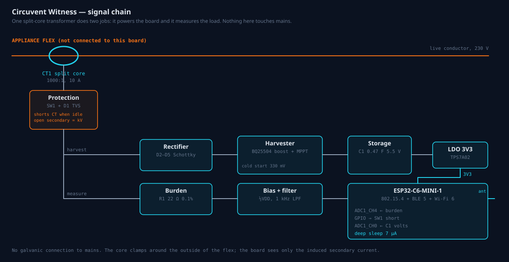

# 39 — Circuvent Witness

A clip-on sensor whose only job is to disagree.



---

## 1. Why this device

Every device in this fleet reports its own state, and nothing can contradict
it. That is not a hypothetical weakness. It is the shape of almost every
firmware bug found in this codebase:

| Device | What it said | What was true |
| --- | --- | --- |
| `rfid-gate` | relays closed | both energised from power-up |
| `smart-plug` | "Live power draw: 42.5 W" | a hard-coded constant |
| `touchboard-8` | 230 V mains, power factor derived | the voltage was invented |
| `curtain` | stopped | both motor relays held on |
| `smart-light` | brightness set ✓ | the lamp was off |
| `camera` | frame count climbing | counting its own optimism |

In each case the device was the **only witness to its own behaviour**, and it
was wrong. Every one of them shipped. Every one looked healthy on the console.

A Witness is a second opinion: a sensor that measures the current actually
flowing to an appliance and has no idea what the appliance claims.

### Why it is not just another energy monitor

An energy monitor answers "how much". This answers "is that true". The
difference is the pairing: a Witness is bound to a device, and the platform
compares the two continuously. Nobody reads a graph — the system reads it and
speaks up.

---

## 2. What makes it possible

**One split-core transformer does both jobs.** It harvests the energy that runs
the board and it measures the load, from the same magnetic field. That is what
removes the battery and the wiring, and it is why the thing can be clipped on
in ten seconds by somebody who is not an electrician.

There is no galvanic connection to mains anywhere in the design. The core
clamps around the outside of the flex; the board only ever sees the induced
secondary current.

### The safety detail that is easy to miss

**An open-circuited current transformer secondary develops dangerous
voltage** — a 1000:1 core on a 10 A load with nothing across it can reach
hundreds of volts. `SW1` shorts the secondary whenever the board is not
actively harvesting, and `D1` is a TVS across it as a second line. This is not
optional and it is the first thing to check on any respin.

---

## 3. Bill of materials

| Ref | Part | Notes |
| --- | --- | --- |
| CT1 | Split-core CT, 1000:1, 10 A | Clamps the appliance flex |
| SW1 | N-channel MOSFET, logic level | Shorts the CT secondary when idle |
| D1 | TVS, 6.8 V bidirectional | Second line across the secondary |
| D2–D5 | BAT54S Schottky ×2 | Bridge; Schottky because two drops is most of the loss |
| U1 | BQ25504 | Boost harvester, 330 mV cold start, MPPT |
| C1 | 0.47 F 5.5 V supercapacitor | The reason it can report while the load is off |
| R1 | 22 Ω 0.1% | Burden |
| U2 | TPS7A02 | 25 nA quiescent LDO |
| U3 | ESP32-C6-MINI-1 | 802.15.4 + BLE 5 + Wi-Fi 6 |

**Board: 25 × 25 mm, 4-layer**, fitting inside the CT clamp's own housing. Four
layers rather than two for the ground pour under the antenna keep-out; the
radio module needs a clean reference more than the design needs the £2.

---

## 4. Does the power budget close

This is the calculation the product depends on, so it lives in
`src/lib/witness.ts` with tests around it rather than in a spreadsheet nobody
re-runs.

```
harvested   = (primary / 1000) × 3.0 V × 0.8      boost compliance and efficiency
per report  = 100 mA × 20 ms × 3.3 V = 6.6 mJ     wake, sample, one 802.15.4 frame
sleep       = 7 µA × 3.3 V = 23 µW
```

802.15.4 rather than Wi-Fi is what makes this possible at all. A Wi-Fi
association costs hundreds of milliseconds of radio — an order of magnitude
more energy than the entire budget.

| Load | Harvested | Sustainable cadence |
| --- | --- | --- |
| 230 W (1 A) | 2.4 mW | every 3 s |
| 23 W (100 mA) | 0.24 mW | every 31 s |
| 2 W (10 mA) | 0.024 mW | not sustainable |

### What the tests forced out of the design

The cadence was originally a fixed 30 seconds. The tests refused it: on a 23 W
load that budget falls **three microwatts short**.

Three microwatts short does not mean it nearly works. It means the capacitor
drains slowly and the sensor dies some hours after installation, looking
perfectly healthy the whole way down — which is precisely the failure mode this
product exists to catch. `sustainablePeriodSec()` exists because of that test.
The sensor now reports as often as the load lets it, which is also the
behaviour anyone would want on reflection: a big load is worth watching closely
and supplies the energy to do it.

### The interesting case: when the load is off

The moment most worth verifying is exactly the moment there is nothing to
harvest from. The capacitor carries it:

| Cadence while idle | Reporting time from a full capacitor |
| --- | --- |
| 30 s | 5.6 h |
| 5 min | 30 h |
| 15 min | 45 h |

So it charges while the appliance runs and spends that charge reporting the
silence afterwards — which is what turns "it really is off" into a measurement
rather than an absence.

**And it does not last forever.** A load switched off for a season will outlast
the capacitor. That is reported, not hidden: every reading carries the reserve
voltage, and below 1.8 V the engine returns `unknown-no-reserve` rather than
letting a flat sensor's silence read as "no current". Reproducing this
product's own target failure inside it would be indefensible.

---

## 5. The disagreement engine

`src/lib/witness.ts`. Six verdicts, and they are not equally urgent.

| Verdict | Severity | Meaning |
| --- | --- | --- |
| `claims-off-but-drawing` | **danger** | Something is energised that everybody believes is dead |
| `claims-on-but-idle` | warn | What was asked for did not happen |
| `watts-disagree` | warn | A reported number is not the measured one |
| `unknown-stale` | info | The two sides describe different moments |
| `unknown-no-reserve` | info | The sensor is running out of energy |
| `agree` | info | — |

Only the first is a safety matter: that is the state in which somebody opens an
enclosure.

### What it refuses to call

Between 20 mA and 60 mA no verdict is issued. A charger, a standby lamp, a
controller board — either answer is defensible there, and a sensor that cried
wolf in that band would be muted within a week and then useless for the case
that matters.

The watts tolerance is deliberately wide (0.4× to 2.5×), because a clamp reads
apparent power and a plug usually reports real power; a third of a difference
on an inductive load is physics. What it catches is not calibration error but
fiction — a plug reporting a fixed 42.5 W whatever is plugged into it, which no
tolerance excuses.

### It observes and does not act

There is no function here that switches anything, and a test asserts there
never will be. A component that decided a relay was stuck and cut power to it
would be a second thing that can be wrong, holding an actuator. The argument
for trusting this sensor is precisely that it has no authority.

---

## 6. Status

| Piece | State |
| --- | --- |
| Concept, schematic, BOM, power budget | Complete; schematic rendered and checked |
| Disagreement engine | Complete, 20 tests |
| Firmware | Not started |
| Console and app surfaces | Not started |
| PCB layout, gerbers | Not started — no EDA tooling available in this environment |

Nothing has been built. The schematic is a signal-chain design, not a verified
board, and the power figures are calculated from datasheet values rather than
measured on a bench.
